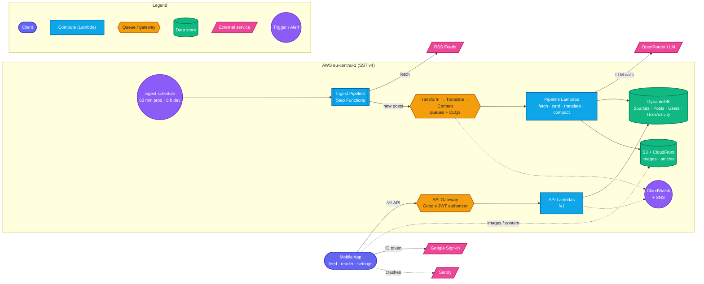

# TechTok

TechTok turns tech & science news into a TikTok-style swipeable feed. Articles are pulled in automatically, condensed into short cards with an LLM, and translated into your language — swipe through headlines, tap into a full compact article when one grabs you, and bookmark the rest for later. Sign in with Google and your read history, bookmarks, and preferences follow you across devices.

This README covers running, developing, and deploying the project day to day. For the full architecture and decision history, see [CLAUDE.md](CLAUDE.md), [docs/DESIGN.md](docs/DESIGN.md), and [docs/IMPLEMENTATION_PLAN.md](docs/IMPLEMENTATION_PLAN.md). The public project site — topics, sources, release history, and the latest Android APK download — lives at [tormozz48.github.io/techtok](https://tormozz48.github.io/techtok/) (`apps/site`).

**Status:** phases 0–20 are code complete and the backend runs on both the `dev` and `production` stages. The current front is the **free-first public Play launch** (phase 23, D75): store listing, legal surface, and the 14-day closed-test clock run against the app as it exists today, with Play Billing (phase 21) and the paid extended compact (phase 22) shipping as later store updates. See CLAUDE.md for the phase-by-phase table and what's still maintainer-gated.

---

## What the app does

- **Feed** — full-screen swipeable cards (image, hook title, 2–3 sentence summary, "why it matters", source, topic chip), newest-unread-first, filtered to your topics and excluding muted sources.
- **Compact reader** — tap a card for a ~400–600 word structured condensation with the article's own figures, generated ahead of time in all 4 languages, ending in a prominent "Read original" link-out.
- **Localized** — `en` · `ru` · `uk` · `pl`, for both card content (LLM-translated) and the app's own chrome.
- **History, bookmarks & search** — everything you've read or saved, searchable via `?q=` on both list endpoints.
- **Listen mode** — `expo-speech` TTS in the feed action bar and the reader.
- **Offline** — feed, bookmarks and already-opened article content persist for a day, so a cold start reads without a network hit. Images (not article content) read ahead 3 cards on wifi.
- **Stats** — reading streak plus top topics/sources, computed client-side from history pages.
- **Plans** — Free and Plus (€2.99/mo · €24.99/yr, D73). Free is capped server-side at 100 card reads and 20 reader opens per local day; Plus lifts both. Entitlement is provider-agnostic (D70), so it can be granted by hand today — Play Billing arrives in phase 21.

## Architecture



**Data flow, start to finish:**

1. **Ingest** — an EventBridge schedule kicks a Step Functions state machine (every 60 min on `production`, every 6 h on `dev`, which also runs a reduced source preset to keep an idle stage cheap): `LoadSources` scans enabled sources → `Map` over them (concurrency 4, per-item catch so one bad feed never fails the run) → `FetchSource` does a conditional GET on each RSS feed, dedups entries by a hash of the canonicalized URL (`postId`, enforced by a conditional DynamoDB put), and enqueues only genuinely new posts to `TransformQueue` → `Summarize` emits run metrics.
2. **Transform** — a consumer fetches the article page (robots.txt-respecting, 10s/2MB-capped), archives the raw HTML to S3, extracts text + an og:image fallback, mirrors the image to CloudFront (rejecting anything under 600px, D28), and calls the configured LLM provider (**OpenRouter by default, Bedrock as a dormant fallback**, D32) for the card copy + topic classification. Failures here degrade to an excerpt card rather than failing the post. It then **eagerly** enqueues a `TranslateQueue` job for each of the 3 non-English languages (D27) and a `ContentQueue` job for all 4 languages (D36) — both fire regardless of whether the card LLM call degraded, so every post gets its translations and its compact articles queued before it ever reaches a feed response or a reader tap.
3. **Translate** — a consumer LLM-translates the card (self-critique in one call) and writes the result into an `i18n` map on the same `Posts` item; failures simply leave the post on its English fallback.
4. **Serve** — the API is plain request/response Lambdas over DynamoDB, behind an API Gateway JWT authorizer that verifies a Google ID token on every route except the two public catalogs (`GET /v1/topics`, `GET /v1/sources`, D68). Routes cover feed, read markers, topic/language/muted-source prefs, history, bookmarks, entitlement, client log/analytics events (D76), and account deletion. `GET /v1/feed` serves each card in the user's `language` with an English fallback, ranks by recency × source weight × topic affinity, and interleaves by both topic and source so no single one crowds out the rest (D77).
5. **Compact reader (eager, D36)** — the content consumer processes one `ContentQueue` message per language, per post. On the first message for a given post it extracts + mirrors up to 5 in-body figures once and stores them on `Posts.mirroredFigures`; every other language reuses that list instead of re-extracting/re-mirroring. Each language then gets a ~400–600 word structured compact article (single LLM pass, compress + translate together) cached as `content/<postId>/<lang>.json` behind CloudFront. Tapping a card in the app calls `GET /v1/posts/{id}/content?lang=` — a plain S3 cache read, no LLM call on the request path: a hit returns the blocks/figures immediately, a miss returns a typed `available: false` (the compact-reader kill switch, or the rare case a just-ingested post's eager job hasn't finished yet).
6. **Observability & cost** — CloudWatch alarms (DLQ depth, queue backlog, Step Functions failures, API 5xx, ingest stalled) page via one SNS topic; alarms and the ops dashboard are **production-only**, since CloudWatch's free tiers are per-account and a personal dev stage doesn't warrant them. The mobile app reports crashes to Sentry. A **$25/mo** AWS Budget alarm is an infrastructure-drift signal only (D74, amending D11's $10 ceiling) — LLM caps were removed (D31) and OpenRouter bills separately, so it never sees LLM spend (D32).

### Component reference

| Component | Role |
|---|---|
| `apps/mobile` | Expo/React Native app (`expo-router`): vertical card pager, compact reader, onboarding, sign-in, settings, history, saved, stats. React Native Paper (MD3), Sentry crash reporting, committed bare `android/` project (D18). |
| `apps/site` | Public Astro site on GitHub Pages: landing page in all 4 languages, topics/sources, release history, APK download + QR, plus the privacy-policy and account-deletion pages Play requires. |
| API Gateway + Google JWT authorizer | Verifies a Google ID token before a request ever reaches a Lambda (D68); `GET /v1/topics` and `GET /v1/sources` are the only public routes. CORS disabled — this is a native-client-only API. |
| API Lambdas | One Lambda per route (`packages/functions/src/api/handlers/*`), thin handlers over `packages/core` repos, validated by `packages/shared` zod schemas. |
| `IngestPipeline` (Step Functions) | Fans out RSS fetching across all sources on a schedule; isolates per-source failures. |
| `TransformQueue` → Transform Lambda | Article fetch, archive, image mirror, card-copy LLM call, eager translate/compact enqueue. |
| `TranslateQueue` → Translate Lambda | Per-language card translation, eager per post (D27). |
| `ContentQueue` → Content Lambda | Eager compact-article generation + once-per-post figure mirroring, for all 4 languages (D23/D36). |
| DynamoDB: `Sources` / `Posts` / `Users` / `UserActivity` | Source registry; post + i18n/compact data; user identity, prefs, entitlement and daily quota; read/bookmark activity. |
| S3 + CloudFront | Private raw-HTML archive; public mirrored images + compact-article JSON behind one `Router`. All three buckets expire objects on the same lifecycle — 90 days on `production`, 7 on `dev`. |
| LLM provider | OpenRouter (`google/gemini-3.1-flash-lite`, D38) primary; AWS Bedrock kept wired as a dormant, env-switchable fallback (`LLM_PROVIDER`). |
| CloudWatch + SNS + AWS Budget | Production-only DLQ/backlog/failure/5xx/stall alarms and dashboard, to one email-subscribed SNS topic; $25/mo budget as an infra-drift signal (D74). |

### Repository layout

```
techtok/
├── sst.config.ts             # stages, imports infra/
├── infra/                    # SST components: api.ts, auth.ts, storage.ts, pipeline.ts, monitoring.ts
├── packages/
│   ├── shared/                # zod v4 contracts, topic/language taxonomy — zero runtime deps beyond zod
│   ├── core/                  # domain logic: RSS mapping, URL canonicalization, feed scoring/merge,
│   │                          #   entitlement, DynamoDB repos, LLM client/providers, pipeline stages
│   ├── functions/             # thin Lambda handlers: api/*, pipeline/*, ops/* (parse → call core → serialize)
│   └── e2e/                   # live-stage suites (D34): backend pipeline, API contract, Maestro emulator flows
├── apps/
│   ├── mobile/                # Expo app (expo-router), committed bare `android/` project (D18)
│   └── site/                  # Astro static site → GitHub Pages
├── scripts/                   # ops/CI scripts: wipeUsers, grantEntitlement, bumpMobileVersion
└── docs/                      # DESIGN.md, IMPLEMENTATION_PLAN.md, DISTRIBUTION.md, RUNBOOK.md, DATA_SAFETY.md
```

`functions` handlers stay thin; all business logic lives in `core`, unit-testable without AWS (`aws-sdk-client-mock` + recorded LLM golden fixtures — no live AWS/LLM calls in the PR-triggered CI path).

---

## Prerequisites

- Node 22 (`nvm use`)
- pnpm (`corepack enable` picks up the pinned version automatically)
- An AWS account with credentials configured locally, for `sst dev`/`sst deploy`
- An [OpenRouter](https://openrouter.ai) API key, for the LLM pipeline (see below)
- A Google Cloud OAuth consent screen plus **Web** and **Android** OAuth client IDs (D68) — see [infra/auth.ts](infra/auth.ts) for exactly what to create, including the Play-managed-vs-local-debug SHA-1 trap
- **JDK 17 + the Android SDK** — no longer optional: Google Sign-In is a native module, so the everyday dev loop builds the app rather than running it in Expo Go
- Optional, for the mobile E2E suite: the [Maestro](https://maestro.mobile.dev) CLI

## Setup

```bash
pnpm install
```

## Backend (AWS, via SST)

```bash
pnpm dev              # sst dev --stage dev — live Lambda reload on the personal "dev" stage
pnpm deploy:dev       # sst deploy --stage dev — one-off deploy of the dev stage
```

The first run bootstraps your AWS account and prints the API's URL (`Api: https://....execute-api.eu-central-1.amazonaws.com`) — copy it for the mobile app's `.env`, below. Leave `sst dev` running; it keeps your stage in sync with local changes.

**LLM provider secret (D32):** the transform/translate/content Lambdas call OpenRouter by default and need a per-stage secret set once before they can complete an LLM call:

```bash
npx sst secret set OpenRouterApiKey <your-key> --stage dev
```

Set `LLM_PROVIDER=bedrock` (per stage, via `infra/pipeline.ts`'s env vars) to fall back to the dormant Bedrock path instead — no code change needed, just IAM-based auth via the existing `bedrock:InvokeModel` grants.

**Google OAuth client ID (D68):** the API Gateway JWT authorizer checks its `audience` against this, so a deploy without it rejects every real Google ID token. It's a plain env var, not a secret (an OAuth client ID is public by design):

```bash
GOOGLE_OAUTH_WEB_CLIENT_ID=<web-client-id>.apps.googleusercontent.com npx sst deploy --stage dev
```

**Production is deployed by CI only** (see [Deployment](#deployment-cicd)) — never `sst deploy --stage production` from a laptop.

## Mobile app (Expo)

```bash
cd apps/mobile
cp .env.example .env    # then set EXPO_PUBLIC_API_URL to the sst dev API URL above,
                         # and EXPO_PUBLIC_GOOGLE_WEB_CLIENT_ID to the Google OAuth
                         # "Web application" client ID (D68 — see infra/auth.ts)
cd ../..
pnpm --filter mobile start
```

**Google Sign-In ends the plain Expo Go loop (D68).** `@react-native-google-signin/google-signin` is a native module Expo Go can't load, so scanning the QR code into Expo Go no longer works for this app. Use the committed bare `android/` project instead:

```bash
pnpm --filter mobile prebuild:android   # only needed after app.json/plugin changes
cd apps/mobile/android && ./gradlew installDebug
```

or `pnpm --filter mobile android` (`expo run:android`), which builds and installs the debug APK directly. Either way needs an Android emulator or a device connected via `adb`.

Storybook runs the real components and screens in isolation on the web:

```bash
pnpm --filter mobile storybook   # http://localhost:6006
```

Every `src/components/*.tsx` needs a sibling `*.stories.tsx`, and every `src/app/` route needs a page story under `src/stories/pages/` — a PostToolUse hook flags missing files.

## Mobile builds (Android)

The app ships a committed, bare `android/` project (Expo prebuild output — DESIGN §2 D18), so release artifacts build with the standard Gradle toolchain. Needs **JDK 17** + the **Android SDK** locally.

```bash
pnpm --filter mobile build:android       # release AAB -> android/app/build/outputs/bundle/release/
pnpm --filter mobile build:android:apk   # release APK -> android/app/build/outputs/apk/release/
pnpm --filter mobile prebuild:android    # regenerate android/ after app.json / plugin / SDK changes
```

Release signing reads a gitignored `apps/mobile/android/keystore.properties` (falls back to the debug key when absent). Keystore creation, Google Play publishing, and the bare-workflow caveats are documented in [docs/DISTRIBUTION.md](docs/DISTRIBUTION.md).

Note that `eas.json`'s `production` profile still builds an **APK**; the Play launch needs an AAB path (phase 23).

### Verifying an OTA update landed

`Mobile build` publishes the JS bundle to the `preview` EAS Update channel, and `AndroidManifest.xml` sets `EXPO_UPDATES_CHECK_ON_LAUNCH=ALWAYS` with a 0 ms wait — so a device fetches a new bundle in the background on one launch and runs it on the **next** one.

**Settings → Build** is the on-device marker. It reads `expo-updates` and shows whether the running JS came over the air or shipped inside the APK, plus the short update id, publish time, channel, and runtime version:

| Row | Embedded launch | After an OTA update |
|---|---|---|
| Running | Bundle shipped with the app | Over-the-air update |
| Update ID | `—` | first 8 chars of the EAS update id |
| Published | `—` | publish time, UTC |

To confirm: relaunch the app twice, then match the update id against `eas update:list --channel preview` (or the EAS dashboard). In Expo Go every field except the bundle version reads `—`, since there is no update runtime.

An OTA push only reaches devices whose installed APK has the same `runtimeVersion` (`apps/mobile/app.json`, hand-maintained) — a native-affecting change needs that bumped and a fresh APK, not an OTA.

## Ops scripts

Both talk to live AWS and discover their target table by stage tag, so pass `--stage` explicitly.

```bash
pnpm wipe-users -- --stage dev                                  # dry run: counts what would be deleted
pnpm wipe-users -- --stage dev --confirm                        # actually delete every user + their activity
pnpm grant-entitlement -- --stage dev --user-id <id> --plan plus
```

`wipe-users` is the D68 migration path (pre-Google-identity rows carry no `sub`); `grant-entitlement` is the manual/comped path into D70's provider-agnostic entitlement layer, and the only way to reach a Plus account until Play Billing ships.

Operational playbooks — stuck DLQs, compact-generation failures, the per-source compact kill switch, LLM spend — live in [docs/RUNBOOK.md](docs/RUNBOOK.md).

## Quality gates

```bash
pnpm lint        # Biome — no ESLint/Prettier in this repo (D7)
pnpm typecheck   # tsc --noEmit, every package + scripts + sst.config.ts/infra (the latter only after a first `pnpm dev`)
pnpm test        # vitest (shared/core/functions) + jest (mobile)
```

All three must be green before considering a change done. Two extras, each a cheap proxy for a real device/browser pass:

```bash
pnpm --filter mobile exec expo export --platform android   # Metro bundle check, for any apps/mobile change
pnpm --filter site run build                               # for any apps/site change
```

Every request/response shape in `packages/shared` is also checked against a committed schema snapshot — a removed field, narrowed type, or removed enum value fails CI unless the snapshot is regenerated deliberately (D34):

```bash
pnpm --filter @techtok/shared run schema:check      # verify
pnpm --filter @techtok/shared run schema:snapshot   # regenerate, deliberately
```

## End-to-end tests

`packages/e2e` is the only suite that touches real AWS — never triggered by a PR (D34). All three need credentials for the target stage.

```bash
pnpm --filter @techtok/e2e run backend-pipeline   # starts a real IngestPipeline run on dev, asserts DynamoDB/SQS state
pnpm --filter @techtok/e2e run api-contract       # calls the deployed dev API, parses every response through packages/shared

pnpm --filter @techtok/e2e run build-mobile-e2e-apk   # debug APK with the sign-in bypass, pointed at a real stage
pnpm --filter @techtok/e2e run mobile-e2e             # drives it on an emulator via Maestro
```

The authenticated suites need a dedicated test Google account's `GOOGLE_TEST_REFRESH_TOKEN` plus `GOOGLE_OAUTH_WEB_CLIENT_ID`/`GOOGLE_OAUTH_WEB_CLIENT_SECRET` (setup in [packages/e2e/src/googleTestAuth.ts](packages/e2e/src/googleTestAuth.ts)). Without them they **skip cleanly rather than fail**. Google deliberately blocks automating its consent UI, so the Maestro flows mint a real ID token and deep-link it in via a build-time bypass (`EXPO_PUBLIC_E2E_AUTH=1`) that no shipping profile sets — the API still verifies every token, so the bypass grants no access a normal sign-in wouldn't.

## Deployment (CI/CD)

Seven GitHub Actions workflows. `CI` is the entry point; the six others are reusable workflows it calls in sequence, each also runnable standalone via `workflow_dispatch`.

- **`CI`** ([ci.yml](.github/workflows/ci.yml)) — on PR + push to `main`. Six independent check jobs run in parallel, each doing its own cached `pnpm install` (D51 retired the shared-install `setup` job — the cache made it a net loss): `lint`, `typecheck`, `test`, `schema-check`, `mobile-icon-check` (D59 — catches source icon/splash assets drifting from the committed `android/` project), and `mobile-security-scan` (mobsfscan over the app source and release manifest).
- **`Deploy dev`** ([deploy-dev.yml](.github/workflows/deploy-dev.yml)) — deliberately has **no** `needs`, so it races the check jobs instead of queueing behind them (D52); `dev` is throwaway. Uses its own least-privilege OIDC role.
- **`E2E`** ([e2e.yml](.github/workflows/e2e.yml)) — daily schedule, manual dispatch, and step 3 of the main-branch pipeline. Exercises the real `dev` stage via a narrowly-scoped, read/invoke-only OIDC role (D34). Its Maestro `mobile-emulator` job is **skipped** in the release pipeline (`skip_mobile_emulator: true`) — UI flake shouldn't block a production deploy.
- **`Deploy production`** ([deploy-production.yml](.github/workflows/deploy-production.yml)) — gated on E2E *and* all six checks. Emits the real API URL from its own `.sst/outputs.json` so the mobile build never needs a committed URL.
- **`Mobile build`** ([mobile-build.yml](.github/workflows/mobile-build.yml)) — builds an Android APK with `eas build --local` (on the GitHub runner, so it consumes **no** EAS cloud-build credits), publishes the JS bundle to the `preview` EAS Update channel (D60), and attaches the APK to a GitHub Release with conventional-commit release notes (D58). It also owns mobile versioning (D42/D44): it computes a conventional-commit semver bump baselined against the last `mobile-v*` tag, pushes it straight to `main` with `[skip ci]` and a rebase-retry loop, then tags the release. A preceding `mobile-changes` job skips the whole build when nothing mobile-relevant landed since that tag (D53).
- **`Deploy site`** ([deploy-site.yml](.github/workflows/deploy-site.yml)) — builds `apps/site` and publishes to GitHub Pages, checking out `main` at full depth so the version badge and release feed see the tag the mobile build just pushed.
- **`Release cleanup`** ([release-cleanup.yml](.github/workflows/release-cleanup.yml)) — keeps only the 3 most recent `android-build-*` releases and `mobile-v*` tags (D57), since every merge would otherwise leave a full APK behind forever.

The main-branch release pipeline, in order:

```
checks ──┐
         ├─→ deploy-production ─→ mobile-build ─┬─→ deploy-site
dev ─→ e2e ┘                                    └─→ release-cleanup
```

### Required repository secrets

| Secret | Used by | Notes |
|---|---|---|
| `AWS_DEV_DEPLOY_ROLE_ARN` | Deploy dev | OIDC role scoped to `techtok-dev-*` only |
| `AWS_DEPLOY_ROLE_ARN` | Deploy production | OIDC, production deploy |
| `AWS_E2E_ROLE_ARN` | E2E | OIDC, read/invoke only — never grant it write/deploy |
| `GOOGLE_OAUTH_WEB_CLIENT_ID` | both deploys, Mobile build | Not sensitive; without it every ID token fails on audience mismatch |
| `EXPO_TOKEN` | Mobile build | Free Expo account; also supplies the signing credentials |
| `SENTRY_AUTH_TOKEN` | Mobile build | Optional — its absence just skips the source-map/symbol upload |
| `GOOGLE_TEST_REFRESH_TOKEN`, `GOOGLE_OAUTH_WEB_CLIENT_SECRET` | E2E | The authenticated suites skip cleanly until these exist |

No long-lived AWS keys anywhere — every AWS-touching job assumes a role via OIDC, and every PR-triggered job runs with no credentials at all.
