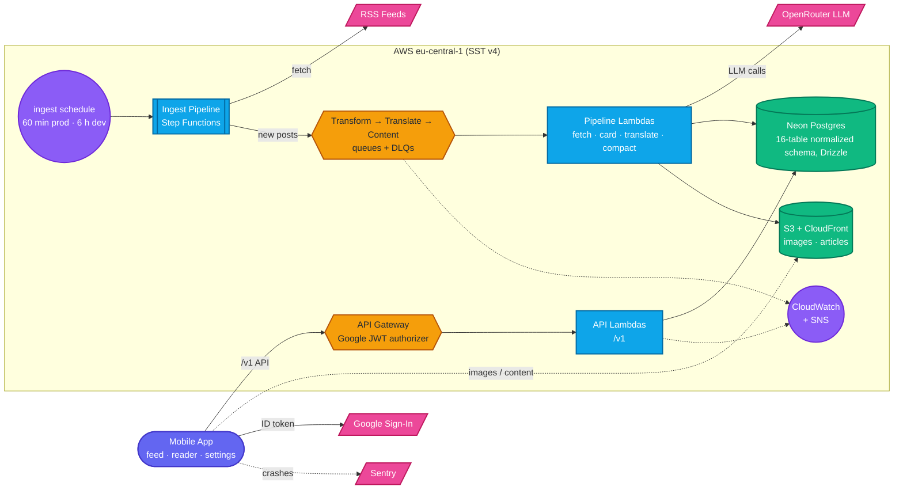

# TechTok

TechTok turns tech & science news into a TikTok-style swipeable feed. Articles are pulled in automatically, condensed into short cards with an LLM, and translated into your language — swipe through headlines, tap into a full compact article when one grabs you, and bookmark the rest for later. Sign in with Google and your read history, bookmarks, and preferences follow you across devices.

This README covers running, developing, and deploying the project day to day. Architecture rationale and decision history live in [CLAUDE.md](CLAUDE.md), [docs/DESIGN.md](docs/DESIGN.md), and [docs/IMPLEMENTATION_PLAN.md](docs/IMPLEMENTATION_PLAN.md). The public site — topics, sources, release history, APK download — is at [techtokapp.eu](https://techtokapp.eu/) (`apps/site`).

**Status:** phases 0–20 and 24 are code complete; the backend runs on both the `dev` and `production` stages. The current front is the **free-first public Play launch** (phase 23, D75) — store listing, legal surface, and the 14-day closed-test clock run against the app as it exists today. Play Billing (21) and the paid extended compact (22) ship as later store updates. CLAUDE.md has the phase-by-phase table and what's maintainer-gated.

---

## What the app does

- **Feed** — full-screen swipeable cards (image, hook title, 2–3 sentence summary, "why it matters", source, topic chip), newest-unread-first, filtered to your topics and excluding muted sources.
- **Compact reader** — tap a card for a ~400–600 word structured condensation with the article's own figures, pre-generated in all 4 languages, ending in a "Read original" link-out. Bookmark, copy, or share from the action bar.
- **Localized** — `en` · `ru` · `uk` · `pl`, for card content (LLM-translated) and the app's own chrome.
- **History, bookmarks & search** — `?q=` on both list endpoints.
- **Listen mode** — `expo-speech` TTS in the feed action bar and the reader.
- **Offline** — the query cache persists for a day, so a cold start reads without a network hit. Images (not article content) read ahead 3 cards, wifi only.
- **Stats** — reading streak plus top topics/sources, computed client-side from history pages.
- **Plans** — Free and Plus (€2.99/mo · €24.99/yr, D73). Free is capped server-side at **100 card reads** and **20 reader opens** per local day; Plus lifts both. Entitlement is provider-agnostic (D70), so it can be granted by hand today — Play Billing arrives in phase 21.

## Architecture



**Data flow, start to finish:**

1. **Ingest** — an EventBridge schedule kicks a Step Functions state machine (60 min on `production`, 6 h on `dev`, which also runs a reduced source preset): `LoadSources` → `Map` over sources (concurrency 4, per-item catch so one bad feed never fails the run) → `FetchSource` conditional-GETs each feed, dedups on the canonicalized URL (`unique(canonical_url)` on `posts`) and enqueues only new posts → `Summarize` emits run metrics.
2. **Transform** — fetches the article page (robots.txt-respecting, 10 s/2 MB-capped), archives raw HTML to S3, extracts text + an og:image fallback, mirrors the image to CloudFront (rejecting anything under 600 px, D28), and calls the LLM (**OpenRouter by default, Bedrock as a dormant fallback**, D32) for card copy + topic classification. Failures here degrade to an excerpt card. It then **eagerly** enqueues a `TranslateQueue` job per non-English language (D27) and a `ContentQueue` job for all 4 (D36), degraded or not.
3. **Translate** — LLM-translates the card (self-critique in one call) into `post_translations`; failures leave the post on its English fallback.
4. **Serve** — plain request/response Lambdas over Neon Postgres (Drizzle, `neon-http`), behind an API Gateway JWT authorizer that verifies a Google ID token on every route except the two public catalogs (D68). `GET /v1/feed` serves each card in the user's language with an English fallback, ranks by recency × source weight × topic affinity, and interleaves by topic and source so neither crowds out the rest (D77).
5. **Compact reader (eager, D36)** — one `ContentQueue` message per language per post. The first extracts and mirrors up to 5 in-body figures into `post_figures`; the rest reuse them. Each language gets a ~400–600 word compact article (one LLM pass: compress + translate) cached at `content/<contentKey>/<lang>.json` behind CloudFront, `contentKey` being the sha-256 of the canonical URL — so keys stay unguessable now that post ids are sequential integers (D94). `GET /v1/posts/{postId}/content?lang=` is a plain S3 cache read, no LLM on the request path; a miss returns a typed `available: false`.
6. **Observability & cost** — seven **production-only** CloudWatch alarms page via one SNS topic (free tiers are per-account, so a personal dev stage gets none). No ops dashboard, no backlog alarms — removed as pure cost (D89). The app reports crashes to Sentry. A **$25/mo** AWS Budget alarm is an infrastructure-drift signal only (D74) — it never sees LLM spend, which OpenRouter bills separately (D32).

### API routes (`/v1`)

`GET /feed` · `POST /reads` · `POST /events` · `GET|DELETE /me` · `PUT /me/topics` · `PUT /me/language` · `PUT /me/muted-sources` · `GET /me/entitlement` · `GET /history` · `GET|POST /bookmarks` · `DELETE /bookmarks/{postId}` · `GET /posts/{postId}/content`

`GET /topics` and `GET /sources` are the only public (unauthenticated) routes. CORS is disabled — this is a native-client-only API.

### Component reference

| Component | Role |
|---|---|
| `apps/mobile` | Expo/React Native app (`expo-router`): card pager, compact reader, onboarding, sign-in, settings, history, saved, stats. React Native Paper (MD3), Sentry, committed bare `android/` project (D18). |
| `apps/site` | Public Astro site on GitHub Pages: landing page in 4 languages, topics/sources, release history, APK download + QR, plus the privacy-policy and account-deletion pages Play requires. |
| API Gateway + JWT authorizer | Verifies a Google ID token before a request reaches a Lambda (D68). |
| API Lambdas | One per route (`packages/functions/src/api/handlers/*`), thin over `packages/core` repos, validated by `packages/shared` zod schemas. |
| `IngestPipeline` (Step Functions) | Fans out RSS fetching across sources on a schedule; isolates per-source failures. |
| `TransformQueue` → Transform Lambda | Article fetch, archive, image mirror, card-copy LLM call, eager translate/compact enqueue. |
| `TranslateQueue` → Translate Lambda | Per-language card translation, eager per post (D27). |
| `ContentQueue` → Content Lambda | Eager compact-article generation + once-per-post figure mirroring, all 4 languages (D23/D36). |
| Neon Postgres (16 tables, Drizzle) | Normalized schema — sources/source_states, posts + translations/topics/compacts/figures, users + prefs/quota/entitlement/reads/bookmarks. Table-by-table layout in [docs/DESIGN.md](docs/DESIGN.md) §6. |
| S3 + CloudFront | Private raw-HTML archive; public mirrored images + compact JSON behind one `Router`. All three buckets expire on the same lifecycle — 90 days on `production`, 7 on `dev`. |
| LLM provider | OpenRouter (`google/gemini-3.1-flash-lite`, D38) primary; Bedrock kept wired as a dormant, env-switchable fallback (`LLM_PROVIDER`). |
| CloudWatch + SNS + Budget | Seven production-only alarms — DLQ depth (×3), Step Functions failure, API 5xx, ingest stalled, Lambda throttled — to one email-subscribed SNS topic; $25/mo budget as an infra-drift signal (D74). |

### Repository layout

```
techtok/
├── sst.config.ts             # stages, imports infra/
├── drizzle.config.ts         # schema -> packages/core/drizzle migrations
├── vitest.config.ts          # root Vitest projects, incl. the mobile project
├── infra/                    # SST components: api.ts, auth.ts, storage.ts, pipeline.ts, monitoring.ts
├── packages/
│   ├── shared/                # zod v4 contracts, topic/language taxonomy — zero runtime deps beyond zod
│   ├── core/                  # domain logic: RSS mapping, URL canonicalization, feed scoring/merge,
│   │                          #   entitlement, db/ schema + drizzle/ migrations + repos/ over models/,
│   │                          #   LLM client/providers, pipeline stages
│   ├── functions/             # thin Lambda handlers: api/*, pipeline/*, ops/* (parse → call core → serialize)
│   └── e2e/                   # live-stage suites (D34): backend pipeline, API contract, Maestro flows
├── apps/
│   ├── mobile/                # Expo app (expo-router), committed bare android/, store/ listing assets
│   └── site/                  # Astro static site → GitHub Pages
├── scripts/                   # lint checks (checkNoComments, checkFileOrganization), ops (wipeUsers,
│                              #   grantEntitlement), CI (bumpMobileVersion, checkProductionApiUrl),
│                              #   setupMail.sh + mail/, setupSiteDns.sh (domain mail + Pages DNS, D103)
└── docs/                      # DESIGN.md, IMPLEMENTATION_PLAN.md, DISTRIBUTION.md, RUNBOOK.md, DATA_SAFETY.md
```

`functions` handlers stay thin; all business logic lives in `core`, unit-testable without AWS (`aws-sdk-client-mock` + recorded LLM golden fixtures — no live AWS/LLM calls in the PR-triggered CI path).

---

## Prerequisites

- Node 22 (`nvm use`) and pnpm (`corepack enable` picks up the pinned version)
- An AWS account with local credentials, for `sst dev`/`sst deploy`
- An [OpenRouter](https://openrouter.ai) API key
- A Google Cloud OAuth consent screen plus **Web** and **Android** client IDs (D68) — [infra/auth.ts](infra/auth.ts) documents exactly what to create, including the Play-managed-vs-local-debug SHA-1 trap
- **JDK 17 + the Android SDK** — not optional: Google Sign-In is a native module, so the everyday dev loop builds the app rather than running it in Expo Go
- Optional, for the mobile E2E suite: the [Maestro](https://maestro.mobile.dev) CLI

## Backend (AWS, via SST)

```bash
pnpm install
pnpm dev              # sst dev --stage dev — live Lambda reload on the personal "dev" stage
pnpm deploy:dev       # sst deploy --stage dev — one-off deploy
```

The first run bootstraps the account and prints the API URL (`Api: https://….execute-api.eu-central-1.amazonaws.com`) — copy it into the mobile app's `.env`. Leave `sst dev` running; it keeps the stage in sync with local changes.

**LLM provider secret (D32)** — set once per stage, or no LLM call can complete:

```bash
npx sst secret set OpenRouterApiKey <your-key> --stage dev
```

Set `LLM_PROVIDER=bedrock` (per stage, in `infra/pipeline.ts`'s env vars) to fall back to the dormant Bedrock path — no code change, IAM-based auth via the existing `bedrock:InvokeModel` grants.

**Google OAuth client ID (D68)** — the JWT authorizer checks its `audience` against this, so a deploy without it rejects every real ID token. A plain env var, not a secret (an OAuth client ID is public by design):

```bash
GOOGLE_OAUTH_WEB_CLIENT_ID=<web-client-id>.apps.googleusercontent.com npx sst deploy --stage dev
```

**Schema migrations** — Drizzle, generated from `packages/core/src/db/schema.ts` into `packages/core/drizzle/`. Both deploy workflows run `db:migrate` automatically before `sst deploy` (D92); locally, point `DATABASE_URL` at a **direct** (non-pooled) Neon connection string:

```bash
pnpm db:generate     # diff the schema into a new migration
pnpm db:migrate      # apply pending migrations
```

**Production is deployed by CI only** (see [Deployment](#deployment-cicd)) — never `sst deploy --stage production` from a laptop.

## Mobile app (Expo)

```bash
cd apps/mobile
cp .env.example .env    # set EXPO_PUBLIC_API_URL to the sst dev API URL above, and
                        # EXPO_PUBLIC_GOOGLE_WEB_CLIENT_ID to the Google OAuth
                        # "Web application" client ID (D68 — see infra/auth.ts)
cd ../..
pnpm --filter mobile start
```

**Google Sign-In ends the plain Expo Go loop (D68).** `@react-native-google-signin/google-signin` is a native module Expo Go can't load, so the QR-into-Expo-Go loop no longer works. Use the committed bare `android/` project:

```bash
pnpm --filter mobile prebuild:android   # only after app.json / plugin changes
pnpm --filter mobile android            # expo run:android — builds and installs the debug APK
```

Either way needs an emulator or a device on `adb`. Storybook runs the real components and screens in isolation on the web:

```bash
pnpm --filter mobile storybook   # http://localhost:6006
```

Every `src/components/*.tsx` needs a sibling `*.stories.tsx`, and every `src/app/` route a page story under `src/stories/pages/` — a PostToolUse hook flags missing files.

The repo also **bans comments in code** (`.ts`/`.tsx`/`.js`/`.jsx`/`.mjs`/`.cjs`/`.astro`) apart from tool directives, and enforces a constants → exported → private **declaration order** in `src/` files. `pnpm lint` gates both, and PostToolUse hooks block offending edits. Rationale for a change belongs in [docs/DESIGN.md](docs/DESIGN.md)'s decision log and the commit message.

## Mobile builds (Android)

The committed bare `android/` project (Expo prebuild output, D18) means release artifacts build with the standard Gradle toolchain. Needs **JDK 17** + the **Android SDK**.

```bash
pnpm --filter mobile build:android       # release AAB -> android/app/build/outputs/bundle/release/
pnpm --filter mobile build:android:apk   # release APK -> android/app/build/outputs/apk/release/
pnpm --filter mobile prebuild:android    # regenerate android/ after app.json / plugin / SDK changes
```

Both release builds run `pnpm check-api-url` first and refuse to build on an unset or placeholder `EXPO_PUBLIC_API_URL`. Release signing reads a gitignored `apps/mobile/android/keystore.properties` (falls back to the debug key when absent). Keystore creation, Play publishing, and bare-workflow caveats: [docs/DISTRIBUTION.md](docs/DISTRIBUTION.md). `eas.json`'s `production` profile builds the **AAB** that `Mobile release (Play Store)` submits.

### Verifying an OTA update landed

`Mobile build` (or, for a JS-only merge, CI's `mobile-ota-update` job) publishes the JS bundle to the `preview` EAS Update channel.

`AndroidManifest.xml` sets `EXPO_UPDATES_CHECK_ON_LAUNCH=ALWAYS` with a 0 ms wait, so startup never blocks on a download — which alone would mean a bundle fetched on one launch runs only on the **next**. `state/updates.ts` closes that gap (D84): it fetches on launch, then calls `Updates.reloadAsync()` the first time the app foregrounds after **5+ minutes** in the background. Shorter excursions (a sign-in hand-off, an in-app browser article) never reload, and neither does a signed-out session.

**Settings → Build** is the on-device marker: it shows whether the running JS came over the air or shipped inside the APK, plus the short update id, publish time, channel, and runtime version — all `—` on an embedded launch. To confirm, background the app for 5 minutes, reopen it, and match the update id against `eas update:list --channel preview`.

An OTA push only reaches devices whose APK has the same `runtimeVersion` (`apps/mobile/app.json`, bumped on every native rebuild — D87/D101) — a native-affecting change needs a fresh APK, not an OTA.

## Ops scripts

Both talk to live AWS and discover their target by stage tag, so pass `--stage` explicitly.

```bash
pnpm wipe-users -- --stage dev                                  # dry run: counts what would be deleted
pnpm wipe-users -- --stage dev --confirm                        # delete every user + their activity
pnpm grant-entitlement -- --stage dev --user-id <id> --plan plus
```

`wipe-users` is the D68 migration path (pre-Google-identity rows carry no `sub`); `grant-entitlement` is the manual/comped path into D70's provider-agnostic entitlement layer, and the only way to reach a Plus account until Play Billing ships.

Operational playbooks — stuck DLQs, compact-generation failures, the per-source compact kill switch, LLM spend — live in [docs/RUNBOOK.md](docs/RUNBOOK.md).

### Project domain & mail

`techtokapp.eu` is registered in Route 53 Domains and receives mail through SES (D103): `privacy@`, `support@` and `noreply@` forward to the maintainer's Gmail via the `techtok-mail-forwarder` Lambda, with the raw copy kept 30 days in `s3://techtok-mail-inbound-<account>/inbound/`. These are account-level, not per-stage, so they live outside `infra/`:

```bash
bash scripts/setupMail.sh --domain techtokapp.eu --forward-to <gmail address>
bash scripts/setupSiteDns.sh --domain techtokapp.eu --pages-host tormozz48.github.io
```

Both are idempotent and need admin credentials (plus `jq` and `zip` for the mail script) — run them from AWS CloudShell, since the local `techtok` profile is read-only. `setupMail.sh` publishes SPF/DKIM/DMARC, builds the S3 → Lambda → receipt-rule pipeline (source: `scripts/mail/{forwarder,rewrite}.mjs`), waits for SES verification, and only then publishes MX; if verification is still pending after 10 minutes it exits 2 without MX and a re-run finishes the job. Still manual in the SES console: production access (the account is sandboxed) and SMTP credentials for Gmail "Send mail as".

`setupSiteDns.sh` publishes the Pages apex A/AAAA records and the `www` CNAME. The custom domain itself is set in Settings → Pages — an Actions-based deploy ignores any `CNAME` file — and must be set together with `astro.config.ts`'s `site`/`base`.

## Quality gates

```bash
pnpm lint          # Biome + the no-comments and file-organization checks — no ESLint/Prettier (D7)
pnpm typecheck     # tsc --noEmit: every package, scripts/, and sst.config.ts/infra (the latter only after a first `pnpm dev`)
pnpm test          # vitest (every *.test.ts) + jest-expo (apps/mobile's *.test.tsx render tests)
```

`pnpm lint:comments` and `pnpm lint:organization` run either check alone and accept file paths to narrow them; `pnpm lint:fix` applies Biome's own fixes.

Two test runners, split by file extension (D104): every `*.test.ts` runs under **Vitest** — including `apps/mobile`'s stores, utils and API client, a `mobile` project in the root [vitest.config.ts](vitest.config.ts) with its own [config](apps/mobile/vitest.config.ts) and [native-module mocks](apps/mobile/vitest.setup.ts). Only `*.test.tsx` runs under **jest-expo**, because rendering a React Native tree needs its babel pipeline; those keep using [apps/mobile/\_\_mocks\_\_/](apps/mobile/__mocks__). Write a new mobile test as `.test.ts` unless it renders a component.

All three gates must be green. Two extras, each a cheap proxy for a real device/browser pass:

```bash
pnpm --filter mobile exec expo export --platform android   # Metro bundle check, for any apps/mobile change
pnpm --filter site run build                               # for any apps/site change
```

Every request/response shape in `packages/shared` is also checked against a committed snapshot — a removed field, narrowed type, or removed enum value fails CI unless the snapshot is regenerated deliberately (D34):

```bash
pnpm --filter @techtok/shared run schema:check      # verify
pnpm --filter @techtok/shared run schema:snapshot   # regenerate, deliberately
```

## End-to-end tests

`packages/e2e` is the only suite that touches real AWS — never triggered by a PR (D34). All need credentials for the target stage.

```bash
pnpm --filter @techtok/e2e run backend-pipeline   # starts a real IngestPipeline run on dev, asserts Postgres/SQS state
pnpm --filter @techtok/e2e run api-contract       # calls the deployed dev API, parses every response through packages/shared

pnpm --filter @techtok/e2e run build-mobile-e2e-apk   # debug APK with the sign-in bypass, pointed at a real stage
pnpm --filter @techtok/e2e run mobile-e2e             # drives it on an emulator via Maestro
```

The authenticated suites need a dedicated test Google account's `GOOGLE_TEST_REFRESH_TOKEN` plus `GOOGLE_OAUTH_WEB_CLIENT_ID`/`GOOGLE_OAUTH_WEB_CLIENT_SECRET` (setup in [packages/e2e/src/googleTestAuth.ts](packages/e2e/src/googleTestAuth.ts)); without them they **skip cleanly rather than fail**. Google blocks automating its consent UI, so the Maestro flows mint a real ID token and deep-link it in via a build-time bypass (`EXPO_PUBLIC_E2E_AUTH=1`) that no shipping profile sets — the API still verifies every token, so the bypass grants no access a normal sign-in wouldn't.

## Deployment (CI/CD)

Nine workflow files: `CI` is the entry point, seven are reusable workflows it calls, and one (`Mobile emulator E2E`) is standalone. All are also runnable via `workflow_dispatch`.

- **`CI`** ([ci.yml](.github/workflows/ci.yml)) — on PR + push to `main`. Six check jobs run in parallel, each with its own cached `pnpm install` (D51): `lint`, `typecheck`, `test`, `schema-check`, `mobile-icon-check` (D59 — catches source icons/splash drifting from the committed `android/`), `mobile-security-scan` (mobsfscan). A new push cancels an in-flight run **only on PRs**; main-branch runs queue, so a merge can't kill a release pipeline mid-deploy (D91).
- **`Deploy dev`** ([deploy-dev.yml](.github/workflows/deploy-dev.yml)) — deliberately has **no** `needs`, so it races the checks (D52). Own least-privilege OIDC role. Runs `pnpm db:migrate` before `sst deploy` (D92), then invokes `SeedSources` — idempotent, and the only thing that refills `sources` after a destructive migration (D94).
- **`E2E (dev stage)`** ([e2e.yml](.github/workflows/e2e.yml)) — daily schedule, manual dispatch, and step 2 of the backend chain. `backend-pipeline` + `api-contract` against the real `dev` stage via a read/invoke-only OIDC role (D34). `backend-pipeline` also takes `NEON_DATABASE_URL_DEV_DIRECT` to assert every enabled source was refetched, and fails rather than skips without it (D97).
- **`Mobile emulator E2E`** ([mobile-emulator-e2e.yml](.github/workflows/mobile-emulator-e2e.yml)) — the Maestro flows on an Android emulator. **Manual dispatch only**, called by nothing: UI flows are flake-prone and shouldn't block the schedule or a deploy. Reuses E2E's Google test secrets, skips cleanly without them.
- **`Deploy production`** ([deploy-production.yml](.github/workflows/deploy-production.yml)) — gated on E2E *and* all six checks. Same `db:migrate` + `SeedSources` as `Deploy dev`, against production's own direct connection string. Emits the real API URL from `.sst/outputs.json` and warns (non-fatally) when `PRODUCTION_API_URL` no longer matches (D100).
- **`mobile-version-bump`** (a job inside [ci.yml](.github/workflows/ci.yml), not its own file) — owns mobile versioning (D42/D44/D99): bumps `versionCode` and `runtimeVersion` unconditionally (D101), computes a conventional-commit semver bump for `version`/`versionName` against the last `mobile-v*` tag, and pushes to `main` with `[skip ci]` and a rebase-retry loop. Gated on `mobile-changes`'s `should_build` (D53), so a JS-only merge routes to `mobile-ota-update` instead.
- **`Mobile build`** ([mobile-build.yml](.github/workflows/mobile-build.yml)) — Android APK via `eas build --local` (on the runner, so **no** EAS cloud credits), publishes the JS bundle to the `preview` EAS Update channel (D60), attaches the APK to a GitHub Release with conventional-commit notes (D58), and tags it. Run standalone, it bumps the version itself.
- **`Mobile release (Play Store)`** ([mobile-release.yml](.github/workflows/mobile-release.yml)) — the `production` `eas.json` profile as a Play-uploadable AAB, gated on the same `should_build` (D53/D98), parallel to `Mobile build` (D99). Submits to the Play `internal` track when `PlayServiceAccountKey` (D71) is set; until then the AAB is an Actions artifact only.
- **`Deploy site`** ([deploy-site.yml](.github/workflows/deploy-site.yml)) — builds `apps/site` to GitHub Pages, checking out `main` at full depth so the version badge and release feed see the tag the mobile build just pushed.
- **`Release cleanup`** ([release-cleanup.yml](.github/workflows/release-cleanup.yml)) — keeps only the 3 most recent `android-build-*` releases and `mobile-v*` tags (D57).

The main-branch release pipeline, in order:

```
deploy-dev ─→ e2e ─→ deploy-production

checks ─→ mobile-changes ─┬─→ mobile-version-bump ─┬─→ mobile-build
                          │                        └─→ mobile-play-release
                          └─→ mobile-ota-update

deploy-site       needs deploy-production + mobile-build
release-cleanup   needs mobile-build
```

Two chains run in parallel (D100). The backend chain gates each step on the last. The mobile chain no longer waits on it: it reads the API URL from the `PRODUCTION_API_URL` repository variable rather than `Deploy production`'s workflow output, so the ~10 min native builds overlap the deploy and E2E. `mobile-build` (APK) and `mobile-play-release` (AAB) run in parallel with each other (D99); `mobile-ota-update` is mutually exclusive with both (D53's `should_build`/`should_ota` split). `deploy-site` is the one join point — it needs `deploy-production` to have succeeded *and* `mobile-build` to have succeeded or been skipped.

### Required repository secrets

| Secret | Used by | Notes |
|---|---|---|
| `AWS_DEV_DEPLOY_ROLE_ARN` | Deploy dev | OIDC role scoped to `techtok-dev-*` only |
| `AWS_DEPLOY_ROLE_ARN` | Deploy production | OIDC, production deploy |
| `AWS_E2E_ROLE_ARN` | E2E, Mobile emulator E2E | OIDC, read/invoke only — never grant it write/deploy |
| `NEON_DATABASE_URL_DEV_DIRECT` | Deploy dev, E2E | Direct (non-pooled) `dev` connection string; runs `pnpm db:migrate` (D92) and backs E2E's source-freshness assertion (D97). Distinct from the pooled `NeonDatabaseUrl` `sst.Secret` the Lambdas link at runtime |
| `NEON_DATABASE_URL_PRODUCTION_DIRECT` | Deploy production | Same, for `production`; never exposed to E2E |
| `GOOGLE_OAUTH_WEB_CLIENT_ID` | both deploys, Mobile build | Not sensitive; without it every ID token fails on audience mismatch |
| `EXPO_TOKEN` | Mobile build, Mobile release | Free Expo account; also supplies the signing credentials |
| `SENTRY_AUTH_TOKEN` | Mobile build, mobile-ota-update | Optional — its absence just skips the source-map/symbol upload |
| `PlayServiceAccountKey` | Mobile release | Google Cloud service account JSON with Play Developer API access (D71); absent, the Play upload is skipped and the AAB stays a downloadable artifact |
| `GOOGLE_TEST_REFRESH_TOKEN`, `GOOGLE_OAUTH_WEB_CLIENT_SECRET` | E2E, Mobile emulator E2E | The authenticated suites skip cleanly until these exist |

No long-lived AWS keys anywhere — every AWS-touching job assumes a role via OIDC, and every PR-triggered job runs with no credentials at all.

### Required repository variables

| Variable | Used by | Notes |
|---|---|---|
| `PRODUCTION_API_URL` | `mobile-changes`, Mobile build, Mobile release, `mobile-ota-update` | The production API Gateway base URL, baked into every APK/AAB/OTA bundle as `EXPO_PUBLIC_API_URL`. A **variable**, not a secret: it is public by construction (extractable from any shipped APK), secrets can't be referenced in a job-level `if:`, and log masking would reduce the guard's error message to `***`. Replacing the old workflow output with it is what lets the mobile chain run in parallel with the deploy (D100). `mobile-changes` fails the mobile chain when it's unset; `Deploy production` warns when it no longer matches what it just deployed. |
