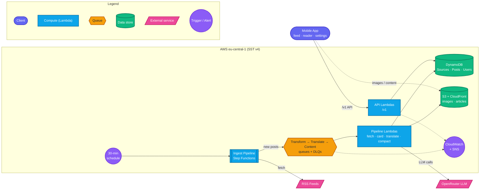

# TechTok

TechTok turns tech & science news into a TikTok-style swipeable feed. Articles are pulled in automatically, condensed into short cards with an LLM, and translated into your language — swipe through headlines, tap into a full compact article when one grabs you, and bookmark the rest for later. No account needed; your read history, bookmarks, and preferences just follow your device.

This README covers running, developing, and deploying the project day to day. For the full architecture and decision history, see [CLAUDE.md](CLAUDE.md), [docs/DESIGN.md](docs/DESIGN.md), and [docs/IMPLEMENTATION_PLAN.md](docs/IMPLEMENTATION_PLAN.md). The public project site — topics, sources, and the latest Android APK download — lives at [tormozz48.github.io/techtok](https://tormozz48.github.io/techtok/) (`apps/site`).

**Status:** the core product is code-complete and running on the `dev` stage; production hardening is still in progress. See CLAUDE.md for the detailed phase-by-phase history.

---

## Architecture



**Data flow, start to finish:**

1. **Ingest** — an EventBridge schedule kicks a Step Functions state machine every 60 min: `LoadSources` scans enabled sources → `Map` over them (concurrency 4, per-item catch so one bad feed never fails the run) → `FetchSource` does a conditional GET on each RSS feed, dedups entries by a hash of the canonicalized URL (`postId`, enforced by a conditional DynamoDB put), and enqueues only genuinely new posts to `TransformQueue` → `Summarize` emits run metrics.
2. **Transform** — a consumer fetches the article page (robots.txt-respecting, 10s/2MB-capped), archives the raw HTML to S3, extracts text + an og:image fallback, mirrors the image to CloudFront (rejecting anything under 600px, D28), and calls the configured LLM provider (**OpenRouter by default, Bedrock as a dormant fallback**, D32) for the card copy + topic classification. Failures here degrade to an excerpt card rather than failing the post. It then **eagerly** enqueues a `TranslateQueue` job for each of the 3 non-English languages (D27) and a `ContentQueue` job for all 4 languages (D36) — both fire regardless of whether the card LLM call degraded, so every post gets its translations and its compact articles queued before it ever reaches a feed response or a reader tap.
3. **Translate** — a consumer LLM-translates the card (self-critique in one call) and writes the result into an `i18n` map on the same `Posts` item; failures simply leave the post on its English fallback.
4. **Serve** — the API is plain request/response Lambdas over DynamoDB: feed (topic-filtered, read-excluding, newest-first), read markers, topic/language prefs, history, bookmarks. `GET /v1/feed` serves each card in the user's `language` with an English fallback.
5. **Compact reader (eager, D36)** — the content consumer processes one `ContentQueue` message per language, per post. On the first message for a given post it extracts + mirrors up to 5 in-body figures once and stores them on `Posts.mirroredFigures`; every other language reuses that list instead of re-extracting/re-mirroring. Each language then gets a ~400–600 word structured compact article (single LLM pass, compress + translate together) cached as `content/<postId>/<lang>.json` behind CloudFront. Tapping a card in the app calls `GET /v1/posts/{id}/content?lang=` — a plain S3 cache read, no LLM call on the request path: a hit returns the blocks/figures immediately, a miss returns a typed `available: false` (the compact-reader kill switch, or the rare case a just-ingested post's eager job hasn't finished yet).
6. **Observability & cost** — CloudWatch alarms (DLQ depth, Step Functions failures, API 5xx) page via one SNS topic; a $10/mo AWS Budget alarm is a monitoring-only signal (not an enforced ceiling — daily LLM caps were removed, D31) and doesn't see OpenRouter spend at all (a separate bill, D32).

### Component reference

| Component | Role |
|---|---|
| `apps/mobile` | Expo/React Native app (`expo-router`): vertical card pager, compact reader, onboarding, settings, history, saved. React Native Paper (MD3) component library. |
| API Gateway + API Lambdas | One Lambda per route (`packages/functions/src/api/*`), thin handlers over `packages/core` repos, validated by `packages/shared` zod schemas. |
| `IngestPipeline` (Step Functions) | Fans out RSS fetching across all sources on a schedule; isolates per-source failures. |
| `TransformQueue` → Transform Lambda | Article fetch, archive, image mirror, card-copy LLM call, eager translate/compact enqueue. |
| `TranslateQueue` → Translate Lambda | Per-language card translation, eager per post (D27). |
| `ContentQueue` → Content Lambda | Eager compact-article generation + once-per-post figure mirroring, for all 4 languages (D23/D36). |
| DynamoDB: `Sources` / `Posts` / `Users` / `UserActivity` | Source registry, post + i18n/compact data, user prefs, read/bookmark activity. |
| S3 + CloudFront | Private raw-HTML archive (90-day lifecycle); public mirrored images + compact-article JSON behind one `Router`. |
| LLM provider | OpenRouter (`google/gemini-3.1-flash-lite`, D38) primary; AWS Bedrock kept wired as a dormant, env-switchable fallback (`LLM_PROVIDER`). |
| CloudWatch + SNS + AWS Budget | DLQ/failure/5xx alarms to one email-subscribed SNS topic; $10/mo budget as a monitoring-only spend signal. |

### Repository layout

```
techtok/
├── sst.config.ts             # stages, imports infra/
├── infra/                    # SST components: api.ts, storage.ts, pipeline.ts, monitoring.ts
├── packages/
│   ├── shared/                # zod v4 contracts, topic/language taxonomy — zero runtime deps beyond zod
│   ├── core/                  # domain logic: RSS mapping, URL canonicalization, feed merge,
│   │                          #   DynamoDB repos, LLM client/providers, pipeline stages
│   ├── functions/              # thin Lambda handlers: api/*, pipeline/*, ops/* (parse → call core → serialize)
│   └── e2e/                   # scheduled/manual-dispatch suite exercising the real `dev` stage (D34)
├── apps/
│   └── mobile/                # Expo app (expo-router), committed bare `android/` project (D18)
└── docs/                     # DESIGN.md, IMPLEMENTATION_PLAN.md, DISTRIBUTION.md, RUNBOOK.md
```

`functions` handlers stay thin; all business logic lives in `core`, unit-testable without AWS (`aws-sdk-client-mock` + recorded LLM golden fixtures — no live AWS/LLM calls in the PR-triggered CI path).

---

## Prerequisites

- Node 22 (`nvm use`)
- pnpm (`corepack enable` picks up the pinned version automatically)
- An AWS account with credentials configured locally, for `sst dev`/`sst deploy`
- An [OpenRouter](https://openrouter.ai) API key, for the LLM pipeline (see below)
- For local Android release builds only: JDK 17 + the Android SDK

## Setup

```bash
pnpm install
```

## Backend (AWS, via SST)

```bash
pnpm dev              # sst dev --stage dev — live Lambda reload on the personal "dev" stage
pnpm deploy:dev       # sst deploy --stage dev — one-off deploy of the dev stage
```

The first run bootstraps your AWS account and prints the API's URL (`Api: https://....execute-api.eu-central-1.amazonaws.com`) — copy it for the mobile app's `.env`, below. Leave `sst dev` running; it keeps your stage in sync with local changes.

**LLM provider secret (D32):** the transform/translate/content Lambdas call OpenRouter by default and need a per-stage secret set once before they can complete an LLM call:

```bash
npx sst secret set OpenRouterApiKey <your-key> --stage dev
```

Set `LLM_PROVIDER=bedrock` (per stage, via `infra/pipeline.ts`'s env vars) to fall back to the dormant Bedrock path instead — no code change needed, just IAM-based auth via the existing `bedrock:InvokeModel` grants.

**Production is deployed by CI only** (see [Deployment](#deployment-cicd)) — never `sst deploy --stage production` from a laptop.

## Mobile app (Expo)

```bash
cd apps/mobile
cp .env.example .env    # then set EXPO_PUBLIC_API_URL to the sst dev API URL above
cd ../..
pnpm --filter mobile start
```

Scan the QR code with Expo Go, or press `a` for an Android emulator.

## Mobile builds (Android)

The app ships a committed, bare `android/` project (Expo prebuild output — DESIGN §2 D18), so release artifacts build with the standard Gradle toolchain. Needs **JDK 17** + the **Android SDK** locally.

```bash
pnpm --filter mobile build:android       # release AAB -> android/app/build/outputs/bundle/release/
pnpm --filter mobile build:android:apk   # release APK -> android/app/build/outputs/apk/release/
pnpm --filter mobile prebuild:android    # regenerate android/ after app.json / plugin / SDK changes
```

Release signing reads a gitignored `apps/mobile/android/keystore.properties` (falls back to the debug key when absent). Keystore creation, Google Play publishing, and the bare-workflow caveats are documented in [docs/DISTRIBUTION.md](docs/DISTRIBUTION.md).

## Quality gates

```bash
pnpm lint        # Biome — no ESLint/Prettier in this repo (D7)
pnpm typecheck   # tsc --noEmit, every package + sst.config.ts (the latter only after a first `pnpm dev`)
pnpm test        # vitest (shared/core/functions) + jest (mobile)
```

All three must be green before considering a change done. Every request/response shape in `packages/shared` is also checked against a committed schema snapshot (`packages/shared/schema-snapshot.json`) — a removed field, narrowed type, or removed enum value fails CI unless the snapshot is regenerated deliberately (D34).

## Deployment (CI/CD)

Four GitHub Actions workflows:

- **`CI`** ([.github/workflows/ci.yml](.github/workflows/ci.yml)) — on PR + push to `main`: a `setup` job installs deps once, then `lint`/`typecheck`/`test`/`schema-check` run in parallel off that shared install (D33); on `main`, `deploy` (needing all four green) runs `sst deploy --stage production` via AWS OIDC (no long-lived keys).
- **`E2E`** ([.github/workflows/e2e.yml](.github/workflows/e2e.yml)) — scheduled (daily) + manual dispatch only, never on a PR — exercises the real `dev` stage end-to-end (a live `IngestPipeline` run, queue draining, the API contract against `packages/shared`'s schemas) via a narrowly-scoped, read/invoke-only OIDC role (D34).
- **`Mobile build`** ([.github/workflows/mobile-build.yml](.github/workflows/mobile-build.yml)) — builds an Android APK with `eas build --local` (runs on the GitHub runner, so it does **not** consume EAS free-tier cloud-build credits) and attaches it to a GitHub Release for sideloading. Also runnable on demand.
- **`Mobile version`** ([.github/workflows/mobile-version.yml](.github/workflows/mobile-version.yml)) — on mobile-relevant merges to `main`, bumps `apps/mobile`'s semver from conventional-commit messages and syncs it across `app.json`/`package.json`/`build.gradle` (D35).

The mobile-build workflow needs an `EXPO_TOKEN` repo secret plus a one-time `eas credentials` setup — see [docs/DISTRIBUTION.md](docs/DISTRIBUTION.md#automated-ci-builds-recommended). The E2E workflow needs an `AWS_E2E_ROLE_ARN` repo secret (the IAM role exists in AWS; only the secret is pending).
