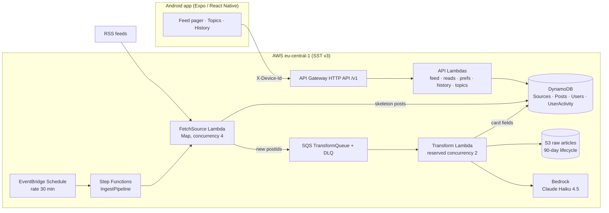

# TechTok — Design Document

TikTok-style reader for tech & science news: full-screen swipeable cards, each card an LLM-condensed story with image, headline, short summary, and a link to the source.

- **Status:** agreed 2026-07-18, after Q&A session (decisions logged in §2)
- **Scale target:** you + friends (tens of users), hobby budget ~$10/mo
- **Companion doc:** [IMPLEMENTATION_PLAN.md](IMPLEMENTATION_PLAN.md)

---

## 1. Product definition

**Core loop:** open app → full-screen card feed (newest unread stories in your topics) → swipe up for next → tap through to source when hooked. Read state and topic preferences follow you server-side.

**A card is:** article image (full-bleed background with scrim) + hook title + 2–3 sentence summary + "why it matters" line + source attribution + topic chip + published time. Tap → source article in an in-app browser tab.

**Non-goals (v1):** video/audio content, comments/social features, user-generated content, iOS release (kept buildable, not tested), Play Store publication, multi-language (English only), personalized ML ranking.

### Topics (fixed taxonomy v1)

`ai` · `dev` · `gadgets` · `startups` · `security` · `science` · `space` · `bio`

Defined once in `packages/shared`. The LLM classifier picks a `primaryTopic` from this list (source default as fallback). Empty user selection = all topics.

### Seed sources (all editable — live in a DynamoDB table + seed file)

| Preset | Sources (verify exact feed URLs at implementation) | Default topic |
|---|---|---|
| Tech | Hacker News front page (hnrss, points≥100), The Verge, Ars Technica, TechCrunch | dev / gadgets / startups |
| Science | ScienceDaily, Phys.org, Quanta Magazine, Nature News | science / bio |
| AI & dev | arXiv cs.AI, GitHub Blog, Hugging Face blog | ai / dev |

### "Read" semantics

A post is **read** when its card has been the active (settled) page for ≥ 1.5 s, or the user opens the source link. The app queues read events locally and flushes in batches (every ~5 s and on app-background). Marking is idempotent.

---

## 2. Decision log

Decisions from the kickoff Q&A. Any of these can be revisited — the "revisit when" column says what would trigger it.

| # | Decision | Choice | Why | Revisit when |
|---|---|---|---|---|
| D1 | Audience | Me + friends, multi-user from day one | No store/compliance work, but real per-user state | It becomes a public product |
| D2 | Post format | Full-screen text+image cards (no video) | TikTok mechanics without the media pipeline | Never for v1; media array on schema keeps door open |
| D3 | Card text | LLM summaries are the target format | Best UX; excerpt cards are the interim + fallback | LLM cost/quality disappoints |
| D4 | Identity | Anonymous device ID, server-side user state | Zero friction, satisfies "server keeps prefs/read status" | Multi-device sync wanted → link Cognito accounts |
| D5 | Mobile toolchain | Expo + expo-dev-client + EAS | Fastest iteration, easy APK distribution to friends | A native need Expo can't plugin-ize |
| D6 | LLM provider | AWS Bedrock, Claude Haiku 4.5 | IAM auth (no keys), one bill, EU inference profiles | Model gaps in EU region |
| D7 | Lint/format | **Biome 2 everywhere** (no ESLint/Prettier) | One fast tool, simple config | RN-specific bugs slip that eslint-config-expo would catch |
| D8 | Package manager | pnpm workspaces | Fast, strict; Expo/Metro/SST all fine with it | Metro symlink pain → `node-linker=hoisted` escape hatch |
| D9 | Sources | All three presets (~11 feeds) | Broad tech+science coverage from day one | Feed quality review after phase 3 |
| D10 | Region | `eu-central-1` | User in EU; Claude via `eu.` cross-region inference profile | Model unavailable in EU profile |
| D11 | Budget | ~$10/mo, AWS Budget alarm, LLM caps | Hobby economics; see §10 | Friends actually use it heavily |
| D12 | iOS | Keep code cross-platform, test Android only | Near-free with Expo | Someone with an iPhone asks nicely |
| D13 | Backend stack | **SST v4** (Ion architecture), Node 22, TypeScript strict | User choice; at Phase 0 implementation time, v3 had already been superseded by v4 on the same CDK-free Ion architecture — same APIs, next major | SST ships a v5 with breaking API changes |
| D14 | Pipeline | Step Functions + SQS, **introduced in phase 2** (walking skeleton uses one cron Lambda) | SFN/SQS earn their keep at fan-out + LLM rate control, not at 3 feeds | — |
| D15 | Phase 0 toolchain pins | `sst.aws.CronV2` (not the deprecated `Cron`); TypeScript **5.9.3** (not the 7.0 native-compiler major); Jest **29.7.0** in `apps/mobile` (not 30.x) | CronV2 uses EventBridge Scheduler + retries/DLQ, the modern component; TS 7 is a from-scratch rewrite with unverified third-party tooling compat this early; `jest-expo@57.0.2` pins `@jest/globals`/`jest-environment-jsdom`/etc. to `^29.2.1` — installing jest 30 at the root split the jest-internals version graph and crashed (`clearMocksOnScope is not a function`) | jest-expo ships a 30.x-compatible release; revisit TS 7 once the ecosystem (Expo/Metro/SST tooling) has caught up |
| D16 | Transform Lambda reserved concurrency | Deferred — not set for now, on both `andrey` and `production` stages | This AWS account's Lambda "Concurrent executions" quota is stuck at 10 (confirmed via `aws lambda get-account-settings` / `aws service-quotas get-service-quota --service-code lambda --quota-code L-B99A9384`), below AWS's normal default of 1000. AWS requires ≥10 unreserved concurrent executions to always remain in the account, so *any* positive reserved-concurrency value on *any* function fails deployment (`InvalidParameterValueException: ... decreases account's UnreservedConcurrentExecution below its minimum value of [10]`). A self-service Service Quotas increase request was rejected (`You must provide a quota value greater than the default quota value of 1000.0`) — this is a suppressed/restricted quota needing an AWS Support case, not a normal increase flow. The transform stage still works correctly without the reservation; it just temporarily loses the intended cost/rate throttle (DESIGN §7.2) | The account's Lambda concurrent-execution quota is raised above ~12 (10 minimum unreserved + at least 2 reserved) — re-add `concurrency: { reserved: 2 }` to the Transform function in `infra/pipeline.ts` at that point |

### Challenged assumptions → resolutions

1. **"Reels" ≠ video.** Resolved: cards with TikTok swipe mechanics (D2). Post schema includes an optional `media[]` array from day one so TTS/video can be added without migration.
2. **Step Functions on day one vs. "prototype ASAP".** Resolved: phase 0 ships a single scheduled Lambda; SFN+SQS arrive in phase 2 where per-source isolation, retries, and rate control actually matter (D14).
3. **LLM is the only real cost.** Resolved: budget guardrails are first-class design (§7.4, §10): daily transform cap, input truncation, reserved concurrency, excerpt fallback.
4. **Content rights.** Resolved lane: ingest RSS (built for syndication), display *our own* summaries + excerpt + prominent attribution and link-out. Full text fetched only as processing input, stored privately in S3, never displayed. Respect robots.txt on page fetches; identify as `TechTokBot`. Per-source allowlist; remove any source on request.
5. **DynamoDB feed query is the hard part.** Resolved with explicit key design (§6) — topic+time GSI, server-side merge, read-set exclusion — accepted imprecision documented (§5.2).

---

## 3. System architecture



**Data flow:** the scheduler kicks a Step Function that fans out over enabled sources; each fetch does a conditional GET on the RSS feed, deduplicates entries by canonical-URL hash (conditional put), and enqueues only *new* posts to SQS. The transform consumer fetches the article page, extracts text, archives raw HTML to S3, calls Bedrock for the card copy + topic classification, and updates the post to `ready`. The API side is plain request/response Lambdas over DynamoDB.

---

## 4. Repository layout

pnpm workspace monorepo; SST config at the root.

```
techtok/
├── sst.config.ts            # stages, imports infra/
├── infra/                   # SST components: api.ts, storage.ts, pipeline.ts
├── biome.json               # lint + format, whole repo
├── tsconfig.base.json       # strict, shared options
├── pnpm-workspace.yaml
├── packages/
│   ├── shared/              # zod contracts, topic taxonomy, API types (server+app)
│   ├── core/                # domain logic: rss mapping, url canonicalization,
│   │                        #   repos (DDB), feed merge, llm client, extractors
│   └── functions/           # thin Lambda handlers: api/*, ingest/*, transform/*
├── apps/
│   └── mobile/              # Expo app (expo-router)
└── docs/
```

Rules: `functions` handlers stay thin (parse → call `core` → serialize); all business logic lives in `core` where it's unit-testable without AWS. `shared` has zero runtime deps besides zod and is imported by both server and app.

---

## 5. API design

- **Base:** API Gateway HTTP API, path-versioned `/v1`, one Lambda per route (SST `ApiGatewayV2.route()` — idiomatic, per-route IAM). Revisit to a single Hono Lambda only if route count or cold starts become annoying.
- **Auth (v1):** `X-Device-Id: <uuid>` header. The app generates a UUID once (stored in SecureStore/MMKV); the server upserts the user on first sight (`userId = deviceId`). Guessable-ID risk is acceptable at friends-scale; upgrade path is Cognito account linking (device → account map) without URL changes.
- **Validation:** every request/response shape is a zod schema in `packages/shared`; server parses inputs (400 on failure), app parses responses.
- **Errors:** `{ "error": { "code": "string", "message": "string" } }` with proper status codes.

| Method & path | Purpose | Notes |
|---|---|---|
| `GET /v1/feed?limit=20&before=<iso>` | Next cards for this user | Unread, topic-filtered, newest-first; returns `{ items, nextBefore }` |
| `POST /v1/reads` | Mark posts read | Body `{ postIds: string[] }`, idempotent, 204 |
| `GET /v1/history?limit=50&cursor=` | Reading history | Newest-read-first, snapshot-based (survives post TTL) |
| `GET /v1/me` | User profile | `{ userId, topics, createdAt }` |
| `PUT /v1/me/topics` | Set topic prefs | `{ topics: string[] }`; empty = all topics |
| `PUT /v1/me/push-token` | Register Expo push token | `{ pushToken: string }`; enables the phase-5 daily digest |
| `GET /v1/topics` | Topic taxonomy | Static list with labels; lets app render without hardcoding |

**Card DTO:** `{ id, title, summary, whyItMatters?, imageUrl?, sourceName, url, primaryTopic, topics[], publishedAt, media?[] }`

### 5.2 Feed algorithm (v1)

1. Load user's topics (empty → all 8).
2. For each selected topic, query `Posts.byTopic` GSI: newest 25 `ready` posts `< before` watermark.
3. Merge by `publishedAt` desc, dedup by id.
4. `BatchGet` the user's read-markers for the top ~60 candidates; drop read ones.
5. Return first `limit` + `nextBefore` = `publishedAt` of the last returned item.

Known imprecision: a timestamp-watermark cursor can duplicate or skip items at equal timestamps under concurrent ingestion. Accepted at this scale; the app dedups by id. The clean fix (fan-out per-topic feed table as a read model) is noted for phase 4+ if ever needed.

**Ordering v1 is newest-first.** A lightweight score (recency decay + source weight + topic diversity) is a phase 4 experiment — deliberately not in the MVP.

---

## 6. Data model (DynamoDB, on-demand)

Four purpose-built tables (clearer to operate and learn than single-table design at this scale; single-table is a possible later optimization, not a goal).

### `Sources`
| | |
|---|---|
| PK | `sourceId` (slug, e.g. `hn`, `verge`) |
| Attrs | `name`, `rssUrl`, `siteUrl`, `defaultTopic`, `topics[]`, `weight`, `enabled`, `etag`, `lastModified`, `lastFetchAt`, `lastStatus`, `failCount` |
| Access | Scan enabled sources (tiny table — scan is correct here) |

### `Posts`
| | |
|---|---|
| PK | `postId` = sha-256 of canonical URL (utm/tracking params stripped) → **dedup is a conditional put** |
| Attrs | `url`, `canonicalUrl`, `sourceId`, `sourceName`, `origTitle`, `cardTitle`, `summary`, `whyItMatters`, `excerpt`, `imageUrl`, `primaryTopic`, `topics[]`, `media[]`, `lang`, `status: discovered\|ready\|failed`, `transform: llm\|excerpt\|skipped`, `publishedAt` (ISO), `ingestedAt`, `s3RawKey`, `ttl` |
| GSI `byTopic` | PK `primaryTopic`, SK `publishedAt` — the feed query |
| GSI `byTime` | PK constant `"POST"`, SK `publishedAt` — "all topics" feed + ops. Deliberate single-partition: fine at <1 write/sec, flagged as the first thing to change at real scale |
| TTL | 90 days (keeps table lean; history survives via snapshots) |

Multi-topic indexing note: a GSI can't index a list, so the feed indexes `primaryTopic` only; secondary `topics[]` are filter metadata. Fan-out index items per (topic, post) is the known upgrade if secondary-topic queries are ever needed.

### `Users`
| | |
|---|---|
| PK | `userId` (= device UUID v1) |
| Attrs | `topics[]`, `createdAt`, `lastSeenAt`, `settings{}`, `pushToken?` (Expo push token, phase 5 daily digest) |

### `UserActivity`
| | |
|---|---|
| PK / SK | `userId` / `read#<postId>` (prefix leaves room for `bm#<postId>` bookmarks in phase 4) |
| Attrs | `readAt` (ISO), `snapshot { cardTitle, sourceName, url }` (~200 B — history renders even after the post expires) |
| GSI `byReadAt` | PK `userId`, SK `<readAt>#<postId>` — history pagination |
| Access | O(1) is-read membership via GetItem/BatchGet; history via GSI query desc |

Plus a small `Counters` item (in `Users` or its own table): `transforms#<yyyy-mm-dd>` atomic counter enforcing the daily LLM cap.

**DynamoDB client:** AWS SDK v3 `lib-dynamodb` behind repo modules in `core`. ElectroDB is a possible later adoption if key-building gets tedious — not v1.

---

## 7. Ingestion & transform pipeline

### 7.1 Phase 0 shape (walking skeleton)

`Cron(rate 1 hour)` → one `ingest` Lambda: fetch 3 hardcoded feeds → `rss-parser` → canonicalize URL → conditional put excerpt-cards (`status=ready`, `transform=excerpt`). No SFN/SQS/S3 yet. This alone makes the app real.

### 7.2 Target shape (phase 2+)

**EventBridge** `rate(30 minutes)` → **Step Function `IngestPipeline`** (SST `StepFunctions` component; drop to raw provider resources if the component lacks a feature):

1. **LoadSources** — Lambda: scan enabled sources.
2. **Map over sources** (`maxConcurrency: 4`, per-item Catch so one bad feed never kills the run → increments `failCount`, records `lastStatus`):
   **FetchSource** — conditional GET (`If-None-Match`/`If-Modified-Since` from stored `etag`/`lastModified`); parse; per entry: canonical URL → `postId` → conditional put skeleton post (`status=discovered`, excerpt fields, `ttl`); only *newly created* posts → `SendMessageBatch` to SQS. Returns `{ sourceId, seen, new }`.
3. **Summarize** — aggregate counts → CloudWatch metrics (EMF) + structured log line.

**SQS `TransformQueue`** (visibility 90 s, redrive to DLQ after 3 receives) → **Transform Lambda** (batch ≤ 5, **reserved concurrency 2** — the LLM rate/cost valve; currently unset pending an AWS account quota fix, see D16):

1. Check daily cap counter — **if over cap, the post ships as an excerpt card** (`transform=skipped`), never blocks the feed.
2. Fetch article page — 10 s timeout, 2 MB cap, UA `TechTokBot/1.0 (+repo URL)`, robots.txt honored (`robots-parser`, per-host cache).
3. Extract main text (`@extractus/article-extractor`; fallback = RSS description).
4. Archive raw HTML → S3 `raw/<postId>.html` (lifecycle: delete at 90 days).
5. **Bedrock Converse** → card copy (§7.4).
6. Update post → `status=ready`, `transform=llm`.

**Failure semantics:** content-level failures (unparseable page, LLM refusal) degrade to excerpt cards — the feed never starves. Infra-level failures throw → SQS retry ×3 → DLQ → CloudWatch alarm. Everything is idempotent: re-transforming overwrites the same fields.

### 7.3 Why SFN + SQS at all (and why not in phase 0)

Step Functions buys per-source retry/isolation, visible execution history, and Map-state fan-out; SQS decouples discovery rate from the deliberately-throttled LLM stage and gives DLQ semantics. None of that pays off at 3 hardcoded feeds — hence phase-gated (D14).

### 7.4 LLM contract

- **Model:** Bedrock inference profile `eu.anthropic.claude-haiku-4-5-*` (confirm exact ID + enable model access in the account once, at implementation). Escalate to Sonnet only if quality demands.
- **Input:** extracted article text truncated to ~4,000 chars + title + source.
- **Output:** single JSON object, zod-validated:
  `{ cardTitle ≤ 80, summary 2–3 sentences ≤ 320, whyItMatters ≤ 160, primaryTopic: enum, topics: enum[], lang }`
  One repair-retry on invalid JSON, then excerpt fallback.
- **Prompt lives in the repo** (`packages/core/src/llm/prompts/`), covered by golden-fixture tests — recorded outputs, no live LLM calls in CI.
- **Cost knobs:** daily cap (default **120 transforms/day**), input truncation, reserved concurrency 2, Bedrock batch inference (−50%) as a later optimization.

---

## 8. Mobile app (Expo)

- **Stack:** Expo SDK (latest at implementation, ~54), TypeScript strict, `expo-router`, New Architecture defaults.
- **Screens:** `/` feed (full-screen vertical pager) · `/settings` modal (topic multi-select, about) · `/history` list. No tab bar in v1 — feed is the app; overlay buttons for the rest.
- **Feed mechanics:** `react-native-pager-view` (vertical, `offscreenPageLimit=1`) over `useInfiniteQuery` pages of 20; request next page when ~5 cards from the end. `expo-image` for cached images, gradient scrim for text legibility, `expo-web-browser` for source link-out, native share sheet.
- **State:** TanStack Query v5 (server state, MMKV-persisted cache → last feed readable offline) + Zustand v5 (device ID, topic cache, pending read-queue) persisted via `react-native-mmkv`.
- **Read queue:** page-settle timer (1.5 s) → enqueue → flush every 5 s + on AppState background; survives restarts via MMKV.
- **Styling:** `StyleSheet` + a small design-tokens module, dark-first with system-theme support. NativeWind is a deliberate later option (Biome has `useSortedClasses` for it), not v1.
- **Config:** API base URL per build profile via `app.config.ts` (`dev` → your personal SST stage, `preview` → production stage).
- **Distribution to friends:** EAS internal distribution (installable APK link). Play Store internal track only if this outgrows friends (D1).

---

## 9. Tooling, quality, operations

- **TypeScript:** strict everywhere, `tsconfig.base.json` + per-package extends; `tsc --noEmit` as the typecheck gate.
- **Biome 2:** single root `biome.json` (lint + format, organize imports); per-directory overrides where mobile needs different rules. Known trade-off (D7): fewer RN-specific rules than eslint-config-expo — revisit if real bugs slip through.
- **Testing:** Vitest for `shared`/`core`/`functions` (URL canonicalization, RSS mapping, feed merge, cursor logic, zod contracts, repos via `aws-sdk-client-mock`, LLM golden fixtures). `jest-expo` + React Native Testing Library for mobile components and the read-queue. Maestro E2E is optional phase 6. No live-AWS calls in CI.
- **CI (GitHub Actions):** on PR + main — pnpm install (cached) → `biome ci .` → typecheck → vitest → mobile jest. On main (from phase 2): `sst deploy --stage production` via AWS OIDC role (no long-lived keys). EAS builds via manual dispatch.
- **Conventions:** conventional commits; solo work goes to `main` behind green CI, branches for risky work. **Definition of done:** Biome + typecheck + tests green, deployed to dev stage, feature exercised on a device/emulator.
- **Stages:** personal dev stage (`sst dev` live development) + `production`. Same AWS account is fine at this scale.
- **Observability:** Lambda Powertools (TypeScript) structured logs + EMF metrics from phase 0 (`IngestedCount`, `TransformFail`, `LLMDailyCount`); 14-day log retention. Alarms: DLQ depth > 0, SFN execution failed, API 5xx spike, AWS Budget at $10.
- **Secrets:** none needed v1 (Bedrock is IAM). Anything later → `sst secret`.

---

## 10. Cost model (monthly, friends-scale)

| Item | Assumption | Est. |
|---|---|---|
| API GW + Lambda + SQS + EventBridge | well inside free tiers | ~$0 |
| DynamoDB on-demand | ~1k writes + few k reads/day | <$1 |
| Step Functions (standard) | 48 runs/day × ~15 transitions | ~$0.50 |
| S3 + lifecycle | <2 GB rolling | ~$0.05 |
| CloudFront + mirrored-image S3 storage (phase 4) | low request volume, <2 GB rolling, 90-day lifecycle | ~$1 |
| CloudWatch logs/metrics/alarms | 14-day retention | ~$1–2 |
| **Bedrock Haiku 4.5** ($1/M in, $5/M out) | **120 art/day**, ~1.4k in + 250 out tokens each | **~$9–10** |
| **Total** | | **≈ $12–14 worst case; <$5 typical** (dedup means quiet days transform far less) |

Levers if over budget: lower daily cap, shrink truncation, 60-min cadence, Bedrock batch API (−50%).
The image-mirroring CDN add reduces an already-thin budget cushion — worth a Cost Explorer check a week after this ships (see IMPLEMENTATION_PLAN.md phase 4).

---

## 11. Risks

| Risk | Mitigation |
|---|---|
| RSS feed quirks (missing images, bad dates, encodings) | Per-source parser fixtures; fallback field chain (enclosure → media:content → og:image → none); tolerate imageless cards |
| Hotlinked images break or block | Accepted v1; phase 4 mirrors images to S3 + CloudFront (~$1/mo) |
| LLM JSON drift / refusals | zod validation + one repair retry + excerpt fallback; golden tests pin the prompt |
| Cost overrun | Daily cap + reserved concurrency + Budget alarm + truncation |
| Feed cursor imprecision | Client id-dedup; fan-out read model documented as the upgrade |
| Biome misses RN-specific footguns | Watch for hook-deps/list-key bugs; ESLint remains a one-day swap |
| pnpm × Metro edge cases | Expo supports pnpm monorepos; `node-linker=hoisted` is the escape hatch |
| Source objects to summarization | Attribution + link-out + robots.txt respect; per-source kill switch (`enabled=false`); remove on request |
| Bedrock model/profile availability in EU | Verify at implementation; fallbacks: eu Sonnet profile or us profile |

---

## 12. Deferred decisions (defaults chosen — flip anytime)

Everything else I would otherwise have asked, with the default the plan assumes:

| Question | Default (v1) |
|---|---|
| Ingestion cadence | 30 min (60 min in phase 0) |
| Post retention | 90-day TTL (DDB + S3 lifecycle); history snapshots keep forever |
| Feed with no topic prefs | All topics |
| Language | English-only ingest + cards |
| API framework | None — per-route Lambdas + zod (Hono single-Lambda is the fallback if routes proliferate) |
| DDB modeling | Multi-table (single-table only as a proven-need optimization) |
| Validation library | zod v4 (shared contracts package) |
| HTTP client (server) | Node 22 built-in fetch/undici |
| RSS parsing | `rss-parser`; extraction `@extractus/article-extractor` |
| Mobile styling | StyleSheet + tokens; NativeWind deferred |
| Offline | Query-cache persistence only; explicit prefetch deferred |
| Push notifications | Implemented phase 5 — daily top-N-unread digest via `expo-notifications` + Expo push API, opt-in from settings |
| Crash reporting | Sentry (free tier) in phase 6 |
| Product analytics | None — CloudWatch metrics only |
| Cross-source duplicate stories (same story, two outlets) | Accepted v1; canonical-URL + title-similarity dedup is a phase 4+ experiment |
| Dark mode | Dark-first + system theme from day one |
| Bookmarks | Phase 4 (`bm#` sort-key space reserved) |
| Auth upgrade | Cognito + device-linking, only when multi-device sync is wanted |
| Renovate/dependabot | Add in phase 6 |
| Node / TS versions | Node 22 LTS, TS 5.8+, pinned via `engines` + `.nvmrc` |
