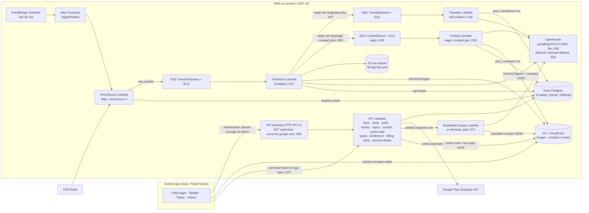

# TechTok — Design Document

TikTok-style reader for tech & science news: full-screen swipeable cards, each card an LLM-condensed story with image, headline, short summary, and a link to the source.

- **Status:** agreed 2026-07-18, after Q&A session (decisions logged in §2); localization + compact-reader + UX extension agreed 2026-07-22 (D20–D25, phases 7–10); UI library, eager translation, image quality, digest retirement, and visual identity agreed 2026-07-24 (D26–D30, phases 11–12); LLM provider swap to OpenRouter agreed 2026-07-24, code complete (D32, phase 13); CI/CD hardening — parallel jobs, API/mobile compatibility guardrail, mobile semver automation — agreed and implemented 2026-07-24 (D33–D35, phase 14); eager compact-article generation for all 4 languages agreed and implemented 2026-07-24 (D36, phase 15); visual identity redesign ("Orbit") + native-asset sync fix agreed 2026-07-24 (D37, phase 16); public project site on GitHub Pages agreed and implemented 2026-07-25 (D39, phase 17); mobile version automation retired for good after a real push race (D41, 2026-07-25), then reinstated as two race-safe pieces: post-merge tag-only (D42) and PR-branch auto-bump (D43), both 2026-07-26; auto-bump moved back to a post-merge push on `main` once the ruleset's `pull_request` requirement was lifted (D44, 2026-07-26); daily-use polish, smarter ranking and new-capability decisions agreed and implemented as independent PRs 2026-07-26 (D45–D49, phases beyond 17 — muting a source as a hard feed exclude being the latest, D49); listen mode (text-to-speech) for cards and the reader agreed and implemented via expo-speech (D54, 2026-07-26); offline saved-article prefetch (wifi-gated, on bookmark) agreed and implemented 2026-07-26 (D55); LoadingScreen made theme-aware with a "TechTok" title, amending D25/D30/D37 agreed and implemented 2026-07-27 (D56); mobile release tags/GitHub Releases now carry a feat/fix changelog, amending D42, agreed and implemented 2026-07-28 (D58); a release history feed on the public site, reusing that changelog, agreed 2026-08-03 (D60, phase 18); feed read-ahead content prefetch, extending D55 from explicit bookmarks to scroll position, agreed and implemented 2026-08-03 (D61); visual identity redesign — mascot-in-hexagon logo, replacing D37's Orbit mark — agreed and implemented 2026-08-10 (D66); D66's hexagon mark corrected for Android adaptive-icon safe-zone clipping, reported from an on-device screenshot, amended and implemented 2026-08-11; **going public and paid** — Google Play listing, Google Sign-In replacing anonymous device identity, a free-tier daily cap, a Play Billing subscription, and a paid extended-compact reader — agreed 2026-08-10 (D67–D74, phases 19–22); article-content prefetch removed from the app, retiring D55/D61 and reversing D81's decision to keep it, agreed and implemented 2026-08-21 (D82); comments banned outright in code, enforced by `scripts/checkNoComments.ts` and a blocking PostToolUse hook, 2026-08-21 (D83); a run of live-bug fixes across the feed, reader, OTA and ingest paths, 2026-08-21 to 2026-08-26 (D78–D81, D84–D87); `Posts` GSI projections narrowed and `buildFeed` split into candidate-then-hydrate, 2026-08-31 (D88); the ops dashboard and the three queue-backlog alarms deleted as per-resource CloudWatch cost, 2026-08-31 (D89); **the primary datastore moved from DynamoDB to Neon Postgres via Drizzle** on a normalized schema, agreed 2026-08-31 and implemented through 2026-09-02 (D90/D93/D94, phase 24 — migrations and source seeding now run as deploy steps, D92/D95); the CI release pipeline reshaped so the Play-Store AAB build runs automatically and in parallel with the backend chain, 2026-09-03 to 2026-09-04 (D98–D101); project domain `techtokapp.eu` plus a real privacy/support mailbox provisioned for the legal and store surface, 2026-09-05 (D103); test runners split by file extension — Vitest for `*.test.ts`, jest-expo for `*.test.tsx`, 2026-09-05 (D104); the app's MD3 neutral palettes reseeded from the brand navy's own hue *and* chroma so its surfaces stop resolving to near-neutral grey and match `apps/site`'s `--navy` exactly, agreed and implemented 2026-09-05 (D105)
- **Scale target:** was "you + friends (tens of users), hobby budget ~$10/mo" through D66. As of D67 this is a **public Play Store app with a paid tier** — audience unbounded, cost governed by per-subscriber unit economics rather than a flat ceiling (D74), with the AWS Budget alarm retained at $25/mo as an infrastructure-drift signal only
- **Companion doc:** [IMPLEMENTATION_PLAN.md](IMPLEMENTATION_PLAN.md)

---

## 1. Product definition

**Core loop:** open app → full-screen card feed (newest unread stories in your topics) → swipe up for next → tap through to source when hooked. Read state and topic preferences follow you server-side.

**A card is:** article image (full-bleed background with scrim; deterministic gradient + topic-glyph stub when the article truly has none, D24) + hook title + 2–3 sentence summary + "why it matters" line + source attribution + topic chip + published time. Tap → compact in-app reader (D23) ending in a prominent "Read original" link-out; posts with no compact version fall back to the direct in-app browser tab.

**Non-goals (v1):** video/audio content, comments/social features, user-generated content, iOS release (kept buildable, not tested), personalized ML ranking. (Multi-language *sources* remain a non-goal — ingest is English-only; *serving* is localized per D20.) *Play Store publication was a non-goal through D66 and is now the explicit target — see D67.* Anonymous use is **also** now a non-goal: sign-in gates the feed (D68).

### Topics (fixed taxonomy v1)

`ai` · `dev` · `gadgets` · `startups` · `security` · `science` · `space` · `bio`

Defined once in `packages/shared`. The LLM classifier picks a `primaryTopic` from this list (source default as fallback). Empty user selection = all topics.

### Languages (v2, D20–D22)

`en` (source language) · `ru` · `uk` · `pl` — fixed set, defined in `packages/shared`. Each user has one `language` (device-locale default, changeable in settings/onboarding). Content is translated **eagerly at transform time** (D27 for cards, D36 for compact articles — the original on-demand, feed-/tap-triggered enqueue is gone) and stored per-post in `post_translations`/`post_compacts`; English is always the fallback and never blocks — an untranslated card simply serves the English copy. Topic labels and the app's own UI chrome are localized into the same four languages (static string tables, no LLM).

### Plans & entitlements (v3, D67–D74)

Every user signs in with Google (D68) and sits on one of two plans:

| | **Free** | **Plus** — €2.99/mo or €24.99/yr (D73) |
|---|---|---|
| Card reads / day | 50 | unlimited |
| Reader opens / day | 10 | unlimited |
| Compact article (~400–600 words, 4 languages, eager) | ✅ | ✅ |
| **Extended compact (~1,500 words, on demand)** | ❌ | ✅ (fair use: 100/mo) |
| Topics, language, history, bookmarks, search, listen mode, offline, stats | ✅ | ✅ |

A "card read" is the existing §1 settle event (1.5 s active page), *not* a feed item served — prefetch and offscreen renders never burn quota. Both counters reset at **local** midnight from an IANA timezone captured at sign-in (UTC fallback). Enforcement is server-side; the client renders remaining counts and the paywall. Entitlement is a first-class concept independent of the payment provider (D70), so it can be granted manually for testing and comped accounts.

Paid does **not** buy access to more of a publisher's text — it buys a longer version of *our own* condensation, on demand, plus the removal of our own limits (D72). That distinction is the whole rights posture of the paid tier.

### Seed sources (all editable — live in a Postgres `sources` table + seed file)

| Preset | Sources (verify exact feed URLs at implementation) | Default topic |
|---|---|---|
| Tech | Hacker News front page (hnrss, points≥100), The Verge, Ars Technica, TechCrunch | dev / gadgets / startups |
| Science | ScienceDaily, Phys.org, Quanta Magazine, Nature News | science / bio |
| AI & dev | arXiv cs.AI, GitHub Blog, Hugging Face blog | ai / dev |

### "Read" semantics

A post is **read** when its card has been the active (settled) page for ≥ 1.5 s, or the user opens the source link. The app queues read events locally and flushes in batches (every ~5 s and on app-background). Marking is idempotent.

---

## 2. Decision log

Decisions from the kickoff Q&A. Any of these can be revisited — the "revisit when" column says what would trigger it.

| # | Decision | Choice | Why | Revisit when |
|---|---|---|---|---|
| D1 | Audience | Me + friends, multi-user from day one | No store/compliance work, but real per-user state | It becomes a public product |
| D2 | Post format | Full-screen text+image cards (no video) | TikTok mechanics without the media pipeline | Never for v1; media array on schema keeps door open |
| D3 | Card text | LLM summaries are the target format | Best UX; excerpt cards are the interim + fallback | LLM cost/quality disappoints |
| D4 | Identity | Anonymous device ID, server-side user state | Zero friction, satisfies "server keeps prefs/read status" | Multi-device sync wanted → link Cognito accounts |
| D5 | Mobile toolchain | Expo + expo-dev-client + EAS | Fastest iteration, easy APK distribution to friends | A native need Expo can't plugin-ize |
| D6 | LLM provider | AWS Bedrock, Claude Haiku 4.5 | IAM auth (no keys), one bill, EU inference profiles | Model gaps in EU region |
| D7 | Lint/format | **Biome 2 everywhere** (no ESLint/Prettier) | One fast tool, simple config | RN-specific bugs slip that eslint-config-expo would catch |
| D8 | Package manager | pnpm workspaces | Fast, strict; Expo/Metro/SST all fine with it | Metro symlink pain → `node-linker=hoisted` escape hatch |
| D9 | Sources | All three presets (~11 feeds) | Broad tech+science coverage from day one | Feed quality review after phase 3 |
| D10 | Region | `eu-central-1` | User in EU; Claude via `eu.` cross-region inference profile | Model unavailable in EU profile |
| D11 | Budget | ~$10/mo, AWS Budget alarm; see §10. *(LLM caps enforced it through D27; D31 removed them, leaving the alarm monitoring-only, not a ceiling.)* | Hobby economics; see §10 | Friends actually use it heavily |
| D12 | iOS | Keep code cross-platform, test Android only | Near-free with Expo | Someone with an iPhone asks nicely |
| D13 | Backend stack | **SST v4** (Ion architecture), Node 22, TypeScript strict | User choice; by Phase 0 v3 was already superseded by v4 on the same CDK-free Ion architecture — same APIs, next major | SST ships a v5 with breaking API changes |
| D14 | Pipeline | Step Functions + SQS, **introduced in phase 2** (walking skeleton uses one cron Lambda) | SFN/SQS earn their keep at fan-out + LLM rate control, not at 3 feeds | — |
| D15 | Phase 0 toolchain pins | `sst.aws.CronV2` (not the deprecated `Cron`); TypeScript **5.9.3** (not the 7.0 native-compiler major); Jest **29.7.0** in `apps/mobile` (not 30.x) | CronV2 is the modern component (EventBridge Scheduler + retries/DLQ); TS 7 is a from-scratch rewrite with unverified third-party tooling compat this early; `jest-expo@57.0.2` pins `@jest/globals`/`jest-environment-jsdom`/etc. to `^29.2.1`, so root jest 30 split the jest-internals version graph and crashed (`clearMocksOnScope is not a function`) | jest-expo ships a 30.x-compatible release; revisit TS 7 once Expo/Metro/SST tooling has caught up |
| D16 | Transform Lambda reserved concurrency | Deferred — not set on either stage (`andrey`, since renamed `dev` per D17, or `production`) | This account's Lambda "Concurrent executions" quota is stuck at 10 (`aws lambda get-account-settings`; `aws service-quotas get-service-quota --service-code lambda --quota-code L-B99A9384`) against AWS's normal default of 1000. AWS requires ≥10 unreserved executions to always remain, so *any* positive reserved value on *any* function fails deployment (`InvalidParameterValueException: ... decreases account's UnreservedConcurrentExecution below its minimum value of [10]`). The self-service increase was rejected (`You must provide a quota value greater than the default quota value of 1000.0`) — a suppressed quota needing an AWS Support case, not the normal flow. Transform still works, minus the intended cost/rate throttle (§7.2) | The quota rises above ~12 (10 minimum unreserved + 2 reserved) — re-add `concurrency: { reserved: 2 }` to the Transform function in `infra/pipeline.ts` then |
| D17 | Stage naming & billing grouping | Personal dev stage renamed from the OS-username default (`andrey`) to an explicit `dev` — `pnpm dev` → `sst dev --stage dev`, `deploy:dev` → `sst deploy --stage dev` (briefly `stage` mid-rename, then unified so the stage name and the `techtok-dev` app/tag/group value share one word). All resources get default provider tags `app: techtok-dev\|techtok-production` + `stage: <stage name>` (`sst.config.ts`), plus one `aws.resourcegroups.Group` per stack (`infra/monitoring.ts`), named `techtok-dev`/`techtok-production`, querying `AWS::AllSupported` by the `app` tag — one console view and Cost Explorer tag grouping | Wanted per-environment resource grouping for cost tracking. Rejected Service Catalog AppRegistry/myApplications: AWS closes AppRegistry to new customers on 2026-07-30 and this account has zero prior usage (`aws servicecatalog-appregistry list-applications`), so it would count as new — plus it needs per-resource `ResourceAssociation` wiring or an undocumented tag-scanner. Plain Resource Groups (the ARG service, confirmed distinct from the AppRegistry sunset) is a pure tag query: no wiring, no lifecycle coupling, free, and reuses the Cost Explorer tags | AWS reopens AppRegistry, or the myApplications console/health view becomes worth the per-resource wiring |
| D18 | Android build & distribution | Committed bare `android/` project (`expo prebuild`) built and published to Play with the standard Android/Gradle toolchain — no EAS. Release signing reads a gitignored `apps/mobile/android/keystore.properties` (upload key outside the repo; falls back to the debug key when absent). `apps/mobile` gains `prebuild:android`/`build:android`/`build:android:apk`; the prebuild→gradlew→Play flow is in `docs/DISTRIBUTION.md`. EAS internal distribution (`eas.json`) kept as a fallback | Wanted a Play release pipeline owned entirely on the maintainer's machine, without Expo's paid cloud build. Keeping the Expo SDK (prebuild/CNG → committed native project) instead of ejecting to bare RN preserves every `expo-*` module in use; only EAS Build is dropped. Bare over managed CNG so the release `signingConfig` lives durably in `build.gradle` rather than a config plugin re-applied on every prebuild. Caveats (EAS Update OTA no longer fetches; push needs direct FCM) are in `docs/DISTRIBUTION.md` | The maintainer wants managed build/submit convenience back, or wants the Expo SDK gone entirely (would mean replacing `expo-router`/`expo-image`/`expo-notifications`/etc.) |
| D19 | Mobile CI builds | Build the Android APK in CI (`.github/workflows/mobile-build.yml`) with `eas build --local` on push to `main` + manual dispatch, publishing to a GitHub Release for sideloading. `--local` compiles on the runner, so it burns none of the 15 Android cloud builds/mo; signing uses EAS-managed *remote* credentials via an `EXPO_TOKEN` secret (no keystore in GitHub). Reuses `eas.json`'s `preview` profile (APK, internal) | Wanted automated mobile builds beyond the free tier without paying. `eas build --local` is unmetered yet stays in the Expo ecosystem (`eas.json` profiles, EAS Update channels, EAS-managed signing) the maintainer wants to keep; GitHub Releases replaces EAS-hosted internal-distribution links, a cloud-build-only feature. Chosen over plain `./gradlew` in CI (D18) to preserve EAS credential management (no keystore in GitHub secrets) and profile/env parity with occasional cloud builds | The maintainer wants EAS install pages or EAS Update in CI (spends cloud credits), moves to Play internal testing (D18), or needs iOS builds (macOS runner + Apple signing) |
| D20 | Localization scope & preference model | Four languages: `en` (source) + `ru`/`uk`/`pl`, fixed list in `packages/shared`. One `Users.language` per user (single choice): default = device locale if it's one of the four, else `en`; set via onboarding and a settings row. Localized: LLM card copy **and** excerpt/skipped cards (verbatim excerpts translated — accepted rights trade-off at friends scale), topic labels (static per-language strings in `shared`), and UI chrome (`expo-localization` + typed string tables). Ingest stays English-only | The audience includes non-English-reading friends; a fixed 4-language set bounds cost and QA. Excerpts are translated because a mixed EN/translated feed on excerpt-heavy days felt worse than the marginal rights exposure of privately machine-translating short excerpts | Language list grows (each one multiplies LLM spend); a source complains about translated excerpts (restrict eligibility to LLM cards); multi-device users want per-device languages |
| D21 | Translation storage & serving | Translations live in an `i18n` map **on the same `Posts` item** (`i18n.ru = { cardTitle, summary, whyItMatters, translatedAt }`), never as separate post items. The server picks the variant per request from `Users.language`; Card DTO gains `servedLang` + `isTranslated`; "show original" exists in the compact reader only (cards stay clean). English is always the fallback | `postId` keys every identity-bearing feature — read markers, bookmarks, dedup, history snapshots, feed GSIs — and per-language items would fracture all of them (reading the RU variant wouldn't mark the EN one read). Server-side selection keeps the feed one request and the client dumb | Translated posts need independent ranking/visibility (fan-out read model); payload size becomes a concern (move variants off the hot item) |
| D22 | On-demand LLM economics under an unchanged $10 budget | Alarm stays $10/mo (D11 reaffirmed). **All new LLM work is on-demand**: compact articles generate at first tap (D23; redesigned to a job-polling API by D27). *(Card translations were on-demand from the feed read path here; D27 moved them to eager pre-translation at transform time.)* Guards were per-kind daily counters in `Counters` plus a per-source daily transform quota — **removed entirely by D31**; there is no cap-based skip/degrade branch now. Also: try Hugging Face's official-posts-only feed URL (its community feed is 52% of the table). Haiku 4.5 everywhere (D6 escalation path unchanged). Translation quality via **in-call self-critique** (translate → critique → corrected output in one response, ~30–50% more output tokens, no second pass). No backfill of translations | Eager fan-out of everything (all posts × all languages + eager compacts) ≈ $70–100/mo against a $10 ceiling — still true, which is why compacts stay on-demand and eager translation (D27) covers card translations only. The cap-based worst-case framing this row originally used no longer applies post-D31: spend tracks real volume, with the alarm as the only signal | Real usage data after phase 12; bad-translation reports accumulate (add the deferred separate verify pass); D31's uncapped spend regularly busts the alarm (see D31) |
| D23 | Compact in-app reader | Re-resolves challenged assumption #4 **at friends scale**: the app shows an LLM-compressed version of the article — structured zod-validated blocks (`paragraph \| heading \| image \| list \| quote`), ~400–600 words — with the article's own in-body figures extracted and mirrored (≤5, minimum dimensions, degrade to text-only). Generated **on demand** in one pass straight to the requested language from the already-archived raw HTML in S3 (one live fetch attempt if no archive); stored as `content/<postId>/<lang>.json` on S3 behind the existing CloudFront router, so cached reads bypass Lambda entirely (`compactLangs` on the DTO tells the app which variants exist). *(Transport originally one synchronous `GET /v1/posts/:id/content?lang=`, 30 s ceiling, spinner UX; D27 made it a job-based polling API — `POST` starts generation, `GET .../content/status?jobId=` polls staged progress — same generation logic. Both the on-demand model and the polling transport are superseded by D36: compacts become eager for all 4 languages inside the ingest pipeline, and the reader API simplifies back to a plain cache read.)* Card tap → reader (when available/generatable) → prominent "Read original" in-app browser link; direct link-out is the fallback; share always shares the original URL. Guardrails: per-source `compactEnabled` kill switch, prominent attribution, remove-on-request, explicit revisit before any public release | Reading without a site-hop is the product's next step, and the raw-HTML archive makes generation nearly network-free. Sync generation was chosen for simplicity at phase 9; D27 revisits it once a real progress bar is wanted, since ~11 s typical generation beats a spinner with staged progress. Per-language single-pass generation avoids a translate-the-compact second call. The rights posture change is deliberate and logged, not incidental | Any public/store release (rights posture must be re-reviewed); a source objects (flip `compactEnabled`, remove content); figure extraction quality disappoints (text-only default) |
| D24 | Image fallback chain fix + backfill + stub | Implement the full designed chain: RSS `enclosure` → `media:content`/`media:thumbnail` (rss-parser `customFields`) → first `` in `content:encoded`/`content`/`summary` → **og:image from the already-fetched article page at transform time** (the `@extractus` result's `image` field, previously discarded) → mirror to CDN. *(D28 extends the og:image trigger to fire also when an ingest-time image exists but fails a minimum-dimension check, not only when it's absent.)* A one-shot backfill Lambda extracts og:image from the raw-HTML S3 archives for existing imageless posts (no LLM, no refetch). Genuinely imageless posts render a **client-side deterministic stub**: gradient seeded by `postId` + topic glyph (zero assets, zero backend, works offline). arXiv's generic og:image logo counts as imageless (small known-generic denylist in `core`) | Production audit 2026-07-22: 28 of 1,610 posts (1%) had images — only The Verge, the one source whose feed embeds `` in plain `content`. The implemented chain was a subset of the §11 design: `media:content` unparsed, `content:encoded` undeclared, og:image never wired despite the transform already downloading every page | A source's og:image proves consistently generic (extend the denylist); stub aesthetics after design-token evolution; the hotlink-vs-mirror balance changes |
| D25 | Feed UI restructure: bottom action bar + loading states | Replace the scattered overlay circle buttons with a **solid, layout-reserving bottom action bar** (~56 px + safe-area inset; the card pager shrinks accordingly — a deliberate amendment of D2's full-bleed aesthetic): per-card actions (bookmark, share) plus global nav (saved, history, settings) in one bar; card tap remains the reader entry (D23). Add a **branded splash** (`expo-splash-screen`; needs a prebuild re-run for the committed bare `android/`, D18) and a **dedicated in-app loading screen** (logo + spinner) between splash and the first rendered feed page, ahead of the existing skeletons. *(Mark/color left generic here — the Expo default icon was still in place; D30 designs the concrete identity, later replaced by D37.)* | Five floating circles don't scale as actions grow, and the maintainer prefers a conventional persistent bar over an overlay (explicit choice against the overlay recommendation). Cold start dropped straight into skeletons with no branded moment | Bar exceeds ~6 actions (add an overflow menu); full-bleed cards get missed enough to revisit the overlay; splash/loading feels slow rather than polished |
| D26 | Mobile UI component library | Adopt **React Native Paper** (Material Design 3) as the shared component library — a full sweep (buttons, cards, inputs, badges, chips, modals) replacing the custom UI. `PaperProvider` wraps the root (`app/_layout.tsx`) alongside expo-router's `ThemeProvider`; every ad hoc `Pressable`+`Text` in `apps/mobile/src` became `Button`/`IconButton`/`Chip`/`List.Item`/`TouchableRipple`; no modal/dialog UI existed to migrate. Unanticipated peer-dep gap: `@expo/vector-icons` wasn't in the repo at all, so Paper's icons would have silently rendered nothing — added at `^15.1.1` (the exact SDK 57 match per `expo install --check`, pure JS on the already-present `expo-font`, Expo-Go-safe). **Amendment, 2026-07-24:** the original stock `MD3LightTheme`/`MD3DarkTheme` choice is reversed — the theme is seeded from the app icon's brand palette (D37 "Orbit": navy `#111A33`, amber `#FF9F1C`), the exact trigger this row's revisit column had flagged. `constants/materialTheme.ts` uses `@material/material-color-utilities` (Google's HCT/tonal-palette algorithm; pure JS, Expo-Go-safe) to seed neutral/secondary/tertiary/error from the navy via `themeFromSourceColor`, then swaps in a separately-computed amber `TonalPalette` (hue/chroma matched from `#FF9F1C`) as `primary`, reproducing Paper's own tone-role mapping and elevation-overlay/disabled-opacity formulas by hand (read from Paper's theme source). `constants/paperTheme.ts` builds the light/dark `MD3Theme` objects plus matching expo-router navigation themes (primary/background/card/text/border/notification), both wired into `_layout.tsx`. `theme.ts`'s `Colors.light`/`Colors.dark` (background/backgroundElement/backgroundSelected/text/textSecondary — what most screens actually render, since they hardcode `Colors.dark.*` rather than switching via `ThemedView`/`ThemedText`) now derive from the same seeded roles instead of flat black/white/gray; `Colors.overlay.accent` (was `#C9A8FF`, a stale leftover of D30's violet identity) is now the seeded dark-theme amber tone. Cross-tool gotcha: `@material/material-color-utilities` is ESM-only, and jest-expo's default `transformIgnorePatterns` allow-lists `.pnpm` only for the *outer* segment of pnpm's nested virtual-store path (`node_modules/.pnpm/<pkg>/node_modules/<pkg>/...`), so the inner `node_modules/@material` segment stayed ignored and its `export` syntax was never transformed — fixed in `apps/mobile/jest.config.js` by mirroring jest-expo's real default pattern with `@material` added; replacing it wholesale with the leaner upstream `@react-native/jest-preset` pattern was tried first and broke unrelated suites by dropping jest-expo's own `.pnpm`/`expo`/`@expo` allowances. Metro resolves ESM natively, so only Jest needed this. Not verified: the on-device Expo Go visual pass | Pure JS, no native linking — the only realistic fit under the plain-Expo-Go constraint (`expo-go-native-module-constraint` memory): Tamagui needs a babel/metro plugin, gluestack-ui/UI Kitten add moving parts for less benefit at this size. Consolidates primitives that had drifted into ad hoc components across phases 0–10. Amendment's why: the user asked to spread the icon's palette across the whole app, and stock MD3's purple-leaning default no longer matched the D37 identity | The Expo Go constraint lifts (a custom dev client becomes acceptable) and a more customizable/headless library earns its setup cost. If the brand identity changes again past D37, re-seed `materialTheme.ts` |
| D27 | Eager feed-card translation + job-polling compact API | Amends D22, feed cards only. `transformArticle` eagerly enqueues a `TranslateQueue` job for each of the 3 non-English languages right after summarization, so every post has all 4 `i18n` variants before it can reach a feed response. This retires the feed-path lazy enqueue / `i18nPending` / `isTranslated`-pop-in mechanism entirely — a feed card always renders already-translated. New posts only, no backfill. The compact reader (D23) stays on demand, but its content endpoint becomes a job-based polling API (`POST` returns a `jobId`; `GET .../content/status?jobId=` reports real stage: fetching/extracting/translating/done) so the reader shows staged progress instead of one spinner. *(Originally also required raising the `translations#<date>` daily cap — moot under D31, which removes caps. Both the on-demand compact model and this polling transport are superseded by D36.)* | Eager pre-translation buys a consistent, pop-in-free card in any of the 4 languages, trading away D22's on-demand cost-shaping for card translations specifically. Real backend-driven progress beat a client-side simulated bar because it reflects what the endpoint is actually doing | Real cost data after phase 12 shows uncapped translation spend (D31) is untenable (reintroduce a redesigned cap); polling proves more complexity than value for a ~11 s generation window |
| D28 | Image quality gate (minimum dimensions) | Amends D24. At transform-time mirroring — where `mirrorImage` already fetches the bytes — read real pixel dimensions with a header-only library (`image-size`, no native decode) and reject anything under **600 px** in width or height as too low-quality for a full-bleed card. Cascade: ingest-time image fails → try the transform-time og:image (extending D24's trigger from "no `imageUrl`" to "has one, but it fails the gate") → still failing/absent/denylisted → `ImageStub` gradient. New posts only, no backfill. `mirrorImage`'s contract changed from `string \| undefined` to a three-way `{status: 'ok'\|'rejected'\|'failed'}` so a quality rejection is distinguishable from an infra failure (which still degrades to the raw hotlink); `transformArticle` cascades ingest→og on `'rejected'`; `PostsRepo.updateTransform` gained a `clearImageUrl` flag issuing a real DynamoDB `REMOVE`, because omitting the attribute from a `SET` leaves the old value in place. `image-size@2.0.2` (ESM+CJS dual, no native code) needed no esbuild workarounds. Live-verified on `dev`: a 300×200 ingest image cascaded to a real 1920×1080 og:image and mirrored to CloudFront; a small ingest image with no og:image available removed `imageUrl` from the row entirely (attribute absent, not falsy), leaving `ImageStub` as the only render path | Production feedback: some card images were blurry because their source was a ~150–300 px RSS thumbnail stretched full-screen. 600 px clears typical thumbnails without rejecting normal editorial images (usually 800 px+) | 600 px proves too strict or too loose against real feedback; a source's thumbnails sit borderline and want a per-source override; backfilling existing low-quality images becomes worth the one-time cost |
| D29 | Retire daily digest push notifications | Reverses the Phase 5 daily top-N-unread digest push (`expo-notifications` + Expo push API) and its Phase 8/10 localization follow-on. Removed end-to-end: `infra/digest.ts` (`DigestCron` + inline Lambda), `packages/functions/src/pipeline/digest.ts`, `core/digest/buildDigest.ts`, `core/notifications/expoPush.ts`, `PUT /v1/me/push-token` + handler, `Users.pushToken` (field + repo methods), `pushTokenRequestSchema`, the mobile settings toggle + `state/pushNotifications.ts`, and the `expo-notifications` dependency/plugin. The standalone "Send feedback" Settings row went in the same pass; the long-press bad-translation report (card/reader) is unrelated and stays | User's explicit choice to drop the feature; rather than leave dead backend infra (Cron, Lambda, table field) running unreachable, retire it fully so nothing is orphaned | The digest is wanted again — it would be redesigned and rebuilt, not restored, since D27's eager-translation economics changed materially after Phase 5/8 |
| D30 | Concrete visual identity (icon/splash) | Amends D25. Replaced the default Expo boilerplate assets (the pre-existing files were literally the template `grid.png` with only the `#208AEF` background customized) with a custom **duotone "T" lettermark** — deep violet `#2A1B5C` background, magenta `#FF3D8A` mark, flat (no gradients) for crispness at small Android adaptive-icon sizes. Applied to `app.json` icon/adaptiveIcon/splash config, all Android adaptive-icon layers (foreground/background/monochrome), the favicon, and `LoadingScreen`'s background (mirrors the native splash per D25's "reads as a continuation"). Generated from an SVG source rasterized locally with `sharp` — no design-tool dependency. **Correction, same day:** "implemented" only ever covered `app.json`, `apps/mobile/assets/images/*` and the JS-side `LoadingScreen`. The committed bare `android/` project (D18) was never regenerated via `expo prebuild`, so every real APK build since kept baking in the default Expo template assets (`mipmap-*/ic_launcher*.webp`, `drawable-*/splashscreen_logo.png`, `values/colors.xml`'s `splashscreen_background` still `#208AEF`) — confirmed by decoding those files. No earlier phase caught it because none included an actual on-device APK check. Fully superseded by D37, which replaces the identity outright rather than re-syncing it | User asked for a real designed icon/splash instead of the Expo default. A lettermark beat an abstract swipe motif or tech/science symbol for simplicity and clean scaling to tiny sizes; violet/magenta beat evolving the existing blue or a charcoal/lime direction for a distinctive feel against typical blue tech-app icons | The brand direction changes again; D26's MD3 theme needs this identity as its seed instead of Paper's stock colors (resolved — D26's amendment seeds from D37's Orbit identity instead) |
| D31 | Remove all daily LLM caps | Amends D11, D22, D23, D27. Cap checking is deleted entirely: the global transform cap (`transforms#<date>`, 120/day), the per-source transform quota (`transforms#<sourceId>#<date>`, 30/day, plus `Sources.dailyQuota`), the translation cap (`translations#<date>`, 100/day, including D27's planned raise) and the compact cap (`compacts#<date>`, 20/day) all go. `transformArticle`/`translateArticle`/`contentArticle` no longer call `CountersRepo.incrementIfUnderCap` and have no cap-based skip/degrade branch — the LLM call always proceeds (non-cap degrades like source-fetch failure or LLM refusal are untouched). The `Counters` DynamoDB table is deleted (nothing else read it). The $10/mo Budget alarm (D11) stays but becomes monitoring-only — an email at $10 spend, not a backstop on an enforced ceiling | User's explicit simplification: four counters, per-source overrides, env-tunable defaults and cap-testing acceptance criteria across phases 3/8/9 had grown complex, and uncapped Bedrock spend is the accepted tradeoff | Real uncapped spend blows past the alarm often enough that monitoring-only isn't sufficient — a throttle would be redesigned, not restored, since `Counters` is gone |
| D32 | LLM provider: OpenRouter replaces Bedrock as active provider | Amends D6. All three LLM paths (card transform, translation, compact article) switch from Bedrock to OpenRouter, calling the **same model** — `anthropic/claude-haiku-4.5` from OpenRouter's catalog — so it's a pure transport swap with no prompt/behavior change. Bedrock stays in the tree as a **dormant fallback**: `bedrockClient.ts`, the `bedrock:InvokeModel` IAM grants and `@aws-sdk/client-bedrock-runtime` all remain, selected by an `LLM_PROVIDER` env var (default `openrouter`, settable to `bedrock` per stage). Calls use Node 22's built-in `fetch` against OpenRouter's OpenAI-compatible chat-completions endpoint — no new HTTP/SDK dependency. New code: `core/src/llm/openRouterClient.ts` (`createOpenRouterProvider`) and `core/src/llm/providerFactory.ts` (`createConfiguredLlmProvider(env)`, now the single construction site for all three handlers); `infra/pipeline.ts` adds the `OpenRouterApiKey` secret plus `LLM_PROVIDER`/`OPENROUTER_MODEL_ID` env vars on the transform/translate/content-job functions, leaving the Bedrock grants and `BEDROCK_MODEL_ID` untouched. The key is the project's first real secret (§9 previously said "none needed v1"), set per stage by the maintainer (`npx sst secret set OpenRouterApiKey <value> --stage <dev\|production>`), and wired through as a plain `OPENROUTER_API_KEY` env var (Pulumi resolves `.value` at deploy time) rather than SST's `Resource.OpenRouterApiKey.value` runtime linking, which needs a generated `sst-env.d.ts` that only exists after a live deploy with the secret already set — revisit once that exists, since linking keeps the key out of plaintext Lambda env vars. Cost monitoring unchanged and knowingly blind: the $10/mo AWS Budget alarm (D11) can't see OpenRouter's separate bill, accepted per D31's no-new-cap-machinery direction | The user already holds an OpenRouter account/key; putting all three paths on one model through one provider keeps prompts and golden fixtures identical. Keeping Bedrock selectable costs only an unused code path and hedges an OpenRouter outage or key-rotation pressure | OpenRouter has a sustained outage or worse reliability/pricing than Bedrock in practice (flip `LLM_PROVIDER`, or revisit the fallback-vs-primary posture); D16's concurrency quota is fixed — unaffected either way, since that throttle was Lambda-side, not Bedrock-side |
| D33 | CI job parallelization | The single sequential `quality` job in `ci.yml` (`biome ci .` → typecheck → vitest → mobile jest) splits into a `setup` job that installs once and uploads `node_modules` as a build artifact, plus parallel `lint`, `typecheck` and `test` jobs that depend only on `setup` and download that artifact; `deploy`'s `needs:` lists all three instead of `quality`. Every workspace's `node_modules` (root + each package/app) is tar'd in `setup` and restored via `upload-artifact`/`download-artifact` — pnpm's relative symlinks stay valid once re-extracted at the same repo path. A fourth parallel job, `schema-check` (D34), hangs off the same artifact | The three checks have no data dependency, so running them sequentially just wasted wall-clock time; shorter feedback matters more as the codebase grows | Per-job setup/restore overhead exceeds what the parallelism saves — collapse back; or Actions minutes/concurrency limits make 3× the job count a real constraint |
| D34 | API/mobile compatibility guardrail | Two layers. **(1) Schema snapshot diff — blocking, per-PR:** a committed snapshot (`packages/shared/schema-snapshot.json`) of the zod request/response contracts; the `schema-check` job regenerates it from the PR branch and fails if a field was removed, a field's type/optionality narrowed, or an enum value was removed — additive changes pass silently. `packages/shared/scripts/schemaSnapshot.ts` uses zod 4's own `z.toJSONSchema()` (no hand-rolled introspection) plus a recursive structural diff (properties/items/oneOf-anyOf branch-matched-by-discriminator/enum) that walks only the *committed* snapshot's schemas, so a branch-new schema is never flagged, and regenerating + committing the file *is* the acknowledged override, visible to reviewers as a plain JSON diff. **(2) E2E suite against the real `dev` stage — post-deploy/scheduled, never per-PR:** `.github/workflows/e2e.yml` (`workflow_dispatch` + daily schedule) exercises the backend pipelines end-to-end (a real `IngestPipeline` execution, `TransformQueue`/`TranslateQueue`/`ContentJobQueue` draining, real DynamoDB/S3 state transitions) and the API contract from the client's perspective (real HTTP against the deployed `dev` API, parsed through the same shared zod schemas the app uses). The `@techtok/e2e` workspace discovers the stage's physical resource identifiers (state machine ARN, queue URLs, table names, API id) via `ResourceGroupsTaggingAPI` tag search on the `app: techtok-dev` tag (D17) rather than guessing SST/Pulumi-generated names; a narrowly-scoped `techtok-gha-e2e` IAM role (OIDC trust mirroring the deploy role, inline policy granting only `tag:GetResources`, `states:StartExecution`/`DescribeExecution`, `sqs:GetQueueAttributes`, `dynamodb:Scan`/`Query`/`GetItem`, `apigateway:GET`, all scoped to `techtok-dev-*` — no write/deploy) replaces the idea of reusing the admin-privileged deploy role. Mobile Maestro flows stay a separate deferred phase 6 item. Both suites ran live against `dev` during implementation (not yet via the runner, which needs `AWS_E2E_ROLE_ARN`): a real ingest execution refreshed `lastFetchAt` on all 11 enabled `Sources` rows and drained both queues to zero; `/v1/topics`, `/v1/me`, `/v1/feed`, `/v1/history`, `/v1/bookmarks` parsed clean as a fresh device. CJS/ESM gotcha found here: `he@1.2.0` does `module.exports = he` (a variable, not a static object literal), which `cjs-module-lexer` can't analyze, so `import { decode } from 'he'` — silently fine under bundlers — throws under a real Node ESM loader (tsx); `core/ingest/htmlText.ts` uses `import he from 'he'; const { decode } = he;` instead | Sideloaded APKs had no auto-update (D18 dropped EAS Update OTA; D65 later restored it for JS/asset-only changes, native changes still needing a reinstall), so an installed client can run indefinitely against current production — a breaking API change can silently break users who never reinstall. The static diff catches breaking *shapes* cheaply; it can't catch runtime/integration failures (an IAM gap, a queue misconfiguration, a key-schema mismatch), which is the E2E layer's job. Keeping E2E off the PR path preserves the no-AWS-credentials-in-CI guarantee for PRs; only this workflow gets credentials, scoped to `dev` read/invoke | The diff proves too noisy on intentional additive changes; E2E flakiness against real infra needs retries/quarantine; a breaking change slips through both layers anyway (add a third, or revisit the app's update story) |
| D35 | Mobile semver automation | The mobile version — previously drifted across three files (`app.json` `0.0.1`, `package.json` `0.0.0`, `android/app/build.gradle` `versionName "0.0.1"`/`versionCode 1`) — gets one canonical source, **`apps/mobile/app.json`'s `version`**, with `package.json` and `build.gradle`'s `versionName` synced from it by `scripts/bumpMobileVersion.ts`; `versionCode` always +1 per bump regardless of semver size (Android requires strict increase). The bump is **conventional-commit-driven**: the script parses commits since the last `mobile-v*` tag (`feat:` → minor, `!`/`BREAKING CHANGE:` → major, `fix:` → patch, anything else → no bump), running in CI on merge to `main` under `mobile-build.yml`'s existing path filter (`apps/mobile/**`, `packages/shared/**`). `.github/workflows/mobile-version.yml` runs the script and commits+tags+pushes only if the three files actually changed (`git diff --quiet` guard), so no-op runs produce no empty commit. With no `mobile-v*` tag yet, the script treats `app.json`'s version as the baseline rather than computing a bump across all pre-automation history — used for real when landing this, reconciling the drift to `0.0.1`/`0.0.1`/`versionCode 2` and tagging `mobile-v0.0.1` so later runs diff from a real baseline instead of re-bootstrapping forever. *(Reinstated into `mobile-build.yml` by D40, retired by D41, then reinstated again by D43/D44.)* | The version should reflect what actually changed, tied to the conventional-commit discipline already in place, instead of a remembered manual bump — which is how the three files drifted apart. `app.json` is canonical because it's Expo's own config; the other two are generated artifacts by comparison | The auto-bump misclassifies real commit patterns often enough to need overrides; the maintainer prefers changesets-style explicit per-PR declarations; bump-per-merge feels too noisy when mobile PRs land close together (batch instead) |
| D36 | Eager compact-article generation (all 4 languages), replacing on-demand | Amends D23/D27, reached alongside D32's OpenRouter swap. Compacts stop being tap-triggered: `transformArticle` eagerly enqueues one generation job per language (en/ru/uk/pl) for **every** post right after the raw-HTML archive step — independent of the card-generation LLM outcome (excerpt-fallback posts get compacts too, since generation reads the archive directly) and independent of `TranslateQueue` (still single-pass compress+translate per D23, not a second pass off the translated card). **Figure extraction + mirroring moves out of the per-language job to once per post** — figures are language-independent, and the on-demand design's per-language re-extraction only looked harmless while at most one language was ever generated. D27's job-polling transport is retired: it existed because generation was synchronous-and-slow at request time, so with generation always ahead of the request `GET /v1/posts/:id/content?lang=` becomes a **plain cache read** — cached blocks, or a typed "not ready yet" for the rare just-ingested post (no jobId, no staged progress). The ephemeral `ContentJobs` table is deleted and `ContentJobQueue` becomes `ContentQueue`. `Sources.compactEnabled` (D23's rights kill switch) is checked before the eager enqueue — same guardrail, new checkpoint. New posts only, no backfill (D24/D27/D28 precedent) | User wants compacts and translations built inside the ingest pipeline like card translation already is (D27). The cost objection that kept compacts on-demand (D22: eager fan-out ≈ $70–100/mo vs the old $10 ceiling) is no longer a hard constraint now that OpenRouter (D32) decouples this spend from the AWS alarm and D31 removed all caps — only an accepted tradeoff. The per-post figure dedup is a pure efficiency win, folded in because 4-language eager generation is what exposed the redundancy | Eager-compact OpenRouter spend proves uncomfortable even without an AWS-side cap (redesigned throttle); a source's rights concern makes generate-before-any-tap worse than generate-on-tap (revert per-source or overall); the "not ready yet" miss happens often enough to want staged progress back |
| D37 | Visual identity redesign: "Orbit" (amber ring-and-dot on navy), replacing D30, plus the native-asset sync fix | D30's violet/magenta lettermark is replaced outright: deep navy `#111A33` with an amber `#FF9F1C` minimal ring-and-dot (an orbit), leaning into the science/space half of the identity, flat, same scope as D30 (`app.json`, all Android adaptive-icon layers, favicon, `LoadingScreen`). Picked by the user from four rendered concepts — Pulse (cyan waveform), Orbit, Stack (coral swipe-cards), Spark (lime bolt). Geometry: stroke-only ring (radius 216, stroke 52 on a 1024 canvas) plus a detached filled dot (radius 50, 34 px clear of the ring, at −40°), rasterized from an SVG source with an ephemeral scratchpad `sharp` (not committed, per D30's no-design-tool precedent). The implementation had to avoid D30's actual failure mode, so the committed bare `android/` project (D18) was synced **surgically** — copying only the icon/splash files from a scratch `expo prebuild` output — rather than by a blind `expo prebuild --clean`, which would have wiped D18's hand-edited release `signingConfig`. The prebuild ran in a temporary `git worktree` checked out from a `git stash create` commit so the workspace's pnpm-linked `node_modules` resolved. A full `diff -rq` against the committed tree confirmed the default `build.gradle` indeed lacks D18's `keystoreProperties`-conditional `signingConfig` (proving the `--clean` risk) and surfaced three unrelated pre-existing sync gaps, left untouched as out of scope: `AndroidManifest.xml` missing an `expo-localization` `configChanges` token, `values/strings.xml`'s `expo_runtime_version` stuck at `0.0.1`, and `gradle.properties` missing phase-14 CI build-perf tuning. Only `mipmap-*/ic_launcher*.webp` (5 densities), `drawable-*/splashscreen_logo.png` (5 densities) and `values/colors.xml`'s two colors were copied; `build.gradle` was `sha256sum`-confirmed byte-identical. Verified by decoding the compiled `.webp`/`.png` files themselves (D30's verification gap) — all show Orbit on navy, and `splashscreen_background` reads `#111A33`. A real APK build/on-device install could **not** run: this environment has no Android SDK, no `adb`/`gradle`, no Java runtime (`ANDROID_HOME`/`ANDROID_SDK_ROOT` unset, no SDK at the default macOS path, `java -version` fails), so that criterion stays open for the maintainer — the same constraint phases 7/10/11/12 hit | The user reported still seeing the default Expo icon/splash on a real installed APK, which is how D30's never-reaching-a-real-build was discovered (source/config/JS were right, the compiled native resources weren't). The redesign-from-scratch, rather than a re-sync of the lettermark, was the user's explicit choice | The brand direction changes again; D26's MD3 theme seeds from this palette instead of Paper's stock colors (later resolved in D26's amendment); in-app theming should tie into the palette too; the three unrelated `android/` sync gaps deserve a dedicated follow-up so this bug class stops recurring silently |
| D38 | LLM model: swap OpenRouter default from Claude Haiku 4.5 to Gemini 3.1 Flash Lite | Amends D32. `OPENROUTER_MODEL_ID`'s default in `infra/pipeline.ts` goes from `anthropic/claude-haiku-4.5` to `google/gemini-3.1-flash-lite` on all three LLM paths — a pure model swap, no prompt/behavior/code change. Bedrock stays dormant per D32 | OpenRouter's live catalog (`GET /api/v1/models`) prices `google/gemini-3.1-flash-lite` at $0.25/M input / $1.50/M output against Haiku 4.5's $1.00/$5.00 — ~75%/70% cheaper — in the same current-gen fast/small tier, with a 1M context window (vs 200K), and Google's models are generally regarded as strongest on multilingual translation, which is exactly what the ru/uk/pl paths need | Generated output (compacts, translations) regresses in quality past what golden-fixture/manual review tolerates — revert the default, a one-string change |
| D39 | Public project site on GitHub Pages | New `apps/site` workspace (Astro, static output): a public landing page for the app — hero, a pure-CSS/SVG phone mockup of a sample feed card, features, all 8 topics (from `packages/shared`'s `TOPIC_LABELS`) and all 11 seed sources (from `packages/core`'s `FULL_SOURCE_PRESETS`, exposed via a new `./ingest/sourcePresets` subpath export because the default barrel constructs AWS SDK clients at module scope), plus a download section with an inline SVG QR code and button pointing at the permanent `github.com/tormozz48/techtok/releases/latest/download/techtok.apk`, and the current version read at build time from `app.json` (D35's canonical source). Localized to all 4 app languages via two route files (unprefixed `/` for the default locale, a `[lang]` dynamic route for the rest) sharing one layout, with a hand-written `SITE_COPY: Record<Language, SiteStrings>` mirroring the app's one-file-all-languages discipline (D20). Deployed as the final stage of `ci.yml`'s D38 release pipeline (the restructure backfilled as D46) via a `deploy-site.yml` reusable workflow (`configure-pages` → `astro build` → `upload-pages-artifact` → `deploy-pages`, `GITHUB_TOKEN` only, no AWS), gated on `mobile-build` and running in parallel with the unrelated `release-cleanup` job a concurrently-merged PR added at the same point (a merge-conflict reconciliation, not a design choice — both are independent and just hang off `needs: mobile-build`). Requires flipping `mobile-build.yml`'s release from `prerelease: true` to `false`, since GitHub's `releases/latest` alias only resolves to non-prereleases — that's what keeps a printed or bookmarked QR from going stale. D37's Orbit mark was never committed as a source file (only prose + raster app assets), so it's redrawn here as inline SVG from that description (ring 216/stroke 52, dot 50 at −40° with a 34 px gap, navy/amber) for the header/favicon and reused in the CSS phone mockup, which stands in for real device screenshots (no Android tooling here). Verification: `astro build` produced all 4 locale pages, the QR SVG extracted from the real build output was rasterized and decoded (ephemeral `sharp`+`jsqr`, per D30/D37 precedent) and encodes the stable URL byte-for-byte, and all 4 locales were browser-checked at desktop and 360–390 px widths. Two real bugs surfaced there, both recorded because they recur as locales/pages are added: (1) Astro's `getStaticPaths()` runs in an isolated per-file scope that sees imports but not a sibling top-level `const` in the same frontmatter, so the `[lang]` route must compute its locale list from an imported binding (`@techtok/shared`'s `LANGUAGES`, filtered inline) or the build throws a `ReferenceError` at generate time, invisible to typecheck; (2) `import.meta.env.BASE_URL` carried no trailing slash (`/techtok`), so every `${base}${path}` concatenation in the language switcher, canonical/hreflang links and favicon/OG links silently dropped the separator — fixed once by a `withBase()` helper in `src/lib/locale.ts`. Not verified here (no Pages access, no phone): the live deploy (Pages not yet enabled — `configure-pages`'s `enablement: true` may switch it on, else a one-time Settings → Pages → Source: "GitHub Actions") and a real phone-camera scan. **Amended 2026-09-05 (D103):** the site moves from `tormozz48.github.io/techtok` to the apex of `https://techtokapp.eu` — `astro.config.ts` gains `site: 'https://techtokapp.eu'` and drops `base: '/techtok'`, so `BASE_URL` becomes `/` (which `withBase()` already normalizes, now under test; the trailing-slash gotcha still holds, just in the other direction). The apex gets Pages' four A + four AAAA records and `www` a CNAME to `tormozz48.github.io`, published by `scripts/setupSiteDns.sh` (idempotent; refuses to overwrite a foreign apex A/AAAA or to run against a CAA record excluding letsencrypt.org). No `CNAME` file — an Actions deploy ignores it; the custom domain is set once in Settings → Pages, which is also what triggers Let's Encrypt provisioning. The two halves must land together: setting the domain makes GitHub redirect the github.io URL to the apex, and a build still carrying `base: '/techtok'` serves asset URLs that 404 at the root | Public visibility for the friends rollout (phase 5) and general presentation was requested directly; reusing code-as-content (topics/sources/version) means the site can't drift from what shipped; a `releases/latest`-based QR never needs reprinting; Pages is free, so D11's ceiling is unaffected | The site outgrows one landing page (blog, changelog) and wants a heavier framework/CMS; distribution leaves sideloaded APKs (Play Store) and the download section must point elsewhere; the Orbit mark gets a real committed SVG source (D37's gap) — then import it instead of keeping this redrawn copy |
| D40 | Reinstate mobile version automation, into `mobile-build.yml` (amends D35, D38) | D35's `scripts/bumpMobileVersion.ts` + push-triggered `mobile-version.yml` were deleted by D38's linear pipeline restructure, because a separate push-triggered job raced `mobile-build.yml` with no clean insertion point — leaving bumps manual since (`chore(mobile): bump version to 0.4.0`, phase 16) with the tag never following (`mobile-v0.0.1` while `app.json` reached `0.4.0`). The bump returns as a step inside `mobile-build.yml`'s `android` job, after `pnpm install` and before the Gradle cache/APK steps: that **is** the clean insertion point D38 said didn't exist, because `mobile-build` now always runs as the final pre-APK checkpoint of every main-branch pipeline, and `deploy-site` (D39) runs after it in a fresh checkout, so a commit pushed here reaches the site's version badge too. Checkout gains `fetch-depth: 0` (for `git describe`/`git log <tag>..HEAD`); after the script runs, a step diffs the three files and, if changed, commits `chore(mobile): bump version to $VERSION` as `github-actions[bot]`, tags `mobile-v$VERSION` and pushes both with `--follow-tags` — D35's original shell logic recovered from the deleted workflow's history and relocated, not rewritten. Also fixes a bug this reinstatement would have hit immediately: `main()` had a bootstrap path only for "no `mobile-v*` tag yet", nothing for "tag exists but no longer matches `app.json`" — exactly the drift above. As-is, the first run would have scanned dozens of merges spanning phases 8–17 from the stale tag and bumped on top of the already-current `0.4.0`, double-counting the manual bumps instead of seeing the two commits (one `feat`, one `fix`) since. The bootstrap condition now also fires whenever the tag's version ≠ `app.json`'s: reconcile to `app.json` (`versionCode` +1, no semver bump, tag rewritten), making the script self-healing against this drift class with no out-of-band tag surgery | The user asked for the automation back (not a one-off bump) after noticing the site's version badge stuck at `0.4.0`; D38's own restructure — `deploy-production` → `mobile-build` → `deploy-site`, each its own job/checkout — turned out to already contain the insertion point its retirement rationale called missing, so this is follow-through, not a re-litigation | The auto-bump misclassifies real commit patterns often enough to need overrides (D35's open concern); a `mobile-build` push to `main` races a concurrent push and fails (accepted, as in D35); the maintainer wants drift to warn/fail loudly instead of silently reconciling; a mobile-paths filter is wanted again now that `mobile-build` runs on every merge |
| D41 | Retire mobile version automation entirely (amends D35, D40) | D40's predicted race happened: in run `30194608567` the bump was computed correctly, then `git push origin HEAD:main --follow-tags` was rejected as non-fast-forward — an unrelated PR merged mid-run — failing the whole job and skipping the Gradle/APK/release steps for that pipeline. Rather than harden it (a rebase-and-retry loop was drafted and verified as a working fix, but not shipped), the automation is removed: the bump and commit/tag steps come out of `mobile-build.yml`, along with the `fetch-depth: 0` checkout that only existed for the script's `git describe`/`git log <tag>..HEAD`; `scripts/bumpMobileVersion.ts` + its test and the `mobile:bump-version` script are deleted. `app.json`'s `version` (and the `package.json`/`build.gradle` copies) go back to hand edits in a normal commit before merge — no CI push, no race | Keeping three files in sync via a CI job that pushes to `main`, behind a race already flagged as accepted risk in both D35 and D40 and which then bit, is more machinery than a version nobody consumes programmatically warrants (no Play Store, no auto-update channel — a manually-installed APK, D5). Manual bumps can't race and match how `versionCode`/`versionName` were reasoned about before D35 | A distribution channel needs a strictly-increasing `versionCode` per merge with no human in the loop (e.g. Play internal testing with auto-upload); or manual bumps get forgotten often enough that re-automating (with the rebase-retry fix) beats the discipline. **Narrowly amended by D42:** CI regained a tag-only step (no commit, no branch push), leaving the manual-bump policy intact |
| D42 | Reinstate mobile release git-tagging, tag-only (amends D41) | Bumping stays manual exactly as D41 left it (the three files were confirmed in sync at `0.4.0`). `mobile-build.yml`'s `android` job gains one step, after the APK build and Release publish both succeed: read `expo.version` from `app.json` and, if `mobile-v$VERSION` isn't already on `origin` (`git ls-remote --tags origin`, so no full-history checkout is needed — there's no commit range to walk), create a lightweight tag and push only that ref — no commit, no branch push. If the tag exists (a merge that didn't bump), the step skips silently instead of failing. `apps/site`'s version display (D39) needs no change: it reads `expo.version` at `deploy-site`'s own build time, in a fresh checkout after `mobile-build` | D41's failure was a *branch* push racing the moving `main` ref. A tag push never touches `main` and has no fast-forward requirement; it can only fail if the exact tag already exists, which the pre-check turns into a no-op. Every release gets a stable, greppable `mobile-v*` marker without the mechanism that actually broke (a CI-authored commit pushed to `main`) | The tag needs to carry more than a marker (a release track keyed off it); manual bumps get forgotten often enough (D41's open concern) to revisit auto-bump — the tag-only-push principle should carry over |
| D43 | Reinstate conventional-commit-driven mobile version auto-bumping, targeting the PR's own branch (amends D41, D42) | The version bump D41 left manual is automated again, but writes elsewhere: instead of a post-merge commit to `main` (D40's mechanism, the thing that raced), a `pull_request`-triggered workflow (`opened`/`synchronize`, paths `apps/mobile/**`/`packages/shared/**`, mirroring `mobile-build.yml`'s filter) computes the bump and commits it onto the **PR's own head branch**. It checks out the PR head with `fetch-depth: 0` (so `origin/<base>` is local), then: (1) no-ops for fork PRs (`head.repo.full_name != github.repository`), since fork PRs get a read-only `GITHUB_TOKEN` regardless of the `permissions:` block; (2) takes the pre-PR baseline from `git show origin/<base>:apps/mobile/app.json` and, if the PR head already differs, skips entirely — a hand bump always wins; (3) otherwise classifies conventional commits in `origin/<base>..HEAD` by D41's deleted script's exact rules (`feat:` → minor, `!`/`BREAKING CHANGE:` → major, `fix:` → patch, else none) and applies them to the three files, `versionCode` +1 relative to the base branch's `build.gradle`; (4) delegates the commit+push to `stefanzweifel/git-auto-commit-action` rather than hand-rolled git shell, since it already handles the clean no-op and committer identity. D42's tagging and the rest of the pipeline are untouched — this workflow never runs on or touches `main` | The user wanted D41's discipline automated again and named the real constraint: branch protection blocks direct pushes to `main`, so automation has to target something else. A PR head branch only risks racing a concurrent push to that *same* branch (in practice the author pushing again mid-run) — far narrower than racing every merge to `main` — and it self-heals, because the push that caused a rejection retriggers `synchronize` and a fresh correct run, unlike D41's once-per-merge run with no retry. Delegating the git write to a proven action avoids reintroducing D40's specific bug in a new script | Branch protection extends to feature branches too, breaking this the way it broke D41; the auto-bump misclassifies often enough to need frequent override (D35/D40's standing concern); `git-auto-commit-action`'s own retry handling proves insufficient against a real observed race, forcing a choice between hardening it and abandoning PR-branch auto-bump |
| D44 | Move mobile version auto-bump back to a post-merge push on `main` (amends D41, D42, D43) | The `ProtectMainBrach` ruleset no longer carries a `pull_request` rule (removed by the maintainer directly in GitHub; confirmed via `gh api repos/tormozz48/techtok/rulesets/19722909` — only `deletion`, `non_fast_forward`, `required_status_checks` remain, no bypass actors), so D43's premise (a `main` that categorically refuses direct pushes) is gone. D43's `mobile-version-bump.yml` is deleted and the bump returns to `mobile-build.yml`'s `android` job, right after `pnpm install` and before the Gradle steps — D40's insertion point and mechanism, with two fixes for how D40/D41 went wrong: (1) **self-trigger avoidance** — the commit message ends with `[skip ci]`, suppressing re-triggering of `ci.yml`; without it the bump push would start a fresh run sharing `ci.yml`'s `ci-${{ github.workflow }}-${{ github.ref }}` concurrency group with `cancel-in-progress: true`, canceling the still-running pipeline for the original merge — a self-inflicted failure on every mobile-relevant merge, worse than D41's race, and never hit before only because neither D40 nor D41 analyzed it; (2) **rebase-and-retry** — the loop D41 mentioned as drafted-but-unshipped now ships: 5 bounded attempts at `git push origin HEAD:main`, each non-fast-forward rejection discarding the local bump commit, re-fetching and hard-resetting to `origin/main`, and recomputing the bump from scratch (rather than rebasing a stale diff) before retrying, so a genuine concurrent push is retried through instead of failed on. `scripts/bumpMobilePrVersion.ts` becomes `scripts/bumpMobileVersion.ts`, rebaselining against the latest `mobile-v*` tag (D42 guarantees one exists and is accurate after every run) instead of a PR base ref — same manual-bump-wins guard, same classification, same pure helpers. D42's tagging step is unchanged, now reading whatever the bump step committed | The user asked to move the bump off the PR branch. A live `gh api` re-check first confirmed D43's blocker was still real and surfaced it as a hard blocker with three options (bot PR with auto-merge, a bypass actor, or stay on D43); the user then removed the `pull_request` rule and asked for a re-check, which confirmed it gone | The `pull_request` rule (or an equivalent direct-push block) returns, breaking this immediately; the retry loop still fails often enough that concurrent direct pushes to `main` need longer backoff or a different approach; `[skip ci]` proves to have a side effect (e.g. a required check never runs against the bump commit, tripping `required_status_checks` later) |
| D45 | Serve only `ready` posts in the feed, closing a documented-intent gap | `buildFeed.ts`'s candidate filter (already excluding `duplicateOf` posts) gains `post.status === 'ready'`, applied before cursor derivation — so a `discovered` (pre-LLM) or `failed` post is never returned, and a stuck one inside a page window is transparently skipped, with `nextBefore` derived from the oldest surviving *ready* candidate. A live status-distribution preflight (a no-scan `byTime` GSI query) confirmed `dev` (1513/1514 ready) and `production` (1617/1617) were safe before merge | §5.2 always said the feed serves the "newest 25 ready posts," but no code path enforced status — a documented-intent gap, not a new decision | A source's transform failure rate rises enough that permanently-invisible `discovered`/`failed` posts (previously shown as excerpt cards) become a real content-availability regression worth surfacing differently (e.g. a retry path) rather than silently excluding |
| D46 | Backfill the missing decision-log row for the linear release-pipeline restructure that D39–D44's text calls "D38" | The live D38 row (Gemini model swap) and the "linear release pipeline" decision that D39/D40/D42/D43/D44 all cite as D38 are two different decisions that collided: both were logged concurrently on independent branches, each computing "next free = D38" without seeing the other, and the reconciling merge kept only the Gemini row — the pipeline row was dropped even though its code shipped intact (confirmed via `git show <original commit> -- docs/DESIGN.md`). Backfilled here from that commit's own text: `ci.yml` becomes one straight-line pipeline for every push to `main` — `lint`/`typecheck`/`test`/`schema-check` gate `deploy-dev`, which gates `e2e`, which gates `deploy-production`, which gates `mobile-build`; each stage is its own reusable workflow (`uses: ./.github/workflows/<file>.yml` + `secrets: inherit`) keeping its own `workflow_dispatch`. `deploy-dev` authenticates via a new least-privilege `AWS_DEV_DEPLOY_ROLE_ARN` (`techtok-gha-dev-deploy`, scoped to `techtok-dev-*` with an explicit deny on anything tagged `production`), replacing a prior reuse of the admin-privileged production role. `mobile-build` takes the real production API URL as a `workflow_call` input from `deploy-production`'s output, so `eas.json` needs no hardcoded placeholder. D35's push-triggered bump workflow was retired in the same change for lack of a clean insertion point in the new shape (revisited by D40–D44). The Gemini D38 row is left as-is: it's independently correct and merely reused a taken number, and renumbering it would break every later row's "amends D38" reference, all of which mean the pipeline restructure | CLAUDE.md flagged this double-booking as a known doc gap while the log was being audited for stale ranges; reconstructing from the original commit keeps the record accurate rather than a guess | A future decision needs to reference the pipeline restructure — cite D46, not D38 |
| D47 | Coverage badge ("Covered by N sources"); fixes a real duplicate-chain bug found while building it; no backfill | `findDuplicateOf` now returns `post.duplicateOf ?? post.postId` instead of `post.postId` unconditionally — previously a post C could be marked a duplicate of B while B was already a duplicate of A, leaving a broken two-hop chain instead of every duplicate pointing at the true root. `Posts.dupCount` increments atomically on the root (`PostsRepo.incrementDupCount`, a top-level `ADD`) via a new `recordDuplicate` ingest dependency, called only when the incoming post was newly inserted and is a duplicate — wrapped in try/catch into `errors[]` so a failure degrades (content-level) instead of blocking ingest. The card DTO exposes `sourceCount: dupCount + 1` only when `dupCount` is present, and the mobile card shows a small localized chip only then. No backfill, per the additive-field precedent | Multiple sources covering one story is a real importance signal the feed already computes via dedup but never surfaced; the chain bug had to be fixed first or the badge would undercount any post more than one hop deep | Same-source republishes inflate N often enough to matter (the accepted trade-off here): a String Set of contributing source IDs would fix it at the cost of an unbounded per-item collection |
| D48 | Affinity write path: per-user topic-read counters on `Users`, not feed-time aggregation | `Users.topicReads: Partial<Record<Topic, number>>` incremented via `UsersRepo.addTopicReads` as two sequential `UpdateCommand`s (DynamoDB `ADD` can't target nested map paths) — SET-if-not-exists on the map, then a per-topic SET-if-not-exists-then-add. `UserActivityRepo.markRead` gains `ReturnValues: 'ALL_OLD'` to derive `wasNew`, so only genuinely-first reads count (retries/re-reads never double-count). No stored decay — read-time share normalization in the scoring blend bounds drift instead; lazy halving stays a documented escalation, not built. Read/bookmark snapshots also gain an optional `primaryTopic` (from the post already in hand via the existing BatchGet), which unlocks a client-side stats screen with no schema change of its own | The feed handler's `touch(deviceId)` already returns the full Users item via `ReturnValues: 'ALL_NEW'`, so reading counters back on the hot feed path costs zero extra reads — the cheapest place to land a signal that only accrues from ship date, which is why it lands ahead of the scoring change that consumes it | Per-topic counters grow enough that read amplification on the Users item shows (unlikely at ~8 topics of small integers); a decay is wanted so very old reads stop dominating (then implement the documented lazy halving) |
| D49 | Muting a source is a hard exclude, not a per-user downweight | `Users.mutedSources: string[]` — a List, not a String Set, since Sets can't be empty and full-replace matches the existing `topics[]` precedent. `PUT /v1/me/muted-sources` replaces the list wholesale; a new public `GET /v1/sources` catalog (mirroring `GET /v1/topics`) lists enabled sources for the settings UI. `buildFeed.ts`'s candidate filter gains `!mutedSourceIds?.has(post.sourceId)` alongside its status/duplicate checks | Per-source weighting lives in one process-wide `sourceWeightsCache`, not per user, so there's no mechanism to downweight a source for one user without affecting everyone — a hard mute is the only option that doesn't first redesign source weighting into a per-user structure | Users ask for "show less of X" rather than "never show X" (needs per-user weight overrides, a bigger change); a muted source's posts turn out to matter for dedup/coverage counts in a way that's confusing when hidden |
| D50 | Search over history & bookmarks: a query param on the existing endpoints, not a new route; bounded to the most recent ~500 rows | `GET /v1/history` and `GET /v1/bookmarks` gain an optional `q` (trimmed, 1–100 chars); when present, `cursor` is ignored and `nextCursor` is always `null` — a search is a bounded one-shot scan, not a paginated relationship. A deps-injected `searchActivity()` in `packages/core` loops 100-row pages from the same single-partition `UserActivity` query every list view already uses, matching case-insensitively against snapshot `cardTitle`/`sourceName` and stopping at `limit` matches or 500 rows scanned (`maxScanned`), whichever comes first — still a single-partition query per page, never a table scan | Reusing the existing endpoints/auth/transformers avoids a parallel API surface for the same data; the 500-row bound is an honest documented contract ("searches your most recent ~500 reads/saves") rather than open-ended cursor bookkeeping for a convenience search that is not a full-text index | Users regularly want to search further back than ~500 rows (needs a real index, or a costlier bound); the known limitation that snapshots store English titles (so non-English users search English text) causes real confusion, worth a stored per-language snapshot title |
| D51 | Retire the shared-install `setup` job; each CI check job installs for itself (amends D33) | `ci.yml`'s `setup` job — one `pnpm install`, every workspace's `node_modules` tar'd into a single artifact, downloaded and extracted by `lint`/`typecheck`/`test`/`schema-check` — is deleted. All four run `pnpm install --frozen-lockfile` themselves against the pnpm store cache `actions/setup-node@v4` (`cache: pnpm`) already restores in each. No other job changes; `deploy-dev` still needs all four green | Measured on real runs (30218005407 and two neighbours), the shared install was a net loss: a warm-store `pnpm install --frozen-lockfile` takes ~10 s, while the artifact path it replaced cost ~12 s (4 s download + 8 s `tar -xzf`), so each check job got *slower* — and the `setup` job itself sat on the critical path ~70 s (10 s install, 31 s `tar -czf`, 10 s upload, ~20 s runner/checkout/node) before any check could start. Deleting it takes ~70 s off every run, PRs included, and makes the checks the first thing to run. D33 chose the shared install to avoid repeated installs without measuring what a warm-cache install actually costs here | The pnpm store cache stops being reliably warm (cache eviction, or a lockfile that churns every run), making per-job installs expensive enough to centralize again — re-measure before reinstating |
| D52 | Deploy `dev` in parallel with the quality jobs; move the quality gate onto `production` (amends D46) | `deploy-dev` drops `needs: [lint, typecheck, test, schema-check]` with no replacement, so it starts at the same instant the checks do, and `e2e` (still `needs: deploy-dev`) follows straight off it. The gate moves one stage later rather than disappearing: `deploy-production` goes from `needs: e2e` to `needs: [e2e, lint, typecheck, test, schema-check]`, so a failing commit can never reach `production` even after reaching `dev`. `deploy-dev.yml` itself is untouched — it does its own checkout and install and only ever depended on the checks for ordering | The check fan-out and the dev deploy are independent work that ran in series for no technical reason: `deploy-dev` waited ~50 s on four jobs whose output it doesn't consume, and `e2e` inherited that wait. Overlapping them cuts ~50 s from every merge's critical path. What's traded away is dev-stage hygiene — `dev` can briefly hold a commit that fails lint or a unit test — acceptable because `dev` is the throwaway stage this project already redeploys on every merge and points no users at; `production`'s guarantee is unchanged | `dev` stops being throwaway (friends or an integration point at it); or `e2e` fails often enough against a not-yet-clean `dev` that the noise outweighs ~50 s — restore `needs` on `deploy-dev` rather than half-gating it |
| D53 | Skip the Android APK build when nothing mobile-relevant changed since the last release (amends D46) | A `mobile-changes` job in `ci.yml` (no `needs`, so it's off the critical path) checks out with `fetch-depth: 0`, takes the newest `mobile-v*` tag as baseline — the same `--sort=-v:refname` ordering `scripts/bumpMobileVersion.ts` uses — and diffs `<tag>..HEAD` over `apps/mobile`, `packages/shared`, `pnpm-lock.yaml` and `.github/workflows/mobile-build.yml`. Empty diff ⇒ `should_build=false` and the `mobile-build` caller's `if` skips it; no tag at all ⇒ fail open and build. Two downstream conditions follow from a *skipped* (not failed) dependency: `deploy-site` moves to `needs: [deploy-production, mobile-build]` with an explicit `!cancelled() && needs.deploy-production.result == 'success' && (needs.mobile-build.result == 'success' \|\| needs.mobile-build.result == 'skipped')`, since GitHub skips a dependent job when any `needs` entry is skipped unless a status function overrides it; `release-cleanup` deliberately keeps a plain `needs: mobile-build` so it cascades the skip — with no new release there's nothing to prune. `mobile-build.yml` is untouched and its `workflow_dispatch` still forces an unconditional build | The APK build is 8–9 minutes of a ~14.5-minute pipeline (~60%) and most merges are backend- or site-only, so the common case rebuilt a near-identical APK for nothing; backend-only merges drop to ~6 minutes. Baselining on the release tag rather than the push's own range (`github.event.before`) is deliberate: the tag asks "what has landed since the APK `releases/latest` actually serves", so changes accumulate across skipped runs and a mobile change can never be stranded, whereas a per-push range would permanently strand a mobile change whose build failed. Old clients keep working against the newly-deployed API because D34's schema-snapshot gate blocks breaking contract changes — that guardrail is what makes skipping safe | A mobile-relevant change lands as a commit type that produces no version bump (`chore(mobile):`, `test(mobile):`), leaving the tag stationary so every later merge rebuilds — a fail-safe degradation to today's behaviour, but if common, mark the built commit directly instead of inferring it from the version tag; or an `infra/` change alters the production API URL, where a skipped build leaves the shipped APK pointing at a dead URL and the `workflow_dispatch` rebuild must be run by hand |
| D54 | Listen mode (text-to-speech) | Adopted `expo-speech` (confirmed Expo-Go-bundled for SDK 57 before adding it, so no custom dev client) for an optional "listen" control: a speaker icon in the feed action bar speaks the active card's title+summary, and the compact reader speaks all blocks sequentially (list items as individual utterances, images skipped unless captioned). Voice language follows the served language; a per-session device-voice-availability check hides the control for a language with no confirmed voice (optimistic default: shown until proven unavailable). Toggling original/translated text in the reader stops any in-flight speech | This narrates *existing* text as a consumption/accessibility aid — it doesn't reopen D2's "no video/audio" non-goal, which is about content *format*, not narration. The schema's `media[]` array was already left open for exactly this (challenged assumptions, resolution 1) | Device voice coverage for ru/uk/pl proves poor enough that the optimistic-show default becomes annoying (silent failures); recorded/produced audio instead of on-device TTS would be a distinct, larger decision |
| D55 | Offline saved articles (promotes §12's deferred compact-article offline prefetch) — **retired by D82, 2026-08-21** | The `PersistQueryClientProvider` dehydration allowlist in `_layout.tsx` (previously `feed`-only) grows to include the `bookmarks` and `content` query-key namespaces, so both persist to `AsyncStorage` across restarts. A new `prefetchPostContent(queryClient, postId, language)` (`src/api/prefetchContent.ts`) calls `queryClient.prefetchQuery` against the exact `['content', postId, language]` key the reader (`post/[id].tsx`) already uses, so a successful prefetch is a guaranteed cache hit rather than a parallel cache. Two call sites, both gated on the existing `getIsWifi()` (no new network-state plumbing): `BookmarkButton.tsx` fires once, fire-and-forget, after a bookmark is created; `saved.tsx` runs a `useEffect` over every loaded bookmark, keyed on `[data, queryClient]` rather than the derived `items` array so it doesn't re-fire on every fresh-but-equivalent array reference. Only the current UI language is prefetched (what the reader would request first); `expo-image`'s disk cache already covers in-body figures. `prefetchQuery` swallows its own `queryFn` rejections, so a failed prefetch (wifi flipping to cellular mid-request) never surfaces as an error | Saving is an explicit "read this later" signal, and later often means offline (commute, flight) — fetching from S3/CloudFront at that moment defeats the point. The wifi gate keeps it from silently spending cellular data or racing the pipeline's own request volume; reusing the feed's persist mechanism and the reader's query key means no new cache layer or invalidation logic | Usage shows saved articles are almost always read before connectivity drops (drop it); the persisted cache grows large enough to matter (many bookmarks × blocks + figures) — cap or evict; a user wants languages beyond the current UI one prefetched |
| D56 | LoadingScreen theming (amends D25/D30/D37's "matches native splash exactly" intent) | `LoadingScreen.tsx` no longer hardcodes the navy `#111A33` splash background — it calls `useThemeColors()` like every other screen, so background/text/spinner follow the user's Settings light/dark/system choice, not just system dark. It also renders a "TechTok" title (`Typography.xl`, `colors.text`) below the logo, matching `apps/site`'s Header/Hero treatment. The logo `<Image>` box switched from `width` + a computed `aspectRatio` (redundant — the source PNG is a fixed 228×228 square) to explicit `width`/`height` as a harder guarantee against layout-time sizing quirks; `contentFit="contain"` already guaranteed letterboxing over cropping | The maintainer reported the logo reading as trimmed and wanted a title plus theme parity with the rest of the app. No reproducible crop was found in `contentFit="contain"`'s math or the asset pixels (checked via `sharp` — the PNG carries ~20–25% transparent padding per edge), so the explicit-size change is defensive hardening, not a confirmed root-cause fix | The native-splash-to-loading-screen jump reads as jarring in light mode (navy splash flashing to a light background) and the maintainer wants the JS screen to fake-match the native splash for the first frame |
| D57 | Prune stale `mobile-v*` git tags, same retention as `android-build-*` releases (amends D42) | `mobile-v*` are plain git tags with no attached release (D42), so D46's `release-cleanup.yml` — which prunes `android-build-*` releases to the newest 3 — never touched them and they accumulated forever. A second step in the same `cleanup` job lists tags via `gh api repos/$GH_REPO/tags --paginate`, filters to `mobile-v*`, sorts descending (`sort -rV`, safe since all share one prefix), keeps the newest 3 (the same `KEEP=3`), and deletes the rest via `gh api -X DELETE repos/$GH_REPO/git/refs/tags/$tag` — the Git refs API, because `gh release delete --cleanup-tag` only works on a tag with an attached release. Same `dry_run`/`workflow_dispatch` support, one workflow file, one concurrency group | `ci.yml`'s `mobile-changes` job (D53) only ever diffs against the single newest `mobile-v*` tag, so pruning older ones is safe — the same safety shape D46's release cleanup already relies on | Something needs to look further back than the newest tag (e.g. a bisect across releases) — raise `KEEP` rather than removing the cleanup |
| D58 | Mobile release tags/GitHub Releases carry a feat/fix changelog (amends D42's "tag-only, no richer content") | `mobile-build.yml` gains a "Generate release notes" step after the version bump and before the Gradle steps: it walks `git log <last mobile-v* tag>..HEAD --format=%s`, classifies subjects with the same `feat(...)/fix(...)` pattern `bumpMobileVersion.ts` uses for the bump, and buckets them into a "### Features" / "### Fixes" `changelog.md`. That is prepended to the existing boilerplate (commit SHA, install steps, always-current link) as `release-body.md`, passed to the publish step via `body_path` instead of an inline `body:`. "Tag release version" switches from a lightweight tag to an annotated `git tag -a -F changelog.md`, so the changelog lives on the tag object too, and gains the same `github-actions[bot]` `GIT_AUTHOR_*`/`GIT_COMMITTER_*` env vars as the bump step, since an annotated tag needs a tagger identity. With no `feat:`/`fix:` commits since the last tag (a `chore:`- or docs-only release), the changelog falls back to a one-line "no user-facing changes". **Bug found and fixed 2026-08-10:** the original `git tag -a -F` shipped without `--cleanup=verbatim`, so git's default "strip" cleanup treated every line starting with `#` — including the `## What's changed`/`### Features`/`### Fixes` headers — as a comment and dropped it (collapsing surrounding blank lines), while the identical bytes reached the GitHub Release untouched (`body_path` posts verbatim, never passing through git's cleanup). Confirmed by diffing a live release body against its sibling tag message for the same range (`android-build-268` vs `mobile-v0.13.3`): the release had the full structure, the tag only bare bullets — and every tag through `mobile-v0.15.1` was the same flat shape, so this affected every release to date. Found while building D60, which reads the tag message directly. Fixed with `--cleanup=verbatim`. Pre-fix tags are immutable and deliberately left alone — D60's parser tolerates the unsectioned shape via its `other` bucket and will keep doing so | The maintainer asked for release/tag descriptions that say what shipped instead of the generic "Automated internal APK", so both the Releases page and `git tag -n99`/`git show <tag>` are self-describing without cross-referencing commits by hand | The classification needs to diverge from `bumpMobileVersion.ts`'s (surfacing `perf:`/`refactor:`) — then the two should share one source of truth rather than duplicating the regex; the changelog needs to span more than one release; or the maintainer decides the pre-fix tags (`mobile-v0.12.0`–`mobile-v0.15.1`) are worth force-retagging with correct messages |
| D59 | CI gate against stale Android launcher icon/splash assets (a repeat of the D30/phase-16 sync bug); amended same day after its first design failed in real CI | An always-run `mobile-icon-check` job in `ci.yml` checks out with `fetch-depth: 0` and, for both the launcher icon (`assets/images/android-icon-*.png` → `res/mipmap-*/ic_launcher*.webp` + `mipmap-anydpi-v26/*.xml`) and the splash (`assets/images/splash-icon.png` → `drawable-*/splashscreen_logo.png`), fails if the source's last-touching commit is newer than the generated output's — pure `git log -1 --format=%ct` metadata, no prebuild, no pixel comparison. `strings.xml`'s `app_name` is checked by value instead (`jq` against `app.json`'s `expo.name`), since `app.json` changes far more often than the name (every release's version bump) and recency there would be permanently, falsely stale | The first design (`expo prebuild --clean`, then diff only asset-derived outputs against `HEAD`) shipped and failed in real CI, though not as anticipated: it correctly avoided the hand-edit false positives it was built against, but `drawable-*/splashscreen_logo.png` still failed because libvips resizes that PNG with an architecture-specific SIMD kernel, so an x86_64 runner's output is never byte-identical to the committed arm64-generated one even with zero drift. A tolerant pixel-diff threshold was prototyped next (calibrated against real arch noise vs a genuinely different logo), but this asset — a small centered mark on a blank canvas — dilutes real content changes to roughly the noise's own magnitude, so no threshold separated them; confirmed by swapping in the pre-Orbit logo and watching the tolerant check still report "in sync". Commit-recency metadata sidesteps all of it by never regenerating or comparing pixels. The investigation also surfaced a real shipped instance of the very bug being guarded against: commit `20aa98b` ("regenerate splash-icon.png with correct padding") fixed the source but never regenerated `android/`'s splash drawables, so builds were still shipping the clipped pre-fix logo — fixed in the same change | Another prebuild-derived file starts drifting (e.g. `AndroidManifest.xml` permissions) — extend with another source→output recency pair; or the recency heuristic proves too coarse (someone touches an output path without a genuine regeneration) — then revisit content verification, budgeting for cross-architecture non-determinism in whatever image library generates the asset |
| D60 | Release history feed on the public site | New "Releases" section in `apps/site`'s single-page layout (composed alongside Hero/Features/Topics/Sources/Download in `Landing.astro`) showing the 3 most recent mobile releases — version, date, Features/Fixes changelog. Deliberately scoped to mobile releases, this project's only versioned, changelogged artifact (D42/D58): a backend- or site-only merge that never bumps the mobile version (D53 can skip `mobile-build`) produces no entry. Sourced from the existing `mobile-v*` annotated tags at Astro build time via a local git read (`execFileSync`, mirroring `scripts/bumpMobileVersion.ts`'s pattern) rather than the GitHub Releases API — no new network dependency, and the annotated message is already D58's clean changelog with no boilerplate to strip. Needs `deploy-site.yml`'s checkout to gain `fetch-depth: 0` (as `mobile-build.yml` already has) so tags exist at build time. The "3" matches `release-cleanup.yml`'s `KEEP="3"` (D46/D57) but is a second independent literal — an Actions env var and an Astro build-time constant have no clean shared source — called out here so a future retention change doesn't silently desync them. Changelog text renders in English at every locale (only the section chrome is localized via `SITE_COPY`), since translating it would mean a fourth ad hoc LLM path outside the three the Hard Rules allow, for the page that is its only reader | The maintainer wants the site to show what's actually shipping, not just a version badge — release history is a natural extension of a site whose purpose is APK distribution. Reusing D58's changelog infra outright instead of inventing a project-wide changelog was the deliberate scope choice: no new backend work, and "what changed in the version I'm about to install" is what a visitor at the download section cares about. Local tags over the API matches the existing `execFileSync('git', ...)` precedent and keeps the site's build at zero external network calls, like its other build-time sources (`version.ts`, `sourcePresets`). A section rather than a `/releases` route because the list is bounded to 3, not a growing archive — D39's "site outgrows a single page" trigger was weighed and doesn't yet apply | The site wants change visibility beyond the mobile app (backend- or site-only merges) — needs a genuinely new mechanism, since D58's generator only runs inside `mobile-build.yml`; `release-cleanup.yml`'s `KEEP` changes — update the site's separate literal in step; or the section grows into a real paginated history — then D39's single-page-to-CMS trigger actually fires |
| D61 | Feed read-ahead content prefetch, extending D55 from explicit bookmarks to scroll position — **retired by D82, 2026-08-21** (the image half of the same read-ahead stays) | `FeedPager.tsx`'s existing wifi-gated, position-driven image read-ahead (`onPageSelected`: `if (getIsWifi()) { for (const url of selectImagesToPrefetch(cards, position)) Image.prefetch(url) }`, next 3 cards) gains a parallel content step over the same window and gate: a new `selectContentToPrefetch(cards, position, count)` beside `selectImagesToPrefetch` in `prefetch.ts` returns the next 3 `postId`s, and `FeedPager` (now holding a `useQueryClient()`) calls D55's existing `prefetchPostContent` for each — an additional call site, not a new mechanism. `prefetchPostContent` gains a fix benefiting both call sites: after `prefetchQuery` resolves it reads the cached value back (`queryClient.getQueryData(['content', postId, language])`) and `Image.prefetch()`es every `figures[].url`, closing a real D55 gap where only the JSON was prefetched, never the in-body figures — so an article prefetched-but-unopened before going offline showed broken images despite having its text. Non-bookmarked prefetched `content` entries are capped at the 50 most recently touched, oldest evicted first via `queryClient.removeQueries()`, tracked by a new `state/prefetchLedger.ts` (`recordPrefetch`/`forgetPrefetch`) deliberately decoupled from `QueryClient` — it returns evicted entries for `FeedPager` to remove rather than owning removal. `BookmarkButton.tsx` calls `forgetPrefetch(postId)` after `createBookmark` succeeds, dropping the ledger entry in every language so an explicit save always outranks scroll-driven prefetch. Scroll-triggered only — no OS-level background fetch, no batch prefetch on app open. No settings toggle, matching D55 | D55 already built everything needed — the wifi gate, a helper landing in the exact key the reader reads, AsyncStorage persistence — so widening the trigger from bookmark to scroll position is a small extension, and it closes the original Phase 4 backlog's "explicit prefetch of next N cards + images on wifi" item that D55 only half-covered. True background fetch (`expo-background-fetch`/`task-manager`) was rejected: new native APIs needing an Expo-Go check (D54's diligence), Android Doze/App Standby restrictions no app-level code controls (can run 15+ minutes late or be skipped under battery saver), and nothing verifiable in this environment, which lacks Android tooling for every other on-device check too (D30/D37/D39) — a Metro bundle check proves nothing about real background wake. A bounded cap was added rather than deferred again (D55's choice) because scroll prefetch touches every card scrolled past, not just deliberate saves — a qualitatively faster growth rate against the single AsyncStorage blob `createAsyncStoragePersister` serializes and deserializes whole on every write and launch, making unbounded growth a hydration-time cost, not just disk | N=3 (shared with the image read-ahead) feels wrong in daily use — tune the two windows independently; the 50-entry cap evicts content the user wanted before going offline, or is too lax to keep hydration flat — retune or move to a byte bound; flicky scrolling fires more prefetches than intended, worth debouncing past per-page-settle; a toggle to disable read-ahead is requested |
| D62 | Reading stats screen (C2): client-computed entirely from existing history pages, no new backend endpoint | `computeReadingStats` (`src/utils/readingStats.ts`) takes the `HistoryItem[]` the app already fetches and derives `readsThisWeek`/`readsThisMonth` (trailing 7/30-day windows off `readAt`), `streakDays`, and top-3 `topTopics`/`topSources` — no endpoint or schema. The streak is the longest run of consecutive UTC read-days (keyed by `readAt.slice(0, 10)`), anchored to the most recent active day rather than literally today, so someone who read every day through yesterday sees their full streak instead of 0 until their next read; same-day reads collapse before the run is computed, so multiple reads never inflate it. Rows without `primaryTopic` (read before B1/D48 added it) just don't contribute to `topTopics` — graceful, no special-casing. Top-N is a stable sort of each tally `Map` by count descending, sliced to 3, so ties keep first-encountered order. `stats.tsx` fetches up to 500 history items (100 per page) via a plain cursor loop, not infinite scroll — the same bound and "based on your recent history" contract as C1/D50 — then renders 3 stat tiles (This Week/This Month/Streak) plus two ranked sections (topics localized via `getTopicLabel`, sources as raw `sourceName`), omitted entirely rather than shown empty, with explicit loading/error/empty states. Linked from Settings and registered in the root `Stack` with a localized header title. Branched off B1 for its `primaryTopic` field rather than duplicating it, so the PR carried B1's commits until B1 merged. (Backfilled from commit `046884a`, PR #59, which shipped without a log row) | History pages are already fetched in full elsewhere (D50's search, the History/Saved screens), so stats are a free client-side derivation rather than a new aggregation endpoint; anchoring the streak to the last active day avoids it visibly dropping to 0 every morning; reusing the 500-row bound keeps one honest "recent history, not full archive" contract instead of two pagination philosophies | 500 rows per screen-open becomes slow enough to need caching or a lighter aggregate, or too small a window to stay meaningful for very active readers; or the rankings should reflect D48's deferred decay-weighted affinity rather than a flat count |
| D63 | Manual theme switch (System/Light/Dark) in Settings, plus a stats-screen dark-mode-only bug fix (amends D26); backfilled from commit `aa136da` (PR #65), which shipped with no log row | A new persisted `src/state/themeStore.ts` (zustand, shaped like `topicsStore`/`languageStore` but with no server sync — a purely local device preference) exposes `mode: 'system' \| 'light' \| 'dark'`, cached at module load from the same in-memory-cached `AsyncStorage` wrapper (`state/storage.ts`), with a synchronous `load()` re-read once `ready()` resolves (called from `_layout.tsx` beside the existing store loads) and a `setMode()` that writes through immediately. `useThemeColors()` and `_layout.tsx`'s `PaperProvider`/navigation-`ThemeProvider` resolution changed identically: both read `useThemeStore((state) => state.mode)` and fall through to `useColorScheme()` only when `mode === 'system'`, so a `light`/`dark` choice overrides the device setting everywhere at once and chrome screens never disagree with Paper components — the invariant `useThemeColors()`'s own doc comment states. Settings gained an `Appearance` section above `Language`, built from the same `SelectableList` as the topic picker, with new localized `themeSectionTitle`/`themeSystem`/`themeLight`/`themeDark` strings in all four locales. Separately, `stats.tsx` — which hardcoded `Colors.dark.*` throughout plus a white `ActivityIndicator` and had never picked up the light-mode work — was rewritten onto `useThemeColors()` + the `createStyles(colors)` pattern every other chrome screen uses | Every chrome screen already followed the OS color scheme and `_layout.tsx` did the same for the Paper/navigation theme (D26), but nothing let a user pin one mode regardless of the device — and `stats.tsx` had silently never been migrated, staying dark unconditionally after the rest of the app had a working light mode. Layering the override inside `themeStore` rather than replacing the OS fallback keeps `system` behavior unchanged for anyone who never opens the setting | A new screen ships without `useThemeColors()` — the same gap class `stats.tsx` had, which only manual review catches (the Storybook hook flags a missing story, not a hardcoded-color screen); or theme overrides are wanted narrower than one global mode (per-screen), which a single `mode` doesn't support |
| D64 | CI gate against `apps/mobile` `runtimeVersion` drift between `app.json` and the committed native project, extending D59's `mobile-icon-check` (fulfills a follow-up D37 flagged) | A third by-value check inside `mobile-icon-check`'s existing step, right after D59's `app_name` check and in the same shape: `jq -r '.expo.runtimeVersion' apps/mobile/app.json` against `strings.xml`'s `expo_runtime_version` (same `grep`/`sed` extraction), failing with the same remediation text ("Run `pnpm --filter mobile prebuild:android -- --clean` and commit the change") — no new job or step, since `app_name` already established that this step covers more than icon/splash assets. The drift it was written to catch already existed on `main` (`app.json` at `"1.0.0"`, `strings.xml` still `"0.0.1"`) and was fixed in the same change, so the gate ships green — D59's precedent of fixing the real instance it finds | D37's revisit column named this exact gap and left it out of scope; this is that follow-up. By value rather than D59's commit recency for the same reason `app_name` is: `app.json` changes on every release (the version bump touches it) while `runtimeVersion` is a hand-bumped literal that only moves for native-incompatible changes, so recency would read as permanently, falsely stale — and these are two plain strings that must be byte-identical, with none of the cross-architecture image nondeterminism that pushed D59 off prebuild-and-diff. A silent mismatch matters beyond hygiene: it's the specific failure that would make a runtime-version-gated update mechanism (D65, merged concurrently) tag a published update with a runtime version no installed client listens on — shipped but invisible; the same risk class D34 names for the manual-reinstall path, closed for the OTA path | Another prebuild-derived native field starts drifting and needs the same by-value or by-recency guard (D59's own trigger); or `runtimeVersion` stops being a hand-edited literal (moving to a computed Expo fingerprint/policy), at which point this check needs a different shape entirely |
| D65 | Automate EAS Update OTA publishing in CI (amends D18/D19; narrows D34's rationale; its `runtimeVersion`-drift risk is guarded by D64) | `mobile-build.yml` gains a "Publish OTA update" step after "Build Android APK" (gated on it succeeding) and before the Release step: `eas update --channel preview --platform android --non-interactive --message "v$VERSION"`, publishing the exact JS/asset bundle just compiled to the `preview` channel. JS/asset-only changes now reach installed friends automatically; anything native-affecting (new native dependency, `app.json` plugin/permission/icon change, SDK bump) still needs a fresh APK. Fixed a latent drift found while implementing: `app.json`'s `runtimeVersion` (`"1.0.0"`) vs `strings.xml`'s `expo_runtime_version` (`"0.0.1"`) — no live impact (phase 5 has never had a real install), but it would have made the first OTA publish invisible to any install; D64, merged concurrently, fixes the same instance and adds a standing gate. `runtimeVersion` is deliberately kept a hand-maintained string rather than Expo's `{"policy": "fingerprint"}`: `android/app/build.gradle` has no `expo-updates`/`create-manifest-android` Gradle integration and `mobile-build.yml` never runs `expo prebuild` (D18 committed a static `android/` precisely to avoid prebuild nondeterminism/signing churn, the same reasoning behind D59's recency check), so nothing would ever recompute a fingerprint and the policy would silently never take effect | Every mobile change, even a one-line JS fix, required a full native rebuild plus a manual reinstall by every friend (`docs/DISTRIBUTION.md` said so outright), despite `expo-updates`/EAS Update being installed and configured end-to-end (`updates.url`, per-profile channels, manifest meta-data) and simply never fed | This mechanism has no drift guard of its own — it relies entirely on D64's by-value check. If D64 is removed or weakened, or a native-affecting change ships through a path D64 doesn't cover, the next OTA publish is silently unreachable by installed apps rather than crashing them, and only a human noticing and reinstalling surfaces it. **Amendment, 2026-08-15 (phase 23 track C):** this row's claim that the `preview` APK "already embeds and polls" a channel conflated `EXPO_UPDATES_CHECK_ON_LAUNCH=ALWAYS` (real, present) with an actual channel binding (absent). `expo-updates`' Android source (`UpdatesConfiguration.kt`, corroborated against the iOS and controller source) shows a channel travels as an `expo-channel-name` header sourced from a manifest meta-data key, and `git log --all` on `AndroidManifest.xml` confirms that key has never existed in the committed native project, for any profile, since D18. So `eas.json`'s `channel` fields have been inert for Android all along — the publish mechanism here is unaffected (it publishes correctly server-side), but no installed build has ever had a channel to receive against; no live impact, per phase 5 never having had a real install. Fix is `npx eas-cli update:configure --platform android`, once per channel needing binding; phase 23/D75 scopes that to the `production` channel only and leaves `preview` as unbound as it already was, since phase 5's dormant friends channel isn't a Play-launch blocker |
| D66 | Visual identity redesign: mascot-in-hexagon logo, replacing D37's Orbit ring-and-dot mark | Same navy `#111A33` / amber `#FF9F1C` palette as D37 — only the mark geometry changed, so D26's MD3 theme seed and every other palette consumer needed no change. New mark: an amber hexagon outline containing the existing "Buddy" mascot (`src/components/TopicMascot.tsx`) flattened to a single-color silhouette (head, antennae, cone body) with a layered white/navy/black eye and a highlight glint, centered with margin on every side. Reached over several rounds in a visualize-widget mockup: a circuit-node "T" in a hexagon from the user's sketch, then a two-T monogram (rejected on sight as inadvertently phallic), then the recolored mascot instead of any lettermark. Assets regenerated via an ephemeral scratchpad `sharp` install (not committed, per D30/D37 precedent) from four derived SVG variants (full, foreground, background, monochrome) sharing one coordinate system: `apps/mobile/assets/images/{icon,android-icon-foreground,android-icon-background,android-icon-monochrome,splash-icon,favicon}.png`, plus `apps/site/public/favicon.{svg,png}` — `favicon.svg` is now the repo's one committed vector source, closing D39's noted gap that the previous mark had none — and `apps/site/src/components/OrbitMark.astro`'s inline geometry. `app.json` and `LoadingScreen.tsx` needed no changes (paths, colors and dimensions unchanged; only pixel content moved). Did not touch the committed `android/` project or produce a real APK — the same no-Android-SDK constraint D30/D37 hit | The user asked to replace the icon/favicon/loading imagery outright after an extended interactive design pass. Keeping the navy/amber palette avoids cascading into `materialTheme.ts`'s MD3 seed (D26/D37) and every screen deriving from it — a much larger, unrequested change; reusing the mascot rather than a lettermark keeps one character as the face of the brand across icon, splash and in-feed topic art instead of a second unrelated motif | The brand direction changes again — D26's seed and its dependents would follow, the same trigger D30/D37 carried; ~~the real on-device check finds the mascot doesn't read at launcher-icon size~~ (fired and resolved below); or `TopicMascot.tsx`'s per-topic illustrations are redesigned, at which point this simplified derivative should follow to stay the same character. **Amendment, 2026-08-11:** the geometry is corrected — the hexagon's vertices reached ~427/512 of the icon canvas's half-width, well outside Android's adaptive-icon safe zone (the guaranteed-visible inner 66dp circle of the 108dp canvas, ≈156 px radius on the 512 px layer), so real launcher masks clipped its corners on-device, reported by the user from a home-screen screenshot. The hexagon+mascot was uniformly scaled 0.65 about its center (vertices now ≈144 px max, inside the safe radius) in `android-icon-background.png` and `android-icon-foreground.png`, then the committed `android/` project's `mipmap-*/ic_launcher_{background,foreground}.webp` (all 5 densities) were synced via D37's surgical git-worktree `expo prebuild` + selective copy — `build.gradle`/`AndroidManifest.xml`/`gradle.properties`/`.gitignore` byte-identical before and after, so none of D37's known unrelated sync gaps were touched. `ic_launcher.webp`/`ic_launcher_round.webp` (the legacy pre-adaptive fallback, generated from flat `icon.png`) and `android-icon-monochrome.png` (mascot only, no hexagon, already safe) needed no change; `icon.png`, `splash-icon.png`, `favicon.*` and `OrbitMark.astro` were left alone since none is subject to the adaptive mask. Verified by decoding both the regenerated PNGs and the copied compiled `.webp`s; real on-device confirmation still needs the maintainer |
| D67 | Distribution & monetization posture: public Google Play listing, Play Billing mandatory | The stage's four requirements (Google auth, paid full-length reading, payments, a free-tier cap) only make sense against a real audience, so D1's "me + friends" and §1's "Play Store publication" non-goal are both retired: TechTok becomes a **publicly listed Play app with a paid subscription**. That picks the payment rail by policy, not preference — **Play's Payments policy requires Play Billing for digital subscriptions consumed in-app, so Stripe (the stage's originally-requested provider) is not permissible** and is rejected. Positives: Google is merchant of record, so EU B2C digital-services VAT/OSS registration — the heaviest item on the Stripe path — disappears; and Play's 15% (first $1M/yr) is competitive with Stripe's 2.9% + €0.30 once VAT handling is priced in. Negatives: Play Billing is a native module, so the Expo Go loop ends for this feature set (D18's committed `android/` makes that workable); IAP can only be exercised from a build on a real Play track; a new *personal* developer account must run a closed test with **≥12 testers opted in continuously for 14 days** before applying for production access (organization and pre-Nov-2023 accounts are exempt); and the "mandatory rights re-review before any public release" standing in challenged assumption #4, D23 and §11 is now **due** | Play's policy changes materially (the EEA/DMA external-offers and alternative-billing routes exist but carry a Google fee anyway plus far more compliance, so they're not worth it at this scale); or the public listing is abandoned for sideloaded GitHub-Release distribution, at which point Stripe becomes permissible again and this row should reopen |
| D68 | Identity: Google Sign-In required at launch; anonymous device identity retired and existing user data wiped | Replaces D4 outright: D4's own trigger (multi-device sync → link accounts) is superseded by a stronger one — at public scale `X-Device-Id` stops being an acceptable risk (§5 accepted guessable UUIDs explicitly *at friends scale*; publicly, anyone can send any UUID and read someone else's history), and a per-device free quota is farmable by reinstalling. So sign-in gates the feed, `userId` becomes the Google `sub` (stored prefixed, `g:<sub>`), and `X-Device-Id` is removed from the API entirely. **No migration** — existing `dev` and `production` `Users`/`UserActivity` rows are wiped on cutover (the maintainer's explicit choice over linking; current users are the maintainer plus a few friends, so the cost is a lost read history, not a lost audience). Client: `@react-native-google-signin/google-signin` on Android **Credential Manager** (the classic SDK is deprecated). Server: API Gateway HTTP API's **built-in JWT authorizer** against issuer `https://accounts.google.com` with the OAuth client ID as audience — no verification code, no new AWS services, **no Cognito**. Two caveats designed around rather than discovered later: Google ID tokens expire in 1 hour, so the client silently re-signs-in and refreshes the `Authorization` header; and **Play App Signing rewrites the signing certificate**, so the Android OAuth client must register the *Play-managed* SHA-1, not the local upload key — the single most common cause of "sign-in works in debug, fails in release" | Multi-provider sign-in is wanted (Apple, email) — introduce Cognito with Google federated and migrate `userId` once; or ID-token refresh proves unreliable (same answer: Cognito, for its long-lived refresh tokens) |
| D69 | Free tier: 50 card-reads/day + 10 reader-opens/day, server-enforced, local-midnight reset | The original ask was "limit available daily posts to 20", but "post" resolves three ways in this codebase and 20 swipes is about two minutes of a TikTok-style loop — enough to make the free tier feel broken rather than limited. Resolved as two counters against the two things that differ in value and cost: **50 card-reads/day** (a read is the existing §1 settle event, the 1.5 s active-page rule already flushed via `POST /v1/reads`, *not* feed-items-served, so D61's read-ahead and the pager's offscreen renders never burn quota) and **10 reader-opens/day** (a compact-article open). Paid removes both. Enforcement is server-side (the client is untrusted; it renders remaining counts and the paywall). Counters live as an attribute on the existing `Users` item with an atomic `ADD` — **the deleted `Counters` table is deliberately not resurrected** (D31), since these are per-user per-day, so they belong on the user's own partition. Reset is at **local** midnight from an IANA timezone captured at sign-in, falling back to UTC — a UTC-only reset means 2 a.m. for most of Europe. Accepted hole: the persisted TanStack cache lets a determined user swipe already-downloaded cards offline past the limit; closing it would cripple offline reading for everyone. **Narrowed again by D82**, which removed the content prefetch that widened it — the persisted `content` cache now holds only articles the user actually opened. **Narrowed by D81** to the offline case only — online, the client blocks on its live entitlement counters rather than a feed page's `quotaExhausted` flag | Real conversion data says the limits are too tight (two plain numbers, trivially raised) or too loose; or offline-cache evasion turns out to be common rather than theoretical |
| D70 | Entitlement layer is separate from the payment provider | `Entitlement` (does this user have `plus` right now, and until when) is its own concept on the `Users` item, consulted by the feed/content/quota handlers and written by *adapters*. Play Billing is the first and only adapter; a manual-grant path exists for the maintainer's testing and comped accounts. This is deliberately one indirection more than strictly needed, for two reasons: the entire paywall — quota enforcement, paywall screen, gated extended compact — can ship and be demoed on a phone with manually-granted entitlements **before any payment code exists** (phase 20 before 21), taking the riskiest integration off the critical path of proving the product; and it keeps the rail swappable if D67 reopens, since a Stripe adapter would be a new writer into an unchanged read path | Never expected to change; if no second adapter materializes and the indirection reads as dead weight in a year, collapse it into the Play-specific code |
| D71 | Purchase sync: verify on app open, no RTDN / GCP Pub/Sub | The app calls Play Billing's `queryPurchases()` on launch and POSTs the purchase token; a Lambda verifies it against the Play Developer API (`purchases.subscriptionsv2.get`) and writes entitlement + expiry to the `Users` row. Google's *recommended* path, Real-time Developer Notifications over GCP Pub/Sub, is explicitly declined: it would add a **GCP project alongside AWS — a cross-cloud dependency this repo has never had** — plus a second authenticated inbound webhook surface, to solve a staleness problem that barely exists, since entitlement is only consulted while serving a request and every request follows an app open. Accepted gap, stated rather than discovered: a refund or revocation isn't learned until the next app open, so a refunded user keeps access until their period would have expired — blast radius bounded by D73's fair-use cap. Needs one new secret: a Google Cloud service-account key with Play Developer API access (`sst.Secret`, per stage, the second after `OpenRouterApiKey`) | Refund abuse shows up in the numbers, or subscription-state bugs prove hard to debug without an event log — then add RTDN as a *second writer* into D70's layer (the read path doesn't change), or take the cheaper middle step first: a nightly reconcile cron re-checking active subscriptions |
| D72 | Paid artifact: extended compact (~1,500 words), on demand — a **fourth** LLM path | The stage asked for "read full translated version on demand". Taken literally that means republishing a full third-party article, translated — a derivative work sold for money in a public app with no EU fair-use safety net — the highest-risk thing this project could ship, and rejected on that basis. Resolved instead as an **extended compact**: the same artifact kind D23/D36 already produce (our own condensation, prominent attribution, "Read original" link-out, per-source `compactEnabled` kill switch) at ~1,500 words instead of ~400–600, generated **on demand** in the user's language and gated on entitlement. The rights *lane* is unchanged from D23 — only length and price are new. This is a **fourth** LLM path, so the "three defined paths" rule in CLAUDE.md, §7.4 and the plan's sequencing notes all become four. On demand rather than eager (unlike D36) is what makes the economics work: cost tracks paid usage instead of RSS volume. D36's eager 4-language ~400–600-word compact stays as it is, free, for everyone | The rights re-review D67 makes due concludes even 1,500 words is too close to substituting for the original at a paid tier (shorten it, or make the paid tier about *our* features — unlimited reading, offline, listen mode, stats — rather than more of someone else's text); or on-demand latency (~15–25 s for 1,500 words) proves unacceptable and an eager-for-subscribers variant is needed |
| D73 | Pricing: €2.99/mo + €24.99/yr, no intro trial in v1, with a per-subscriber fair-use cap | Two base plans under one Play subscription product — monthly for low commitment, annual (~30% off) for cash flow and churn. **No free trial in v1**, deliberately: a trial is the one configuration where someone can burn extended-compact LLM spend with zero possibility of revenue, and there's no cost ceiling left to absorb that (D31/D32/D36). It's a Play Console offer, addable in minutes once real per-subscriber cost data exists. **Fair-use cap: 100 extended compacts/subscriber/month**, soft — the reader explains and falls back to the free compact rather than erroring. Not a revenue play at this scale (tens of users × ~€2.54 net ≈ pocket change); it's what keeps a paid feature from costing more than it earns, since an extended compact runs ~€0.01–0.02 and the LLM base under it is uncapped and invisible to AWS Budget | Real usage shows the cap is never approached (raise or drop it) or is routinely hit by normal users (mispriced, not misused); or conversion is bad enough that a trial's cost risk is worth taking |
| D74 | The $10/mo AWS Budget ceiling is no longer the governing cost number (amends D11) | D11's ceiling assumed no revenue, no subscribers and — before D31/D32 — an enforced cap; all three are gone: D32 moved LLM spend to OpenRouter's invisible-to-AWS-Budget bill, D31 removed enforcement, D36 multiplied volume, D67 introduces revenue. The governing number becomes **per-subscriber unit economics** — net revenue (€2.54/mo after Play's 15%) minus that subscriber's marginal LLM cost (bounded by D73's cap at roughly €1–2/mo worst case) — with the Budget alarm kept purely as an infrastructure-drift signal, raised to **$25/mo** to reflect a public app's real API/CloudFront/DynamoDB floor. The un-priced risk this makes explicit: free users still cost money (eager transform + 3 translations + 4 eager compacts per post, D31/D36) and generate none, so free-tier cost scales with RSS volume and user count while revenue scales only with conversion | Free-tier cost per active user is measured (first real read after phase 22) and dominates — the levers are D36's eager compacts (most expensive, easiest to make demand-targeted), the ingestion cadence, and reintroducing some form of cap |
| D75 | Play launch is **free-first**: publish phases 19–20 publicly, monetize afterwards (re-sequences D67; defers D69's enforcement date) | The first public release is the **free** app — Google sign-in (D68) plus the entitlement/quota machinery (D69/D70) deployed but not biting — with Play Billing (D71/phase 21) and the extended compact (D72/phase 22) as later store updates. Four sub-decisions, taken together because each only makes sense given the others. **(a) Publication before billing.** D70's provider-agnostic entitlement layer exists so the paywall could be demoed before payment code; this extends the reasoning to the store itself — listing, Data Safety form, legal surface, upload-signing chain, and the Play-managed SHA-1 (D68's named failure mode, discoverable only against a real Play-signed build) all get proven while only a free app is at risk. **(b) `applicationId` stays `com.tormozz48dev.techtok`**, `.dev` suffix included, and becomes permanent at first upload. Renaming to `io.github.tormozz48.techtok` (reverse-DNS of the site's domain, D39) was rejected: the string shows only in the Play URL and Android's app-info screen, never in the listing, and a rename costs an `expo prebuild` regeneration of the committed `android/` (D18) plus re-derived namespace and Java package directories, for cosmetic gain — `docs/DISTRIBUTION.md`'s standing "decide before publishing" note is resolved here. **(c) Personal developer account**, so Play's ≥12-testers-for-14-continuous-days gate applies in full and is the critical path — but it now starts against code that already exists. **(d) D69's limits are not enforced at launch:** `FREE_CARD_READS_PER_DAY`/`FREE_READER_OPENS_PER_DAY` (`packages/core/src/entitlement/entitlement.types.ts`) are raised out of reach until phase 21 makes a purchase possible. That corrects an assumption left implicit in D69 and D74 — the expensive per-post LLM work (transform + 3 translations + 4 eager compacts) is fixed per *ingested post*, not per user, so a free user's true marginal cost is API/DynamoDB/CloudFront only. The quota is a conversion lever, not a cost control, and a conversion lever with no purchase button is friction with no upside — worst of all during the 14 days testers are judging the app | Phases 19 and 20 are code-complete with **zero** verified acceptance criteria between them — nothing deployed, no live user wipe, no on-device pass — while 21 and 22 are unwritten. Serializing the first public release behind all of that puts the longest-lead item (the 14-day tester clock) dead last, right after the riskiest and least testable integration (Play Billing, exercisable only from a real track build). Free-first inverts it: the clock starts on existing code, and Play Billing is later built against a live Play app with a proven signing chain | Conversion pressure or real cost data argues for enforcing D69 before billing exists (two constants, trivially flipped); or the free launch surfaces a Play policy problem making the paid tier unviable, reopening D67; or 12 testers can't be fielded, at which point an organization account's exemption becomes worth its legal-entity and D-U-N-S overhead |
| D76 | Mobile client observability: logs + product analytics ingestion (resolves §12's "Product analytics" deferred default) | A single `POST /v1/events` Lambda route — the same per-route-Lambda + zod pattern as every other endpoint (§5), no new AWS service — ingests a client-batched array validated against a `packages/shared` discriminated union on `kind: "log" \| "event"`, so non-crash client errors/warnings and product-usage events (screen views, swipe/read events, feature usage) share one schema and one Lambda. The handler uses the Powertools logger already wired into `summarize`/`transform` to emit structured JSON per record to CloudWatch Logs, plus EMF custom metrics (e.g. `EventCount` by `kind`/`name`) for aggregate trends that outlive log retention. The client batches and flushes periodically (not one call per swipe) to bound invocation volume. Retention matches the existing per-stage `sst.config.ts` config (14 d prod / 3 d dev) — no new tier. Crash reporting (Sentry, phase 6) is unaffected and stays deferred | Reuses what already exists (Powertools, per-route Lambda + zod, the dashboard/alarms in `infra/monitoring.ts`) instead of adding a billed/managed service — CloudWatch RUM's per-session pricing, Pinpoint's maintenance-mode posture, or a Firehose→S3→Athena pipeline — that this scale (tens–low hundreds of users) doesn't justify, consistent with D74 and the project's AWS-native, no-third-party-SaaS bias. One endpoint/schema rather than two avoids duplicating auth/batching/schema plumbing for what is the same pipe at this scale | Event volume or query needs outgrow Logs Insights (real per-user funnels/cohorts) → revisit Firehose/S3/Athena; or session-level detail (network waterfalls, device/OS breakdowns) justifies CloudWatch RUM; or raw volume pushes the Logs bill meaningfully past the $25/mo drift alarm (D74) |
| D77 | Feed ranking gets a per-source interleave, on top of the existing per-topic one, to fix source-imbalanced feeds | Reported bug: most feed posts came from 1–2 sources while others starved, even though `scorePost` (`packages/core/src/feed/scoring.ts`) already multiplies in a per-source weight — that weight shapes *score*, not *slot order*, and `rankCandidates` only guarded against a single **topic** dominating consecutive slots (`interleaveByTopic`), never a single **source**. The round-robin was pulled out into a generic `interleaveByKey`, and a new `interleaveBySource` (round-robin by `sourceId`, same preserve-internal-order/drop-nothing semantics) added; `rankCandidates` now runs `interleaveBySource(interleaveByTopic(scored))`, so topic interleaving still sets primary ordering and the source pass breaks up same-source runs within it. No schema change, no new config or weights, no change to `scorePost` — purely a reordering pass over already-scored candidates | Minimal, symmetric fix consistent with the structural-guard pattern the code already used for topics, closing the same gap for sources instead of introducing a new mechanism (a hard per-source cap, or an explicit diversity term in the score) | Topic and source interleaving start fighting in practice (a source publishing almost exclusively in one topic makes the passes cancel out and clumping return) — revisit with a combined `(topic, source)` key instead of two sequential passes |
| D78 | `buildFeed`'s ready-only filter (D45) is extended to also require the requested language's compact article to exist, closing D36's own revisit trigger | Reported bug: the first feed card consistently opened the external browser instead of the compact reader, needing a swipe or two before reading worked (confirmed on-device — the user saw Chrome open). Root cause: `transformArticle` flips a post to `status: 'ready'` *before* enqueueing its per-language compact jobs (D36), and the newest/highest-ranked post is structurally the likeliest to still lack a compact for a language, so it disproportionately hit `GET /v1/posts/:id/content`'s `available:false` path, which the reader turns into an immediate link-out. A live preflight against `dev`'s `Posts` (`byTime` GSI, no scan, D45's method) showed this isn't only a transient race: of the 300 most-recent `ready` posts, 6 (2%) are *permanently* stuck at `compactLangs: []` well past normal latency (the 5 absolute-newest already had all 4 languages), while the wider ~16%-of-all-time gap is overwhelmingly the pre-D36 backlog D36 chose not to backfill — old enough that the 6-hour recency half-life already keeps it out of any real feed position. Fix: `buildFeed.ts`'s candidate filter gains `(!params.lang \|\| (post.compactLangs ?? []).includes(params.lang))`, with `lang` threaded from `feed.ts` (the value already used for card-copy selection); `params.lang` is optional, like `mutedSourceIds`, so existing callers and tests default to no filtering | A client-side retry/backoff in the reader before falling back to the browser was rejected: the live data shows the affected posts are permanently stuck, not transiently generating, so a bounded retry would delay the same failure by seconds rather than fix it | The ~2%-of-recent stuck rate grows — then `content.ts`'s SQS consumer likely has a real silent failure mode (dead-lettered messages, a swallowed per-language error) worth investigating directly rather than filtering the symptom out of the feed |
| D79 | The feed response reports the account language it actually rendered with, and the client adopts it — closing a live production bug where chrome/reader silently drifted from the server's `Users.language` (D21) | Reported bug, confirmed live: settings showed English while cards rendered in Russian (the account's real server-held language) — the production `Users` row had `language: "ru"` and the client's mirror never learned it. `languageStore` (zustand, hydrated from AsyncStorage) reconciled only via a dedicated `GET /v1/me` fired in `_layout.tsx`'s mount effect, and CloudWatch access logs for the session show zero such calls, proving the reconciler never ran — a warm resume isn't a fresh mount, and nothing forces a reload after an EAS OTA update either, so a fix shipped that way can go unobserved for another relaunch. Fix: `feedResponseSchema` gains an optional `language`, echoed from `feed.ts`'s existing `lang` (D21's value) in both response bodies (ordinary page and D69's quota-exhausted one). The client adopts it via a new `languageStore.adoptServerLanguage`, called from an effect in `index.tsx` keyed off the latest feed page — the feed request fires on every launch, making it the one reconciliation channel that can't be skipped. `adoptServerLanguage` no-ops while a local `setLanguage` write is in flight, so it can never revert a change just made in Settings. Landed alongside: hardened `setLanguage` rollback semantics (roll back on `ApiError`/network failure, since the write never landed; do *not* roll back on a response-parse failure, since the server already committed) and error logging on the previously-silent reconcile-failure path | Reusing `Card.servedLang` was rejected — it's a per-post fallback outcome (`selectCardVariant` returns `'en'` whenever a translation is missing), not the account preference, and it doesn't cover History/Saved's reader entry points, which carry no language field at all. Blocking the first feed render on `GET /v1/me` was rejected as a blocking network gate on every cold start, against the persisted-feed/offline design (D55/D61). Sending `?lang=` on `GET /v1/feed` was rejected outright — it inverts D21's server-owned-language design | The adoption effect's one-time query-key churn (one extra `GET /v1/feed` on the launch where client and server actually disagree) becomes a UX complaint; or OTA/deploy ordering ever needs the field non-optional (unlikely — additive is the established precedent, D34) |
| D80 | The feed's card set is settled once before first paint, instead of being replaced ~1.6 s after it — closing the third and final report of "the first posts aren't clickable until you swipe a few times" | Reported bug, third occurrence after D78 and D79 each fixed a different cause. Production access logs show **four `GET /v1/feed` calls within 1.55 s of every launch, and D61's read-ahead firing twice with completely different post ids** (07:27:05.837 → `5139cb…/086b99…/bdb698…`, 07:27:07.483 → `a9e7d8…/5d8446…/cc6262…`), proving the card array under the mounted `PagerView` is fully replaced a second and a half after the user sees it. Every `Card` is keyed by `card.id`, so a wholesale replacement unmounts the touchable mid-press, and RN's Pressability cancels a press whose target unmounts — the tap is silently swallowed, which reads exactly as "not clickable"; swiping lands on cards from the settled array, hence "it works after a few swipes". D78's `available:false` cause was ruled out here: every post requested in the affected sessions has all four languages. Two independent causes, both fixed. (1) **`languageStore`'s pre-hydration default:** its initial value is computed at module-import time, when `state/storage.ts`'s sync cache is still empty, so it is *always* the `'en'` fallback — and D79 had moved the storage re-read out of `_layout.tsx`'s `ready()` gate into an auth-gated effect alongside the network reconcile, so the feed (query key `['feed', language]`) mounted under `'en'` and switched once `load()` ran. A new storage-only, network-free `languageStore.hydrate()` now runs inside the `ready()` gate beside `topicsStore`/`themeStore`, so the first render already holds the persisted language; `load()` calls it too for the re-sign-in path. This accounts for the two *concurrent* feed calls. (2) **The stale-restore mount refetch:** `_layout.tsx` dehydrates `['feed']` for offline use, so a cold start paints persisted cards instantly and — being older than `FEED_STALE_TIME_MS` — they're replaced by a mount refetch a round-trip later. `index.tsx` now holds its `LoadingScreen` while `dataUpdatedAt < mountedAt && isFetching`, i.e. while the cards it would paint predate this mount and a fetch is in flight, so a cold start paints exactly one card set. `dataUpdatedAt` rather than a settled-once flag because a flag races the persister: during restoration `isFetching` is `false`, so a flag-based gate arms before the mount refetch starts and defeats itself. Later fetches never blank the feed (once a fetch from this mount lands, `dataUpdatedAt` stays ahead of `mountedAt`, so `fetchNextPage` and A1's focus refetch are unaffected), and a *failed* refetch clears `isFetching` without advancing `dataUpdatedAt`, so an offline cold start falls through to the restored cards instead of hanging on the spinner | Fixes the trigger, not the symptom. Keying `Card` by index so the touchable survives a swap was rejected outright: the press would then complete against whichever post replaced the tapped one, turning a lost tap into the wrong article. Remounting the pager via a changing `key` was rejected because it resets scroll to the top, yanking the user back to card 0 whenever a background refetch brings in a newer post. Removing `'feed'` from `shouldDehydrateQuery` would have killed cause (2) in one line but gives up the instant offline-capable cold start D55/D61 built | Cause (2)'s gate makes a stale cold start wait a feed round-trip (~0.2–1.3 s observed) on the LoadingScreen instead of showing day-old cards immediately — if that reads as a startup regression, paint the restored cards and suppress the swap instead (apply fresh pages only on explicit refresh). Also, if the persister ever resumes queries a render *before* the refetch flips `isFetching`, a frame or two of pre-mount cards can still paint — the gate re-engages for the rest of the round-trip, so the exposure is a frame rather than the ~1.4 s measured here; a transition-tracking ref would close it entirely at the cost of a hang risk if a fetch never starts |
| D81 | The feed's client-side quota block reads the **live entitlement counters**, and blocks **in place** instead of routing to `/paywall` — closing a reported bug where the limit did not stop swiping at all | Reported bug: after hitting the daily card-reads limit the feed kept swiping normally, and the block only appeared via another path (opening the reader, or returning to a feed left stale past its 5-minute `staleTime`). Three compounding client-side causes — D69's server enforcement was correct throughout. **(a) The gate read a lagging signal.** `index.tsx` derived exhaustion from `data.pages.at(-1).quotaExhausted`, a flag that can only appear on a page fetched *after* the limit was hit, and pages are only fetched from `onNearEnd` (within `NEAR_END_THRESHOLD` = 5 of the buffer's end), so a user who spent their last card mid-buffer had no check for the rest of the page. The authoritative counters were already in the app — `['entitlement']` is invalidated on every `POST /v1/reads` flush (`api/client.ts`) and rendered in the `QuotaBadge` right over the feed — and nothing gated on them. The gate is now `entitlement.plan === 'free' && quota.cardReads >= quota.cardReadsLimit`, with the page flag kept only as a cold-start fallback until `['entitlement']` resolves. **(b) The block was a one-shot:** a `hasPromptedPaywall` ref guarded `router.push('/paywall')` and was never re-armed, so backing out once left the feed swipeable for the session — and, since `['feed']` persists to AsyncStorage for a day, across restarts. **(c) `push`, not a block:** a pushed route leaves the feed mounted underneath, one back press away. Fixed by rendering the exhausted state *as* the feed (a `ScreenState` with the reset time and an upgrade link, keeping the action bar so saved/history/settings stay reachable) — nothing to dismiss, and it re-derives from the same gate after any remount. Removing D55/D61's prefetch was considered first as the suspected cause and rejected on evidence: content prefetch calls `?intent=prefetch`, which `content.ts` exempts from both the reader-opens gate and its increment, and it never touches `cardReads` (only `POST /v1/reads` does, driven by the pager's 1.5 s settle timer) — removing it would have cost offline reading and changed the swipe block by nothing. **Reversed by D82 (2026-08-21)**: prefetch was removed anyway, not as a fix for this bug but because it made both counters hard to reason about | D69's accepted offline hole is deliberately left open: with no network neither query can refresh, so already-downloaded cards stay swipeable, still the better trade. If online evasion via a very large persisted buffer ever matters, the next step is a client-side counter, not more server plumbing |
| D82 | Article-content prefetch is removed from the app — D55's bookmark trigger, D61's scroll read-ahead, and the Saved-screen sweep all go; image read-ahead stays | Maintainer's call, 2026-08-21, after D81's investigation left prefetch in place. Deleted: `api/prefetchContent.ts`, `state/prefetchLedger.ts` (D61's 50-entry cap), `selectContentToPrefetch` in `components/prefetch.ts`, and the three call sites (`FeedPager.tsx`'s `onPageSelected`, `BookmarkButton.tsx`'s post-create hook, `saved.tsx`'s `useEffect`). `fetchPostContent` loses its `intent` parameter and always invalidates `['entitlement']`, since every call it makes is now a genuine reader open. Kept deliberately: `selectImagesToPrefetch` + the `getIsWifi()` gate (`state/network.ts`) in `FeedPager`, which touch neither the API nor either counter; and the `content` key in `_layout.tsx`'s dehydration allowlist, which now persists articles the user actually opened, so offline re-reading survives. **Server-side `?intent=prefetch` is deliberately untouched** — `content.ts` still exempts it, so an already-installed build that still prefetches doesn't burn three reader-opens per swipe; no client sends it any more | Prefetch never incremented `cardReads` or `readerOpens` (D81 verified that and rejected removal on it), but it did make both counters hard to reason about, which is the real complaint. It wrote into `['content', postId, language]` — the reader's own key, with no `staleTime` — so an opened article painted from a cache entry no counter had seen while the gated `intent=read` request was still in flight: a quota-exhausted free user reads the body first and lands on the paywall a round-trip later, and offline that request never fires at all (D69's accepted hole, reached by scrolling rather than saving). It also made the request stream unreadable: `staleTime: 0` means `prefetchQuery` refetches every time, so three content GETs fired per swipe against the same sliding window — noise D80 had to reason around in production access logs, and which inflates any per-post metric derived from content reads. What it bought was narrow: articles the user never asked for, warmed only on wifi, capped at 50, on a pre-launch app with no reported offline complaints | Real users report the reader feeling slow to open, or offline saved-article reading turns out to matter after launch — the helper was 32 lines and the wifi gate remains, so the bookmark-only half (D55 without D61's scroll trigger) is a small revert. If it returns, give the reader query a `staleTime` so a prefetched article is a real cache hit rather than a flash of uncounted content, and decide explicitly whether that hit counts as a reader open |
| D83 | Comments in code | **Banned outright** in `.ts`/`.tsx`/`.js`/`.jsx`/`.mjs`/`.cjs`/`.astro`. The only survivors are comments a tool actually reads, where deleting the text changes build/lint/test behaviour: `biome-ignore`, `/// <reference … />`, `@ts-expect-error`/`@ts-ignore`/`@ts-nocheck`/`@ts-check`, `eslint-disable*`, `@jest-environment`/`@vitest-environment`, coverage pragmas, `prettier-ignore`, `@type`/`@typedef` casts in `.js`, `sourceMappingURL`, `webpackIgnore`, `/* @__PURE__ */`. The existing **1,215 comments across 197 files** were removed in one sweep (1,185 in 192 TS/JS files plus 30 lines in 5 `.astro` files). Enforcement is mechanical: `scripts/checkNoComments.ts` runs as part of `pnpm lint` (gating CI's `lint` job) and a fourth PostToolUse hook, `.claude/hooks/no-comments-check.sh`, **blocks** an edit that introduces one — unlike the three pre-existing informational hooks | Maintainer preference, stated directly. It also removes a duplication hazard: this repo already mandates that the *why* lives in this log and operational facts in `README.md`, so inline rationale was a second copy with nothing keeping it honest — and the stalest copy is the one next to the code, where it reads as authoritative. The checker uses the **TypeScript scanner** rather than regex, so `//` inside a string, template literal or regex literal isn't a false positive (unit-tested in `scripts/lib/comments.test.ts`); `.astro` gets a line-based pass because Biome can't parse it. A `biome.json` rule was the first choice and isn't available: Biome ships no such rule, and its GritQL plugins can't match comments at all — they're CST trivia, not nodes, so `comment()`/`line_comment()` patterns don't compile | A comment turns out genuinely load-bearing outside the allowlist (add the pragma to `ALLOWED_DIRECTIVES` in `scripts/lib/comments.ts`, don't grant a blanket exception); or the ban should extend to the unpoliced surfaces — `.github/workflows/*.yml`, Maestro `.yaml` flows, `.sh` scripts (hooks included), `android/` native sources, Markdown |
| D84 | An OTA update is applied on the next long-absence foreground, and the publish baseline is what actually reached the channel — not a single push window | Reported bug, 2026-08-21: settings changes shipped over the air weren't visible after relaunching. **The publish side was verified healthy end to end and was never the fault** — CI run 32531191563's `mobile-ota-update` published update `01a0265d` (branch `preview`, runtime `1.0.0`, commit 3590489), the shipped `techtok.apk`'s decoded binary manifest carries `UPDATES_CONFIGURATION_REQUEST_HEADERS_KEY = {"expo-channel-name":"preview"}` (so `eas build --local` *does* inject the channel into D18's committed `android/`, contradicting the standing note that the raw-Gradle path ships no channel binding), and a hand-built request to `u.expo.dev` with the device's exact headers plus the APK's embedded update id returned `200` with `expo-update-id: 01a0265d` and `expo-manifest-filters: branchname="preview"`. The defect was client-side apply timing, as D79's rationale had noted in passing: `EXPO_UPDATES_CHECK_ON_LAUNCH=ALWAYS` with `EXPO_UPDATES_LAUNCH_WAIT_MS=0` launches from the cached bundle and downloads in the background, so the new bundle only runs on the *following* cold start — and nothing in `apps/mobile/src` called `checkForUpdateAsync`/`fetchUpdateAsync`/`reloadAsync` (the sole `expo-updates` import was read-only, in `BuildInfo.tsx`). Resuming from recents isn't a cold start, so a user who never force-stops the app never triggers the check. Two fixes: (1) **`state/updates.ts`**, started from `_layout.tsx`'s `ready()` gate alongside the other queue/monitor services, fetches on launch and, on a foreground transition, applies the pending bundle with `Updates.reloadAsync()`; the decision is a pure function, `utils/otaUpdate.ts`'s `decideOnForeground`, gated on the app having been backgrounded ≥ 5 minutes **and** the session being signed in — the excursion guard is what keeps a reload out of the middle of a Google sign-in hand-off, an `expo-web-browser` article read, or a permission dialog, all of which background the app for seconds. (2) **`ci.yml`'s `should_ota`**, rebaselined from `github.event.before..HEAD` onto the newer of the `mobile-v*` tag and a new moving `mobile-ota-latest` tag that `mobile-ota-update` force-pushes only after a successful publish | A latent hole found while tracing the first: because `ci.yml` sets `cancel-in-progress`, a mobile-JS push whose run is cancelled by a following backend-only push published nothing, and the next run's single-push window no longer contained the change — it sat unpublished until some later push happened to touch `apps/mobile/src`. This already fired on PR #162 (run 32528630305, cancelled at 3m47s), masked only because #163 also touched mobile source. Content was never lost (`eas update` exports the working tree at HEAD); the exposure is an unbounded delay, which for the one commit that adds the on-device OTA marker is precisely the worst case. Raising `updates.fallbackToCacheTimeout` so the launch waits was rejected: it puts a round-trip in front of every cold start, against the startup path D80 had just tightened, and needs a native rebuild to take effect. A Settings → Build "check for updates" button was rejected as the *only* mechanism — nobody finds it — though it stays a cheap addition on top | The 5-minute threshold reads as too slow (lower it, or add the Settings button as an explicit second path); a reload lands somewhere genuinely destructive, needing real per-screen state rather than a duration heuristic; or `runtimeVersion` stops being hand-maintained (D60) — a fingerprint policy would make the native-vs-OTA classification exact and retire the path heuristics `should_build`/`should_ota` rest on |
| D85 | The ingest watermark skips only items **strictly older** than it, and the per-fetch cap bounds **candidates** (items surviving the watermark), not raw feed entries | The 2026-08-26 WCU fix (`newestSeenPublishedAt` + `MAX_ITEMS_PER_FETCH = 100`) cut billed DynamoDB writes 87,924 → 31,332/day but silently stopped ingesting content. Two defects, both confirmed against `production`: (1) the skip was `publishedAt <= watermark`, wrong for **date-granularity feeds** — `arxiv-ai` stamps every item in a burst `T04:00:00.000Z` (3,993 posts across 12 distinct timestamps, 707 sharing one) and `nature` uses `T00:00:00.000Z` (42 sharing one), so once a batch's first item advanced the watermark every sibling was skipped **forever**; `nature` fell from ~18 posts/day to exactly 1. (2) the 100-item cap sliced the **raw feed**, so a 585-item `arxiv-ai` burst was truncated to its first 100 and the rest never examined — `FetchSourceFunction` logs show `seen=585 created=522` on 08-25 becoming `seen=100 created=100` on 08-26 and `seen=100 created=0` on 08-27, and the Posts table holds exactly 100 arxiv rows for 08-26 vs 522 for 08-25. Total posts created fell 776 → 331/day between comparable burst days. Fix: compare with `<`, iterate the whole feed, and charge the cap (now `MAX_CANDIDATES_PER_FETCH = 1000`) only against items that pass the watermark | The cost win never depended on either defect: already-seen items are still skipped without a write, and `huggingface-blog` — the source the original fix targeted, 19,608 conditional writes/day for 4 new posts — stays at ~0, since its items are strictly older than its watermark. `<` re-attempts only items sharing the newest timestamp, costing one conditional write each **per poll that returns a body**; `arxiv-ai` returns 304 on all but ~2 polls/day, so the worst case is ~1.4k writes/day against ~22k of eliminated waste. The cap moved to 1000 to clear the largest real feeds (`huggingface-blog` 850, `arxiv-ai` 707 per burst) while still bounding a runaway feed; charging it against candidates means an all-already-seen feed consumes none of the budget. Regression-tested by reverting each defect in turn and confirming the new tests fail | A feed appears whose bursts exceed 1000 items (raise the cap, or page the fetch); or equal-timestamp re-attempts become material on a source that returns a body every poll, which would call for a per-source seen-id set rather than a single scalar watermark |
| D86 | `ContentStore.getContent` distinguishes a missing S3 object from any other read failure, instead of collapsing both into "not ready yet" | Reported bug: a specific feed card ("Тайны Меркурия…", `postId ff6390f4…c4aa`) failed to open on the first tap. Its compact article had been generated and cached in S3 two days earlier (all 4 languages in `compactLangs`), ruling out D78's cause. Production access logs show exactly two `GET /v1/posts/{id}/content` requests for this post ever — 49 seconds apart, same device, both 200 — the shape of a failed first attempt and a successful manual retry. Root cause: `ContentStore.getContent` (`packages/core/src/repos/contentStore.ts`) wrapped its `GetObjectCommand` in a bare `catch { return undefined }`, so *any* read failure — a transient S3 blip, throttling, a parse error — was reported identically to "doesn't exist yet", which `content.ts` turns into `available:false` (still HTTP 200) and the reader (`post/[id].tsx`) treats as terminal: it opens the external browser and navigates back, with no retry and nothing logged. Fix: `getContent` catches only `NoSuchKey` (the SDK's own missing-object exception) as not-ready and rethrows everything else; the handler has no surrounding try/catch, so a rethrown error propagates through `withAuth`'s `runWithLogging` (which logs it — closing the silent failure mode) into an unhandled Lambda error, surfaced by API Gateway as HTTP 5xx | No mobile change was needed: `apiFetch` already throws `ApiError` on non-2xx, and the reader's `useQuery` already retries up to 3 times with react-query's default backoff on any thrown error except a 402 — a path that never engaged here because a swallowed error never threw anything to retry. Reusing it beats bespoke client retry logic and doesn't reopen D78's rejected proposal: D78 rejected retrying because *those* posts were permanently stuck, whereas this is a transient read failure, exactly what a retry resolves — as the incident's own 49-second manual retry showed. Genuinely-not-ready content (D78's footnote: a non-feed entry point opened before its compact exists) is unchanged — `NoSuchKey` still maps to `available:false` and the immediate browser fallback. Follows the sibling `rawArticleStore.getRaw` convention of not swallowing unrecognized errors | These 5xx responses show up often enough (via the logging this adds) to suggest a systemic S3/content-store issue rather than a blip, which would mean investigating the generation pipeline, not the read path; or Sentry gets connected and a captured client trace confirms or contradicts this root cause more directly than the circumstantial access-log evidence |
| D87 | `scripts/bumpMobileVersion.ts` auto-bumps `expo.runtimeVersion`, instead of leaving it hand-maintained (amends D60, closes D84's revisit trigger on the same point) | Reported crash via Sentry (`tormozz48.sentry.io`, project `react-native-g`): `Error: Cannot find native module 'ExpoClipboard'`, unhandled, thrown from `requireNativeModule` at import time of `apps/mobile/src/app/post/[id].tsx`. Root cause: commit `15a1eff7` added `expo-clipboard` (the copy-article-text button) and correctly triggered a native rebuild (`should_build`, since it touched `package.json`/`pnpm-lock.yaml`) — but `app.json`'s `runtimeVersion` stayed `"1.0.0"`, exactly the manual step `mobile-build.yml`'s own comment beside the `eas update` step warned could be skipped. Since `eas update` publishes to the `preview` channel keyed only by `runtimeVersion`, any older installed APK built before `expo-clipboard` was linked — still carrying the unchanged `runtimeVersion` — kept receiving every subsequent OTA bundle, including this one, and crashed on opening the reader. Fix: the script now also patch-bumps `expo.runtimeVersion` in `app.json` and the generated `android/app/src/main/res/values/strings.xml`'s `expo_runtime_version`, unconditionally, every run — mirroring the app-version bump rather than adding machinery; `mobile-build.yml`'s bump step now stages `strings.xml` too | The script only ever runs from `mobile-build.yml`'s bump step, which only runs when `ci.yml`'s `mobile-changes` sets `should_build=true` — a native-affecting change by construction (D53). So "this script ran" and "a native rebuild is happening" are the same fact, and bumping unconditionally is safe: an installed APK at the prior `runtimeVersion` simply stops matching the OTA channel value and stops receiving updates until its own next native rebuild, instead of crashing on an incompatible bundle. A full fingerprint policy (D60's rejected alternative) stays rejected for D60's reason: D18's committed `android/` has no per-build `expo prebuild`, so a fingerprint would never be recomputed here | A false-positive `should_build` (a pure-JS `pnpm-lock.yaml` bump misclassified as native, already noted in `ci.yml`'s own comment) now also costs an unnecessary `runtimeVersion` bump, freezing OTA for installed apps until the next native build for no compatibility reason. If that gets common, `should_build`'s path heuristic needs precision before this fix's blast radius does; or the app moves to a real fingerprint policy once the committed `android/` gains a per-build prebuild |
| D88 | Both `Posts` GSIs drop `ProjectionType: ALL`: `byTopic` becomes `INCLUDE` of the five fields the feed filter and dedup scan actually read, `byTime` becomes `KEYS_ONLY`. `buildFeed` ranks projected candidates and hydrates only the page it returns, via a `BatchGet` on the base table | Cost Explorer, August 2026: DynamoDB was **$2.75/mo** across `dev` + `production` — the second-largest line after CloudWatch on an $11.08 total — and **$2.65 of it was writes** (3.48M write units) against $0.08 for all reads and $0 storage; §10's `<$1` estimate had been stale for months. The cause is write amplification, not volume: a sampled `production` post is 7,513 bytes of which **`i18n` alone is 4,918 (65%)**, and with `ALL` on both GSIs every update replicates the whole item three times. At an average 3.46 KB (54.8 MB / 15,818 items) one update costs 4 WRU × 3 copies = 12 WRU, and the pipeline updates each post ~10 times (`putIfNew`, `updateTransform`, `updateMirroredImage`, `setMirroredFigures`, 3× `writeTranslation`, 4× `appendCompactLang`). DynamoDB charges `UpdateItem` on the full post-update item size, not the delta, so appending a 2-character language code to `compactLangs` billed 24 WRU — and the three-language translation blob was being copied into a time-ordered index whose only job is `publishedAt` ordering | Projections were chosen from the actual readers, not the record type. `byTopic` has two consumers — `buildFeed`'s candidate filter (`sourceId`, `status`, `duplicateOf`, `compactLangs`) and `findDuplicateOf`'s 48-hour scan (`origTitle`) — so it projects exactly those five. `byTime` has only the two `ops/backfill*` batch jobs, which need full records anyway and now hydrate explicitly, so it keeps nothing. New `PostCandidate`/`PostKey` types make the projected shape a compile-time fact instead of a `PostRecord` cast that would lie about which fields are present; `rankCandidates` and its interleave helpers became generic over the ranking fields. Hydration re-sorts the `BatchGet` result into rank order and drops ids that no longer resolve (a post can TTL out between index query and fetch), and is skipped when nothing survives ranking. Reads get cheaper too: the feed previously pulled up to 8 × 25 fat items to return 20. Modelled effect ~267 → ~109 WRU per post (**~59%**, roughly $2.65 → $1.15). The remaining half is the base item itself; relocating `i18n` off it — a separate `PostTranslations` table, not S3, so hydration stays a `BatchGet` rather than 20 S3 GETs — would reach ~$0.40 but needs a backfill of 15,818 `production` + 10,560 `dev` rows, so it's deliberately a follow-up | Changing a GSI projection **replaces** the index, and DynamoDB rejects more than one index create/delete per `UpdateTable`, so the two must land in separate deploys and each rebuild backfills before it serves — the feed degrades until `byTopic` finishes (~16k items). If that window is unacceptable on `production`, add new indexes alongside, cut over, then drop the old ones. Revisit if write cost climbs back above ~$2/mo (the `i18n` relocation is the next lever), or if a future feed filter needs a field the narrowed `byTopic` no longer carries — each such field is a permanent addition to every post's write cost, so weigh it rather than adding reflexively |
| D89 | The ops dashboard and the three `*QueueBacklogAlarm`s are deleted from `infra/monitoring.ts` — CloudWatch spend here is a **per-resource free-tier** problem, not a log-volume one (amends D74, supersedes the dashboard half of D76; same 2026-08-31 Cost Explorer read as D88, different service) | Removed: `aws.cloudwatch.Dashboard('OpsDashboard')` and the whole `dashboardBody` builder behind it (14 widgets, 45 metrics, ~250 lines, plus the `alarmArns` list and the table/live-queue imports that existed only for it), and `queueBacklogAlarms` — the three `ApproximateAgeOfOldestMessage > 60 min` alarms on `TransformQueue`/`TranslateQueue`/`ContentQueue`. Seven alarms remain (3 DLQ-depth, Step Functions failed, API 5xx, ingest stalled, Lambda throttled), still production-only on the one email-subscribed SNS topic; `alertTopic`, the resource group and the $25 budget are untouched. Measured on 2026-08-31: CloudWatch was **$4.10 of an $11.08 August bill** — the largest line, ahead of DynamoDB — split `DashboardsUsageHour-Basic` $2.58 and `CW:AlarmMonitorUsage` $1.52 (both regions), with **$0.00** for log ingestion, log storage, Insights queries and EMF metrics combined. Expected saving ≈ **$3.30/mo** ($3.00 dashboard, $0.30 alarms) | CloudWatch cost $0.20/mo in June and $4.10 in August, and this monitoring stack deployed 2026-07-28, so it is essentially the whole delta — and neither charge responds to traffic. **Dashboards bill per dashboard, not per metric**: the usage type is `DashboardsUsageHour-Basic`, AWS's own "50 or fewer metrics" bucket, free for 3 per account. The account already held 3 chargeable units (`uweather-dev`, `uweather-prod` from a second project sharing the account, plus one more), so `techtok-production` was the unit over the line at a flat $3.00/mo. Trimming was rejected on paper: at 45 metrics it's already inside the cheap bucket, so cutting the two near-zero DynamoDB widgets (16 metrics) would have saved exactly $0 — it's delete-or-keep. **Alarms are $0.10 per alarm-metric/month, first 10 free per account** — confirmed exactly by June's line item (12 alarms, 2 chargeable, $0.2000). The account now runs 22 (7 here plus 12 `uweather` across three stages), so every alarm here is billable at the margin. The backlog alarms were cheapest to give up: a consumer wedged long enough for a message to age past 60 minutes also fails it 3 times and lands it in the DLQ, which the DLQ-depth alarms already page on at `threshold: 0`, so the backlog alarm mostly bought a slightly earlier page. Metric-math folding was rejected — CloudWatch bills a math alarm per referenced alarm-metric, so one expression over three DLQs costs the same three dimes. **Logs were deliberately left alone:** the whole eu-central-1 log estate is ~16 MB, August ingested 0.078 GB and scanned 0.02 GB, all inside free tier, so retention tuning, sampling, log levels and the Infrequent Access class are each worth $0 here and D76 needs no revision. Deleting from code rather than the console is what actually stops the charge: `sst.config.ts`'s `removal: 'retain'` retains only S3 buckets and DynamoDB tables and `protect: true` gates only `sst remove`, so the dashboard is genuinely destroyed by the next `production` deploy rather than orphaned into a silent $3/mo. The body stays recoverable from git history | A second operator, or a real incident, makes an at-a-glance view worth $3/mo — then delete the two `uweather-*` dashboards first, since the allowance is per-account and a dormant project's dev dashboard is the weaker claim. A queue wedges in a way the DLQ alarms genuinely miss — a consumer that neither succeeds nor fails, e.g. one timing out into a visibility-timeout loop — the one mode the backlog alarms covered alone. Or the account's alarm count drops back under 10, making re-adding them free |
| D90 | The primary datastore moves from DynamoDB to **Neon Postgres** via **Drizzle ORM**, on a **normalized (3NF) schema** — supersedes §6's four-table design | Four DynamoDB tables become fifteen Postgres tables on Neon (`aws-eu-central-1`, **one free-plan project per stage** — the 0.5 GB/100 CU-hour quotas are per *project*, so two projects beat two branches of one). Every blob and array attribute normalizes out: `Posts.i18n` **and** the base `cardTitle`/`summary`/`whyItMatters` columns unify into `post_translations(post_id, lang, …)`, where English is a row like any other; `topics[]` → `post_topics`; `compactLangs[]` → `post_compacts`; `mirroredFigures[]` → `post_figures(post_id, position, …)`, where `position` is load-bearing because `compactBlockSchema`'s image blocks address figures by `figureIndex`; `Users.topics[]`/`mutedSources[]`/`topicReads{}`/`quota{}`/`entitlement{}` → five child tables; `UserActivity`'s `read#`/`bm#` sort-key prefixes split into `user_reads`/`user_bookmarks`, with the `snapshot` blob they both duplicate extracted into a shared `post_snapshots` table carrying **no FK to `posts`** (posts expire at 90 days; history must outlive them). `dupCount` becomes a derived `count(*)`. Access is `drizzle-orm/neon-http` (stateless, one HTTP round trip per query), **not** a pooled TCP driver: a warm Lambda holding a connection defeats Neon's 5-minute autosuspend and burns the CU-hour budget doing nothing. The price is non-interactive transactions only, so multi-table writes are expressed as single data-modifying CTEs. Tests run the identical schema on PGlite (`drizzle-orm/pglite`), replacing `aws-sdk-client-mock` and keeping every PR job credential-free (D34). Repo class names and method signatures don't change, so `buildFeed`, `findDuplicateOf`, every handler and all of `packages/shared` compile untouched and the schema snapshot doesn't move | Three reasons, in order. **(1) The blobs were never one attribute:** `posts.cardTitle` and `posts.i18n.ru.cardTitle` are the same attribute stored two ways — which is why translation writes need a nested-map `UpdateExpression` while transform writes are plain columns. **(2) Normalization deletes documented workarounds instead of adding abstraction:** D48's two-sequential-`UpdateCommand` hack ("`ADD` can't target nested map paths") becomes one upsert; `incrementQuota`'s ~45-line `ConditionalCheckFailedException` rollover dance becomes one statement once quota is keyed `(user_id, day)`, since a new day is just a new row; D50's search stops being `searchActivity.ts`'s 500-row client-side scan loop that always returns `nextCursor: null` and becomes an indexed `ilike` with real pagination; `getReadSet`'s 100-key `BatchGet` chunking collapses to `post_id = any($1)`. **(3) Cost is not the motive and must not be claimed as one** — measured 2026-08-31, production is ~56 MB across all four tables (Posts 15,818 rows / 54.8 MB), storage bills $0 and reads $0.08/mo. DynamoDB *did* cost $2.75/mo, but that was write amplification and **D88 already harvested that win without leaving DynamoDB**, which strengthens the point: there is no cost argument left for the move. The motive is queryability, a schema that enforces its own invariants, and running the real database in tests without AWS. The binding *new* constraint is **egress**, not storage: Neon's free plan allows 5 GB/month and, unlike DynamoDB's in-region reads, every row crosses the internet. **D88 already did most of that work** — `queryByTopic` returns a narrow `PostCandidate` and only the returned page is hydrated, so a feed request moves ~130 KB (up to 300 candidates at ~200 B plus ~20 full records at 3.46 KB) rather than ~700 KB, i.e. ~38k requests/month against the allowance. The port must **preserve D88's candidate/hydrate split rather than collapse it back into one query** — it maps onto SQL as a narrow candidate select plus a hydrate select — and normalization then improves on it, since joining a single language cuts the hydrate half to ~48 KB/request, about 110k requests/month | Storage approaches the 0.5 GB/project ceiling (projected 80–240 MB at 90-day steady state, so ~2× headroom), or CU-hours/egress do — note that hitting **any** free limit suspends compute until the next billing cycle, a hard outage rather than a degrade, so the escape hatch is Neon's paid Launch plan, not a re-migration; or the CTE ergonomics under `neon-http` prove bad enough to need interactive transactions, at which point the WebSocket driver replaces the HTTP one and the compute maths is redone; or fifteen tables plus the hydration layer that rebuilds `PostRecord` from them cost more in ceremony than the blobs ever cost in correctness |
| D91 | `ci.yml`'s workflow-level `cancel-in-progress` becomes conditional — `true` for `pull_request`, `false` for a push to `main`, so a merge never cancels a release pipeline in flight | The 2026-08-31 `production` outage. D88's GSI projection change merged as PR #190; its main-branch run deployed `dev` cleanly (delete `byTime`, delete `byTopic`, create `byTime`, create `byTopic`, 21:59–22:09 CEST) then began `production`: delete `byTime` 22:21:40, delete `byTopic` 22:21:48, create `byTime` 22:21:55. Two further merges (#192, #193) landed 60 seconds apart at 22:24 and 22:25; the first cancelled that run at 26m31s — after `byTime` was recreated and before `byTopic` was — and the second diffed against the interrupted state, deleted the fresh `byTime` at 22:29:18 and died at 22:29:26 on `ResourceNotFoundException: Requested resource not found: Index byTopic`. `techtok-production-PostsTable` was left with **zero GSIs**, so every `GET /v1/feed` returned 500 (`ValidationException: The table does not have the specified index: byTopic`) for ~8 hours and `findDuplicateOf` degraded on every hourly ingest. `Api5xxAlarm` did fire; the SNS subscription is what nobody saw | A **caller** run's cancellation propagates into every reusable workflow it calls, so `deploy-production.yml`'s own `concurrency: {group: deploy-production, cancel-in-progress: false}` could never protect this — it guards against a second *deploy-production* starting, not against `ci.yml` killing the running one. The three-line fix keeps cancellation where it's cheap and correct (a superseded PR head has nothing deployed) and removes it where the job holds a half-applied `UpdateTable` sequence. Main-branch runs now **queue** rather than cancel: GitHub keeps at most one pending run per group and cancels older *pending* ones, so rapid merges still collapse into fewer runs — they just never interrupt a live deploy. That queued-run cancellation is why D84's `mobile-ota-latest` baseline is still load-bearing and was left in place. Splitting the checks into their own cancellable workflow was rejected as premature: it doubles the workflow count and duplicates the `if: github.ref == 'refs/heads/main'` gating to save a few minutes on a repo where merges aren't usually 60 seconds apart. D88's own deploy note — one index create/delete per `UpdateTable`, so a projection change lands one index per deploy — was correct and wasn't what broke; Pulumi serializes those operations correctly when left alone | Merge frequency makes a serialized ~30-minute pipeline the bottleneck — then split `ci.yml` into a cancellable checks workflow and a non-cancellable deploy workflow. Or GitHub changes reusable-workflow cancellation so a called workflow's `cancel-in-progress: false` genuinely holds, making this redundant |
| D92 | `drizzle-kit migrate` runs as a step in `deploy-dev.yml`/`deploy-production.yml`, immediately before `sst deploy`, instead of the maintainer running `pnpm db:migrate` by hand — supersedes phase 24 stage 8's assumption of a manual per-cutover migration | Real incident during phase 24: the `user_muted_sources` FK fix (D49's unvalidated-muting contract, violated by a stray FK the Postgres port added) merged to `main`, but nothing re-ran `pnpm db:migrate` against `dev`'s already-deployed database — the old constraint stayed live and kept failing the exact E2E case (`PUT /v1/me/muted-sources` with an arbitrary `sourceId`) the fix resolved, until the next migration happened to be run by hand. A step a human must remember, with no CI signal when it's skipped, doesn't scale past the initial cutover: every `schema.ts` change needs it forever, with silent staleness as the failure mode | Each deploy job sets `DATABASE_URL` to a **direct** (non-pooled) Neon string from new per-stage secrets `NEON_DATABASE_URL_DEV_DIRECT`/`NEON_DATABASE_URL_PRODUCTION_DIRECT` — distinct from the pooled `NeonDatabaseUrl` `sst.Secret` the Lambdas link at runtime (D90), because `drizzle-kit migrate` issues a session's worth of DDL that PgBouncer's transaction pooling can't guarantee, and because Actions can't read an `sst.Secret`'s value anyway. `pnpm db:migrate` is idempotent (drizzle-kit tracks applied migrations in its own table), so running it on every deploy is a no-op rather than a risk. Migrating before `sst deploy` matches the repo's actual pattern: every schema change has shipped alongside code written to assume it already applied | A migration is deliberately destructive enough to need a manual gate (one that can't run safely against in-flight traffic) — add a `workflow_dispatch` approval or a maintainer escape hatch for that migration rather than removing the automation for all of them |
| D93 | Drizzle stays — the ORM behind `packages/core`'s repos is **not** replaced. Row-to-domain mapping moves out of `repos/` into internal model classes in `packages/core/src/models/` (`Post`, `User`, `Source`, `Activity`), each owning its aggregate's `toRecord()`/`toRow()`; opaque-cursor pagination, the `postId` tie-break and `ilike` search move to `db/cursor.ts`. The four repos keep their D90 class names, signatures and plain-record returns, so models never cross the package boundary and `packages/shared`, every handler, `buildFeed` and the mobile app stay untouched | Asked to swap Drizzle for an ORM with entity classes carrying their own logic/validation/serialization. The entity-class half was adopted; the swap was rejected on driver cost, not preference. Every candidate with real entity classes — MikroORM 7, TypeORM 1.x, Objection/Knex — is `pg`-over-TCP only (TypeORM 1.1.1's peer deps list `pg`/`pg-native`, no HTTP option), so it would drop `drizzle-orm/neon-http`'s fetch driver and make every cold start pay a TCP+TLS handshake through Neon's pooler, push PGlite unit tests through a wire-protocol shim (`@electric-sql/pglite-socket`), and rewrite the drizzle-kit migration path D92 had just automated. MikroORM would additionally import identity-map/Unit-of-Work semantics needing per-invocation `RequestContext` in Lambda, or entities leak across warm invocations. Meanwhile the repos' bulk was never ORM-shaped: ~170 of 870 lines were normalized-row to denormalized-`PostRecord`/`UserRecord` mapping that exists **only** because D90 froze the DynamoDB-era domain shapes — no ORM deletes that, and relocating it onto models does, under any query layer | Repos went 870 → 603 lines against 303 lines of new single-purpose files, so total lines are roughly flat; the win is that mapping, pagination and query-building are three separately named things instead of one interleaved blob. `toPostRecord`'s 35-line hand-written structural type became an 8-line `$inferSelect`-derived type that can't drift from `schema.ts`. `userActivityRepo`'s three near-duplicate read/bookmark pairs collapsed into shared `selectPostIds`/`queryActivity` helpers by aliasing `readAt`/`bookmarkedAt` to a common `ts` column — verified type-real, not `any`, by probing with a deliberately wrong column and confirming the compiler reports a genuine union of both tables' row shapes. Two traps closed on the way: `sourcesRepo.putIfNew` does **not** pass a `SourceRecord` straight to `.values()`, because Drizzle iterates the caller's keys rather than the table's columns (so a future record-only field would become a runtime SQL error in ingest) — it goes through the explicit `Source.toRow()`; and `FetchOutcome` became a discriminated union whose `error` case can't carry `etag`/`lastModified`, which makes collapsing `recordFetchResult`'s two branches into one update equivalent by construction rather than by luck. The whole change is proved by the repo tests being **unmodified** | The repos need cross-table transactional writes a single data-modifying CTE can't express (neon-http has no interactive transactions, only `batch()`), or Drizzle's relational query builder stops covering the aggregate loads — then the HTTP-vs-TCP tradeoff gets re-priced against `pg` plus Neon's pooler, and MikroORM becomes the candidate to beat |
| D94 | Every table gets an `integer generated always as identity` **surrogate primary key named `id`**, every FK is `<singular>_id`, indexed and given an explicit referential action, `topics` becomes a table replacing the `topic` enum, and `Sources` splits into stable `sources` + volatile `source_states` — amends D90's 15-table schema to 16 tables | The sha-256 `posts.post_id` is gone: dedup is `unique(canonical_url)` and the id the API returns is `posts.id`, serialized as a decimal string so `packages/shared`'s `z.string()` contracts, the schema snapshot and the mobile app are untouched. `sources.source_id` becomes `sources.slug` and `users.user_id` becomes `users.external_id` — both keep `not null unique` text columns because neither is derivable: the slug is what `sourcePresets`, `GET /v1/sources` and `mutedSources` speak, and `external_id` is the JWT subject (`"g:" + <Google sub>`), the only handle the authorizer can look a user up by. The eight `TOPICS` values are seeded as `topics` rows by the migration; `posts.primary_topic_id`, `sources.default_topic_id`, `post_topics.topic_id`, `user_topics.topic_id`, `user_topic_reads.topic_id` and the two activity snapshots' `primary_topic_id` all reference them. Referential actions are three-valued by role: `cascade` for owned children, `restrict` for the two not-null topic references (reference data must not silently take posts with it), `set null` for nullable ones — including `posts.duplicate_of_post_id`, which previously had **no** `onDelete` and would have made `deleteExpired` throw once an original outlived by a later-ingested duplicate came up for expiry. The `sources`/`source_states` split follows write frequency: `recordFetchResult` fires once per source per ingest run and touches only `etag`/`last_modified`/`last_fetch_at`/`last_status`/`newest_seen_published_at`/`fail_count`, while `name`/`rss_url`/`site_url`/`default_topic_id`/`weight`/`enabled`/`compact_enabled` are written once at seed time and never updated (`weight` was checked: set to 1 by `sourcePresets`, only ever read, by `sourceWeightsCache`). Migration `0003_integer_keys.sql` drops and recreates every table and enum, seeding `topics` — sanctioned because the maintainer authorised dropping all existing data rather than migrating it, and it runs itself on both stages via D92 | Three things the change had to preserve, and did. **(1) The unauthenticated CDN's opacity.** §11 accepts guessable CloudFront URLs *only* because postIds were sha-256 hashes, and D72's paid extended compacts will share the router — sequential integers would make `content/1/en.json` enumerable. S3/CDN keys therefore switched from the post id to `contentKey(canonicalUrl)`, the same sha-256 the old `post_id` held, now computed from a column instead of stored; `raw/`, `images/` and `content/` keys keep their exact shape. **(2) History outliving posts.** `user_reads.post_id`/`user_bookmarks.post_id` stay plain integers with **no** FK — posts expire at 90 days and the snapshot columns exist so history still renders — and `user_muted_sources.source_slug` stays unvalidated text per D49, the constraint a stray FK already broke once (D92). Identity sequences never reuse a value, so a stale history row can't collide with a new post any more than a hash could. **(3) The domain layer.** `SourceRecord.sourceId`, `UserRecord.userId` and `PostRecord.postId` are still the same strings, so `buildFeed`, `findDuplicateOf`, every handler and all of `packages/shared` compile untouched; the integer/slug translation lives entirely at the repo boundary, with `decodeId` rejecting non-numeric ids so a stale client id yields a 404 rather than a 500. The one flow that genuinely changed shape is ingest: `posts.id` doesn't exist until after the insert, so `PostsRepo.putIfNew` returns the new id instead of a boolean, `NewPost` no longer carries a `postId`, and `ingestSource` builds its dedup candidate and `TransformQueue` payload from the returned id | The `topics` joins start showing up in query plans — every read joins `topics` for the slug and every write resolves one via a subquery, free at eight rows and not at eight thousand; or the `id`-plus-natural-key pairing on `sources`/`users` proves redundant enough that one should collapse to a single key; or `post_id` on the activity tables needs real referential integrity, which would mean giving history its own copy of the post rather than a snapshot |
| D95 | `deploy-dev.yml`/`deploy-production.yml` invoke the `SeedSources` Lambda immediately **after** `sst deploy`, the mirror of D92's pre-deploy `db:migrate` | The stage's `SeedSources` ARN is published as a new `seedSources` stage output in `sst.config.ts` (`arn`, not `name` — `--function-name` accepts either and `arn` is the accessor this config already uses for `ingestPipeline`), read back from `.sst/outputs.json` the way `Deploy production` already reads `api`, and invoked with `aws lambda invoke`; the step fails the deploy when the response carries a `FunctionError`. `SeedSources` is idempotent — `putIfNew` over `sourcePresetsForStage(stage)` — so on a seeded stage it's a no-op, exactly D92's argument for running migrations unconditionally. **Requires `lambda:InvokeFunction` on the stage's own `SeedSources` for both deploying principals** (`AWS_DEV_DEPLOY_ROLE_ARN`, `AWS_DEPLOY_ROLE_ARN`); Claude cannot edit IAM, so that's a maintainer step | Found the hard way by D94's own release. Migration `0003` dropped every table including `sources`, and **nothing re-seeds them**: `LoadSources` only calls `listEnabled()`, and `seedSourcesFn` was declared in `infra/pipeline.ts` but wired to no schedule, deploy hook or pipeline step — only ever invoked by hand at bootstrap. So the main-branch run left `dev` with `GET /v1/sources` returning `{"sources":[]}` permanently: the 6-hourly ingest would map over an empty set forever, the feed would never refill, and `api-contract`'s five feed-dependent E2E tests would fail on every run, which blocks `deploy-production` because E2E gates it. Unfixed, `production` would have taken the identical wipe on its next deploy — with real users on it. Seeding from the deploy rather than the migration keeps `sourcePresets.ts` the single source of truth: the presets are stage-dependent (`NON_PRODUCTION_SOURCE_IDS` trims `dev` to two feeds) and encoding that in SQL would fork it | Sources stop being preset-derived and become user-curated, at which point re-seeding on every deploy could resurrect a source someone deliberately deleted (`putIfNew` already declines to revive a *disabled* one, so only hard deletes are exposed) — then gate the step on the table being empty rather than running it unconditionally |
| D96 | `PostsRepo.setMirroredFigures` upserts on `(post_id, position)` (`on conflict do update set url = excluded.url, caption = excluded.caption`) instead of relying on SQS retry to resolve the collision | The delete-then-insert pair is not atomic and not the only writer: D36 fans out one `ContentQueue` message per language per post, so all four content Lambdas for a post run concurrently, each reading an empty `post.mirroredFigures`, each mirroring the same figures, each calling `setMirroredFigures`. Interleaved as delete/delete/insert/insert, the second insert hits `post_figures_post_position_key` with `23505`. The `excluded.*` form is required because this insert is multi-row — unlike `writeTranslation`, whose single-row `set: row` can reuse its literal values | Observed live on `dev` 2026-09-02: one failure in 60 content jobs, logged as `content job failed for message` with `Failed query: insert into "post_figures" ...`. Benign — SQS retried and the job succeeded, no DLQ entry — but the retry re-runs a full LLM compact generation, so the collision costs real OpenRouter spend, not a lost post. Pre-existing rather than a D94 regression: the old schema enforced the same uniqueness as a composite primary key on `(post_id, position)`. The `delete` stays, since it trims figures when a re-run produces a shorter list; the upsert only removes the crash when two writers overlap | Figure extraction moves off the per-language fan-out to a single once-per-post step, removing the concurrent writers entirely and making both the `delete` and the `on conflict` clause dead weight |
| D97 | The E2E `backend-pipeline` job gets `DATABASE_URL` from the existing `NEON_DATABASE_URL_DEV_DIRECT` secret, and fails loudly when it is unset instead of skipping — narrowing, but not abandoning, D34's read/invoke-only E2E credential scope | `backendPipeline.test.ts` guards itself with `describe.skipIf(!databaseUrl)`, right for a laptop run but making the CI job a **silent no-op**: `e2e.yml` never set `DATABASE_URL`, so from the phase 24 Postgres port until now the job reported green having executed nothing. The step now sets the secret and, like D92's migration step, exits 1 with a `::error::` when it's empty, so the suite can't quietly vanish again. The same test also had a vacuous assertion — `staleSources` filters `afterSources`, so an **empty** source list yields an empty stale list and passes, precisely the state D94's wipe left `dev` in — and now asserts `afterSources.length > 0` first | Three alternatives weighed. A dedicated read-only Neon role is better-scoped and remains the right long-term answer, but needs a role created and a secret added before anything runs, leaving the suite skipping for as long as it already had. Dropping the DB dependency and asserting through CloudWatch/EMF instead would preserve the credential scope perfectly but replaces a direct read of the thing under test (`recordFetchResult` writing `last_fetch_at` through) with a proxy, and needs log-read permissions the E2E role may not hold. Reusing the dev secret was chosen because the blast radius is small: it's the **dev** stage, which the README already calls throwaway; this workflow already mutates dev by design (it starts real ingest executions); it's never PR-triggered (D34/D38); and production's connection string stays exclusive to `deploy-production.yml`. What D34 actually protects is the **AWS** role, which is untouched | A read-only Neon role exists (point the secret at it and the tradeoff disappears), or the E2E workflow becomes PR-triggerable — at which point a write-capable dev credential in a fork-reachable job is no longer acceptable and this must move to the read-only role first |
| D98 | `mobile-release.yml` (the Play Store AAB build) moves from `workflow_dispatch`-only into `ci.yml`'s automatic main-branch pipeline, and gains a Play Developer API submit step | A new `mobile-play-release` job runs after `mobile-build`, gated on the same `mobile-changes.should_build` signal (D53) so it fires only when a merge needed a native rebuild. It `needs: mobile-build` and checks out `ref: main` (not `github.sha`) because it must embed the versionCode `mobile-build`'s bump step already pushed to main — building from the triggering SHA would ship a stale one. `mobile-release.yml` gained a `workflow_call` trigger alongside its `workflow_dispatch` (kept for an ad hoc rebuild against a one-off API URL) plus a "Publish to Google Play (internal track)" step using `r0adkll/upload-google-play` against the `PlayServiceAccountKey` secret (D71), submitting to the `internal` track. That step is gated on the secret existing and skips cleanly when it doesn't — the convention already used for `SENTRY_AUTH_TOKEN` and the E2E Google credentials — so the AAB always still lands as a downloadable Actions artifact | Maintainer wants Play publishing to be part of regular CI/CD rather than a deliberate manual click. `internal` is the safest fully-automated default, and phase 23's Track D still needs the *first* Play-managed-signing upload to land on `internal` before Play mints the real SHA-1 (D68's ordering trap) — this pipeline is what will produce that upload once the prerequisites exist | This doesn't close phase 21: `PlayServiceAccountKey` (a Google Cloud service account with Play Developer API access) still needs provisioning, and the app must already exist in Play Console with Play App Signing enabled (phase 23 Track D task 20) before the submit step does anything but skip. Revisit if a higher automated track (closed/production) is wanted, or if a bad automatic build reaches even internal testers unreviewed and a manual gate turns out to be needed |
| D99 | Amends D98: extracts the version bump into its own `mobile-version-bump` job in `ci.yml`, so `mobile-build` (APK) and `mobile-play-release` (AAB) run **in parallel** instead of the latter needing the former | D98's dependency existed purely so the AAB could see the versionCode/versionName that `mobile-build.yml`'s bump step pushed to `main` mid-run — the two builds never needed each other, that was an artifact of where the bump code lived. `mobile-version-bump` runs `bumpMobileVersion.ts` and pushes exactly as before, but as a small Node-only job (no Android SDK/JDK/EAS setup) that both build jobs `needs:` directly. `mobile-build.yml` gained a `skip_version_bump` `workflow_call` input (default `false`, so its own `workflow_dispatch` still bumps itself) that `ci.yml` sets `true`, and its checkout moved from the default `github.sha` to an explicit `ref: main` — the same reasoning as `mobile-release.yml`'s checkout, now stated in both places. `mobile-play-release`'s gate simplifies to the same `should_build` check, dropping the `needs.mobile-build.result == 'success'` clause | Maintainer asked for the two native builds to run in parallel to cut the critical path — two ~10 min `eas build --local` runs back to back was the largest piece of main-branch latency after e2e | If a future job needs both builds' *outcomes* rather than just the bumped version — e.g. a promotion step that tags "released" only once APK and AAB are both live — it needs its own `needs: [mobile-build, mobile-play-release]` job, since neither now waits on the other |
| D100 | The mobile chain runs **in parallel** with the `deploy-dev → e2e → deploy-production` chain instead of behind it, taking the production API URL from a new `PRODUCTION_API_URL` repository variable rather than `deploy-production`'s workflow output | In `ci.yml`, `mobile-build`/`mobile-play-release`/`mobile-ota-update` drop `deploy-production` from `needs` and pass `${{ vars.PRODUCTION_API_URL }}` as `api_url`; `mobile-changes` gains `needs: [lint, typecheck, test, schema-check, mobile-icon-check, mobile-security-scan]` — the gate the chain used to inherit transitively through `mobile-build`'s `needs: deploy-production` — plus a first step that fails the whole mobile chain when the variable is unset. A **variable**, not a secret: the URL is public by construction (baked into every shipped APK as `EXPO_PUBLIC_API_URL`), secrets can't be referenced in a job-level `if:`, and GitHub's log masking would reduce the guard's own error message and every build log line to `***`. `deploy-production.yml` keeps its `api_url` output and gains a post-deploy `::warning::` when the variable doesn't match what was just deployed — the only remaining signal that a hand-maintained value has gone stale. The backend chain is otherwise untouched: `dev` is still deployed, E2E still runs against `dev`, and `deploy-production` still needs both E2E and all six checks | The two native builds are ~10 min each and the deploy+E2E span ahead of them was ~10–15 min, all of it spent waiting for a single string. Nothing in an APK depends on *this* merge's deploy having completed — the API URL is stable across deploys, changing only if the API Gateway is recreated — so the dependency encoded ordering the artifact never needed. Overlapping the chains roughly halves a mobile merge's wall-clock. `deploy-site` still joins both chains, so the site never publishes ahead of either | The API Gateway URL starts changing for reasons other than a stack recreate, making a hand-maintained variable a recurring staleness trap — then restore the workflow-output dependency, or have `deploy-production` write the variable back via the GitHub API instead of only warning. Also revisit if the mobile chain's self-declared check gate drifts from `deploy-production`'s (the same six jobs are now listed in two places) |
| D101 | `versionCode` and `runtimeVersion` are bumped **unconditionally on every native rebuild**, incrementing the value already in the working tree, instead of being derived from the last `mobile-v*` tag alongside the semver bump | In `scripts/bumpMobileVersion.ts`, `main()` bumps `runtimeVersion` (`app.json` + `strings.xml`) and `versionCode` (`android/app/build.gradle`) before it looks at the tag at all, each `current + 1` off the checked-out file. The tag baseline stays only for the semver `version`/`versionName`, where it's the right question. `versionCodeAtRef`/`runtimeVersionAtRef` and the "manual bump present, skipping" guard on `runtimeVersion` are gone; `writeBuildGradle` splits into `writeVersionCode`/`writeVersionName` so the two fields move independently | The two gates disagreed. `ci.yml`'s `mobile-changes` decides `should_build` from a **file-path** diff since the tag, while the bump script decided from **conventional-commit types** since the same tag. A merge touching a native-relevant path with no `feat:`/`fix:` commit — e.g. `chore(infra): remove the dead DynamoDB layer` (D90/D94 cleanup) changing only `pnpm-lock.yaml` — builds an AAB but bumps nothing, and Play rejects it with `Version code 49 has already been used` (run 33951428925). Tag-baselining made it self-perpetuating: `mobile-build` skips re-tagging when the version didn't move, so the tag stays behind and the next run reads a stale base and skips again. `runtimeVersion` had the identical defect one line above — D87 wanted an unconditional bump and the tag-baselined guard silently stopped delivering one — which would have shipped two APKs sharing a `runtimeVersion` and crossed their OTA channels. Neither field is semver: both only need to be strictly increasing per shipped build, so "increment what's there" is the whole requirement, and a hand-bump in the same PR just costs one extra integer | `versionCode` needs to encode something other than build order (it doesn't today), or the semver bump becomes unconditional too — at which point all three fields could share one baseline again |
| D102 | `signOut()` wipes local per-user state via `clearUserScopedState()`: `queryClient.clear()` plus a new `storage.clearExcept(DEVICE_SCOPED_KEYS)` removing **every** AsyncStorage key except an explicit device-scoped allowlist — theme mode and haptics. Onboarding-seen is treated as per-user, not device-scoped, and is cleared | The allowlist is a **denylist-by-default**: anything unnamed is dropped, so a per-user key added later is wiped without anyone remembering to update the wipe. The keys moved into a new leaf module `src/state/storageKeys.ts` (every `techtok.*` key, including the query-cache persister key `_layout.tsx` used to spell inline) because `sessionReset.ts` must not import a store: `@/api/client` imports `useAuthStore`, so `authStore → sessionReset → anyStore → @/api/client → authStore` is a cycle, and it made `languageStore.test.ts`'s `jest.requireActual('@/api/client')` initialize `languageStore` against the *real* client — a hard process crash, not a soft failure. `sessionReset.ts` therefore reaches only `storage`, `queryClient` and `storageKeys`, all leaves. The clear runs **before** the `signedOut` transition, so the `auth_signed_out` event lands in the fresh queue instead of being wiped with the old one. In-memory staleness is handled separately: `topicsStore.load()` and `mutedSourcesStore.load()` now open with `get().hydrate()`, the pattern `languageStore.load()` already had, so each re-reads the (now empty) cache before its network round-trip, and `_layout.tsx` recomputes `showOnboarding` when auth flips to `signedIn` | `signOut()` reset only the auth store. The read queue (`readQueue.ts`), the events queue (up to 200 records, `logStore.ts`) and the persisted React Query cache of feed/bookmarks/content all survived, so on a shared device entries queued as account A were flushed to `POST /v1/reads` and `POST /v1/events` under account B's bearer token — cross-account attribution, and A's reading behaviour leaking into B's history. Theme and haptics are genuinely device-scoped and wiping them would make sign-out feel like a factory reset; onboarding is *not*, because it's where topics and language get picked (`onboarding.tsx` is the `TopicPicker`/`LanguagePicker` screen), so preserving it would drop B into a feed with zero topics selected. Account deletion inherits the wipe for free, since `runDelete` already calls `signOut()`. A's un-flushed reads are dropped rather than flushed-as-A first: sign-out must not block on the network, and a best-effort flush would re-enter `refreshToken()` mid-sign-out | A key needs to be device-scoped and isn't in `DEVICE_SCOPED_KEYS` — add it there rather than reaching for `clearAll()`. Also revisit if losing A's queued reads at sign-out matters enough to justify a bounded, timeout-capped flush before the wipe |
| D103 | Project domain `techtokapp.eu` plus a real `privacy@`/`support@`/`noreply@` mailbox for the legal and store surface, provisioned as an account-level script outside `infra/` | `techtokapp.eu` registered via Route 53 Domains on 2026-09-05 (`techtok.app`, `.dev`, `.io`, `.news`, `.xyz`, `.site`, `.space`, `.tech` all taken), DNS in the auto-created hosted zone `Z04938292EN0GAAKFNSQ5`. Mail is **SES inbound → S3 → Lambda → Gmail forwarding**, not a hosted mailbox: receipt rule set `techtok-inbound` (rule `forward-to-gmail`, recipients `privacy@`/`support@`/`noreply@`) writes the raw MIME to `s3://techtok-mail-inbound-<account>/inbound/<messageId>` (30-day lifecycle, public access blocked) then invokes `techtok-mail-forwarder` (nodejs22.x, no bundled dependencies — the runtime's own `@aws-sdk/client-s3`/`client-ses`), which rewrites `From:` to the matched `@techtokapp.eu` recipient, keeps the original sender in `Reply-To:`, strips `Return-Path`/`Sender`/`Message-ID`/`DKIM-Signature`, skips anything whose SES spam or virus verdict is `FAIL`, replaces messages over 9 MB with a notice naming the S3 key (SES v1 `SendRawEmail` caps at 10 MB), and `SendRawEmail`s to the maintainer's Gmail. Replying *as* `privacy@` is Gmail's "Send mail as" over SES SMTP (`email-smtp.eu-central-1.amazonaws.com:587`). All provisioned by `scripts/setupMail.sh` (bash + AWS CLI + jq, idempotent), Lambda source in `scripts/mail/{forwarder,rewrite}.mjs` — `rewrite.mjs` holds the pure MIME logic and is the only part under vitest (`scripts/mail/forwarder.test.ts`), since `forwarder.mjs` can't be imported locally (its SDK clients exist only in the Lambda runtime). **Deliberately not in `infra/`**: these are account-global resources shared by every stage (one domain, one mailbox), so a per-stage SST app would either provision them twice or, gated to one stage, let an `sst remove` there delete the project's mailbox — and the CI deploy roles would need SES/Route 53/IAM/Lambda write permissions for a one-time setup. It's run once with admin credentials (from CloudShell as root — the laptop's `TechtokDev` profile is a read-only allowlist that can't even `head-bucket`). DNS published: MX `10 inbound-smtp.eu-central-1.amazonaws.com`, apex TXT `v=spf1 include:amazonses.com ~all`, `_dmarc` `v=DMARC1; p=none` (no `rua=` — an off-domain report address is silently ignored under RFC 7489 §7.1), and three Easy-DKIM CNAMEs. Four constraints the script encodes, each a real defect found in its first draft: **(1) ordering** — SES receiving needs a *verified* identity and an *active* rule set, and mail arriving before both is dropped and never replayed, so SPF/DMARC/DKIM go first, then the pipeline, then a bounded 10-minute poll of `get-email-identity` for `DkimAttributes.Status = SUCCESS` (exiting 2 *without* MX if still pending, so a re-run finishes the job), with **MX published last**; **(2) the apex TXT record set is merged, never replaced**, via `jq` — Route 53 returns TXT values with literal quotes and a naive re-escape corrupts them — because that record must later carry the Google Search Console `google-site-verification` token the OAuth consent screen's Authorized Domain check depends on, so the script asserts the non-SPF value count is unchanged after the write and snapshots the zone to `~/zone-before-<domain>.json` first; **(3) raw MIME is a byte-safe `latin1` round-trip**, not UTF-8 decoded, so ru/uk/pl bodies and binary attachments survive, with RFC 2047 display names encoded from the original bytes; **(4) `create-function` retries only on the specific "cannot be assumed by Lambda" IAM-propagation error**. Verified live 2026-09-05: DNS on the authoritative nameservers, both identities `SUCCESS`, rule set active with `S3Action → LambdaAction`, invoke policy scoped to the exact receipt-rule ARN, and a real external message to `privacy@techtokapp.eu` landing in Gmail with `From` rewritten and `Reply-To` intact — after two `MessageRejected: Email address is not verified` attempts while the Gmail verification link was unclicked, since the account is still in the **SES sandbox** (200 sends/day, verified recipients only, which is why the script also verifies the forward-to Gmail as an identity); it succeeded on Lambda's second async retry, which is itself the argument for the dead-letter queue under revisit. `apps/site/src/lib/legal.ts`'s `CONTACT_EMAIL` becomes `privacy@techtokapp.eu`, retiring the `example.invalid` placeholder. Still maintainer-only: SES production access; SMTP credentials for Gmail Send-mail-as (an IAM user + access key, shown once); and the *site* binding's one console step — Settings → Pages → custom domain `techtokapp.eu`, then Enforce HTTPS once the certificate issues (no `CNAME` file; Actions deploys ignore it). The DNS records (`scripts/setupSiteDns.sh`) and the `astro.config.ts` change ship together here; see the D39 amendment for why | The Google OAuth consent screen's brand verification (phase 19) requires the home page and privacy policy on a domain the project owns and has verified in Search Console — `tormozz48.github.io/techtok` can never pass — and the Play listing (phase 23) needs a public support address that actually receives mail; `privacy@example.invalid` in the shipped policy blocked both. Buying at Route 53 keeps DNS in the same account as everything else. SES forwarding costs ~$0/month (first 1,000 inbound free; S3/Lambda within free tier) against WorkMail's $4/user/month or Migadu's $19/year, needs no third-party mail account, and leaves the S3 copy as the durable record with Gmail merely the reading surface | Reply volume makes Gmail Send-mail-as awkward — a real mailbox (WorkMail or third party) is a drop-in: repoint MX and deactivate the rule set; someone besides the maintainer needs a mailbox (this forwards everything to one person); a forwarding failure loses mail — SES invokes the Lambda asynchronously and Lambda retries twice then discards, so an SQS dead-letter queue plus alarms on SES `PublishFailure`/`PublishExpired` and Lambda `Errors` is the next hardening step (the S3 copy survives 30 days regardless); the sandbox is still on when a stranger needs a reply; DMARC monitoring is wanted (add a `dmarc@` recipient and an on-domain `rua=`, only after production access so reports don't consume the sandbox quota) |
| D104 | Test runners | Split by file extension: `*.test.ts` runs under **Vitest**, `*.test.tsx` under **jest-expo** | Consolidating on Vitest alone isn't possible: `@testing-library/react-native` reaches into Flow-typed `react-native` internals Vite/esbuild can't parse (`SyntaxError: Unexpected token 'typeof'` on a bare import, even with `vite-plugin-rnw` + a `react-native-web` alias). The alternatives were rebuilding jest-expo's babel pipeline and native-module mocks inside Vite, or rewriting all 16 render tests against `react-native-web` + `@testing-library/react`, which asserts on DOM output rather than RN host components. So jest keeps exactly the tests that need it and nothing else: `apps/mobile/jest.config.js` sets `testMatch: ['<rootDir>/src/**/*.test.tsx']`, and the 22 pure-logic mobile suites (stores, utils, API client) moved to a `mobile` Vitest project (`apps/mobile/vitest.config.ts`, registered in the root config's `test.projects`). That project runs `environment: 'node'` with `define: { __DEV__: 'false' }` — `src/state/sentry.ts` and `expo-modules-core` both read `__DEV__` at module scope — and `vitest.setup.ts` supplies the ambient native-module mocks (`react-native`'s `AppState`, AsyncStorage, Sentry, expo-crypto/localization/speech, Google Sign-In) jest got implicitly from `apps/mobile/__mocks__/`; Vitest doesn't auto-apply that directory, and it stays for the render tests. Conversions the codemod couldn't do mechanically: `require()` after `jest.mock` became a static import plus `vi.hoisted()` for module-scope env reads, `jest.isolateModules` became `vi.resetModules()` + `await import()`, and `jest.requireActual` became an `async` factory awaiting `vi.importActual` | RNTL ships a runner-agnostic build, or Expo publishes a supported Vitest preset — then the 16 render tests move too and jest leaves the repo |
| D105 | The app's MD3 `neutral` and `neutralVariant` tonal palettes are built with `TonalPalette.fromHueAndChroma(navyHct.hue, navyHct.chroma)` instead of taking `themeFromSourceColor(NAVY_SEED).palettes.neutral`/`.neutralVariant`, amending D26's amendment and the palette D37 introduced / D66 reaffirmed | The app never actually rendered the brand navy. MD3's scheme generator deliberately **flattens the source colour's chroma when it derives the neutral roles** (`#111A33` is HCT h=271.75 c=21.76, but the generated `neutral` palette comes back at chroma ~4 and `neutralVariant` at ~8), and `neutral`/`neutralVariant` are exactly the roles that paint every surface. So `surface` resolved to `#1b1b1f` and `surfaceVariant` to `#45464f` — near-neutral dark greys — while `apps/site`'s `--navy` is the literal `#111a33` and `app.json`'s splash/adaptive-icon `backgroundColor` is the literal `#111A33`. The app was therefore inconsistent both with the marketing site and with its own splash screen: the splash painted brand navy and the UI that replaced it was grey. Reported by the maintainer as "on website we use main color like dark blue but in application it looks like a very dark grey". Seeding both neutral palettes from the navy's own hue **and** chroma makes dark `surface` resolve to exactly `#111a33` — byte-identical to the site's `--navy` — with no change to any MD3 tone-role mapping (only the palettes' chroma changed, so every surface keeps the lightness relationship it had). Knock-on values, all verified: dark `onSurface` `#e4e2e6` → `#dbe1ff`, dark `surfaceVariant` `#45464f` → `#3d4661`, dark `onSurfaceVariant` `#c5c6d0` → `#bdc5e7`, light `onSurface` `#1b1b1f` → `#111a33`; light `surface` stays `#fefbff`. Contrast re-checked and comfortably AA/AAA throughout: dark text-on-surface 13.31:1, light 16.78:1, dark amber-primary-on-surface 10.10:1, light 6.31:1, `onSurfaceVariant`-on-`surfaceVariant` 5.48:1 dark / 7.22:1 light. `neutral` and `neutralVariant` are deliberately the *same* palette here rather than the stock 4/8 chroma pair — the roles stay distinct via their tone mapping (dark `surface` t10 vs `surfaceVariant` t30), and a single brand constant is what keeps the value pinned to the site's. The amber `primary` palette is untouched: the app's `#ffb86b` is MD3 tone 80 for contrast on dark and the site already carries that exact value as `--amber-soft`, so it is a second on-brand shade rather than a drift. `apps/site` is likewise untouched — it already held the correct navy; the app is what moved to meet it | The brand navy `#111A33` changes again (this constant is now the single source of both the app's surfaces and, by hand, the site's `--navy` — they are pinned by equality, not by a shared import, so a future navy change must be applied in both `apps/mobile/src/constants/materialTheme.ts` and `apps/site/src/styles/global.css`); or the blue cast the higher-chroma neutrals give dark-mode body text (`#dbe1ff`) reads as too cool on a real device, in which case drop `neutral` to the ~12–16 chroma range (Google's own `SchemeVibrant`/`SchemeExpressive` band) and accept a background that is navy-ish rather than an exact site match |

### Challenged assumptions → resolutions

1. **"Reels" ≠ video.** Resolved: cards with TikTok swipe mechanics (D2). Post schema includes an optional `media[]` array from day one so TTS/video can be added without migration.
2. **Step Functions on day one vs. "prototype ASAP".** Resolved: phase 0 ships a single scheduled Lambda; SFN+SQS arrive in phase 2 where per-source isolation, retries, and rate control actually matter (D14).
3. **LLM is the only real cost.** Resolved: budget guardrails were first-class design (§7.4, §10): daily transform cap, input truncation, reserved concurrency, excerpt fallback. **Re-resolved 2026-07-24 (D31):** the daily cap guardrail was deliberately removed for simplicity; input truncation and excerpt fallback remain, reserved concurrency stays deferred (D16), and the $10/mo Budget alarm (D11) is now a monitoring-only signal instead of a backstop on an enforced ceiling.
4. **Content rights.** Resolved lane: ingest RSS (built for syndication), display *our own* summaries + excerpt + prominent attribution and link-out. Full text fetched only as processing input, stored privately in S3, never displayed. Respect robots.txt on page fetches; identify as `TechTokBot`. Per-source allowlist; remove any source on request. **Re-resolved 2026-07-22 (D23):** the compact in-app reader deliberately widens this lane at friends scale — an LLM-compressed rewrite with the article's mirrored figures is displayed in-app, with prominent attribution + "Read original", a per-source `compactEnabled` kill switch, remove-on-request, and a mandatory rights re-review before any public release. **Re-resolved 2026-08-10 (D67/D72):** that re-review is no longer deferrable — the app is going to a public Play listing *with a paid tier*, which is the exact condition every prior revision of this row postponed to. Two deliberate boundaries hold the lane: (a) the paid artifact is an **extended condensation of our own writing** (~1,500 words), not a translation or reproduction of the publisher's article — "full translated version", as originally requested, was rejected specifically because a derivative work republished for money has no EU fair-use defence; (b) nothing about attribution, "Read original", `compactEnabled`, robots.txt, or remove-on-request weakens at the paid tier — those guardrails get *more* load-bearing, not less. The open item this row can no longer defer is a real rights review by the maintainer before the Play listing goes live (release gate, IMPLEMENTATION_PLAN.md phases 19–22), including a decision on whether any source should be excluded from extended compacts entirely.
5. **DynamoDB feed query is the hard part.** Resolved with explicit key design (§6) — topic+time GSI, server-side merge, read-set exclusion — accepted imprecision documented (§5.2).

---

## 3. System architecture



**Data flow:** the scheduler kicks a Step Function that fans out over enabled sources; each fetch does a conditional GET on the RSS feed, deduplicates entries by canonical-URL hash (`unique(canonical_url)` on `posts`), and enqueues only *new* posts to SQS. The transform consumer fetches the article page, extracts text + og:image, archives raw HTML to S3, mirrors the image, calls the configured LLM provider (OpenRouter by default, Bedrock as a dormant fallback — D32) for the card copy + topic classification (no cap, D31), enqueues eager `TranslateQueue` jobs for the 3 non-English languages (D27), enqueues eager `ContentQueue` compact-generation jobs for all 4 languages (D36), and updates the post to `ready`. The content consumer extracts + mirrors the post's figures once (language-independent), then generates and caches compact-article JSON for each language on the CDN — eager, not tap-triggered (D36); the API's own content route is now a plain cache read, returning cached blocks or a typed "not ready yet" for the rare miss. The API side is otherwise plain request/response Lambdas over Neon Postgres (Drizzle, `neon-http`, D90/D94 — see §6).

---

## 4. Repository layout

pnpm workspace monorepo; SST config at the root.

```
techtok/
├── sst.config.ts            # stages, imports infra/
├── infra/                   # SST components: api.ts, auth.ts, storage.ts,
│                            #   pipeline.ts, monitoring.ts
├── drizzle.config.ts        # drizzle-kit: schema in core, migrations in core/drizzle
├── biome.json               # lint + format, whole repo
├── tsconfig.base.json       # strict, shared options
├── pnpm-workspace.yaml
├── scripts/                 # root CLI entry points: checkNoComments,
│                            #   checkFileOrganization, bumpMobileVersion,
│                            #   wipeUsers, grantEntitlement, checkProductionApiUrl,
│                            #   mail/ + setupMail.sh + setupSiteDns.sh (D103)
├── packages/
│   ├── shared/              # zod contracts, topic taxonomy, API types (server+app)
│   ├── core/                # domain logic: rss mapping, url canonicalization,
│   │   │                    #   feed scoring, llm client, extractors, entitlement
│   │   ├── src/db/          #   Drizzle schema, relations, cursors, PGlite test db
│   │   ├── src/models/      #   row → domain mapping: Post, User, Source, Activity (D93)
│   │   ├── src/repos/       #   PostsRepo, UsersRepo, UserActivityRepo, SourcesRepo
│   │   │                    #     + S3/SQS stores (content, images, raw, queues)
│   │   └── drizzle/         #   generated SQL migrations, applied by CI (D92)
│   ├── functions/           # thin Lambda handlers
│   │   └── src/             #   api/handlers/*, api/lib/*, api/transformers/*,
│   │                        #     pipeline/*, ops/* (seedSources, backfills)
│   └── e2e/                 # live-dev-stage suites (D34) + Maestro device flows
├── apps/
│   ├── mobile/              # Expo app (expo-router), committed bare android/ (D18)
│   └── site/                # public project site (Astro), GitHub Pages at techtokapp.eu
├── .github/workflows/       # ci.yml orchestrates: deploy-dev, e2e, deploy-production,
│                            #   mobile-build, mobile-release, deploy-site, release-cleanup
└── docs/
```

Rules: `functions` handlers stay thin (parse → call `core` → serialize); all business logic lives in `core` where it's unit-testable without AWS. `shared` has zero runtime deps besides zod and is imported by both server and app.

---

## 5. API design

- **Base:** API Gateway HTTP API, path-versioned `/v1`, one Lambda per route (SST `ApiGatewayV2.route()` — idiomatic, per-route IAM). Revisit to a single Hono Lambda only if route count or cold starts become annoying.
- **Auth (v1, retired):** ~~`X-Device-Id: <uuid>` header, `userId = deviceId`, guessable-ID risk accepted at friends-scale.~~ **Superseded by D68** — the header is removed from the API entirely, and its guessable-ID acceptance was explicitly scoped to friends-scale, which no longer holds.
- **Auth (v3, D68):** `Authorization: Bearer <Google ID token>`, verified by **API Gateway HTTP API's built-in JWT authorizer** (issuer `https://accounts.google.com`, audience = the OAuth client ID) — no verification code in any handler, no Cognito. `userId = "g:" + <sub>` is read from the authorizer's validated claims (`event.requestContext.authorizer.jwt.claims.sub`), never from a client-supplied header. The user row is upserted on first sight. Tokens live 1 hour; the client silently re-signs-in and retries once on 401. **All `/v1` routes require auth except `GET /v1/topics` and `GET /v1/sources`** (static catalogs, already public).
- **Breaking change (D68):** dropping `X-Device-Id` is not backward compatible, and D34's schema-snapshot guardrail will correctly fail CI on it — that failure is the point, and the snapshot is regenerated deliberately as part of phase 19. Every APK already in the wild 401s after cutover; acceptable because the live user data is being wiped in the same phase and the app is not yet publicly listed.
- **Validation:** every request/response shape is a zod schema in `packages/shared`; server parses inputs (400 on failure), app parses responses.
- **Errors:** `{ "error": { "code": "string", "message": "string" } }` with proper status codes.

| Method & path | Purpose | Notes |
|---|---|---|
| `GET /v1/feed?limit=20&before=<iso>` | Next cards for this user | Unread, topic-filtered, ranked (§5.2); served in the account language with EN fallback (translations enqueued eagerly at transform time, D27 — this path no longer enqueues on read); returns `{ items, nextBefore, language?, quotaExhausted?, resetsAt? }`, where `language` is the account language the page was actually rendered with and the client adopts it (D79) |
| `POST /v1/reads` | Mark posts read | Body `{ postIds: string[] }`, idempotent, 204. Also where the free tier's `cardReads` counter and the per-topic affinity counters (B1/D48) are incremented |
| `GET /v1/history?limit=50&cursor=&q=` | Reading history | Newest-read-first, snapshot-based (survives post expiry); `q` is an indexed `ilike` over the snapshot title/source (C1) |
| `POST /v1/bookmarks` | Bookmark a post | Body `{ postId }`; writes the same snapshot columns as a read |
| `DELETE /v1/bookmarks/{postId}` | Remove a bookmark | 204, idempotent |
| `GET /v1/bookmarks?limit=&cursor=&q=` | Saved posts | Same paging + `q` search shape as history (C1) |
| `GET /v1/me` | User profile | `{ userId, topics, language, mutedSources, createdAt, ... }` |
| `PUT /v1/me/topics` | Set topic prefs | `{ topics: string[] }`; empty = all topics |
| `PUT /v1/me/language` | Set content/UI language | `{ language: "en"\|"ru"\|"uk"\|"pl" }` (D20) |
| `PUT /v1/me/muted-sources` | Mute/unmute sources | `{ sources: string[] }` of source slugs; a hard feed exclude, deliberately **unvalidated** against the `sources` table (D49, B3) |
| `GET /v1/topics` | Topic taxonomy | Static list with per-language labels (D20); lets app render without hardcoding. **Public** (no auth) |
| `GET /v1/sources` | Source catalog | Slug + name for the mute UI (B3). **Public** (no auth) |
| `POST /v1/events` | Client logs + product analytics | Batched `ClientRecord[]` from the app, ingested into the same Powertools/CloudWatch pipeline as the server (`ClientLogCount`/`ClientEventCount` EMF metrics); resolves §12's product-analytics default with no third-party SaaS (D76) |
| `GET /v1/posts/:id/content?lang=` | Read a (now eagerly-generated, D36) compact article | Returns `{ available: true, blocks, figures }` on a cache hit (the common case — generation already happened during ingest), or `{ available: false, reason: "not ready yet" \| "compactEnabled is false" \| ... }` for the rare miss. No `jobId`, no polling — plain cache read. **Counts against the free tier's 10 reader-opens/day (D69)**; 402 when exhausted |
| `POST /v1/posts/:id/extended` **(not built — phase 22)** | Generate/read the paid extended compact (D72) | Body `{ lang }`. **Entitlement-gated (402 `plus_required`)** and fair-use-capped (429 `fair_use_exceeded`, D73). CDN cache hit → returns immediately; miss → synchronous on-demand generation (~15–25 s, Lambda timeout 60 s), then cached at `content/<postId>/<lang>.extended.json`. Failure degrades to the free compact, never an error page |
| `GET /v1/me/entitlement` | Current plan + quota state | `{ plan: "free"\|"plus", expiresAt?, quota: { cardReads, cardReadsLimit, readerOpens, readerOpensLimit, resetsAt }, fairUse?: { used, limit } }` — one call drives the whole paywall UI |
| `POST /v1/billing/play/verify` **(not built — phase 21)** | Verify a Play purchase (D71) | Body `{ purchaseToken, productId }`. Server calls the Play Developer API, writes entitlement + expiry, returns the same shape as `GET /v1/me/entitlement`. Idempotent; called on every app open |
| `DELETE /v1/me` | Delete account and all data | **Required by Play policy** for any app with accounts. Deletes the user's `user_reads` and `user_bookmarks` rows, then the `users` row, whose `on delete cascade` FKs clear the remaining five per-user tables; 204. Paired with a public web deletion URL on the project site (D39) |

**Card DTO** (`cardSchema`, `packages/shared/src/schemas.ts`): `{ id, title, summary, whyItMatters?, imageUrl?, blurhash?, sourceName, url, primaryTopic, topics[], publishedAt, servedLang, isTranslated, compactLangs[], media?[], transform?, isBookmarked?, sourceCount? }` — `title`/`summary`/`whyItMatters` carry the `servedLang` variant (D21); `sourceCount` is the "covered by N sources" badge, present only when ≥ 2 (B4).

### 5.2 Feed algorithm (v1)

1. Load the user's topics (empty → all 8), `language`, muted source slugs, and per-topic affinity counters.
2. For each selected topic, one narrow `PostCandidate` select over `posts_feed_idx` (`(primary_topic_id, published_at desc, id desc)`, partial on `status = 'ready' and duplicate_of_post_id is null`): newest 25 rows `< before` watermark. **Narrow, not full rows** — D88's candidate/hydrate split, preserved by the Postgres port because Neon's 5 GB/month egress is the binding constraint (§10).
3. Merge by post id, then filter out: duplicates, non-`ready` posts, muted sources (D49/B3), sources with `compact_enabled = false`, and — the D78 rule — any post with **no compact article in the requested language**, which is what stops the newest card from opening the external browser instead of the reader.
4. Sort by `published_at` desc, keep the top 60 candidates.
5. Drop the ones already in `user_reads`.
6. **Rank** (`packages/core/src/feed/scoring.ts`): `recencyDecay × sourceWeight × topicAffinityBoost`, where recency is a 6-hour half-life, source weight comes from the `sources` table, and the affinity boost is `1 + 0.5 × (topic share of the user's reads)` clamped to 1.5 and suppressed entirely below 10 total reads (B2). The ranked list is then **interleaved by primary topic and again by source** (D77 — the source pass fixed feeds dominated by one or two outlets).
7. `hydrate()` only the `limit` posts actually returned, joining **one** language rather than four. `nextBefore` = `published_at` of the last *candidate* when any per-topic query came back full, else `null`.
8. **Variant selection (D21):** each card serves `post_translations` for the account language when the row exists, else English; `servedLang`/`isTranslated` report which happened. Post-D27 this is essentially always the translated row for non-EN users, since translation happens eagerly at transform time. The response echoes the account language as `language` and the client adopts it (D79).
9. **Quota gate (D69, free plan only):** before step 2, read the user's `user_quotas` row for the current local day; if `card_reads` is already ≥ `FREE_CARD_READS_PER_DAY`, return `{ items: [], quotaExhausted: true, resetsAt }` instead of a page. Plus users skip this branch. The counter is incremented on `POST /v1/reads`, not here, so serving a page never consumes quota — the feed only *checks*. The cap is enforced at page granularity, so server-side a user can overshoot by at most one page; that is deliberate, since a hard mid-page cut would strand cards the client has already buffered. **The client no longer rides that overshoot (D81):** it blocks in place on its own live `GET /v1/me/entitlement` counters. *(Per D75d the limit constants are currently raised out of reach for the free-first launch; the enforcement path stays deployed and exercised.)*

~~**On-demand translate enqueue (D22).**~~ **Superseded by D27** — translation is enqueued eagerly at transform time (§7.5); this step no longer exists in the feed handler.

Known imprecision: a timestamp-watermark cursor can duplicate or skip items at equal timestamps under concurrent ingestion. The index's `id desc` tiebreaker narrows this, and the app still dedups by id.

**Ordering is no longer newest-first.** It was through phase 4; the score-and-interleave described in step 6 landed as increments B2 (affinity) and D77 (source interleave). Personalized ML ranking remains a non-goal (§1).

---

## 6. Data model (Neon Postgres, normalized)

Sixteen tables (D90 replaced the four DynamoDB tables; D94 added `topics`/`source_states` and the surrogate keys). Conventions, all D94: every table's primary key is `id integer generated always as identity`; every foreign key is named `<singular referenced table>_id`, is indexed (directly, or as the leading column of a unique constraint), and carries an explicit `on delete`/`on update` action. Business keys that outside systems speak survive as `not null unique` text columns — they are no longer keys.

### Reference data

| Table | Columns | Notes |
|---|---|---|
| `topics` | `id`, `slug` (unique) | The eight `TOPICS` values from `packages/shared`, seeded by migration `0003`. Replaces the old `topic` pg enum; everything that used to store a topic string now holds a `topic_id` |

### Sources

| Table | Columns | Notes |
|---|---|---|
| `sources` | `id`, `slug` (unique — `hn`, `verge`), `name`, `rss_url`, `site_url`, `default_topic_id` → `topics` (restrict), `weight`, `enabled`, `compact_enabled` (compact-reader kill switch, D23) | Written once at seed time and effectively never updated. `slug` is what `sourcePresets`, `GET /v1/sources` and `mutedSources` speak |
| `source_states` | `id`, `source_id` → `sources` (cascade, unique), `etag`, `last_modified`, `last_fetch_at`, `last_status`, `newest_seen_published_at`, `fail_count` | The volatile half: rewritten by `recordFetchResult` once per source per ingest run |

### Posts

| Table | Columns | Notes |
|---|---|---|
| `posts` | `id`, `url`, `canonical_url` (unique), `source_id` → `sources` (cascade), `orig_title`, `excerpt`, `image_url`, `mirrored_image_url`, `primary_topic_id` → `topics` (restrict), `status: discovered\|ready\|failed`, `transform: llm\|excerpt`, `lang`, `s3_raw_key`, `duplicate_of_post_id` → `posts` (set null), `published_at`, `ingested_at`, `expires_at` | **Dedup is `unique(canonical_url)`** (utm/tracking params stripped) — the sha-256 `postId` it replaced is now computed on demand as `contentKey(canonicalUrl)` for S3/CDN object keys only. `expires_at` is 90 days; `deleteExpired` runs in the ingest sweep. `duplicate_of_post_id`'s `set null` is what lets an original expire while a later-ingested duplicate still points at it |
| `post_translations` | `id`, `post_id` → `posts` (cascade), `lang`, `card_title`, `summary`, `why_it_matters`, `translated_at`, unique `(post_id, lang)` | English is a row like any other (D90); D21's `i18n` blob is rebuilt from these rows by the `Post` model |
| `post_topics` | `id`, `post_id` → `posts` (cascade), `topic_id` → `topics` (cascade), unique `(post_id, topic_id)` | Secondary topics; the feed indexes `posts.primary_topic_id` only |
| `post_compacts` | `id`, `post_id` → `posts` (cascade), `lang`, unique `(post_id, lang)` | Which compact-article variants exist on the CDN (D36) |
| `post_figures` | `id`, `post_id` → `posts` (cascade), `position`, `url`, `caption`, unique `(post_id, position)` | `position` is load-bearing: `compactBlockSchema`'s image blocks address figures by `figureIndex` |

`posts_feed_idx` is the feed query: `(primary_topic_id, published_at desc, id desc)` partial on `status = 'ready' and duplicate_of_post_id is null`. `dupCount` is a derived `count(*)` over `duplicate_of_post_id`, not a stored counter.

### Users

| Table | Columns | Notes |
|---|---|---|
| `users` | `id`, `external_id` (unique), `created_at`, `last_seen_at`, `language`, `timezone`, `email`, `name` | `external_id` is `"g:" + <Google sub>` from the JWT authorizer's validated claims (D68) — the only handle a request carries, so it cannot be dropped. `email`/`name` are the first personal data this app stores |
| `user_topics` | `id`, `user_id` → `users` (cascade), `topic_id` → `topics` (cascade), unique `(user_id, topic_id)` | Topic preferences |
| `user_muted_sources` | `id`, `user_id` → `users` (cascade), `source_slug`, unique `(user_id, source_slug)` | **Deliberately no FK to `sources`** — D49 specifies muting as unvalidated, and a stray FK here broke `PUT /v1/me/muted-sources` once already (D92) |
| `user_topic_reads` | `id`, `user_id` → `users` (cascade), `topic_id` → `topics` (cascade), `read_count`, unique `(user_id, topic_id)` | Affinity counters (D48/B1) |
| `user_quotas` | `id`, `user_id` → `users` (cascade), `day` (local `YYYY-MM-DD`), `card_reads`, `reader_opens`, unique `(user_id, day)` | A new day is a new row, which is what deleted D69's conditional-rollover dance |
| `user_entitlements` | `id`, `user_id` → `users` (cascade, unique), `plan`, `source`, `expires_at`, `product_id`, `purchase_token`, `verified_at` | D70 |
| `user_reads` | `id`, `user_id` → `users` (cascade), `post_id` (**no FK**), `read_at`, `card_title`, `source_name`, `url`, `primary_topic_id` → `topics` (set null), unique `(user_id, post_id)` | The snapshot columns are why there is no FK: posts expire at 90 days and history has to outlive them. Identity sequences never reuse a value, so a stale `post_id` cannot collide with a new post |
| `user_bookmarks` | same shape, `bookmarked_at` instead of `read_at` | Paged by `(user_id, <ts> desc, post_id desc)` with an opaque cursor; C1's search is an indexed `ilike` over `card_title`/`source_name` |

**S3 content layout** (keys are `contentKey(canonicalUrl)` = sha-256 of the canonical URL, **not** `posts.id` — §11's guessable-CDN-URL acceptance depends on the key being unguessable, and D72's paid extended compacts land on the same unauthenticated router): `raw/<contentKey>.html` (private article archive, 90-day lifecycle) · `images/<contentKey>[-figN].<ext>` mirrored images behind the CloudFront router · `content/<contentKey>/<lang>.json` compact-article blocks (D23) · `content/<contentKey>/<lang>.extended.json` paid extended compacts (D72).

**Client:** `drizzle-orm/neon-http` (stateless, one HTTP round trip per query) behind the four repo classes in `core`, which map rows to the unchanged `PostRecord`/`UserRecord`/`SourceRecord`/`ActivityRecord` shapes via `core/src/models/`. No interactive transactions, so multi-table writes are single data-modifying CTEs. Tests run the identical migrations on PGlite.

---


## 7. Ingestion & transform pipeline

### 7.1 Phase 0 shape (walking skeleton)

`Cron(rate 1 hour)` → one `ingest` Lambda: fetch 3 hardcoded feeds → `rss-parser` → canonicalize URL → conditional put excerpt-cards (`status=ready`, `transform=excerpt`). No SFN/SQS/S3 yet. This alone makes the app real.

### 7.2 Target shape (phase 2+)

**EventBridge** `rate(60 minutes)` → **Step Function `IngestPipeline`** (SST `StepFunctions` component; drop to raw provider resources if the component lacks a feature):

1. **LoadSources** — Lambda: select enabled sources (`sources` joined to `source_states`).
2. **Map over sources** (`maxConcurrency: 4`, per-item Catch so one bad feed never kills the run → increments `failCount`, records `lastStatus`):
   **FetchSource** — conditional GET (`If-None-Match`/`If-Modified-Since` from `source_states.etag`/`last_modified`); parse; per entry: canonical URL → insert-if-new skeleton post (`status=discovered`, excerpt fields, `expires_at`), deduped by `unique(canonical_url)`; only *newly created* posts → `SendMessageBatch` to SQS. **Watermark + cap (D85):** entries **strictly older** than `source_states.newest_seen_published_at` are skipped, and `MAX_CANDIDATES_PER_FETCH` bounds the surviving *candidates* per run, not raw feed entries — the earlier cap-on-raw-entries version silently starved fast feeds. Returns `{ sourceId, seen, created, errors }`.
3. **Summarize** — aggregate counts → CloudWatch metrics (EMF) + structured log line.

**SQS `TransformQueue`** (visibility 90 s, redrive to DLQ after 3 receives) → **Transform Lambda** (batch ≤ 5, **reserved concurrency 2** — the LLM rate/cost valve; currently unset pending an AWS account quota fix, see D16):

1. Fetch article page — 10 s timeout, 2 MB cap, UA `TechTokBot/1.0 (+repo URL)`, robots.txt honored (`robots-parser`, per-host cache).
2. Extract main text (`@extractus/article-extractor`; fallback = RSS description).
3. Archive raw HTML → S3 `raw/<contentKey>.html`, where `contentKey` is the sha-256 of the canonical URL (§6 — deliberately not `posts.id`; lifecycle: delete at 90 days).
4. **LLM call** (OpenRouter primary, Bedrock dormant fallback — D32) → card copy (§7.4). *(No daily cap check before this call — removed by D31; the LLM call always proceeds. `transform=skipped` no longer exists as a cap-driven outcome — `transform` is now just `llm` or `excerpt`.)*
5. Enqueue eager `TranslateQueue` jobs (3 non-English languages, D27) and eager `ContentQueue` compact-generation jobs (all 4 languages, D36) — both fire regardless of whether step 4 degraded to excerpt, since neither depends on the card LLM call succeeding.
6. Update post → `status=ready`, `transform=llm` (or `excerpt` on degrade), writing the English card as a `post_translations` row like any other language (D90).

**Failure semantics:** content-level failures (unparseable page, LLM refusal) degrade to excerpt cards — the feed never starves. Infra-level failures throw → SQS retry ×3 → DLQ → CloudWatch alarm. Everything is idempotent: re-transforming overwrites the same fields.

### 7.3 Why SFN + SQS at all (and why not in phase 0)

Step Functions buys per-source retry/isolation, visible execution history, and Map-state fan-out; SQS decouples discovery rate from the deliberately-throttled LLM stage and gives DLQ semantics. None of that pays off at 3 hardcoded feeds — hence phase-gated (D14).

### 7.4 LLM contracts

All **four** contracts (three through D36; the fourth added by D72) share the same machinery: prompt in the repo (`packages/core/src/llm/prompts/`), zod-validated JSON output, one repair-retry, golden-fixture tests (recorded outputs, no live LLM calls in CI), `google/gemini-3.1-flash-lite` via OpenRouter (D32 provider, D38 model) with Bedrock's EU Claude Haiku 4.5 inference profile kept as a dormant, env-switchable fallback (D6/D22).

- **Card generation** (transform stage) — **Input:** extracted article text truncated to ~4,000 chars + title + source. **Output:** `{ cardTitle ≤ 80, summary 2–3 sentences ≤ 320, whyItMatters ≤ 160, primaryTopic: enum, topics: enum[], lang }`. Failure → excerpt fallback.
- **Card translation** (translate stage, D22) — **Input:** the English card fields (or excerpt for `transform=excerpt` posts) + target language. **Self-critique in-call:** the prompt instructs translate → critique the draft → emit only the corrected final JSON (same field shape as the card copy). Failure → post simply stays English (no degrade state needed — EN fallback *is* the resting state).
- **Compact article** (content stage, D23; eager for all 4 languages as of D36) — **Input:** archived article text (~8,000 chars) + title + source + the extracted figure list (urls + captions, extracted/mirrored once per post and shared across all 4 language calls, D36) + target language. Single pass straight to the requested language (compress + translate in one call, with the same self-critique instruction for non-EN). **Output:** zod-validated block list `{ blocks: ({type:"paragraph"|"heading"|"list"|"quote", text|items} | {type:"image", figureIndex, caption?})[], ~400–600 words }` — image blocks reference the *provided* figure list by index (the LLM never invents URLs). Failure → no compact stored for that language; reader degrades to the direct link-out for that language only (other languages generate independently).
- **Extended compact** (paid, on demand, D72) — **Input:** the same archived article text as the compact call but truncated to ~16,000 chars instead of ~8,000 + title + source + the already-mirrored figure list + target language. Same single-pass compress-and-translate shape and the same self-critique instruction for non-EN. **Output:** the *same* zod block-list schema as the compact article (so the reader renders both with one component, and a failed extended call degrades to the free compact with zero UI branching), targeting ~1,500 words with a `variant: "extended"` marker. **This is the only LLM path in the system that is request-triggered rather than pipeline-triggered**, so it is also the only one whose latency a user waits on (~15–25 s) and the only one whose cost is bounded by an explicit per-user cap (D73) rather than by RSS volume. Failure → the free compact, plus the fair-use counter is *not* incremented.
- **Cost knobs:** input truncation, on-demand triggers for compacts, Bedrock batch inference (−50%, only applies if `LLM_PROVIDER=bedrock`, D32) as a later optimization. **Daily caps/per-source quotas were the primary cost knob through D27 — removed entirely by D31**; the $25/mo AWS Budget alarm (D74, raising D11's $10) is now the only remaining AWS-side signal, monitoring-only, and it doesn't see OpenRouter spend at all (D32 — separate bill, no AWS-side visibility). (Reserved concurrency 2 remains deferred per D16, and is Bedrock-fallback-only regardless.)

### 7.5 Extension pipeline stages (phases 7–9, made fully eager by D27/D36)

**Image chain fix (D24), inside existing stages:** FetchSource's mapper implements the full fallback chain (`enclosure` → `media:content`/`media:thumbnail` → `` in `content:encoded`/`content`/`summary`); the transform stage adds the final rung — when the post has no `imageUrl`, take og:image from the `@extractus` result (already in hand) before the mirror step, with a small denylist for known-generic images (arXiv logo). **Quality gate (D28):** before mirroring any candidate, check its real pixel dimensions (`image-size`, header-only) and reject below 600px in either dimension; a rejected ingest-time image now also triggers the og:image rung (not only a fully-missing one), and a rejected/absent/denylisted og:image falls through to the stub. `mirrorImage` reports a three-way `'ok' | 'rejected' | 'failed'` outcome rather than a plain `string | undefined` so the cascade only advances on a genuine quality rejection, never on an infra failure (which still degrades to the raw hotlink); when both candidates end up rejected, `PostsRepo.updateTransform`'s `clearImageUrl` flag issues an explicit `image_url = null` update so the stale ingest-time image URL can never be served raw.

**Translate stage (D22, eager as of D27):** `TranslateQueue` (SQS + DLQ, same redrive semantics as transform) consumed by a translate Lambda (ESM `maxConcurrency: 2` — respects the D16 account ceiling). Messages `{ postId, lang }` are enqueued eagerly at transform time, one per non-English language, for every post (D27 — supersedes the original feed-read-triggered enqueue). Consumer: LLM translation → insert the `post_translations` row for that `(post_id, lang)` (no daily cap check — removed by D31; D21's `i18n` blob is rebuilt from these rows by the `Post` model). Content-level failures (LLM refusal/invalid output) leave the post on English fallback, so nothing degrades. Infra failures throw → SQS retry → DLQ → existing alarm.

**Content stage (D23; eager for all 4 languages as of D36):** `transformArticle` enqueues one `ContentQueue` message per language (en/ru/uk/pl), for every post, right after archiving raw HTML — independent of the card-generation LLM outcome and of `TranslateQueue`. The content consumer, on its **first** message for a given post, extracts + mirrors that post's in-body figures once (≤5, min dimensions, existing `ImageStore`) and writes them to `post_figures`; every subsequent per-language message for that post reuses the stored figure list instead of re-extracting/re-mirroring. Per language: check `sources.compact_enabled` (kill switch stays — rights guardrail, D23, unrelated to cost) → compact-article LLM call → write `content/<contentKey>/<lang>.json` to S3, insert the `post_compacts` row for that `(post_id, lang)`. Content-level failures (LLM refusal, disallowed by robots.txt, archive+live-fetch both unavailable) mean that language's compact simply never gets cached — no alarm, no retry; the reader degrades to the direct link-out for that language only. Infra failures throw → SQS retry → DLQ → alarm, same split as every other stage. The API's `GET /v1/posts/:id/content?lang=` is now a **plain cache read** (S3 cache hit → return blocks; miss → typed "not ready yet", since eager generation should already be in flight) — no job IDs, no polling, no synchronous LLM call on the request path at all.

### 7.6 Extended-compact stage (phase 22, D72)

The one deliberately-not-a-pipeline-stage LLM path. `POST /v1/posts/:id/extended` runs in its own Lambda (60 s timeout, separate from the thin cache-read content route so a slow generation can never affect the free reader's latency profile) and does, in order: check entitlement (402 `plus_required`) → check the monthly fair-use counter (429 `fair_use_exceeded`) → check the CDN for `content/<contentKey>/<lang>.extended.json` (hit → return, and **do not** increment fair use, so re-reading something you already generated is free) → check `sources.compact_enabled` (the D23 rights kill switch applies unchanged to the paid artifact) → read the archived raw HTML from S3 → one LLM call → validate → write to the CDN, upsert the extended-variant `post_compacts` row, increment fair use.

It follows the standing failure split, with the degrade target being the *free* compact rather than the link-out: an LLM refusal, invalid output, or a missing archive all mean the reader shows the ~400–600-word compact it would have shown anyway, with a one-line note — a paid user is never left with an error screen, and never has a fair-use unit deducted for a generation that failed. Infra failures (S3/Postgres unavailable) still throw. Because generation is synchronous and user-visible, this is also the only path where the D16 concurrency ceiling could bite in a user-facing way; at the expected subscriber count it is far from binding, and the mitigation if it ever is, is to move generation behind a queue and poll — the design D27 already built and D36 retired, recoverable from git history.

---

## 8. Mobile app (Expo)

- **Stack:** Expo SDK (latest at implementation, ~54), TypeScript strict, `expo-router`, New Architecture defaults.
- **Native modules & the Expo Go loop (D67/D68):** this stage adds the app's first two Expo-Go-incompatible dependencies — `@react-native-google-signin/google-signin` (Android Credential Manager) and a Play Billing client (`expo-iap`/`react-native-iap`). **The Expo Go test loop ends here** for auth, billing and anything behind them; D18's committed bare `android/` project is what makes that survivable, and a `prebuild` + Gradle debug build becomes the standard dev loop. In-app purchases additionally cannot be tested at all from a local build — they require a build distributed through a real Play track with license testers configured.
- **Screens (added this stage):** `/auth` sign-in gate (Google button, shown before the feed for signed-out users, D68) · `/paywall` plan comparison + Play Billing purchase flow, reachable from an exhausted quota, the extended-compact CTA, and settings (D73) · `/account` email, plan, manage-subscription deep link to Play, and **delete account** (a Play requirement, D68). Settings gains a plan row with remaining daily quota.
- **Screens:** `/` feed (vertical pager above the bottom action bar) · `/post/[id]` compact reader (D23: block renderer, translated ⇄ original toggle, "Read original" link-out) · `/settings` modal (topic multi-select, language, muted sources, theme, about) · `/history` list (with `?q=` search, C1) · `/saved` bookmarks (same search) · `/stats` reading stats — streak, top topics/sources, computed client-side from history pages (C2/D62) · `/onboarding` (topics + language). **Bottom action bar (D25):** solid, layout-reserving (~56 px + safe-area) — bookmark, share, saved, history, settings; replaces the overlay circle buttons; card tap opens the reader.
- **Feed mechanics:** `react-native-pager-view` (vertical, `offscreenPageLimit=1`) over `useInfiniteQuery` pages of 20; request next page when ~5 cards from the end. `expo-image` for cached images, gradient scrim for text legibility, `expo-web-browser` for source link-out, native share sheet (original URL). Imageless cards render the deterministic gradient + topic-glyph stub (D24, pure client code).
- **Launch sequence (D25):** branded `expo-splash-screen` → in-app loading screen (logo + spinner while the first feed page is in flight) → feed (skeletons remain for subsequent loads). The concrete visual identity — violet `#2A1B5C` background, magenta `#FF3D8A` duotone "T" lettermark — is D30. Splash changes require an `expo prebuild` re-run for the committed bare `android/` (D18).
- **Localization (D20):** the account language (`users.language`) mirrored in the zustand store drives *both* served content and UI chrome; chrome strings via `expo-localization` (Expo-Go-bundled) + typed per-language string tables in the app (no i18n framework dep); topic labels come localized from `packages/shared`.
- **State:** TanStack Query v5 (server state, AsyncStorage-persisted cache → last feed readable offline) + Zustand v5 (auth session, topic cache, pending read-queue, client-log queue) persisted via the AsyncStorage-backed `state/storage.ts` module (`react-native-mmkv` is not an actual dependency — that note was aspirational and never matched what shipped). **On sign-out (D102)** `clearUserScopedState()` runs `queryClient.clear()` plus `storage.clearExcept(DEVICE_SCOPED_KEYS)`, so only an explicit device-scoped allowlist (theme mode, onboarding-seen) survives.
- **Read queue:** page-settle timer (1.5 s) → enqueue → flush every 5 s + on AppState background; survives restarts via the same AsyncStorage module.
- **Styling:** `StyleSheet` + a small design-tokens module, dark-first with system-theme support, through phase 10. Phase 11 (D26) replaces the custom component set with **React Native Paper** (MD3) for buttons/cards/inputs/badges/chips/modals; MD3 theme seeded from the app icon's brand palette (D26 amendment, D37) rather than Paper's stock theme; **D105 then rebuilt the `neutral`/`neutralVariant` palettes from the brand navy's own hue *and* chroma** (`apps/mobile/src/constants/materialTheme.ts`), because MD3's `themeFromSourceColor()` flattens a source colour's chroma when deriving the neutral roles — which paint every surface, so the app rendered near-neutral grey behind a brand-navy splash. `apps/site` was already correct and did not move. NativeWind remains a deliberate non-adoption (Biome has `useSortedClasses` for it if it's ever picked up).
- **Config:** API base URL per build profile via `app.config.ts` (`dev` → your personal SST stage, `preview` → production stage).
- **Crash reporting & client telemetry:** `@sentry/react-native` (EU ingest) for crashes, device context and 10%-sampled traces, with screenshot/view-hierarchy/session-replay capture disabled and `beforeSend`/`beforeBreadcrumb` stripping query strings and client IP (see [DATA_SAFETY.md](DATA_SAFETY.md)). Structured client logs and product events queue locally and flush to the first-party `POST /v1/events` route (D76).
- **Distribution:** ~~EAS internal distribution to friends only (D1).~~ **Superseded by D67/D75** — the target is a public Play listing, built as an AAB by CI (`mobile-release.yml`, D98). The EAS-internal APK path remains for the friends/preview channel; see [DISTRIBUTION.md](DISTRIBUTION.md).

---

## 9. Tooling, quality, operations

- **TypeScript:** strict everywhere, `tsconfig.base.json` + per-package extends; `tsc --noEmit` as the typecheck gate.
- **Biome 2:** single root `biome.json` (lint + format, organize imports); per-directory overrides where mobile needs different rules. Known trade-off (D7): fewer RN-specific rules than eslint-config-expo — revisit if real bugs slip through.
- **Testing (D104 — split by file extension, not by package):** `*.test.ts` runs under **Vitest** (root `vitest.config.ts` `test.projects`, including a mobile project with `apps/mobile/vitest.setup.ts` for native-module mocks); `*.test.tsx` runs under **jest-expo** (`apps/mobile/jest.config.js`, `testMatch` is `.tsx` only). Anything that renders a React Native tree must be `.tsx` — `@testing-library/react-native` pulls in Flow-typed `react-native` internals Vite cannot parse, which is why consolidating on Vitest alone is not possible. Coverage: URL canonicalization, RSS mapping, feed scoring/merge, cursor logic, zod contracts, LLM golden fixtures, and **repos against real Postgres via PGlite** running the identical Drizzle migrations (D90 — this replaced the `aws-sdk-client-mock` repo tests along with DynamoDB itself; the mock is still used for the S3/SQS stores). Maestro device flows live in `packages/e2e/maestro/` and run in `mobile-emulator-e2e.yml`. No live-AWS calls in the PR-triggered CI path. *(D34, phase 14: `.github/workflows/e2e.yml` authenticates via AWS OIDC and exercises the real backend pipelines + the API contract against the `dev` stage — the one place live AWS calls are intentional. It runs on schedule, on dispatch, and as a required step of `ci.yml`'s main-branch pipeline; never from a PR. Its `backend-pipeline` job also takes `DATABASE_URL` from `NEON_DATABASE_URL_DEV_DIRECT` and fails loudly when unset rather than skipping, D97.)*
- **CI (GitHub Actions):** `ci.yml` is the single orchestrator. On PR + main, six checks run as parallel jobs — `lint`, `typecheck`, `test`, `schema-check`, `mobile-icon-check`, `mobile-security-scan` — each doing its own `pnpm install --frozen-lockfile` off the pnpm store cache (D33, phase 14; the shared-install `setup` job D33 introduced was measured as a net loss and retired in D51). On a push to `main` two chains then run **in parallel** (D100):
  - **Backend:** `deploy-dev` → `e2e` → `deploy-production`, all via AWS OIDC roles (no long-lived keys). `drizzle-kit migrate` runs as a step immediately *before* each `sst deploy` (D92) and the `SeedSources` Lambda is invoked immediately *after* it (D95), so schema and seed data are never applied by hand.
  - **Mobile:** `mobile-changes` → `mobile-version-bump` → (`mobile-build` APK ‖ `mobile-play-release` AAB) — the version bump is its own job so the two builds run concurrently (D99), and the production API URL comes from a `PRODUCTION_API_URL` repository variable rather than `deploy-production`'s output, which is what lets the chains be parallel (D100). `mobile-release.yml` submits the AAB to Play's `internal` track once `PlayServiceAccountKey` exists, and cleanly skips the submit until then (D98). `deploy-site` and `release-cleanup` close the pipeline.
  - Workflow-level `cancel-in-progress` is `true` for `pull_request` and `false` for a push to `main`, so a merge can never cancel a release pipeline already in flight (D91, written after a real `production` outage).
- **API/mobile compatibility:** *(D34, phase 14)* a committed snapshot of `packages/shared`'s zod contracts (`packages/shared/schema-snapshot.json`) is diffed on every PR; a removed field, narrowed/changed type, or removed enum value fails CI — this exists because sideloaded mobile APKs have no auto-update (D18) and can run for a long time against whatever API is currently live.
- **Mobile versioning:** *(D35, retired D41, tag-only reinstated D42, bump automation reinstated D43 then moved back to `main` by D44, phase 14)* `apps/mobile/app.json`'s `version` is the canonical source. `mobile-build.yml`'s `android` job (post-merge to `main` only) does both remaining steps itself: (1) D44's bump step computes a conventional-commit-driven bump (baselined against the latest `mobile-v*` tag) and, if the three files changed, commits and pushes directly to `main` — with a `[skip ci]` marker so the push doesn't retrigger `ci.yml`, and a bounded rebase-and-retry loop against a concurrent push — skipping entirely if a manual bump already landed since that tag; (2) D42's tag step pushes a `mobile-v$VERSION` git tag once the build/release succeed, if that tag doesn't already exist. `package.json` and `android/app/build.gradle`'s `versionName`/`versionCode` stay in sync with `app.json` via the bump step. **D87 added `expo.runtimeVersion` to what the script bumps** (after a Sentry-reported crash traced to a hand-maintained value), and **D101 made `versionCode`/`runtimeVersion` bump unconditionally on every native rebuild** — incrementing the value already in the working tree rather than deriving it from the last `mobile-v*` tag, because Play rejects a re-used `versionCode` even when the semver didn't move. D99 extracted the whole step into its own `mobile-version-bump` job in `ci.yml` so the APK and AAB builds can run in parallel behind it. D40's original design (bump-commit-tag-push landing directly on `main` post-merge) was tried and retired in D41 after a real push race broke a `mobile-build` run, then D43 moved the bump to a PR's own branch specifically because `main`'s ruleset blocked direct pushes outright at the time — D44 moves it back now that the ruleset's `pull_request` requirement has been removed, adding the `[skip ci]` guard and rebase-retry loop D40/D41 lacked.
- **Conventions:** conventional commits; solo work goes to `main` behind green CI, branches for risky work. **Definition of done:** Biome + typecheck + tests green, deployed to dev stage, feature exercised on a device/emulator.
- **Stages:** personal dev stage (`sst dev` live development) + `production`. Same AWS account is fine at this scale — SST already namespaces every resource's physical name by `<app>-<stage>` (confirmed 2026-07-24: every `sst.aws.*` component in `infra/` uses SST's logical name, none set an explicit shared physical name), so dev and production get fully separate Neon Postgres databases (a per-stage `NeonDatabaseUrl` secret, same pattern as `OpenRouterApiKey`), Lambdas, SQS queues, S3 buckets, Step Functions, and API Gateway/CloudFront — zero resource sharing across stages today. The Bedrock model/inference profile ID and the OpenRouter model slug (D32) are both stage-agnostic plain strings, not SST-owned resources; the OpenRouter API key itself *is* stage-scoped (an `sst.Secret` set independently per stage, even though the value happens to be the same).
- **Observability:** Lambda Powertools (TypeScript) structured logs + EMF metrics; 14-day log retention. Metrics actually emitted today: `IngestedCount`, `NewPostCount`, `SourceErrorCount` (ingest summarize) and `ClientLogCount`, `ClientEventCount` (the D76 events route) — `TransformFail` and `LLMDailyCount` were removed with the daily caps (D31). Alarms (production only): `DlqDepthAlarm`, `TranslateDlqDepthAlarm`, `ContentDlqDepthAlarm`, `IngestPipelineFailedAlarm`, `Api5xxAlarm`, `IngestStalledAlarm`, `LambdaThrottledAlarm`, plus the AWS Budget at $25 (D74, infrastructure-drift signal only). **No ops dashboard and no queue-backlog alarms** — both deleted as per-resource CloudWatch cost (D89); see [RUNBOOK.md](RUNBOOK.md) for what to read by hand instead. Client-side: Sentry for crashes/traces plus the `POST /v1/events` route for structured logs and product events (D76).
- **Secrets:** the current inventory, with the live per-stage values and their exact roles maintained in [README.md](../README.md)'s required-secrets table rather than here. `sst.Secret`s (per stage, `sst secret set --stage <stage>`): **`OpenRouterApiKey`** (D32, phase 13) and **`NeonDatabaseUrl`** (D90, phase 24); **`PlayServiceAccountKey`** (D71, phase 21) is designed but its value is not set yet, which is exactly what makes `mobile-release.yml` skip the Play upload rather than fail (D98). The Google OAuth **client ID** is not a secret (public by design) and lives in config, not `sst.Secret`. GitHub-side credentials, which are workflow credentials rather than app runtime ones: the AWS OIDC deploy roles, `NEON_DATABASE_URL_DEV_DIRECT`/`_PRODUCTION_DIRECT` for the D92 migrate step and D97's E2E job, `EXPO_TOKEN`, and `GOOGLE_TEST_REFRESH_TOKEN` + `GOOGLE_OAUTH_WEB_CLIENT_SECRET` for `packages/e2e`'s dedicated test Google account — the authenticated API-contract suites `describe.skipIf` cleanly until the last two are set, rather than failing. Bedrock needs no secret at all (IAM).

---

## 10. Cost model (monthly, friends-scale)

| Item | Assumption | Est. |
|---|---|---|
| API GW + Lambda + SQS + EventBridge | well inside free tiers | ~$0 |
| ~~DynamoDB on-demand~~ (superseded by D90) | Historical, pre-migration measurement (Cost Explorer, Aug 2026, `dev` + `production`): 3.48M write units = $2.65, 514k read units = $0.08, storage $0 (0.18 GB, free tier) — essentially all write amplification from ~10 pipeline updates per post against a 3.46 KB average item. **D90 removed this line from the AWS bill entirely**, replacing it with Neon Postgres (measured 2026-08-31: `production` ~56 MB total). D90 is not a cost migration (this DynamoDB cost was already near-zero after D88) — Neon's own free-tier limits (storage, compute, and the binding new constraint, 5 GB/month egress) are the cost signal now, tracked on Neon's dashboard rather than AWS Cost Explorer, the same way OpenRouter spend already sits outside this table | **$2.75/mo historical (DynamoDB)** → Neon, currently within free tier |
| Step Functions (standard) | 48 runs/day × ~15 transitions | ~$0.50 |
| S3 + lifecycle | <2 GB rolling (raw HTML + compact JSON) | ~$0.05 |
| CloudFront + mirrored images/figures + compact content | low request volume, <2 GB rolling, 90-day lifecycle | ~$1 |
| CloudWatch logs/metrics/alarms | 14-day retention | ~$1–2 |
| **LLM: card generation** (as of D38, OpenRouter's `google/gemini-3.1-flash-lite` — confirmed $0.25/M in, $1.50/M out via OpenRouter's model catalog, replacing the prior `anthropic/claude-haiku-4.5` default's $1/M in, $5/M out) | **Uncapped (D31)** — every newly-discovered post gets an LLM card; no daily ceiling, no per-source quota. ~1.4k in + 250 out each. Real volume = actual RSS ingestion rate, previously suppressed to 120/day by the cap plus a per-source quota that was specifically throttling a Hugging Face community-feed flood (D22) — that flood is no longer throttled either | **No longer computable without real data.** Was ~$9–10/mo at the old 120/day ceiling on Bedrock; real cost now scales directly with whatever RSS actually delivers, including the previously-quota'd HF volume — and as of D32 lands on the OpenRouter bill, not AWS's (D38's model swap lowers the per-token rate further, ~75%/70% on in/out vs the prior OpenRouter default) |
| **LLM: card translations** (D27, uncapped by D31) | **Eager** — 3 languages × every LLM-carded post, ~0.5k in + 0.4k out each (self-critique). No daily ceiling; volume is exactly 3× the (also uncapped) row above | **No longer computable without real data** — scales directly with uncapped transform volume, with no ceiling of its own on top |
| **LLM: compact articles** (D23, eager for all 4 languages as of D36) | **Eager** — 4 languages × every post, no longer bounded by taps at all. ~3.5k in + ~1k out each. Real volume = actual RSS ingestion rate × 4, same uncapped-by-RSS-volume shape as the card-generation row above | **No longer computable without real data.** Was ~$5/mo at the old 20/day on-demand cap on Bedrock; eager generation for all 4 languages removes the tap-gating that bounded this entirely — expect an order-of-magnitude jump proportional to real RSS volume, landing on the OpenRouter bill (D32) |
| **LLM: extended compacts** (D72, paid, on demand) | **The only demand-bounded LLM row in the table.** ~16k in + ~2k out per generation ≈ €0.01–0.02 at D38's `google/gemini-3.1-flash-lite` rates. Capped at 100/subscriber/month (D73), so worst case is ~€1–2 per subscriber per month; realistically far less, since cache hits are free and most subscribers won't approach the cap | **≤ €2 × subscribers**, and it is the one LLM cost in this project with a hard ceiling |
| **Revenue** (D67/D73) | €2.99/mo or €24.99/yr, less Google's 15% (first $1M/yr) → **~€2.54/mo net** per monthly subscriber. Google is merchant of record, so EU VAT is handled and doesn't come out of this | **+€2.54 × subscribers** |
| **Total** | | **No longer a computable ceiling.** D31 deliberately removed the mechanism that made a "theoretical maximum" a meaningful number — real monthly spend is now `(actual RSS ingestion volume) × (1 card + 3 translations)` plus `(actual reader taps) × (1 compact generation)`, with nothing in the pipeline bounding either factor. As of D32 this spend moves to OpenRouter's bill (Bedrock is a dormant fallback only) — the AWS Budget alarm (now $25/mo, D74) no longer sees it at all; OpenRouter's own dashboard is now the only spend-visibility tool for the LLM rows in this table |

**Unit economics (D74) replace the flat ceiling.** The number that governs is per-subscriber: **+€2.54 net revenue − ≤€2 worst-case extended-compact cost = €0.54–2.50/subscriber/month**, thin but never negative, because D73's cap is what makes the downside bounded. The number that is *not* governed, and is now the real cost story: **free users generate no revenue and still cost money** — every ingested post pays for 1 card + 3 translations + 4 eager compacts (D31/D36) regardless of whether anyone reads it. That cost scales with RSS volume, not with users, so it behaves as a fixed monthly floor that conversion has to clear. Measuring it is the first post-phase-22 task, and the levers, in order of size, are: D36's eager 4-language compacts (make demand-targeted), ingestion cadence, D27's eager 3-language translations (restrict to languages with active users), and reintroducing some form of cap.

The AWS Budget alarm is raised from $10 to **$25** (D74, amending D11) and narrowed to an *infrastructure-drift* signal — it never saw LLM spend after D32 anyway. Its original role, described below, is retained verbatim for context:

The AWS Budget alarm stays at **$10** (D11) but its role changed with D31: it's a **monitoring-only signal**, not a backstop on an enforced ceiling — nothing in the pipeline stops spend at any threshold anymore. As of D32, it also only covers AWS-side costs (S3, CloudFront, etc. — DynamoDB was the other line here until D90 moved storage to Neon, off the AWS bill) — LLM spend on OpenRouter and database spend on Neon are both invisible to it entirely; the maintainer checks each provider's own dashboard for that. Firing is expected to happen for the AWS-side rows and is not itself an incident; it's the trigger to go read Cost Explorer and decide whether some form of throttle needs to come back (D31's own revisit condition).
Levers if real spend proves untenable: reintroduce some form of cap (redesigned, since the `Counters` table is deleted), shrink truncation, 60-min cadence, Bedrock batch API (−50%, Bedrock-fallback-only, D32), or fall back to D27's documented demand-targeted alternative for translation (only languages with ≥1 active user).
Cost Explorer check one week after phases 8 and 9 ship is mandatory (see IMPLEMENTATION_PLAN.md phase 10); a check immediately after phase 12 (D27 + D31) ships was meant to be the load-bearing one for uncapped Bedrock spend — D32 (phase 13, code complete, not yet deployed) moves that spend off AWS Budget entirely, so the equivalent check post-phase-13 is against OpenRouter's own dashboard, not Cost Explorer.

---

## 11. Risks

| Risk | Mitigation |
|---|---|
| RSS feed quirks (missing images, bad dates, encodings) | Per-source parser fixtures; fallback field chain (enclosure → media:content → og:image → none); tolerate imageless cards |
| Hotlinked images break or block | Accepted v1; phase 4 mirrors images to S3 + CloudFront (~$1/mo) |
| LLM JSON drift / refusals | zod validation + one repair retry + excerpt fallback; golden tests pin the prompt |
| Cost overrun | Input truncation + the $25/mo Budget alarm (monitoring-only as of D31, and an infrastructure-drift signal only as of D74 — daily caps were removed for simplicity, see the uncapped-spend risk row below) |
| Feed cursor imprecision | Client id-dedup; fan-out read model documented as the upgrade |
| Biome misses RN-specific footguns | Watch for hook-deps/list-key bugs; ESLint remains a one-day swap |
| pnpm × Metro edge cases | Expo supports pnpm monorepos; `node-linker=hoisted` is the escape hatch |
| Source objects to summarization | Attribution + link-out + robots.txt respect; per-source kill switch (`enabled=false`); remove on request |
| Source objects to compact rewrites / mirrored figures (D23) | ~~Friends-scale + private~~ — **that acceptance is gone (D67/D75)**, so what remains is: prominent attribution + "Read original", the per-source `compact_enabled` kill switch, and remove-on-request. The mandatory rights re-review this row defers to is now a **hard release gate** for the free launch, not a future item (see IMPLEMENTATION_PLAN's release gate, item 1) |
| Bedrock model/profile availability in EU | Verify at implementation; fallbacks: eu Sonnet profile or us profile. Bedrock is now itself the fallback provider (D32) — this risk only bites if `LLM_PROVIDER=bedrock` is ever actually in use |
| OpenRouter outage or API key compromise (D32) | Outage: flip `LLM_PROVIDER=bedrock` and redeploy (fallback kept live for exactly this). Key compromise: rotate via `sst secret set` per stage; the key is never stored in code or logs, only as an `sst.Secret` |
| Uncapped LLM spend invisible to AWS Budget (D32) | As of D32, LLM spend lands on OpenRouter's bill, which the AWS Budget alarm (now $25/mo, D74) cannot see at all — accepted as-is per the user's explicit choice; OpenRouter's own dashboard is the only spend signal for this cost going forward |
| Translation pop-in confuses users (EN card silently becomes RU on refetch, D22) | Resolved by D27 (phase 12): feed cards are pre-translated eagerly at transform time, so pop-in no longer occurs; `isTranslated` badge is kept for the compact reader's own on-demand translation surface |
| Eager pre-translation cost overrun (D27) | All 3 non-English languages generated for every post regardless of demand, with no cap of its own (D31); fallback is demand-targeted eager translation (active languages only) or reintroducing some form of cap if real cost data proves untenable |
| Eager compact-generation cost overrun (D36) | All 4 languages × every post, regardless of taps, with no cap of its own — same shape as the translation row above, applied to the more expensive (~3.5k in + ~1k out) compact call. Fallback is reverting to on-demand generation (D23's original model) or reintroducing some form of cap |
| Uncapped LLM spend generally (D31, extended by D36) | No pipeline mechanism bounds transform/translation/compact volume anymore — spend tracks real RSS ingestion volume alone now (D36 removes the last usage-gated LLM path; compacts no longer track reader taps either). The $25/mo Budget alarm (D74) is the only remaining AWS-side signal and it doesn't see any of this spend post-D32 — OpenRouter's own dashboard is the only real visibility |
| Sync compact generation misses the 30 s ceiling (slow source page or LLM) | **Moot as of D36** — generation is no longer synchronous or request-triggered at all; it happens eagerly during ingest, well ahead of any reader tap |
| A just-ingested post is opened before its eager compact job finishes (D36) | **Revised by D78, and see D80/D81** — this was expected to be rare and self-resolving; a live preflight instead found 2% of recent posts permanently stuck with no compact article, disproportionately at the feed's highest-ranked (newest) slot. `buildFeed` now excludes any post missing the requested language's compact article from the feed entirely (D78), so this row's original fallback — the reader degrading to the in-app browser — is now a rarer last resort (content still mid-generation in the first few seconds, or a non-feed entry point like a bookmarked post from History/Saved) rather than the primary mitigation |
| Compact/figure content on guessable CDN URLs | Same acceptance as mirrored images: the CDN is unauthenticated, and the only thing making an object key unguessable is that it is `contentKey(canonicalUrl)`, a sha-256 — **not** `posts.id`, which is a sequential integer since D94. That substitution is load-bearing and must not be "simplified" later. **The "revisit with any public release" trigger is now due** (D67/D75), and D72's paid extended compacts land on the same unauthenticated router |
| Lambda concurrency quota stuck at 10 (D16) vs. more consumers | Translate ESM capped at `maxConcurrency: 2`. **The content Lambda is no longer "API-invoked and rare"** — D36 made it a queue consumer firing 4× per ingested post, which is the single largest consumer of the ceiling; the API's content route is now just a cache read. No fan-out-heavy additions until the quota case is resolved |
| Machine-translated verbatim excerpts (D20) | Accepted at friends scale; drop excerpt posts from translation eligibility on any complaint (one-line change). **Note this acceptance was explicitly friends-scale and D67 ends that** — re-decide as part of the pre-listing rights review; the safe default is to exclude `transform=excerpt` posts from translation once public |
| **Selling condensations of third-party articles publicly (D67/D72)** | The single highest-consequence risk of this stage. Guardrails, unchanged but now load-bearing: our own writing only (never a translation or reproduction of the publisher's text — the reason "full translated version" was rejected), prominent attribution, "Read original", per-source `compactEnabled`, robots.txt, remove-on-request. **Hard release gate:** a real rights review before the Play listing goes live, including whether specific sources should be excluded from extended compacts. Escape hatch if it goes wrong: the paid tier can be redefined to sell only *our own* features (unlimited reading, offline, listen mode, stats) with no length-gated content at all — a pricing-page and entitlement-check change, not an architecture change |
| **Play policy rejection or takedown (D67)** | Play Billing is used for the subscription (Stripe would itself be a violation); mandatory in-app + web account deletion; Data Safety form declared honestly for the email/name now stored (D68); no News category declaration (it carries extra publisher-transparency requirements this app can't satisfy). Residual risk is a reviewer taking a different view of the aggregation model than the rights review did |
| **Play's 12-testers-for-14-days gate blocks launch (D67)** | New personal Play developer accounts cannot reach production without a continuous 14-day closed test with ≥12 opted-in testers. This is a *scheduling* risk, not a technical one, and it is the longest-lead item in the whole stage — it should start the day phase 21 produces an installable track build. Exempt if the developer account is an organization account or predates Nov 2023 |
| **Google Sign-In works in debug, fails in release (D68)** | Play App Signing rewrites the signing certificate, so the Android OAuth client must register the *Play-managed* SHA-1, not the local upload key. Called out here because it is the most common Google-auth failure mode and it surfaces only in a real track build — i.e. after the Expo Go loop has already ended |
| **Personal data, GDPR, and account deletion (D68)** | The app stores email + name for the first time. Required before listing: a public privacy policy (hosted on the D39 project site), a Data Safety declaration matching it, in-app deletion (`DELETE /v1/me`) plus a public web deletion URL, and a lawful basis for processing. Deletion must remove the reading history and bookmarks **as well as** the profile row, not just the profile |
| **Refunded users keep access until period end (D71)** | Accepted consequence of verify-on-app-open with no RTDN. Blast radius is bounded by D73's fair-use cap. Upgrade path is a nightly reconcile cron, then RTDN, both as additional writers into D70's entitlement layer |
| **Free-tier quota evaded via the offline cache (D69)** | Accepted **while offline**: the persisted TanStack cache lets a user swipe already-downloaded cards past the daily limit, and closing that would mean crippling offline reading for paying and non-paying users alike. Online, D81 closed it — the feed blocks on live entitlement counters, not on a fetched page's flag |
| **The free tier costs money and earns none (D74)** | Eager transform + 3 translations + 4 compacts run for every ingested post regardless of readership, so free-tier cost tracks RSS volume, not conversion. Measured first, then addressed by making D36's eager compacts demand-targeted — deliberately *not* pre-optimized, because the measurement doesn't exist yet |

---

## 12. Deferred decisions (defaults chosen — flip anytime)

Everything else I would otherwise have asked, with the default the plan assumes:

| Question | Default (v1) |
|---|---|
| Ingestion cadence | `production` 60 min, `dev` 6 hours (`infra/pipeline.ts`; 30 min through phase 17) |
| Post retention | 90-day `expires_at` + scheduled expiry sweep (replaces DynamoDB TTL, D90) + S3 lifecycle; history snapshots keep forever |
| Feed with no topic prefs | All topics |
| Language | English-only **ingest**; serving localized to en/ru/uk/pl on demand (D20–D22, supersedes the original English-only default) |
| Separate translation verify pass | Self-critique in-call now (D22); a standalone verify stage only if bad-translation reports demand it |
| Compact-article offline prefetch | **Resolved by D55**, then **removed by D82** — no article content is prefetched; the persisted `content` cache covers re-reading what was already opened |
| API framework | None — per-route Lambdas + zod (Hono single-Lambda is the fallback if routes proliferate) |
| ~~DDB modeling~~ | Moot — superseded by D90/D94's normalized Postgres schema (§6) |
| Validation library | zod v4 (shared contracts package) |
| HTTP client (server) | Node 22 built-in fetch/undici |
| RSS parsing | `rss-parser`; extraction `@extractus/article-extractor` |
| Mobile styling | React Native Paper (MD3) component library (D26, phase 11), theme seeded from the app icon's brand palette (D26 amendment, D37); NativeWind still not adopted |
| Offline | Article content: no prefetch at all (D82) — the persisted `content` cache holds what the reader actually opened. Feed images: wifi-gated read-ahead, next 3 cards. No OS-level background fetch |
| Push notifications | Implemented phase 5, retired 2026-07-24 (D29) — no push notification feature exists |
| Crash reporting | **Shipped** — `@sentry/react-native` (EU ingest) is wired in `apps/mobile/src/state/sentry.ts`, ahead of the never-built phase 6. Capture surface is deliberately narrow; see [DATA_SAFETY.md](DATA_SAFETY.md) |
| Product analytics | **Resolved by D76 and shipped** — the `POST /v1/events` route ingests batched client logs/events into CloudWatch (`ClientLogCount`/`ClientEventCount`), no third-party SaaS. D89 later deleted the ops dashboard half of D76 as per-resource cost |
| Cross-source duplicate stories (same story, two outlets) | Accepted v1; canonical-URL + title-similarity dedup is a phase 4+ experiment |
| Dark mode | Dark-first + system theme from day one |
| Bookmarks | **Shipped** — `user_bookmarks` table, three `/v1/bookmarks` routes, `/saved` screen with `?q=` search (C1). The reserved `bm#` sort-key space was a DynamoDB-era plan and is moot post-D90 |
| Auth upgrade | ~~Cognito + device-linking, only when multi-device sync is wanted~~ **Resolved by D68** — Google Sign-In required at launch, JWT authorizer, no Cognito; Cognito returns only if a second sign-in provider is wanted |
| Free trial on the subscription | **None in v1** (D73) — a Play Console offer, addable in minutes once per-subscriber cost data exists |
| Extended-compact fair-use cap | **100/subscriber/month**, soft (degrades to the free compact, D73) |
| Quota day boundary | User's **local** midnight, from an IANA timezone captured at sign-in; UTC fallback (D69) |
| Subscription upgrade/downgrade/proration | Handled entirely by Play; the server only reads the resulting entitlement state (D71) |
| Web purchase flow / Stripe | Not built. Prohibited by Play policy for in-app digital goods while D67 stands (§2 D67) |
| iOS + App Store | Still a non-goal (D12). Note StoreKit would be a second billing adapter behind D70's entitlement layer, not a rewrite |
| Renovate/dependabot | Still not added — no `.github/dependabot.yml` or Renovate config exists. Phase 6 was never built |
| Node / TS versions | Node 22 LTS, TS 5.8+, pinned via `engines` + `.nvmrc` |
