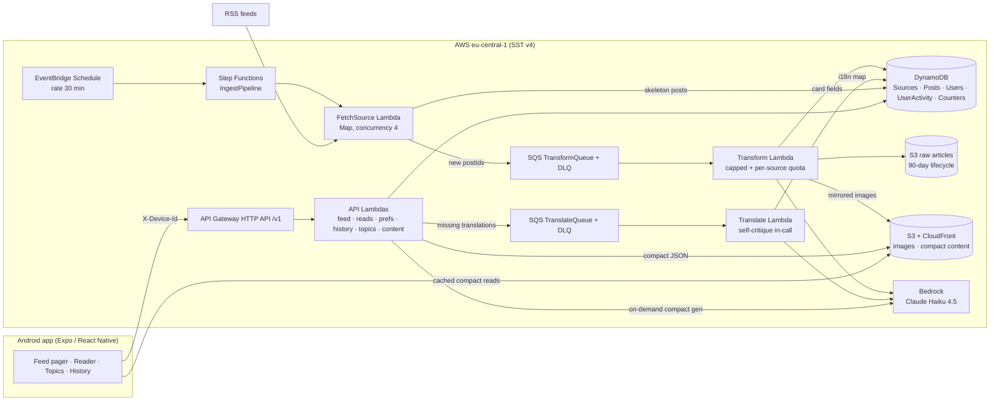

# TechTok — Design Document

TikTok-style reader for tech & science news: full-screen swipeable cards, each card an LLM-condensed story with image, headline, short summary, and a link to the source.

- **Status:** agreed 2026-07-18, after Q&A session (decisions logged in §2); localization + compact-reader + UX extension agreed 2026-07-22 (D20–D25, phases 7–10)
- **Scale target:** you + friends (tens of users), hobby budget ~$10/mo
- **Companion doc:** [IMPLEMENTATION_PLAN.md](IMPLEMENTATION_PLAN.md)

---

## 1. Product definition

**Core loop:** open app → full-screen card feed (newest unread stories in your topics) → swipe up for next → tap through to source when hooked. Read state and topic preferences follow you server-side.

**A card is:** article image (full-bleed background with scrim; deterministic gradient + topic-glyph stub when the article truly has none, D24) + hook title + 2–3 sentence summary + "why it matters" line + source attribution + topic chip + published time. Tap → compact in-app reader (D23) ending in a prominent "Read original" link-out; posts with no compact version fall back to the direct in-app browser tab.

**Non-goals (v1):** video/audio content, comments/social features, user-generated content, iOS release (kept buildable, not tested), Play Store publication, personalized ML ranking. (Multi-language *sources* remain a non-goal — ingest is English-only; *serving* is localized per D20.)

### Topics (fixed taxonomy v1)

`ai` · `dev` · `gadgets` · `startups` · `security` · `science` · `space` · `bio`

Defined once in `packages/shared`. The LLM classifier picks a `primaryTopic` from this list (source default as fallback). Empty user selection = all topics.

### Languages (v2, D20–D22)

`en` (source language) · `ru` · `uk` · `pl` — fixed set, defined in `packages/shared`. Each user has one `language` (device-locale default, changeable in settings/onboarding). Content is translated **on demand** (feed-triggered for cards, tap-triggered for compact articles) and stored per-post; English is always the fallback and never blocks — an untranslated card simply serves the English copy and upgrades on a later fetch. Topic labels and the app's own UI chrome are localized into the same four languages (static string tables, no LLM).

### Seed sources (all editable — live in a DynamoDB table + seed file)

| Preset | Sources (verify exact feed URLs at implementation) | Default topic |
|---|---|---|
| Tech | Hacker News front page (hnrss, points≥100), The Verge, Ars Technica, TechCrunch | dev / gadgets / startups |
| Science | ScienceDaily, Phys.org, Quanta Magazine, Nature News | science / bio |
| AI & dev | arXiv cs.AI, GitHub Blog, Hugging Face blog | ai / dev |

### "Read" semantics

A post is **read** when its card has been the active (settled) page for ≥ 1.5 s, or the user opens the source link. The app queues read events locally and flushes in batches (every ~5 s and on app-background). Marking is idempotent.

---

## 2. Decision log

Decisions from the kickoff Q&A. Any of these can be revisited — the "revisit when" column says what would trigger it.

| # | Decision | Choice | Why | Revisit when |
|---|---|---|---|---|
| D1 | Audience | Me + friends, multi-user from day one | No store/compliance work, but real per-user state | It becomes a public product |
| D2 | Post format | Full-screen text+image cards (no video) | TikTok mechanics without the media pipeline | Never for v1; media array on schema keeps door open |
| D3 | Card text | LLM summaries are the target format | Best UX; excerpt cards are the interim + fallback | LLM cost/quality disappoints |
| D4 | Identity | Anonymous device ID, server-side user state | Zero friction, satisfies "server keeps prefs/read status" | Multi-device sync wanted → link Cognito accounts |
| D5 | Mobile toolchain | Expo + expo-dev-client + EAS | Fastest iteration, easy APK distribution to friends | A native need Expo can't plugin-ize |
| D6 | LLM provider | AWS Bedrock, Claude Haiku 4.5 | IAM auth (no keys), one bill, EU inference profiles | Model gaps in EU region |
| D7 | Lint/format | **Biome 2 everywhere** (no ESLint/Prettier) | One fast tool, simple config | RN-specific bugs slip that eslint-config-expo would catch |
| D8 | Package manager | pnpm workspaces | Fast, strict; Expo/Metro/SST all fine with it | Metro symlink pain → `node-linker=hoisted` escape hatch |
| D9 | Sources | All three presets (~11 feeds) | Broad tech+science coverage from day one | Feed quality review after phase 3 |
| D10 | Region | `eu-central-1` | User in EU; Claude via `eu.` cross-region inference profile | Model unavailable in EU profile |
| D11 | Budget | ~$10/mo, AWS Budget alarm, LLM caps | Hobby economics; see §10 | Friends actually use it heavily |
| D12 | iOS | Keep code cross-platform, test Android only | Near-free with Expo | Someone with an iPhone asks nicely |
| D13 | Backend stack | **SST v4** (Ion architecture), Node 22, TypeScript strict | User choice; at Phase 0 implementation time, v3 had already been superseded by v4 on the same CDK-free Ion architecture — same APIs, next major | SST ships a v5 with breaking API changes |
| D14 | Pipeline | Step Functions + SQS, **introduced in phase 2** (walking skeleton uses one cron Lambda) | SFN/SQS earn their keep at fan-out + LLM rate control, not at 3 feeds | — |
| D15 | Phase 0 toolchain pins | `sst.aws.CronV2` (not the deprecated `Cron`); TypeScript **5.9.3** (not the 7.0 native-compiler major); Jest **29.7.0** in `apps/mobile` (not 30.x) | CronV2 uses EventBridge Scheduler + retries/DLQ, the modern component; TS 7 is a from-scratch rewrite with unverified third-party tooling compat this early; `jest-expo@57.0.2` pins `@jest/globals`/`jest-environment-jsdom`/etc. to `^29.2.1` — installing jest 30 at the root split the jest-internals version graph and crashed (`clearMocksOnScope is not a function`) | jest-expo ships a 30.x-compatible release; revisit TS 7 once the ecosystem (Expo/Metro/SST tooling) has caught up |
| D16 | Transform Lambda reserved concurrency | Deferred — not set for now, on both `andrey` and `production` stages | This AWS account's Lambda "Concurrent executions" quota is stuck at 10 (confirmed via `aws lambda get-account-settings` / `aws service-quotas get-service-quota --service-code lambda --quota-code L-B99A9384`), below AWS's normal default of 1000. AWS requires ≥10 unreserved concurrent executions to always remain in the account, so *any* positive reserved-concurrency value on *any* function fails deployment (`InvalidParameterValueException: ... decreases account's UnreservedConcurrentExecution below its minimum value of [10]`). A self-service Service Quotas increase request was rejected (`You must provide a quota value greater than the default quota value of 1000.0`) — this is a suppressed/restricted quota needing an AWS Support case, not a normal increase flow. The transform stage still works correctly without the reservation; it just temporarily loses the intended cost/rate throttle (DESIGN §7.2) | The account's Lambda concurrent-execution quota is raised above ~12 (10 minimum unreserved + at least 2 reserved) — re-add `concurrency: { reserved: 2 }` to the Transform function in `infra/pipeline.ts` at that point |
| D17 | Stage naming & billing grouping | Personal dev stage renamed from the OS-username-derived default (`andrey`) to an explicit `dev` (`pnpm dev` now runs `sst dev --stage dev`; `deploy:dev` now `sst deploy --stage dev`; briefly named `stage` mid-rename, then unified to `dev` so the stage name and the `techtok-dev` app/tag/group value use one consistent word). All resources get default provider tags `app: techtok-dev\|techtok-production` + `stage: <stage name>` (`sst.config.ts`), plus one `aws.resourcegroups.Group` per stack (`infra/monitoring.ts`) named `techtok-dev`/`techtok-production` querying `AWS::AllSupported` resources by the `app` tag, for a single console view and Cost Explorer tag-based grouping | Wanted to group AWS resources per environment for billing/cost tracking. Considered AWS Service Catalog AppRegistry/myApplications, but AWS is closing AppRegistry to new customers on 2026-07-30 and this account (confirmed via `aws servicecatalog-appregistry list-applications`) has zero prior usage, so it would count as new and be a bad long-term bet; it also requires either per-resource `ResourceAssociation` wiring or an undocumented tag-scanner, not just default tags. Plain AWS Resource Groups (`aws.resourcegroups.Group`, the ARG service — confirmed distinct from and unaffected by the AppRegistry sunset) is a pure tag-query view: no per-resource wiring, no lifecycle coupling, free, and pairs with the same default tags used for Cost Explorer | AWS reopens AppRegistry to new customers, or the project wants the myApplications console/health-dashboard view badly enough to justify the extra per-resource wiring |
| D18 | Android build & distribution | Adopt a committed bare `android/` project (`expo prebuild`) so the app builds & publishes to Google Play with the standard Android/Gradle toolchain — no EAS. Release signing reads a gitignored `apps/mobile/android/keystore.properties` (upload key kept outside the repo; falls back to the debug key when absent). `apps/mobile` gains `prebuild:android`/`build:android`/`build:android:apk` scripts; the prebuild→gradlew→Play flow is documented in `docs/DISTRIBUTION.md`. EAS internal distribution (`eas.json`) is kept as a fallback | Wanted a Play Store release pipeline owned entirely on the maintainer's machine, without Expo's paid cloud build. Keeping the Expo SDK (prebuild/CNG → committed native project) rather than ejecting to bare React Native preserves every `expo-*` module already in use; only EAS Build is dropped. Bare (committed `android/`) was chosen over managed CNG so the release `signingConfig` lives durably in `build.gradle` instead of needing a config plugin re-applied on every prebuild. Caveats (OTA updates via EAS Update no longer fetch; push needs direct FCM off EAS) are documented in `docs/DISTRIBUTION.md` | The maintainer wants Expo's managed build/submit convenience back, or wants to remove the Expo SDK entirely (would require replacing `expo-router`/`expo-image`/`expo-notifications`/etc.) |
| D19 | Mobile CI builds | Build the Android APK in CI (`.github/workflows/mobile-build.yml`) with `eas build --local` on push to `main` + manual dispatch, publishing the APK to a GitHub Release for friends to sideload. `--local` runs on the GitHub runner, so it doesn't consume EAS free-tier cloud-build credits (15 Android/mo); signing uses EAS-managed *remote* credentials via an `EXPO_TOKEN` secret (no keystore in GitHub). Reuses the existing `eas.json` `preview` profile (APK, internal) | Wanted mobile builds automated in CI and to exceed the free tier's 15 cloud builds/month without paying. `eas build --local` is unmetered (compiles on the runner) yet stays in the Expo ecosystem (`eas.json` profiles, EAS Update channels, EAS-managed signing) that the maintainer wants to keep. GitHub Releases replaces EAS-hosted internal-distribution links, which are a cloud-build-only feature. Chosen over plain `./gradlew` in CI (D18) because it preserves EAS credential management (no keystore in GitHub secrets) and profile/env parity with any occasional cloud build | The maintainer wants EAS-hosted install pages or EAS Update baked into CI (would spend cloud-build credits), moves to the Play Store internal-testing track (D18), or needs iOS builds (requires a macOS runner + Apple signing) |
| D20 | Localization scope & preference model | Four languages: `en` (source) + `ru`/`uk`/`pl`, fixed list in `packages/shared`. One `Users.language` per user (single choice, not multi): default = device locale when it's one of the four, else `en`; set via an onboarding step and a settings row. Localized: LLM card copy **and** excerpt/skipped cards (verbatim excerpts translated — accepted rights trade-off at friends scale), topic labels (static per-language strings in `shared`), and the app's own UI chrome (`expo-localization` + typed string tables). Ingest stays English-only | The intended audience includes non-English-reading friends; a fixed 4-language set keeps cost and QA bounded. Excerpt translation included because a mixed EN/translated feed for excerpt-heavy days felt worse than the marginal rights exposure of machine-translating short verbatim excerpts privately | Language list grows (each language multiplies on-demand LLM spend); a source complains about translated excerpts (drop excerpts from eligibility, LLM cards only); multi-device users want per-device languages |
| D21 | Translation storage & serving | Translations live in an `i18n` map **on the same `Posts` item** (`i18n.ru = { cardTitle, summary, whyItMatters, translatedAt }`), never as separate post items. The server picks the served variant per request from `Users.language`; Card DTO gains `servedLang` + `isTranslated`; a "show original" toggle exists in the compact reader only (cards stay clean). English fallback is always served when a translation is missing | `postId` keys every identity-bearing feature — read markers, bookmarks, dedup, history snapshots, feed GSIs. Separate per-language items would fracture all of them (reading the RU variant wouldn't mark the EN one read). Server-side selection keeps the feed a single request and the client dumb | Translated posts ever need independent ranking/visibility (fan-out read model); payload size becomes a concern (move variants out of the hot item) |
| D22 | On-demand LLM economics under an unchanged $10 budget | Budget alarm stays at $10/mo (D11 reaffirmed). **All new LLM work is on-demand**: card translations are enqueued from the feed read path when a non-EN user's page contains untranslated posts (the page serves English immediately; the translation appears on a later fetch — accepted "pop-in"), compact articles generate synchronously at first tap (D23). Guards: per-kind daily counters in `Counters` (`translations#<date>` default 100/day, `compacts#<date>` default 20/day, env-tunable like `LLM_DAILY_CAP`) plus a **per-source daily transform quota** (`transforms#<sourceId>#<date>`, default 30/day, `Sources.dailyQuota` override) that gates only the LLM call inside transform (fetch/archive/excerpt/image still run). Try switching Hugging Face to an official-posts-only feed URL (its community feed is 52% of the table and was eating the cap). Haiku 4.5 for every step (D6 escalation path unchanged). Translation quality via **self-critique in-call** (translate → critique → corrected output in one response, ~30–50% more output tokens, no second pass). No backfill of translations | Eager fan-out (all posts × all languages + eager compacts) ≈ $70–100/mo vs. the $10 ceiling. On-demand shifts the cost driver from 120 ingested posts/day to *actual reads*, which at friends scale is dozens/day. Worst case with every cap maxed ≈ $20 theoretical (the pre-D22 doc already documented worst case above the alarm); typical projected < $8 | Real usage data after phases 8–9 (tune caps); bad-translation reports accumulate (add the deferred separate verify pass); friends-scale assumption breaks (revisit eager pre-warm for active languages) |
| D23 | Compact in-app reader | Re-resolves challenged assumption #4 **at friends scale**: the app shows an LLM-compressed compact version of the article (structured zod-validated blocks — `paragraph \| heading \| image \| list \| quote` — ~400–600 words) with the article's own in-body figures extracted and mirrored (≤5, minimum dimensions, degrade to text-only). Generated **on demand, synchronously** (`GET /v1/posts/:id/content?lang=`, 30 s ceiling, spinner UX) in a single pass straight to the requested language, sourced from the already-archived raw HTML in S3 (one live fetch attempt if no archive); stored as `content/<postId>/<lang>.json` on S3 behind the existing CloudFront router; cached reads bypass Lambda entirely (`compactLangs` on the DTO tells the app which variants exist on the CDN). Card tap → reader (when available/generatable) → prominent "Read original" in-app browser link; direct link-out is the fallback; share always shares the original URL. Guardrails: per-source `compactEnabled` kill switch, prominent attribution, remove-on-request, explicit revisit before any public release | Reading without a site-hop is the product's next step, and the raw-HTML archive makes generation nearly free of network work. Sync generation beats async-and-poll on simplicity at this scale; per-language single-pass generation avoids a translate-the-compact second call. The rights posture change is deliberate and logged, not incidental | Any public/store release (rights posture must be re-reviewed); a source objects (flip `compactEnabled`, remove content); sync latency proves annoying (move to async + push/poll); figure extraction quality disappoints (text-only default) |
| D24 | Image fallback chain fix + backfill + stub | Implement the full designed chain: RSS `enclosure` → `media:content`/`media:thumbnail` (rss-parser `customFields`) → first `` in `content:encoded`/`content`/`summary` → **og:image from the already-fetched article page at transform time** (the `@extractus` result's `image` field, currently discarded) → mirror to CDN. One-shot backfill Lambda extracts og:image from the raw-HTML S3 archives for existing imageless posts (no LLM, no refetch). Genuinely imageless posts render a **client-side deterministic stub**: gradient seeded by `postId` + topic glyph (zero assets, zero backend, works offline). arXiv's generic og:image logo is treated as imageless (small known-generic denylist in `core`) | Production audit 2026-07-22: 28 of 1,610 posts (1%) had images — only The Verge, the one source whose feed embeds `` in plain `content`. The implemented chain was a subset of the §11-designed one: `media:content` unparsed, `content:encoded` undeclared, og:image never wired despite the transform already downloading every page | A source's og:image turns out consistently generic (extend the denylist); stub aesthetics after the design-token evolution; hotlink-vs-mirror balance changes |
| D25 | Feed UI restructure: bottom action bar + loading states | Replace the scattered overlay circle buttons with a **solid, layout-reserving bottom action bar** (~56 px + safe-area inset; the card pager shrinks accordingly — a deliberate amendment of D2's full-bleed aesthetic): per-card actions (bookmark, share) + global nav (saved, history, settings) in one bar; card tap remains the reader entry (D23). Add a **branded splash** (`expo-splash-screen`; requires prebuild re-run for the committed bare `android/`, D18) and a **dedicated in-app loading screen** (logo + spinner) between splash and the first rendered feed page, ahead of the existing skeleton states | Five floating circles don't scale as actions grow, and the maintainer prefers a conventional persistent bar over an overlay (explicit choice against the overlay recommendation). Cold start currently drops straight into skeletons with no branded moment | Bar exceeds ~6 actions (introduce an overflow menu); full-bleed cards get missed enough to revisit the overlay variant; splash/loading feels slow rather than polished |

### Challenged assumptions → resolutions

1. **"Reels" ≠ video.** Resolved: cards with TikTok swipe mechanics (D2). Post schema includes an optional `media[]` array from day one so TTS/video can be added without migration.
2. **Step Functions on day one vs. "prototype ASAP".** Resolved: phase 0 ships a single scheduled Lambda; SFN+SQS arrive in phase 2 where per-source isolation, retries, and rate control actually matter (D14).
3. **LLM is the only real cost.** Resolved: budget guardrails are first-class design (§7.4, §10): daily transform cap, input truncation, reserved concurrency, excerpt fallback.
4. **Content rights.** Resolved lane: ingest RSS (built for syndication), display *our own* summaries + excerpt + prominent attribution and link-out. Full text fetched only as processing input, stored privately in S3, never displayed. Respect robots.txt on page fetches; identify as `TechTokBot`. Per-source allowlist; remove any source on request. **Re-resolved 2026-07-22 (D23):** the compact in-app reader deliberately widens this lane at friends scale — an LLM-compressed rewrite with the article's mirrored figures is displayed in-app, with prominent attribution + "Read original", a per-source `compactEnabled` kill switch, remove-on-request, and a mandatory rights re-review before any public release.
5. **DynamoDB feed query is the hard part.** Resolved with explicit key design (§6) — topic+time GSI, server-side merge, read-set exclusion — accepted imprecision documented (§5.2).

---

## 3. System architecture



**Data flow:** the scheduler kicks a Step Function that fans out over enabled sources; each fetch does a conditional GET on the RSS feed, deduplicates entries by canonical-URL hash (conditional put), and enqueues only *new* posts to SQS. The transform consumer fetches the article page, extracts text + og:image, archives raw HTML to S3, mirrors the image, calls Bedrock for the card copy + topic classification (under the global cap and per-source quota), and updates the post to `ready`. Two on-demand paths hang off the API side (D22): the feed handler enqueues `TranslateQueue` jobs for posts a non-EN user saw untranslated (the translate consumer writes the `i18n` map), and the content handler synchronously generates compact-article JSON at first tap, caching it on the CDN. The API side is otherwise plain request/response Lambdas over DynamoDB.

---

## 4. Repository layout

pnpm workspace monorepo; SST config at the root.

```
techtok/
├── sst.config.ts            # stages, imports infra/
├── infra/                   # SST components: api.ts, storage.ts, pipeline.ts
├── biome.json               # lint + format, whole repo
├── tsconfig.base.json       # strict, shared options
├── pnpm-workspace.yaml
├── packages/
│   ├── shared/              # zod contracts, topic taxonomy, API types (server+app)
│   ├── core/                # domain logic: rss mapping, url canonicalization,
│   │                        #   repos (DDB), feed merge, llm client, extractors
│   └── functions/           # thin Lambda handlers: api/*, ingest/*, transform/*
├── apps/
│   └── mobile/              # Expo app (expo-router)
└── docs/
```

Rules: `functions` handlers stay thin (parse → call `core` → serialize); all business logic lives in `core` where it's unit-testable without AWS. `shared` has zero runtime deps besides zod and is imported by both server and app.

---

## 5. API design

- **Base:** API Gateway HTTP API, path-versioned `/v1`, one Lambda per route (SST `ApiGatewayV2.route()` — idiomatic, per-route IAM). Revisit to a single Hono Lambda only if route count or cold starts become annoying.
- **Auth (v1):** `X-Device-Id: <uuid>` header. The app generates a UUID once (stored in SecureStore/MMKV); the server upserts the user on first sight (`userId = deviceId`). Guessable-ID risk is acceptable at friends-scale; upgrade path is Cognito account linking (device → account map) without URL changes.
- **Validation:** every request/response shape is a zod schema in `packages/shared`; server parses inputs (400 on failure), app parses responses.
- **Errors:** `{ "error": { "code": "string", "message": "string" } }` with proper status codes.

| Method & path | Purpose | Notes |
|---|---|---|
| `GET /v1/feed?limit=20&before=<iso>` | Next cards for this user | Unread, topic-filtered, newest-first; served in `Users.language` with EN fallback; enqueues missing translations (D22); returns `{ items, nextBefore }` |
| `POST /v1/reads` | Mark posts read | Body `{ postIds: string[] }`, idempotent, 204 |
| `GET /v1/history?limit=50&cursor=` | Reading history | Newest-read-first, snapshot-based (survives post TTL) |
| `GET /v1/me` | User profile | `{ userId, topics, language, createdAt }` |
| `PUT /v1/me/topics` | Set topic prefs | `{ topics: string[] }`; empty = all topics |
| `PUT /v1/me/language` | Set content/UI language | `{ language: "en"\|"ru"\|"uk"\|"pl" }` (D20) |
| `PUT /v1/me/push-token` | Register Expo push token | `{ pushToken: string }`; enables the phase-5 daily digest |
| `GET /v1/topics` | Topic taxonomy | Static list with per-language labels (D20); lets app render without hardcoding |
| `GET /v1/posts/:id/content?lang=` | Compact article (D23) | Synchronous generate-on-first-request (30 s ceiling) → structured blocks JSON; cached variants are read straight from the CDN instead (`compactLangs` on the card says which exist) |

**Card DTO:** `{ id, title, summary, whyItMatters?, imageUrl?, sourceName, url, primaryTopic, topics[], publishedAt, servedLang, isTranslated, compactLangs[], media?[] }` — `title`/`summary`/`whyItMatters` carry the `servedLang` variant (D21).

### 5.2 Feed algorithm (v1)

1. Load user's topics (empty → all 8) and `language`.
2. For each selected topic, query `Posts.byTopic` GSI: newest 25 `ready` posts `< before` watermark.
3. Merge by `publishedAt` desc, dedup by id.
4. `BatchGet` the user's read-markers for the top ~60 candidates; drop read ones.
5. Return first `limit` + `nextBefore` = `publishedAt` of the last returned item.
6. **Variant selection (D21):** for each returned card, serve `i18n[language]` when present, else the English fields (`servedLang`/`isTranslated` reflect which happened).
7. **On-demand translate enqueue (D22):** for returned posts missing `i18n[language]` (non-EN users only), conditionally stamp `i18nPending[language]` on the post (skip if a fresh pending marker exists) and `SendMessageBatch` `{ postId, lang }` to `TranslateQueue`. The current response still ships English; the translation appears on a later fetch.

Known imprecision: a timestamp-watermark cursor can duplicate or skip items at equal timestamps under concurrent ingestion. Accepted at this scale; the app dedups by id. The clean fix (fan-out per-topic feed table as a read model) is noted for phase 4+ if ever needed.

**Ordering v1 is newest-first.** A lightweight score (recency decay + source weight + topic diversity) is a phase 4 experiment — deliberately not in the MVP.

---

## 6. Data model (DynamoDB, on-demand)

Four purpose-built tables (clearer to operate and learn than single-table design at this scale; single-table is a possible later optimization, not a goal).

### `Sources`
| | |
|---|---|
| PK | `sourceId` (slug, e.g. `hn`, `verge`) |
| Attrs | `name`, `rssUrl`, `siteUrl`, `defaultTopic`, `topics[]`, `weight`, `enabled`, `etag`, `lastModified`, `lastFetchAt`, `lastStatus`, `failCount`, `dailyQuota?` (per-source LLM transform quota override, D22), `compactEnabled?` (compact-reader kill switch, D23) |
| Access | Scan enabled sources (tiny table — scan is correct here) |

### `Posts`
| | |
|---|---|
| PK | `postId` = sha-256 of canonical URL (utm/tracking params stripped) → **dedup is a conditional put** |
| Attrs | `url`, `canonicalUrl`, `sourceId`, `sourceName`, `origTitle`, `cardTitle`, `summary`, `whyItMatters`, `excerpt`, `imageUrl`, `mirroredImageUrl`, `primaryTopic`, `topics[]`, `media[]`, `lang`, `status: discovered\|ready\|failed`, `transform: llm\|excerpt\|skipped`, `publishedAt` (ISO), `ingestedAt`, `s3RawKey`, `ttl`, `i18n{ru\|uk\|pl → {cardTitle, summary, whyItMatters, translatedAt}}` (D21), `i18nPending{lang → ISO}` (enqueue-dedup markers, D22), `compactLangs[]` (compact variants cached on the CDN, D23), `duplicateOf?` |
| GSI `byTopic` | PK `primaryTopic`, SK `publishedAt` — the feed query |
| GSI `byTime` | PK constant `"POST"`, SK `publishedAt` — "all topics" feed + ops. Deliberate single-partition: fine at <1 write/sec, flagged as the first thing to change at real scale |
| TTL | 90 days (keeps table lean; history survives via snapshots) |

Multi-topic indexing note: a GSI can't index a list, so the feed indexes `primaryTopic` only; secondary `topics[]` are filter metadata. Fan-out index items per (topic, post) is the known upgrade if secondary-topic queries are ever needed.

### `Users`
| | |
|---|---|
| PK | `userId` (= device UUID v1) |
| Attrs | `topics[]`, `language` (en\|ru\|uk\|pl, D20), `createdAt`, `lastSeenAt`, `settings{}`, `pushToken?` (Expo push token, phase 5 daily digest) |

### `UserActivity`
| | |
|---|---|
| PK / SK | `userId` / `read#<postId>` (prefix leaves room for `bm#<postId>` bookmarks in phase 4) |
| Attrs | `readAt` (ISO), `snapshot { cardTitle, sourceName, url }` (~200 B — history renders even after the post expires) |
| GSI `byReadAt` | PK `userId`, SK `<readAt>#<postId>` — history pagination |
| Access | O(1) is-read membership via GetItem/BatchGet; history via GSI query desc |

Plus the `Counters` table of atomic daily counters enforcing every LLM cap (D22): `transforms#<yyyy-mm-dd>` (global card cap, default 120/day), `transforms#<sourceId>#<yyyy-mm-dd>` (per-source quota, default 30/day, `Sources.dailyQuota` override), `translations#<yyyy-mm-dd>` (default 100/day), `compacts#<yyyy-mm-dd>` (default 20/day). All defaults env-tunable.

**S3 content layout:** `raw/<postId>.html` (private article archive, 90-day lifecycle) · mirrored images bucket behind the CloudFront router · `content/<postId>/<lang>.json` compact-article blocks on the same router (D23), lifecycle-matched to the posts' 90-day TTL.

**DynamoDB client:** AWS SDK v3 `lib-dynamodb` behind repo modules in `core`. ElectroDB is a possible later adoption if key-building gets tedious — not v1.

---

## 7. Ingestion & transform pipeline

### 7.1 Phase 0 shape (walking skeleton)

`Cron(rate 1 hour)` → one `ingest` Lambda: fetch 3 hardcoded feeds → `rss-parser` → canonicalize URL → conditional put excerpt-cards (`status=ready`, `transform=excerpt`). No SFN/SQS/S3 yet. This alone makes the app real.

### 7.2 Target shape (phase 2+)

**EventBridge** `rate(30 minutes)` → **Step Function `IngestPipeline`** (SST `StepFunctions` component; drop to raw provider resources if the component lacks a feature):

1. **LoadSources** — Lambda: scan enabled sources.
2. **Map over sources** (`maxConcurrency: 4`, per-item Catch so one bad feed never kills the run → increments `failCount`, records `lastStatus`):
   **FetchSource** — conditional GET (`If-None-Match`/`If-Modified-Since` from stored `etag`/`lastModified`); parse; per entry: canonical URL → `postId` → conditional put skeleton post (`status=discovered`, excerpt fields, `ttl`); only *newly created* posts → `SendMessageBatch` to SQS. Returns `{ sourceId, seen, new }`.
3. **Summarize** — aggregate counts → CloudWatch metrics (EMF) + structured log line.

**SQS `TransformQueue`** (visibility 90 s, redrive to DLQ after 3 receives) → **Transform Lambda** (batch ≤ 5, **reserved concurrency 2** — the LLM rate/cost valve; currently unset pending an AWS account quota fix, see D16):

1. Check daily cap counter — **if over cap, the post ships as an excerpt card** (`transform=skipped`), never blocks the feed.
2. Fetch article page — 10 s timeout, 2 MB cap, UA `TechTokBot/1.0 (+repo URL)`, robots.txt honored (`robots-parser`, per-host cache).
3. Extract main text (`@extractus/article-extractor`; fallback = RSS description).
4. Archive raw HTML → S3 `raw/<postId>.html` (lifecycle: delete at 90 days).
5. **Bedrock Converse** → card copy (§7.4).
6. Update post → `status=ready`, `transform=llm`.

**Failure semantics:** content-level failures (unparseable page, LLM refusal) degrade to excerpt cards — the feed never starves. Infra-level failures throw → SQS retry ×3 → DLQ → CloudWatch alarm. Everything is idempotent: re-transforming overwrites the same fields.

### 7.3 Why SFN + SQS at all (and why not in phase 0)

Step Functions buys per-source retry/isolation, visible execution history, and Map-state fan-out; SQS decouples discovery rate from the deliberately-throttled LLM stage and gives DLQ semantics. None of that pays off at 3 hardcoded feeds — hence phase-gated (D14).

### 7.4 LLM contracts

All three contracts share the same machinery: prompt in the repo (`packages/core/src/llm/prompts/`), zod-validated JSON output, one repair-retry, golden-fixture tests (recorded outputs, no live LLM calls in CI), Haiku 4.5 via the EU inference profile (D6/D22).

- **Card generation** (transform stage) — **Input:** extracted article text truncated to ~4,000 chars + title + source. **Output:** `{ cardTitle ≤ 80, summary 2–3 sentences ≤ 320, whyItMatters ≤ 160, primaryTopic: enum, topics: enum[], lang }`. Failure → excerpt fallback.
- **Card translation** (translate stage, D22) — **Input:** the English card fields (or excerpt for `transform=excerpt|skipped` posts) + target language. **Self-critique in-call:** the prompt instructs translate → critique the draft → emit only the corrected final JSON (same field shape as the card copy). Failure → post simply stays English (no degrade state needed — EN fallback *is* the resting state).
- **Compact article** (content stage, D23) — **Input:** archived article text (~8,000 chars) + title + source + the extracted figure list (urls + captions) + target language. Single pass straight to the requested language (compress + translate in one call, with the same self-critique instruction for non-EN). **Output:** zod-validated block list `{ blocks: ({type:"paragraph"|"heading"|"list"|"quote", text|items} | {type:"image", figureIndex, caption?})[], ~400–600 words }` — image blocks reference the *provided* figure list by index (the LLM never invents URLs). Failure → no compact stored; reader degrades to the direct link-out.
- **Cost knobs:** per-kind daily caps + per-source quota (§6 Counters, D22), input truncation, on-demand-only triggers, Bedrock batch inference (−50%) as a later optimization. (Reserved concurrency 2 remains deferred per D16.)

### 7.5 On-demand stages (phases 7–9)

**Image chain fix (D24), inside existing stages:** FetchSource's mapper implements the full fallback chain (`enclosure` → `media:content`/`media:thumbnail` → `` in `content:encoded`/`content`/`summary`); the transform stage adds the final rung — when the post has no `imageUrl`, take og:image from the `@extractus` result (already in hand) before the mirror step, with a small denylist for known-generic images (arXiv logo).

**Translate stage (D22):** `TranslateQueue` (SQS + DLQ, same redrive semantics as transform) consumed by a translate Lambda (ESM `maxConcurrency: 2` — respects the D16 account ceiling). Messages `{ postId, lang }` come from the feed read path (§5.2 step 7). Consumer: check `translations#<date>` cap (over cap → drop message, clear pending marker; the post stays EN and can be re-enqueued another day) → LLM translation → write `i18n[lang]` + clear `i18nPending[lang]`. Content-level failures (LLM refusal/invalid output) also just clear the marker — English fallback is the resting state, so nothing degrades. Infra failures throw → SQS retry → DLQ → existing alarm.

**Content stage (D23):** `GET /v1/posts/:id/content?lang=` Lambda (30 s timeout): S3 `content/<postId>/<lang>.json` exists → return it (races resolve idempotently — last write wins, content is deterministic-ish and disposable). Else: load archived raw HTML (`s3RawKey`; one live page fetch attempt if absent — robots-respecting, same caps as transform) → extract text + in-body figures → mirror figures (≤5, min dimensions, existing ImageStore) → check `compacts#<date>` cap + `Sources.compactEnabled` → compact-article LLM call → write JSON to S3, append `lang` to `Posts.compactLangs` → return blocks. Any content-level failure returns a typed "no compact available" response and the app falls back to the in-app browser; the feed never depends on this path.

---

## 8. Mobile app (Expo)

- **Stack:** Expo SDK (latest at implementation, ~54), TypeScript strict, `expo-router`, New Architecture defaults.
- **Screens:** `/` feed (vertical pager above the bottom action bar) · `/post/[id]` compact reader (D23: block renderer, translated ⇄ original toggle, "Read original" link-out) · `/settings` modal (topic multi-select, language, about) · `/history` list · `/saved` bookmarks · `/onboarding` (topics + language). **Bottom action bar (D25):** solid, layout-reserving (~56 px + safe-area) — bookmark, share, saved, history, settings; replaces the overlay circle buttons; card tap opens the reader.
- **Feed mechanics:** `react-native-pager-view` (vertical, `offscreenPageLimit=1`) over `useInfiniteQuery` pages of 20; request next page when ~5 cards from the end. `expo-image` for cached images, gradient scrim for text legibility, `expo-web-browser` for source link-out, native share sheet (original URL). Imageless cards render the deterministic gradient + topic-glyph stub (D24, pure client code).
- **Launch sequence (D25):** branded `expo-splash-screen` → in-app loading screen (logo + spinner while the first feed page is in flight) → feed (skeletons remain for subsequent loads). Splash changes require an `expo prebuild` re-run for the committed bare `android/` (D18).
- **Localization (D20):** `Users.language` mirrored in the zustand store drives *both* served content and UI chrome; chrome strings via `expo-localization` (Expo-Go-bundled) + typed per-language string tables in the app (no i18n framework dep); topic labels come localized from `packages/shared`.
- **State:** TanStack Query v5 (server state, MMKV-persisted cache → last feed readable offline) + Zustand v5 (device ID, topic cache, pending read-queue) persisted via `react-native-mmkv`.
- **Read queue:** page-settle timer (1.5 s) → enqueue → flush every 5 s + on AppState background; survives restarts via MMKV.
- **Styling:** `StyleSheet` + a small design-tokens module, dark-first with system-theme support. NativeWind is a deliberate later option (Biome has `useSortedClasses` for it), not v1.
- **Config:** API base URL per build profile via `app.config.ts` (`dev` → your personal SST stage, `preview` → production stage).
- **Distribution to friends:** EAS internal distribution (installable APK link). Play Store internal track only if this outgrows friends (D1).

---

## 9. Tooling, quality, operations

- **TypeScript:** strict everywhere, `tsconfig.base.json` + per-package extends; `tsc --noEmit` as the typecheck gate.
- **Biome 2:** single root `biome.json` (lint + format, organize imports); per-directory overrides where mobile needs different rules. Known trade-off (D7): fewer RN-specific rules than eslint-config-expo — revisit if real bugs slip through.
- **Testing:** Vitest for `shared`/`core`/`functions` (URL canonicalization, RSS mapping, feed merge, cursor logic, zod contracts, repos via `aws-sdk-client-mock`, LLM golden fixtures). `jest-expo` + React Native Testing Library for mobile components and the read-queue. Maestro E2E is optional phase 6. No live-AWS calls in CI.
- **CI (GitHub Actions):** on PR + main — pnpm install (cached) → `biome ci .` → typecheck → vitest → mobile jest. On main (from phase 2): `sst deploy --stage production` via AWS OIDC role (no long-lived keys). EAS builds via manual dispatch.
- **Conventions:** conventional commits; solo work goes to `main` behind green CI, branches for risky work. **Definition of done:** Biome + typecheck + tests green, deployed to dev stage, feature exercised on a device/emulator.
- **Stages:** personal dev stage (`sst dev` live development) + `production`. Same AWS account is fine at this scale.
- **Observability:** Lambda Powertools (TypeScript) structured logs + EMF metrics from phase 0 (`IngestedCount`, `TransformFail`, `LLMDailyCount`); 14-day log retention. Alarms: DLQ depth > 0, SFN execution failed, API 5xx spike, AWS Budget at $10.
- **Secrets:** none needed v1 (Bedrock is IAM). Anything later → `sst secret`.

---

## 10. Cost model (monthly, friends-scale)

| Item | Assumption | Est. |
|---|---|---|
| API GW + Lambda + SQS + EventBridge | well inside free tiers | ~$0 |
| DynamoDB on-demand | ~1k writes + few k reads/day | <$1 |
| Step Functions (standard) | 48 runs/day × ~15 transitions | ~$0.50 |
| S3 + lifecycle | <2 GB rolling (raw HTML + compact JSON) | ~$0.05 |
| CloudFront + mirrored images/figures + compact content | low request volume, <2 GB rolling, 90-day lifecycle | ~$1 |
| CloudWatch logs/metrics/alarms | 14-day retention | ~$1–2 |
| **Bedrock: card generation** ($1/M in, $5/M out) | 120/day cap, ~1.4k in + 250 out each; per-source quota (D22) trims the HF flood, so typical volume *drops* | **~$9–10 at cap; typical lower than pre-D22** |
| **Bedrock: card translations** (D22) | on-demand, 100/day cap, ~0.5k in + 0.4k out each (self-critique) | ~$7.5 at cap; **typical $2–4** (friends-scale reads) |
| **Bedrock: compact articles** (D23) | on-demand, 20/day cap, ~3.5k in + ~1k out each | ~$5 at cap; **typical ≤$1** (taps, not posts) |
| **Total** | | **theoretical all-caps-maxed ≈ $20–22; projected typical < $8** — on-demand means the expensive rows only spend when someone actually reads |

The AWS Budget alarm stays at **$10** (D11/D22): typical usage is projected under it, and the alarm firing is the intended signal to tune caps — all four caps are env vars, changeable without a code deploy. (The pre-D22 model already documented worst-case above the alarm; the shape is unchanged, the tail is just longer and demand-gated.)
Levers if over budget: lower per-kind caps, tighten per-source quotas, shrink truncation, 60-min cadence, Bedrock batch API (−50%).
Cost Explorer check one week after phases 8 and 9 ship is mandatory (see IMPLEMENTATION_PLAN.md phase 10).

---

## 11. Risks

| Risk | Mitigation |
|---|---|
| RSS feed quirks (missing images, bad dates, encodings) | Per-source parser fixtures; fallback field chain (enclosure → media:content → og:image → none); tolerate imageless cards |
| Hotlinked images break or block | Accepted v1; phase 4 mirrors images to S3 + CloudFront (~$1/mo) |
| LLM JSON drift / refusals | zod validation + one repair retry + excerpt fallback; golden tests pin the prompt |
| Cost overrun | Daily cap + reserved concurrency + Budget alarm + truncation |
| Feed cursor imprecision | Client id-dedup; fan-out read model documented as the upgrade |
| Biome misses RN-specific footguns | Watch for hook-deps/list-key bugs; ESLint remains a one-day swap |
| pnpm × Metro edge cases | Expo supports pnpm monorepos; `node-linker=hoisted` is the escape hatch |
| Source objects to summarization | Attribution + link-out + robots.txt respect; per-source kill switch (`enabled=false`); remove on request |
| Source objects to compact rewrites / mirrored figures (D23) | Friends-scale + private; prominent attribution + "Read original"; per-source `compactEnabled` kill switch; remove on request; mandatory rights re-review before any public release |
| Bedrock model/profile availability in EU | Verify at implementation; fallbacks: eu Sonnet profile or us profile |
| Translation pop-in confuses users (EN card silently becomes RU on refetch, D22) | Accepted trade-off of on-demand; `isTranslated` badge makes the state visible; pre-warm for active languages is the documented upgrade if it grates |
| Sync compact generation misses the 30 s ceiling (slow source page or LLM) | Archive-first sourcing avoids most fetch latency; on timeout the reader degrades to the in-app browser — drill-down never dead-ends |
| Compact/figure content on guessable CDN URLs | Same acceptance as mirrored images (unauthenticated CDN, random postId hashes); revisit with any public release |
| Lambda concurrency quota stuck at 10 (D16) vs. more consumers | Translate ESM capped at `maxConcurrency: 2`; content Lambda is API-invoked and rare; no fan-out-heavy additions until the quota case is resolved |
| Machine-translated verbatim excerpts (D20) | Accepted at friends scale; drop excerpt/skipped posts from translation eligibility on any complaint (one-line change) |

---

## 12. Deferred decisions (defaults chosen — flip anytime)

Everything else I would otherwise have asked, with the default the plan assumes:

| Question | Default (v1) |
|---|---|
| Ingestion cadence | 30 min (60 min in phase 0) |
| Post retention | 90-day TTL (DDB + S3 lifecycle); history snapshots keep forever |
| Feed with no topic prefs | All topics |
| Language | English-only **ingest**; serving localized to en/ru/uk/pl on demand (D20–D22, supersedes the original English-only default) |
| Separate translation verify pass | Self-critique in-call now (D22); a standalone verify stage only if bad-translation reports demand it |
| Compact-article offline prefetch | Deferred — reader content is fetched on open; revisit with usage data |
| API framework | None — per-route Lambdas + zod (Hono single-Lambda is the fallback if routes proliferate) |
| DDB modeling | Multi-table (single-table only as a proven-need optimization) |
| Validation library | zod v4 (shared contracts package) |
| HTTP client (server) | Node 22 built-in fetch/undici |
| RSS parsing | `rss-parser`; extraction `@extractus/article-extractor` |
| Mobile styling | StyleSheet + tokens; NativeWind deferred |
| Offline | Query-cache persistence only; explicit prefetch deferred |
| Push notifications | Implemented phase 5 — daily top-N-unread digest via `expo-notifications` + Expo push API, opt-in from settings |
| Crash reporting | Sentry (free tier) in phase 6 |
| Product analytics | None — CloudWatch metrics only |
| Cross-source duplicate stories (same story, two outlets) | Accepted v1; canonical-URL + title-similarity dedup is a phase 4+ experiment |
| Dark mode | Dark-first + system theme from day one |
| Bookmarks | Phase 4 (`bm#` sort-key space reserved) |
| Auth upgrade | Cognito + device-linking, only when multi-device sync is wanted |
| Renovate/dependabot | Add in phase 6 |
| Node / TS versions | Node 22 LTS, TS 5.8+, pinned via `engines` + `.nvmrc` |
