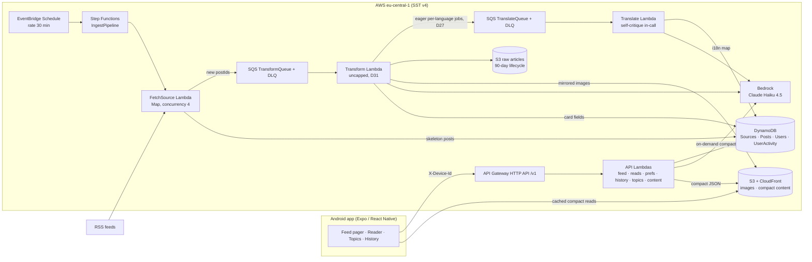

# TechTok — Design Document

TikTok-style reader for tech & science news: full-screen swipeable cards, each card an LLM-condensed story with image, headline, short summary, and a link to the source.

- **Status:** agreed 2026-07-18, after Q&A session (decisions logged in §2); localization + compact-reader + UX extension agreed 2026-07-22 (D20–D25, phases 7–10); UI library, eager translation, image quality, digest retirement, and visual identity agreed 2026-07-24 (D26–D30, phases 11–12); CI/CD hardening — parallel jobs, API/mobile compatibility guardrail, mobile semver automation — agreed and implemented 2026-07-24 (D33–D35, phase 14)
- **Scale target:** you + friends (tens of users), hobby budget ~$10/mo
- **Companion doc:** [IMPLEMENTATION_PLAN.md](IMPLEMENTATION_PLAN.md)

---

## 1. Product definition

**Core loop:** open app → full-screen card feed (newest unread stories in your topics) → swipe up for next → tap through to source when hooked. Read state and topic preferences follow you server-side.

**A card is:** article image (full-bleed background with scrim; deterministic gradient + topic-glyph stub when the article truly has none, D24) + hook title + 2–3 sentence summary + "why it matters" line + source attribution + topic chip + published time. Tap → compact in-app reader (D23) ending in a prominent "Read original" link-out; posts with no compact version fall back to the direct in-app browser tab.

**Non-goals (v1):** video/audio content, comments/social features, user-generated content, iOS release (kept buildable, not tested), Play Store publication, personalized ML ranking. (Multi-language *sources* remain a non-goal — ingest is English-only; *serving* is localized per D20.)

### Topics (fixed taxonomy v1)

`ai` · `dev` · `gadgets` · `startups` · `security` · `science` · `space` · `bio`

Defined once in `packages/shared`. The LLM classifier picks a `primaryTopic` from this list (source default as fallback). Empty user selection = all topics.

### Languages (v2, D20–D22)

`en` (source language) · `ru` · `uk` · `pl` — fixed set, defined in `packages/shared`. Each user has one `language` (device-locale default, changeable in settings/onboarding). Content is translated **on demand** (feed-triggered for cards, tap-triggered for compact articles) and stored per-post; English is always the fallback and never blocks — an untranslated card simply serves the English copy and upgrades on a later fetch. Topic labels and the app's own UI chrome are localized into the same four languages (static string tables, no LLM).

### Seed sources (all editable — live in a DynamoDB table + seed file)

| Preset | Sources (verify exact feed URLs at implementation) | Default topic |
|---|---|---|
| Tech | Hacker News front page (hnrss, points≥100), The Verge, Ars Technica, TechCrunch | dev / gadgets / startups |
| Science | ScienceDaily, Phys.org, Quanta Magazine, Nature News | science / bio |
| AI & dev | arXiv cs.AI, GitHub Blog, Hugging Face blog | ai / dev |

### "Read" semantics

A post is **read** when its card has been the active (settled) page for ≥ 1.5 s, or the user opens the source link. The app queues read events locally and flushes in batches (every ~5 s and on app-background). Marking is idempotent.

---

## 2. Decision log

Decisions from the kickoff Q&A. Any of these can be revisited — the "revisit when" column says what would trigger it.

| # | Decision | Choice | Why | Revisit when |
|---|---|---|---|---|
| D1 | Audience | Me + friends, multi-user from day one | No store/compliance work, but real per-user state | It becomes a public product |
| D2 | Post format | Full-screen text+image cards (no video) | TikTok mechanics without the media pipeline | Never for v1; media array on schema keeps door open |
| D3 | Card text | LLM summaries are the target format | Best UX; excerpt cards are the interim + fallback | LLM cost/quality disappoints |
| D4 | Identity | Anonymous device ID, server-side user state | Zero friction, satisfies "server keeps prefs/read status" | Multi-device sync wanted → link Cognito accounts |
| D5 | Mobile toolchain | Expo + expo-dev-client + EAS | Fastest iteration, easy APK distribution to friends | A native need Expo can't plugin-ize |
| D6 | LLM provider | AWS Bedrock, Claude Haiku 4.5 | IAM auth (no keys), one bill, EU inference profiles | Model gaps in EU region |
| D7 | Lint/format | **Biome 2 everywhere** (no ESLint/Prettier) | One fast tool, simple config | RN-specific bugs slip that eslint-config-expo would catch |
| D8 | Package manager | pnpm workspaces | Fast, strict; Expo/Metro/SST all fine with it | Metro symlink pain → `node-linker=hoisted` escape hatch |
| D9 | Sources | All three presets (~11 feeds) | Broad tech+science coverage from day one | Feed quality review after phase 3 |
| D10 | Region | `eu-central-1` | User in EU; Claude via `eu.` cross-region inference profile | Model unavailable in EU profile |
| D11 | Budget | ~$10/mo, AWS Budget alarm; see §10. *(LLM caps were the enforcement mechanism through D27 — D31 removes them, leaving the alarm as a monitoring-only signal, not an enforced ceiling.)* | Hobby economics; see §10 | Friends actually use it heavily |
| D12 | iOS | Keep code cross-platform, test Android only | Near-free with Expo | Someone with an iPhone asks nicely |
| D13 | Backend stack | **SST v4** (Ion architecture), Node 22, TypeScript strict | User choice; at Phase 0 implementation time, v3 had already been superseded by v4 on the same CDK-free Ion architecture — same APIs, next major | SST ships a v5 with breaking API changes |
| D14 | Pipeline | Step Functions + SQS, **introduced in phase 2** (walking skeleton uses one cron Lambda) | SFN/SQS earn their keep at fan-out + LLM rate control, not at 3 feeds | — |
| D15 | Phase 0 toolchain pins | `sst.aws.CronV2` (not the deprecated `Cron`); TypeScript **5.9.3** (not the 7.0 native-compiler major); Jest **29.7.0** in `apps/mobile` (not 30.x) | CronV2 uses EventBridge Scheduler + retries/DLQ, the modern component; TS 7 is a from-scratch rewrite with unverified third-party tooling compat this early; `jest-expo@57.0.2` pins `@jest/globals`/`jest-environment-jsdom`/etc. to `^29.2.1` — installing jest 30 at the root split the jest-internals version graph and crashed (`clearMocksOnScope is not a function`) | jest-expo ships a 30.x-compatible release; revisit TS 7 once the ecosystem (Expo/Metro/SST tooling) has caught up |
| D16 | Transform Lambda reserved concurrency | Deferred — not set for now, on both `andrey` and `production` stages | This AWS account's Lambda "Concurrent executions" quota is stuck at 10 (confirmed via `aws lambda get-account-settings` / `aws service-quotas get-service-quota --service-code lambda --quota-code L-B99A9384`), below AWS's normal default of 1000. AWS requires ≥10 unreserved concurrent executions to always remain in the account, so *any* positive reserved-concurrency value on *any* function fails deployment (`InvalidParameterValueException: ... decreases account's UnreservedConcurrentExecution below its minimum value of [10]`). A self-service Service Quotas increase request was rejected (`You must provide a quota value greater than the default quota value of 1000.0`) — this is a suppressed/restricted quota needing an AWS Support case, not a normal increase flow. The transform stage still works correctly without the reservation; it just temporarily loses the intended cost/rate throttle (DESIGN §7.2) | The account's Lambda concurrent-execution quota is raised above ~12 (10 minimum unreserved + at least 2 reserved) — re-add `concurrency: { reserved: 2 }` to the Transform function in `infra/pipeline.ts` at that point |
| D17 | Stage naming & billing grouping | Personal dev stage renamed from the OS-username-derived default (`andrey`) to an explicit `dev` (`pnpm dev` now runs `sst dev --stage dev`; `deploy:dev` now `sst deploy --stage dev`; briefly named `stage` mid-rename, then unified to `dev` so the stage name and the `techtok-dev` app/tag/group value use one consistent word). All resources get default provider tags `app: techtok-dev\|techtok-production` + `stage: <stage name>` (`sst.config.ts`), plus one `aws.resourcegroups.Group` per stack (`infra/monitoring.ts`) named `techtok-dev`/`techtok-production` querying `AWS::AllSupported` resources by the `app` tag, for a single console view and Cost Explorer tag-based grouping | Wanted to group AWS resources per environment for billing/cost tracking. Considered AWS Service Catalog AppRegistry/myApplications, but AWS is closing AppRegistry to new customers on 2026-07-30 and this account (confirmed via `aws servicecatalog-appregistry list-applications`) has zero prior usage, so it would count as new and be a bad long-term bet; it also requires either per-resource `ResourceAssociation` wiring or an undocumented tag-scanner, not just default tags. Plain AWS Resource Groups (`aws.resourcegroups.Group`, the ARG service — confirmed distinct from and unaffected by the AppRegistry sunset) is a pure tag-query view: no per-resource wiring, no lifecycle coupling, free, and pairs with the same default tags used for Cost Explorer | AWS reopens AppRegistry to new customers, or the project wants the myApplications console/health-dashboard view badly enough to justify the extra per-resource wiring |
| D18 | Android build & distribution | Adopt a committed bare `android/` project (`expo prebuild`) so the app builds & publishes to Google Play with the standard Android/Gradle toolchain — no EAS. Release signing reads a gitignored `apps/mobile/android/keystore.properties` (upload key kept outside the repo; falls back to the debug key when absent). `apps/mobile` gains `prebuild:android`/`build:android`/`build:android:apk` scripts; the prebuild→gradlew→Play flow is documented in `docs/DISTRIBUTION.md`. EAS internal distribution (`eas.json`) is kept as a fallback | Wanted a Play Store release pipeline owned entirely on the maintainer's machine, without Expo's paid cloud build. Keeping the Expo SDK (prebuild/CNG → committed native project) rather than ejecting to bare React Native preserves every `expo-*` module already in use; only EAS Build is dropped. Bare (committed `android/`) was chosen over managed CNG so the release `signingConfig` lives durably in `build.gradle` instead of needing a config plugin re-applied on every prebuild. Caveats (OTA updates via EAS Update no longer fetch; push needs direct FCM off EAS) are documented in `docs/DISTRIBUTION.md` | The maintainer wants Expo's managed build/submit convenience back, or wants to remove the Expo SDK entirely (would require replacing `expo-router`/`expo-image`/`expo-notifications`/etc.) |
| D19 | Mobile CI builds | Build the Android APK in CI (`.github/workflows/mobile-build.yml`) with `eas build --local` on push to `main` + manual dispatch, publishing the APK to a GitHub Release for friends to sideload. `--local` runs on the GitHub runner, so it doesn't consume EAS free-tier cloud-build credits (15 Android/mo); signing uses EAS-managed *remote* credentials via an `EXPO_TOKEN` secret (no keystore in GitHub). Reuses the existing `eas.json` `preview` profile (APK, internal) | Wanted mobile builds automated in CI and to exceed the free tier's 15 cloud builds/month without paying. `eas build --local` is unmetered (compiles on the runner) yet stays in the Expo ecosystem (`eas.json` profiles, EAS Update channels, EAS-managed signing) that the maintainer wants to keep. GitHub Releases replaces EAS-hosted internal-distribution links, which are a cloud-build-only feature. Chosen over plain `./gradlew` in CI (D18) because it preserves EAS credential management (no keystore in GitHub secrets) and profile/env parity with any occasional cloud build | The maintainer wants EAS-hosted install pages or EAS Update baked into CI (would spend cloud-build credits), moves to the Play Store internal-testing track (D18), or needs iOS builds (requires a macOS runner + Apple signing) |
| D20 | Localization scope & preference model | Four languages: `en` (source) + `ru`/`uk`/`pl`, fixed list in `packages/shared`. One `Users.language` per user (single choice, not multi): default = device locale when it's one of the four, else `en`; set via an onboarding step and a settings row. Localized: LLM card copy **and** excerpt/skipped cards (verbatim excerpts translated — accepted rights trade-off at friends scale), topic labels (static per-language strings in `shared`), and the app's own UI chrome (`expo-localization` + typed string tables). Ingest stays English-only | The intended audience includes non-English-reading friends; a fixed 4-language set keeps cost and QA bounded. Excerpt translation included because a mixed EN/translated feed for excerpt-heavy days felt worse than the marginal rights exposure of machine-translating short verbatim excerpts privately | Language list grows (each language multiplies on-demand LLM spend); a source complains about translated excerpts (drop excerpts from eligibility, LLM cards only); multi-device users want per-device languages |
| D21 | Translation storage & serving | Translations live in an `i18n` map **on the same `Posts` item** (`i18n.ru = { cardTitle, summary, whyItMatters, translatedAt }`), never as separate post items. The server picks the served variant per request from `Users.language`; Card DTO gains `servedLang` + `isTranslated`; a "show original" toggle exists in the compact reader only (cards stay clean). English fallback is always served when a translation is missing | `postId` keys every identity-bearing feature — read markers, bookmarks, dedup, history snapshots, feed GSIs. Separate per-language items would fracture all of them (reading the RU variant wouldn't mark the EN one read). Server-side selection keeps the feed a single request and the client dumb | Translated posts ever need independent ranking/visibility (fan-out read model); payload size becomes a concern (move variants out of the hot item) |
| D22 | On-demand LLM economics under an unchanged $10 budget | Budget alarm stays at $10/mo (D11 reaffirmed). **All new LLM work is on-demand**: compact articles generate on demand at first tap (D23, endpoint redesigned to a job-polling API by D27). *(Card translations were on-demand from the feed read path under this decision; D27 moved them to eager pre-translation at transform time — see D27 for the current model and its cost impact.)* Guards were per-kind daily counters in `Counters` plus a per-source daily transform quota — **removed entirely by D31**; the LLM call always proceeds now, with no cap-based skip/degrade branch. Try switching Hugging Face to an official-posts-only feed URL (its community feed is 52% of the table). Haiku 4.5 for every step (D6 escalation path unchanged). Translation quality via **self-critique in-call** (translate → critique → corrected output in one response, ~30–50% more output tokens, no second pass). No backfill of translations | Eager fan-out of *everything* (all posts × all languages + eager compacts) ≈ $70–100/mo vs. the $10 ceiling — still true, which is why compact articles stay on-demand and eager translation (D27) is scoped to card translations only, not compacts. The cap-based worst-case/typical framing this row originally reasoned in no longer applies post-D31: spend now tracks real volume directly, with the $10 alarm as the only remaining signal | Real usage data after phase 12 rollout; bad-translation reports accumulate (add the deferred separate verify pass); D31's uncapped spend regularly busts the $10 alarm (see D31's own revisit trigger) |
| D23 | Compact in-app reader | Re-resolves challenged assumption #4 **at friends scale**: the app shows an LLM-compressed compact version of the article (structured zod-validated blocks — `paragraph \| heading \| image \| list \| quote` — ~400–600 words) with the article's own in-body figures extracted and mirrored (≤5, minimum dimensions, degrade to text-only). Generated **on demand** in a single pass straight to the requested language, sourced from the already-archived raw HTML in S3 (one live fetch attempt if no archive); stored as `content/<postId>/<lang>.json` on S3 behind the existing CloudFront router; cached reads bypass Lambda entirely (`compactLangs` on the DTO tells the app which variants exist on the CDN). *(Original shape was one synchronous `GET /v1/posts/:id/content?lang=` call, 30 s ceiling, spinner UX; D27 redesigns this into a job-based polling API — `POST` starts generation, `GET .../content/status?jobId=` polls staged progress — so the reader can show real progress instead of a spinner. Same generation logic, different transport.)* Card tap → reader (when available/generatable) → prominent "Read original" in-app browser link; direct link-out is the fallback; share always shares the original URL. Guardrails: per-source `compactEnabled` kill switch, prominent attribution, remove-on-request, explicit revisit before any public release | Reading without a site-hop is the product's next step, and the raw-HTML archive makes generation nearly free of network work. Sync-call generation was chosen over async-and-poll for simplicity at first (phase 9); D27 revisits that once a real progress bar is wanted, since ~11s typical generation is long enough that staged progress beats a spinner. Per-language single-pass generation avoids a translate-the-compact second call. The rights posture change is deliberate and logged, not incidental | Any public/store release (rights posture must be re-reviewed); a source objects (flip `compactEnabled`, remove content); figure extraction quality disappoints (text-only default) |
| D24 | Image fallback chain fix + backfill + stub | Implement the full designed chain: RSS `enclosure` → `media:content`/`media:thumbnail` (rss-parser `customFields`) → first `` in `content:encoded`/`content`/`summary` → **og:image from the already-fetched article page at transform time** (the `@extractus` result's `image` field, currently discarded) → mirror to CDN. *(D28 extends the og:image trigger to also fire when an ingest-time image exists but fails a minimum-dimension quality check, not only when it's entirely absent.)* One-shot backfill Lambda extracts og:image from the raw-HTML S3 archives for existing imageless posts (no LLM, no refetch). Genuinely imageless posts render a **client-side deterministic stub**: gradient seeded by `postId` + topic glyph (zero assets, zero backend, works offline). arXiv's generic og:image logo is treated as imageless (small known-generic denylist in `core`) | Production audit 2026-07-22: 28 of 1,610 posts (1%) had images — only The Verge, the one source whose feed embeds `` in plain `content`. The implemented chain was a subset of the §11-designed one: `media:content` unparsed, `content:encoded` undeclared, og:image never wired despite the transform already downloading every page | A source's og:image turns out consistently generic (extend the denylist); stub aesthetics after the design-token evolution; hotlink-vs-mirror balance changes |
| D25 | Feed UI restructure: bottom action bar + loading states | Replace the scattered overlay circle buttons with a **solid, layout-reserving bottom action bar** (~56 px + safe-area inset; the card pager shrinks accordingly — a deliberate amendment of D2's full-bleed aesthetic): per-card actions (bookmark, share) + global nav (saved, history, settings) in one bar; card tap remains the reader entry (D23). Add a **branded splash** (`expo-splash-screen`; requires prebuild re-run for the committed bare `android/`, D18) and a **dedicated in-app loading screen** (logo + spinner) between splash and the first rendered feed page, ahead of the existing skeleton states. *(The actual mark/color was left generic here — the Expo default template icon was still in place; D30 designs the concrete visual identity.)* | Five floating circles don't scale as actions grow, and the maintainer prefers a conventional persistent bar over an overlay (explicit choice against the overlay recommendation). Cold start currently drops straight into skeletons with no branded moment | Bar exceeds ~6 actions (introduce an overflow menu); full-bleed cards get missed enough to revisit the overlay variant; splash/loading feels slow rather than polished |
| D26 | Mobile UI component library | Adopt **React Native Paper** (Material Design 3) as the shared component library across the app — a full component sweep (buttons, cards, inputs, badges, chips, modals) replacing the custom UI, with full stock `MD3LightTheme`/`MD3DarkTheme` theming (not a custom-seeded theme). Implemented 2026-07-24: `PaperProvider` wraps the root (`app/_layout.tsx`) alongside expo-router's own `ThemeProvider`; every ad hoc `Pressable`+`Text` in `apps/mobile/src` was replaced (`Button`, `IconButton`, `Chip`, `List.Item`, `TouchableRipple`); no modal/dialog UI existed anywhere in the app to migrate. One peer-dep gap this decision didn't anticipate: `@expo/vector-icons` wasn't in the repo at all, so Paper's icon rendering would have silently rendered nothing — added it (`^15.1.1`, matches this repo's Expo SDK 57 exactly per `expo install --check`, pure JS backed by the already-present `expo-font`, Expo-Go-safe). Lint/typecheck/287 vitest + 37 mobile-jest tests green, `expo export` bundled cleanly for both `android`/`ios`; the physical-device Expo Go visual pass is still the maintainer's own step (no Android SDK/Xcode in this environment) | Pure JS, no native linking — the only realistic fit under the plain-Expo-Go testing constraint (`expo-go-native-module-constraint` memory): Tamagui needs a babel/metro plugin, gluestack-ui/UI Kitten add more moving parts for less benefit at this app's size. Consolidates buttons and other primitives that had drifted into ad hoc custom components across phases 0–10 | The Expo Go testing constraint lifts (a custom dev client becomes acceptable) and a more customizable/headless library earns its setup cost; or MD3's stock look doesn't fit the product's brand identity (D30) and a custom-seeded MD3 theme becomes necessary instead |
| D27 | Eager feed-card translation + job-polling compact API | Amends D22's on-demand model, feed-card scope only. `transformArticle` now eagerly enqueues a `TranslateQueue` job for each of the 3 non-English languages (ru/uk/pl) for every post, right after summarization — every post gets all 4 language variants (`i18n` map) saved before it ever reaches a feed response. This retires the feed-path lazy enqueue / `i18nPending` / `isTranslated`-pop-in mechanism entirely: a feed card always renders already-translated, never pops in. New posts only — no backfill of the historical backlog. The compact-reader detail view (D23) stays on-demand (translated only when a user opens it for a specific language), but its content endpoint is redesigned from one synchronous call into a job-based polling API (`POST` starts a job and returns a `jobId`; `GET .../content/status?jobId=` polls real stage: fetching/extracting/translating/done) so the reader can show a real staged progress bar instead of a single spinner. *(Originally required raising the `translations#<date>` daily cap and rechecking the budget ceiling — moot as of D31, which removes the cap entirely instead of raising it.)* | Eager pre-translation gives every feed card a consistent, pop-in-free experience in any of the 4 languages, trading away D22's on-demand cost-shaping for card translations specifically (compacts stay on-demand — see D22). Real backend-driven progress reporting was chosen over a client-side simulated progress bar because it reflects what the content endpoint is actually doing stage-by-stage | Real cost data after phase 12 rollout shows uncapped translation spend (D31) is untenable (reintroduce some form of cap, redesigned); job-based polling proves more complexity than value for the ~11s typical generation window |
| D28 | Image quality gate (minimum dimensions) | Amends D24. At transform-time mirroring — the same point D24's `mirrorImage` step already fetches image bytes — check the candidate's real pixel dimensions via a lightweight header-only library (`image-size`, no native decode) and reject anything below **600px** in width or height as too low-quality for a full-bleed card. Cascade on rejection: ingest-time image fails the bar → try the transform-time og:image next (extends D24's og:image trigger from "no `imageUrl` at all" to also cover "has one, but it fails the quality check") → still fails/absent/denylisted → fall through to the existing `ImageStub` gradient placeholder. New posts only — no backfill of already-mirrored low-quality images. Implemented 2026-07-24: `mirrorImage`'s contract changed from `string \| undefined` to a three-way `{status: 'ok'\|'rejected'\|'failed'}` outcome so a quality rejection can be distinguished from an infra failure (which still degrades to the raw hotlink, unchanged); `transformArticle` cascades ingest→og on `'rejected'`; `PostsRepo.updateTransform` gained a `clearImageUrl` flag that issues a real DynamoDB `REMOVE` (a `SET` omission alone leaves the old value in place) for the both-rejected case. `image-size@2.0.2` (pure ESM+CJS dual package, Node ≥16, no native code) needed no bundling workarounds under SST's esbuild — confirmed live. 294 vitest + 37 mobile-jest tests green. Live-verified end-to-end on `dev` by direct Lambda invocation against two synthetic posts: a small (300×200) ingest image correctly cascaded to a real 1920×1080 og:image, which mirrored successfully to CloudFront; a small ingest image with no available og:image (`example.com`) correctly removed `imageUrl` from the DynamoDB row entirely (confirmed via `get-item` — the attribute was absent, not just falsy), leaving the mobile `ImageStub` as the only possible render path | Production feedback: some card images are blurry/pixelated because their source is a small RSS thumbnail (~150–300px) stretched to fill a full-screen card. 600px comfortably clears typical thumbnail sizes without rejecting normal editorial images (usually 800px+) | 600px proves too strict or too loose against real feedback; a source's thumbnails are borderline and worth a per-source override; backfilling existing low-quality images becomes worth the one-time cost |
| D29 | Retire daily digest push notifications | Reverses the Phase 5 "chosen-in" item (daily top-N-unread digest push via `expo-notifications` + Expo push API) and its Phase 8/10 follow-on wiring (digest localization). Removed end-to-end: `infra/digest.ts` (`DigestCron` + inline Lambda), `packages/functions/src/pipeline/digest.ts`, `core/digest/buildDigest.ts`, `core/notifications/expoPush.ts`, `PUT /v1/me/push-token` + its handler, `Users.pushToken` (field + repo methods), `pushTokenRequestSchema`, the mobile settings toggle + `state/pushNotifications.ts`, and the `expo-notifications` dependency/plugin entirely. Implemented and verified (lint/typecheck/287 vitest + 37 mobile-jest tests green) 2026-07-24. The related standalone "Send feedback" Settings row was removed in the same pass, but the long-press bad-translation-report feature (Card/reader) is unrelated and stays intact | User's explicit choice to remove the feature from Settings; rather than leave dead backend infra (Cron, Lambda, table field) running unreachable, chose full retirement for a clean codebase with nothing orphaned | Daily digest is wanted again as a feature — would need to be re-designed and rebuilt from scratch (not restored), since D27's eager-translation economics have changed materially since Phase 5/8 built the original version |
| D30 | Concrete visual identity (icon/splash) | Amends D25. Replaced the default Expo boilerplate icon/splash assets (confirmed: the pre-existing files were literally the default Expo template `grid.png`, only the `#208AEF` background had been customized) with a custom **duotone "T" lettermark** — deep violet background (`#2A1B5C`) with a magenta mark (`#FF3D8A`), flat rendering (no gradients) for crisp rendering at small Android adaptive-icon sizes. Applied to `app.json`'s icon/adaptiveIcon/splash-screen config, all Android adaptive-icon layers (foreground/background/monochrome), the favicon, and `LoadingScreen`'s background color (mirrors the native splash per D25's "reads as a continuation" requirement; its snapshot test was regenerated). Generated via an SVG source rasterized locally with `sharp` — no design-tool dependency. Implemented and verified (lint/typecheck/287 vitest + 37 mobile-jest tests green) 2026-07-24 | User explicitly asked for a real designed icon/splash rather than the Expo default. Lettermark chosen over an abstract swipe-motif or tech/science symbol for simplicity and clean scaling to tiny icon sizes; violet/magenta chosen over evolving the existing blue or a charcoal/lime direction for a distinctive, modern-product feel that stands out from typical blue tech-app icons | The brand direction changes again; D26's MD3 theme (phase 11, not yet built) is applied and this identity needs to seed a custom MD3 theme instead of using Paper's stock Material colors |
| D31 | Remove all daily LLM caps | Amends D11, D22, D23, D27. Delete cap-checking entirely: the global transform cap (`transforms#<date>`, 120/day), the per-source transform quota (`transforms#<sourceId>#<date>`, 30/day, plus `Sources.dailyQuota`), the translation cap (`translations#<date>`, 100/day, incl. D27's planned raise — now moot), and the compact-article cap (`compacts#<date>`, 20/day) all go away. `transformArticle`/`translateArticle`/`contentArticle` stop calling `CountersRepo.incrementIfUnderCap` and never take a cap-based skip/degrade branch — the LLM call always proceeds (non-cap degrade paths like source-fetch failure or LLM refusal are untouched). The `Counters` DynamoDB table is deleted (nothing else reads it). The $10/mo AWS Budget alarm (D11) stays but changes role: monitoring-only (fires an email at $10/mo spend), not a backstop on an enforced ceiling — no pipeline mechanism stops spend at a threshold anymore | User's explicit choice to simplify the pipeline: four separate counters, per-source overrides, env-tunable defaults, and cap-testing acceptance criteria across phases 3/8/9 had grown complex; user wants that complexity gone and accepts uncapped Bedrock spend as the tradeoff | Real spend without caps blows past the $10 alarm regularly enough that monitoring-only isn't sufficient and some form of throttle is wanted back — would need to be redesigned, not restored, since the `Counters` table is deleted |
| D33 | CI job parallelization | The single `quality` job in `.github/workflows/ci.yml` (`biome ci .` → typecheck → vitest → mobile jest, run sequentially in one job) splits into a `setup` job (installs deps once, uploads `node_modules` as a build artifact) plus three parallel jobs — `lint`, `typecheck`, `test` — each depending only on `setup` and downloading that artifact. The `deploy` job's `needs:` gains all three in place of the old single `quality` job. Implemented 2026-07-24: every workspace's `node_modules` (root + each package/app) is tar'd in `setup` and restored via `actions/upload-artifact`/`download-artifact` in each downstream job (pnpm's relative symlinks inside each package's `node_modules` stay valid once re-extracted at the same repo path); a fourth parallel job, `schema-check` (D34), was added alongside `lint`/`typecheck`/`test` off the same `setup` artifact | Lint/typecheck/test are independent checks with no data dependency between them — running them sequentially in one job wastes wall-clock time waiting on each other for no reason. Splitting them shortens CI feedback time, which matters more as the codebase (now 14 phases in) keeps growing | A job's own overhead (setup/restore) starts costing more than the parallelism saves (small repo, fast checks) — collapse back to one job; or GitHub Actions minutes/concurrency limits make 3x job count a real constraint |
| D34 | API/mobile compatibility guardrail | Two complementary layers: **(1) Schema snapshot diff, blocking, per-PR** — a committed snapshot (`packages/shared/schema-snapshot.json`) of `packages/shared`'s zod request/response contracts; a CI job (`schema-check`) regenerates the snapshot from the PR branch and fails if, relative to the committed one, a field was removed, a field's type/optionality narrowed, or an enum value was removed — additive changes (new optional field, new enum value) pass silently. **(2) E2E test suite against the real `dev` stage, post-deploy/scheduled (not per-PR)** — `.github/workflows/e2e.yml` (`workflow_dispatch` + a daily schedule, never triggered by a push/PR, since it needs real AWS credentials and this repo's standing rule is "CI must run with no AWS credentials" for the PR path) exercising: backend pipelines end-to-end (a real `IngestPipeline` execution, `TransformQueue`/`TranslateQueue`/`ContentJobQueue` draining, verifying real DynamoDB/S3 state transitions) and the API contract from the mobile client's perspective (real HTTP calls against the deployed `dev` API, parsed through the same shared zod schemas the mobile app itself uses). Mobile UI Maestro flows stay a separate, still-deferred phase 6 item — not folded into this E2E effort. Implemented 2026-07-24: (1) `packages/shared/scripts/schemaSnapshot.ts` uses zod 4's own `z.toJSONSchema()` (no hand-rolled introspection) plus a recursive structural diff (properties/items/oneOf-anyOf branch-matched-by-discriminator/enum) that walks only the *committed* snapshot's schemas against the freshly-generated one — a schema newly added on a branch is never flagged, and regenerating+committing the snapshot file *is* the explicit "acknowledged override" the design called for, visible to reviewers as a plain JSON diff; (2) a new `@techtok/e2e` workspace package (`packages/e2e`) discovers the dev stage's real resource identifiers (state machine ARN, queue URLs, table names, API id) via `ResourceGroupsTaggingAPI` tag search on the existing `app: techtok-dev` tag (D17) rather than guessing at SST/Pulumi-generated physical names, then runs the two suites against them; a new narrowly-scoped `techtok-gha-e2e` IAM role (OIDC trust policy mirroring the existing deploy role's, but an inline policy granting only `tag:GetResources`, `states:StartExecution`/`DescribeExecution` and `sqs:GetQueueAttributes`/`dynamodb:Scan`/`Query`/`GetItem`/`apigateway:GET` scoped to `techtok-dev-*` ARNs — no write/deploy permissions at all) replaces the idea of reusing the admin-privileged deploy role. Both suites were run live against the real `dev` stage during implementation (not yet via the Actions runner itself, which needs the `AWS_E2E_ROLE_ARN` secret added): the backend-pipeline suite started a real `IngestPipeline` execution, confirmed all 11 enabled `Sources` rows picked up a fresh `lastFetchAt`, and confirmed `TransformQueue`/`TranslateQueue` drained to zero; the API-contract suite hit `/v1/topics`, `/v1/me`, `/v1/feed`, `/v1/history`, `/v1/bookmarks` as a fresh device and parsed every response through the real `packages/shared` schemas with zero parse errors. A real CJS/ESM interop bug surfaced along the way: `he@1.2.0`'s `module.exports = he` (a variable, not a static object literal) can't be statically analyzed by Node's `cjs-module-lexer`, so `import { decode } from 'he'` — which bundlers silently paper over — throws under a real Node ESM loader (tsx); fixed in `core/ingest/htmlText.ts` with a default-import workaround (`import he from 'he'; const { decode } = he;`), harmless under every existing bundled runtime | Mobile APKs are sideloaded with no auto-update (D18 dropped EAS Update OTA), so an already-installed client can run for a long time against whatever API is currently in production — a breaking API change can silently break users who haven't (and may never) reinstall. The static schema-diff catches breaking *shape* changes cheaply and immediately; it can't catch real runtime/integration failures (a Lambda IAM permission gap, a queue misconfiguration, a real DynamoDB key-schema mismatch), which is what the E2E layer is for. Keeping E2E off the per-PR path preserves the existing no-AWS-credentials-in-CI guarantee for every PR; only this dedicated workflow gets AWS credentials, scoped to `dev`-stage read/invoke only | The schema-diff mechanism proves too strict/noisy in practice (false positives on intentional additive changes); E2E flakiness against real infra makes the scheduled run unreliable enough to need retries/quarantine; a real breaking change ships anyway and slips through both layers (add a third layer or revisit the mobile app's own update story instead) |
| D35 | Mobile semver automation | The mobile app's version — previously inconsistent across three files (`apps/mobile/app.json` at `0.0.1`, `apps/mobile/package.json` at `0.0.0`, `apps/mobile/android/app/build.gradle` at `versionName "0.0.1"`/`versionCode 1`) — gets one canonical source, **`apps/mobile/app.json`'s `version` field**, with `package.json` and `build.gradle`'s `versionName` synced from it automatically by a script (`scripts/bumpMobileVersion.ts`); `versionCode` auto-increments by 1 on every bump regardless of semver bump size (Android requires it to strictly increase). The bump itself is **conventional-commit-driven**: the script parses commit messages since the last `mobile-v*` tag and computes the next version (`feat:`/`feat!:` → minor unless a `BREAKING CHANGE:`/`!` marker is present → major, `fix:` → patch, anything else → no bump), running in CI on merge to `main` when mobile-relevant paths change (same path filter `mobile-build.yml` already uses: `apps/mobile/**`, `packages/shared/**`). Implemented 2026-07-24: a new `.github/workflows/mobile-version.yml` runs the script then commits+tags+pushes only if the three files actually changed (`git diff --quiet` guard), so no-op runs (no feat/fix commits since the last tag) never produce an empty commit; on the very first run (no `mobile-v*` tag exists yet), the script treats `app.json`'s current version as the already-canonical baseline instead of computing a bump across the entire pre-automation commit history, and just reconciles the other two files to it plus bumps `versionCode` once — run for real as part of landing this decision, reconciling the pre-existing drift to `0.0.1`/`0.0.1`/`versionCode 2` and tagging `mobile-v0.0.1` at that commit so future runs correctly diff from a real baseline instead of re-triggering bootstrap mode indefinitely | User wants the mobile app's version to reflect what actually changed, tied to the conventional-commit discipline already in place, rather than a manually-remembered bump (which is how the three files drifted out of sync in the first place). `app.json` chosen as canonical because it's Expo's own config and the natural single source for an Expo app; `package.json`/`build.gradle` are generated artifacts by comparison | The auto-bump misclassifies real-world commit patterns often enough to need manual override; the maintainer wants changesets-style explicit per-PR bump declarations instead for more control; multiple mobile-relevant PRs merge close together and the bump-per-merge granularity feels too noisy (batch instead) |

### Challenged assumptions → resolutions

1. **"Reels" ≠ video.** Resolved: cards with TikTok swipe mechanics (D2). Post schema includes an optional `media[]` array from day one so TTS/video can be added without migration.
2. **Step Functions on day one vs. "prototype ASAP".** Resolved: phase 0 ships a single scheduled Lambda; SFN+SQS arrive in phase 2 where per-source isolation, retries, and rate control actually matter (D14).
3. **LLM is the only real cost.** Resolved: budget guardrails were first-class design (§7.4, §10): daily transform cap, input truncation, reserved concurrency, excerpt fallback. **Re-resolved 2026-07-24 (D31):** the daily cap guardrail was deliberately removed for simplicity; input truncation and excerpt fallback remain, reserved concurrency stays deferred (D16), and the $10/mo Budget alarm (D11) is now a monitoring-only signal instead of a backstop on an enforced ceiling.
4. **Content rights.** Resolved lane: ingest RSS (built for syndication), display *our own* summaries + excerpt + prominent attribution and link-out. Full text fetched only as processing input, stored privately in S3, never displayed. Respect robots.txt on page fetches; identify as `TechTokBot`. Per-source allowlist; remove any source on request. **Re-resolved 2026-07-22 (D23):** the compact in-app reader deliberately widens this lane at friends scale — an LLM-compressed rewrite with the article's mirrored figures is displayed in-app, with prominent attribution + "Read original", a per-source `compactEnabled` kill switch, remove-on-request, and a mandatory rights re-review before any public release.
5. **DynamoDB feed query is the hard part.** Resolved with explicit key design (§6) — topic+time GSI, server-side merge, read-set exclusion — accepted imprecision documented (§5.2).

---

## 3. System architecture



**Data flow:** the scheduler kicks a Step Function that fans out over enabled sources; each fetch does a conditional GET on the RSS feed, deduplicates entries by canonical-URL hash (conditional put), and enqueues only *new* posts to SQS. The transform consumer fetches the article page, extracts text + og:image, archives raw HTML to S3, mirrors the image, calls Bedrock for the card copy + topic classification (no cap, D31), enqueues eager `TranslateQueue` jobs for the 3 non-English languages (D27), and updates the post to `ready`. The content handler generates compact-article JSON on demand via a job-polling API (D27), caching it on the CDN. The API side is otherwise plain request/response Lambdas over DynamoDB.

---

## 4. Repository layout

pnpm workspace monorepo; SST config at the root.

```
techtok/
├── sst.config.ts            # stages, imports infra/
├── infra/                   # SST components: api.ts, storage.ts, pipeline.ts
├── biome.json               # lint + format, whole repo
├── tsconfig.base.json       # strict, shared options
├── pnpm-workspace.yaml
├── packages/
│   ├── shared/              # zod contracts, topic taxonomy, API types (server+app)
│   ├── core/                # domain logic: rss mapping, url canonicalization,
│   │                        #   repos (DDB), feed merge, llm client, extractors
│   └── functions/           # thin Lambda handlers: api/*, ingest/*, transform/*
├── apps/
│   └── mobile/              # Expo app (expo-router)
└── docs/
```

Rules: `functions` handlers stay thin (parse → call `core` → serialize); all business logic lives in `core` where it's unit-testable without AWS. `shared` has zero runtime deps besides zod and is imported by both server and app.

---

## 5. API design

- **Base:** API Gateway HTTP API, path-versioned `/v1`, one Lambda per route (SST `ApiGatewayV2.route()` — idiomatic, per-route IAM). Revisit to a single Hono Lambda only if route count or cold starts become annoying.
- **Auth (v1):** `X-Device-Id: <uuid>` header. The app generates a UUID once (stored in SecureStore/MMKV); the server upserts the user on first sight (`userId = deviceId`). Guessable-ID risk is acceptable at friends-scale; upgrade path is Cognito account linking (device → account map) without URL changes.
- **Validation:** every request/response shape is a zod schema in `packages/shared`; server parses inputs (400 on failure), app parses responses.
- **Errors:** `{ "error": { "code": "string", "message": "string" } }` with proper status codes.

| Method & path | Purpose | Notes |
|---|---|---|
| `GET /v1/feed?limit=20&before=<iso>` | Next cards for this user | Unread, topic-filtered, newest-first; served in `Users.language` with EN fallback (translations enqueued eagerly at transform time, D27 — this path no longer enqueues on read); returns `{ items, nextBefore }` |
| `POST /v1/reads` | Mark posts read | Body `{ postIds: string[] }`, idempotent, 204 |
| `GET /v1/history?limit=50&cursor=` | Reading history | Newest-read-first, snapshot-based (survives post TTL) |
| `GET /v1/me` | User profile | `{ userId, topics, language, createdAt }` |
| `PUT /v1/me/topics` | Set topic prefs | `{ topics: string[] }`; empty = all topics |
| `PUT /v1/me/language` | Set content/UI language | `{ language: "en"\|"ru"\|"uk"\|"pl" }` (D20) |
| `GET /v1/topics` | Topic taxonomy | Static list with per-language labels (D20); lets app render without hardcoding |
| `POST /v1/posts/:id/content?lang=` | Start compact-article generation (D23, job-polling as of D27) | Returns `{ jobId, status: "pending" }` immediately — a cache hit completes the job inline, a miss enqueues the real generation; cached variants otherwise read straight from the CDN (`compactLangs` on the card says which exist) |
| `GET /v1/posts/:id/content/status?jobId=` | Poll a content job (D27) | Returns `{ stage: fetching\|extracting\|translating\|done, available: boolean\|null, content?, reason? }` |

**Card DTO:** `{ id, title, summary, whyItMatters?, imageUrl?, sourceName, url, primaryTopic, topics[], publishedAt, servedLang, isTranslated, compactLangs[], media?[] }` — `title`/`summary`/`whyItMatters` carry the `servedLang` variant (D21).

### 5.2 Feed algorithm (v1)

1. Load user's topics (empty → all 8) and `language`.
2. For each selected topic, query `Posts.byTopic` GSI: newest 25 `ready` posts `< before` watermark.
3. Merge by `publishedAt` desc, dedup by id.
4. `BatchGet` the user's read-markers for the top ~60 candidates; drop read ones.
5. Return first `limit` + `nextBefore` = `publishedAt` of the last returned item.
6. **Variant selection (D21):** for each returned card, serve `i18n[language]` when present, else the English fields (`servedLang`/`isTranslated` reflect which happened — post-D27, `isTranslated` should essentially always be true for non-EN users since translation now happens eagerly at transform time, not on this read path).
7. ~~**On-demand translate enqueue (D22):** for returned posts missing `i18n[language]` (non-EN users only), conditionally stamp `i18nPending[language]` on the post (skip if a fresh pending marker exists) and `SendMessageBatch` `{ postId, lang }` to `TranslateQueue`. The current response still ships English; the translation appears on a later fetch.~~ **Superseded by D27:** this feed-read-triggered enqueue is removed entirely — translation is enqueued eagerly at transform time instead (§7.5). This step no longer exists in the feed handler.

Known imprecision: a timestamp-watermark cursor can duplicate or skip items at equal timestamps under concurrent ingestion. Accepted at this scale; the app dedups by id. The clean fix (fan-out per-topic feed table as a read model) is noted for phase 4+ if ever needed.

**Ordering v1 is newest-first.** A lightweight score (recency decay + source weight + topic diversity) is a phase 4 experiment — deliberately not in the MVP.

---

## 6. Data model (DynamoDB, on-demand)

Four purpose-built tables (clearer to operate and learn than single-table design at this scale; single-table is a possible later optimization, not a goal).

### `Sources`
| | |
|---|---|
| PK | `sourceId` (slug, e.g. `hn`, `verge`) |
| Attrs | `name`, `rssUrl`, `siteUrl`, `defaultTopic`, `topics[]`, `weight`, `enabled`, `etag`, `lastModified`, `lastFetchAt`, `lastStatus`, `failCount`, `compactEnabled?` (compact-reader kill switch, D23) |
| Access | Scan enabled sources (tiny table — scan is correct here) |

### `Posts`
| | |
|---|---|
| PK | `postId` = sha-256 of canonical URL (utm/tracking params stripped) → **dedup is a conditional put** |
| Attrs | `url`, `canonicalUrl`, `sourceId`, `sourceName`, `origTitle`, `cardTitle`, `summary`, `whyItMatters`, `excerpt`, `imageUrl`, `mirroredImageUrl`, `primaryTopic`, `topics[]`, `media[]`, `lang`, `status: discovered\|ready\|failed`, `transform: llm\|excerpt` (no `skipped` post-D31 — nothing caps the LLM call anymore), `publishedAt` (ISO), `ingestedAt`, `s3RawKey`, `ttl`, `i18n{ru\|uk\|pl → {cardTitle, summary, whyItMatters, translatedAt}}` (D21, populated eagerly at transform time post-D27), `compactLangs[]` (compact variants cached on the CDN, D23), `duplicateOf?` |
| GSI `byTopic` | PK `primaryTopic`, SK `publishedAt` — the feed query |
| GSI `byTime` | PK constant `"POST"`, SK `publishedAt` — "all topics" feed + ops. Deliberate single-partition: fine at <1 write/sec, flagged as the first thing to change at real scale |
| TTL | 90 days (keeps table lean; history survives via snapshots) |

Multi-topic indexing note: a GSI can't index a list, so the feed indexes `primaryTopic` only; secondary `topics[]` are filter metadata. Fan-out index items per (topic, post) is the known upgrade if secondary-topic queries are ever needed.

### `Users`
| | |
|---|---|
| PK | `userId` (= device UUID v1) |
| Attrs | `topics[]`, `language` (en\|ru\|uk\|pl, D20), `createdAt`, `lastSeenAt`, `settings{}` |

### `UserActivity`
| | |
|---|---|
| PK / SK | `userId` / `read#<postId>` (prefix leaves room for `bm#<postId>` bookmarks in phase 4) |
| Attrs | `readAt` (ISO), `snapshot { cardTitle, sourceName, url }` (~200 B — history renders even after the post expires) |
| GSI `byReadAt` | PK `userId`, SK `<readAt>#<postId>` — history pagination |
| Access | O(1) is-read membership via GetItem/BatchGet; history via GSI query desc |

*(The `Counters` table of atomic daily counters — global/per-source transform caps, translation cap, compact cap, D22 — was removed by D31: no pipeline path enforces a daily LLM limit anymore.)*

**S3 content layout:** `raw/<postId>.html` (private article archive, 90-day lifecycle) · mirrored images bucket behind the CloudFront router · `content/<postId>/<lang>.json` compact-article blocks on the same router (D23), lifecycle-matched to the posts' 90-day TTL.

**DynamoDB client:** AWS SDK v3 `lib-dynamodb` behind repo modules in `core`. ElectroDB is a possible later adoption if key-building gets tedious — not v1.

---

## 7. Ingestion & transform pipeline

### 7.1 Phase 0 shape (walking skeleton)

`Cron(rate 1 hour)` → one `ingest` Lambda: fetch 3 hardcoded feeds → `rss-parser` → canonicalize URL → conditional put excerpt-cards (`status=ready`, `transform=excerpt`). No SFN/SQS/S3 yet. This alone makes the app real.

### 7.2 Target shape (phase 2+)

**EventBridge** `rate(30 minutes)` → **Step Function `IngestPipeline`** (SST `StepFunctions` component; drop to raw provider resources if the component lacks a feature):

1. **LoadSources** — Lambda: scan enabled sources.
2. **Map over sources** (`maxConcurrency: 4`, per-item Catch so one bad feed never kills the run → increments `failCount`, records `lastStatus`):
   **FetchSource** — conditional GET (`If-None-Match`/`If-Modified-Since` from stored `etag`/`lastModified`); parse; per entry: canonical URL → `postId` → conditional put skeleton post (`status=discovered`, excerpt fields, `ttl`); only *newly created* posts → `SendMessageBatch` to SQS. Returns `{ sourceId, seen, new }`.
3. **Summarize** — aggregate counts → CloudWatch metrics (EMF) + structured log line.

**SQS `TransformQueue`** (visibility 90 s, redrive to DLQ after 3 receives) → **Transform Lambda** (batch ≤ 5, **reserved concurrency 2** — the LLM rate/cost valve; currently unset pending an AWS account quota fix, see D16):

1. Fetch article page — 10 s timeout, 2 MB cap, UA `TechTokBot/1.0 (+repo URL)`, robots.txt honored (`robots-parser`, per-host cache).
2. Extract main text (`@extractus/article-extractor`; fallback = RSS description).
3. Archive raw HTML → S3 `raw/<postId>.html` (lifecycle: delete at 90 days).
4. **Bedrock Converse** → card copy (§7.4). *(No daily cap check before this call — removed by D31; the LLM call always proceeds. `transform=skipped` no longer exists as a cap-driven outcome — `transform` is now just `llm` or `excerpt`.)*
5. Update post → `status=ready`, `transform=llm`.

**Failure semantics:** content-level failures (unparseable page, LLM refusal) degrade to excerpt cards — the feed never starves. Infra-level failures throw → SQS retry ×3 → DLQ → CloudWatch alarm. Everything is idempotent: re-transforming overwrites the same fields.

### 7.3 Why SFN + SQS at all (and why not in phase 0)

Step Functions buys per-source retry/isolation, visible execution history, and Map-state fan-out; SQS decouples discovery rate from the deliberately-throttled LLM stage and gives DLQ semantics. None of that pays off at 3 hardcoded feeds — hence phase-gated (D14).

### 7.4 LLM contracts

All three contracts share the same machinery: prompt in the repo (`packages/core/src/llm/prompts/`), zod-validated JSON output, one repair-retry, golden-fixture tests (recorded outputs, no live LLM calls in CI), Haiku 4.5 via the EU inference profile (D6/D22).

- **Card generation** (transform stage) — **Input:** extracted article text truncated to ~4,000 chars + title + source. **Output:** `{ cardTitle ≤ 80, summary 2–3 sentences ≤ 320, whyItMatters ≤ 160, primaryTopic: enum, topics: enum[], lang }`. Failure → excerpt fallback.
- **Card translation** (translate stage, D22) — **Input:** the English card fields (or excerpt for `transform=excerpt` posts) + target language. **Self-critique in-call:** the prompt instructs translate → critique the draft → emit only the corrected final JSON (same field shape as the card copy). Failure → post simply stays English (no degrade state needed — EN fallback *is* the resting state).
- **Compact article** (content stage, D23) — **Input:** archived article text (~8,000 chars) + title + source + the extracted figure list (urls + captions) + target language. Single pass straight to the requested language (compress + translate in one call, with the same self-critique instruction for non-EN). **Output:** zod-validated block list `{ blocks: ({type:"paragraph"|"heading"|"list"|"quote", text|items} | {type:"image", figureIndex, caption?})[], ~400–600 words }` — image blocks reference the *provided* figure list by index (the LLM never invents URLs). Failure → no compact stored; reader degrades to the direct link-out.
- **Cost knobs:** input truncation, on-demand triggers for compacts, Bedrock batch inference (−50%) as a later optimization. **Daily caps/per-source quotas were the primary cost knob through D27 — removed entirely by D31**; the $10/mo AWS Budget alarm (D11) is now the only remaining cost signal, monitoring-only. (Reserved concurrency 2 remains deferred per D16.)

### 7.5 On-demand stages (phases 7–9)

**Image chain fix (D24), inside existing stages:** FetchSource's mapper implements the full fallback chain (`enclosure` → `media:content`/`media:thumbnail` → `` in `content:encoded`/`content`/`summary`); the transform stage adds the final rung — when the post has no `imageUrl`, take og:image from the `@extractus` result (already in hand) before the mirror step, with a small denylist for known-generic images (arXiv logo). **Quality gate (D28):** before mirroring any candidate, check its real pixel dimensions (`image-size`, header-only) and reject below 600px in either dimension; a rejected ingest-time image now also triggers the og:image rung (not only a fully-missing one), and a rejected/absent/denylisted og:image falls through to the stub. `mirrorImage` reports a three-way `'ok' | 'rejected' | 'failed'` outcome rather than a plain `string | undefined` so the cascade only advances on a genuine quality rejection, never on an infra failure (which still degrades to the raw hotlink); when both candidates end up rejected, `PostsRepo.updateTransform`'s new `clearImageUrl` flag issues an explicit DynamoDB `REMOVE` so the stale ingest-time `imageUrl` can never be served raw.

**Translate stage (D22, eager as of D27):** `TranslateQueue` (SQS + DLQ, same redrive semantics as transform) consumed by a translate Lambda (ESM `maxConcurrency: 2` — respects the D16 account ceiling). Messages `{ postId, lang }` are enqueued eagerly at transform time, one per non-English language, for every post (D27 — supersedes the original feed-read-triggered enqueue). Consumer: LLM translation → write `i18n[lang]` (no daily cap check — removed by D31). Content-level failures (LLM refusal/invalid output) leave the post on English fallback, so nothing degrades. Infra failures throw → SQS retry → DLQ → existing alarm.

**Content stage (D23):** `GET /v1/posts/:id/content?lang=`-shaped Lambda (redesigned to a job-based polling API by D27 — `POST` starts generation, `GET .../content/status?jobId=` polls stage): S3 `content/<postId>/<lang>.json` exists → return it (races resolve idempotently — last write wins, content is deterministic-ish and disposable). Else: load archived raw HTML (`s3RawKey`; one live page fetch attempt if absent — robots-respecting) → extract text + in-body figures → mirror figures (≤5, min dimensions, existing ImageStore) → check `Sources.compactEnabled` (kill switch stays — this is a rights guardrail, D23, not a cost cap; D31 only removes the daily *count* cap) → compact-article LLM call → write JSON to S3, append `lang` to `Posts.compactLangs` → return blocks. Any content-level failure returns a typed "no compact available" response and the app falls back to the in-app browser; the feed never depends on this path.

---

## 8. Mobile app (Expo)

- **Stack:** Expo SDK (latest at implementation, ~54), TypeScript strict, `expo-router`, New Architecture defaults.
- **Screens:** `/` feed (vertical pager above the bottom action bar) · `/post/[id]` compact reader (D23: block renderer, translated ⇄ original toggle, "Read original" link-out) · `/settings` modal (topic multi-select, language, about) · `/history` list · `/saved` bookmarks · `/onboarding` (topics + language). **Bottom action bar (D25):** solid, layout-reserving (~56 px + safe-area) — bookmark, share, saved, history, settings; replaces the overlay circle buttons; card tap opens the reader.
- **Feed mechanics:** `react-native-pager-view` (vertical, `offscreenPageLimit=1`) over `useInfiniteQuery` pages of 20; request next page when ~5 cards from the end. `expo-image` for cached images, gradient scrim for text legibility, `expo-web-browser` for source link-out, native share sheet (original URL). Imageless cards render the deterministic gradient + topic-glyph stub (D24, pure client code).
- **Launch sequence (D25):** branded `expo-splash-screen` → in-app loading screen (logo + spinner while the first feed page is in flight) → feed (skeletons remain for subsequent loads). The concrete visual identity — violet `#2A1B5C` background, magenta `#FF3D8A` duotone "T" lettermark — is D30. Splash changes require an `expo prebuild` re-run for the committed bare `android/` (D18).
- **Localization (D20):** `Users.language` mirrored in the zustand store drives *both* served content and UI chrome; chrome strings via `expo-localization` (Expo-Go-bundled) + typed per-language string tables in the app (no i18n framework dep); topic labels come localized from `packages/shared`.
- **State:** TanStack Query v5 (server state, MMKV-persisted cache → last feed readable offline) + Zustand v5 (device ID, topic cache, pending read-queue) persisted via `react-native-mmkv`.
- **Read queue:** page-settle timer (1.5 s) → enqueue → flush every 5 s + on AppState background; survives restarts via MMKV.
- **Styling:** `StyleSheet` + a small design-tokens module, dark-first with system-theme support, through phase 10. Phase 11 (D26) replaces the custom component set with **React Native Paper** (MD3, full stock theme) for buttons/cards/inputs/badges/chips/modals. NativeWind remains a deliberate non-adoption (Biome has `useSortedClasses` for it if it's ever picked up).
- **Config:** API base URL per build profile via `app.config.ts` (`dev` → your personal SST stage, `preview` → production stage).
- **Distribution to friends:** EAS internal distribution (installable APK link). Play Store internal track only if this outgrows friends (D1).

---

## 9. Tooling, quality, operations

- **TypeScript:** strict everywhere, `tsconfig.base.json` + per-package extends; `tsc --noEmit` as the typecheck gate.
- **Biome 2:** single root `biome.json` (lint + format, organize imports); per-directory overrides where mobile needs different rules. Known trade-off (D7): fewer RN-specific rules than eslint-config-expo — revisit if real bugs slip through.
- **Testing:** Vitest for `shared`/`core`/`functions` (URL canonicalization, RSS mapping, feed merge, cursor logic, zod contracts, repos via `aws-sdk-client-mock`, LLM golden fixtures). `jest-expo` + React Native Testing Library for mobile components and the read-queue. Maestro E2E is optional phase 6 (mobile UI flows only). No live-AWS calls in the PR-triggered CI path. *(D34, phase 14: a separate scheduled/manual-dispatch E2E workflow, `.github/workflows/e2e.yml`, authenticates via AWS OIDC and exercises the real backend pipelines + the API contract from the mobile client's perspective against the `dev` stage — this is the one place live AWS calls are intentional.)*
- **CI (GitHub Actions):** on PR + main — a `setup` job installs deps once, then `lint`/`typecheck`/`test` run as three parallel jobs off that shared install (D33, phase 14); `deploy` needs all three green. On main (from phase 2): `sst deploy --stage production` via AWS OIDC role (no long-lived keys). EAS builds via manual dispatch.
- **API/mobile compatibility:** *(D34, phase 14)* a committed snapshot of `packages/shared`'s zod contracts (`packages/shared/schema-snapshot.json`) is diffed on every PR; a removed field, narrowed/changed type, or removed enum value fails CI — this exists because sideloaded mobile APKs have no auto-update (D18) and can run for a long time against whatever API is currently live.
- **Mobile versioning:** *(D35, phase 14)* `apps/mobile/app.json`'s `version` is the canonical semver source, bumped automatically from conventional-commit messages on merges that touch mobile-relevant paths; `package.json` and `android/app/build.gradle`'s `versionName` sync from it, `versionCode` auto-increments by 1 per bump.
- **Conventions:** conventional commits; solo work goes to `main` behind green CI, branches for risky work. **Definition of done:** Biome + typecheck + tests green, deployed to dev stage, feature exercised on a device/emulator.
- **Stages:** personal dev stage (`sst dev` live development) + `production`. Same AWS account is fine at this scale.
- **Observability:** Lambda Powertools (TypeScript) structured logs + EMF metrics from phase 0 (`IngestedCount`, `TransformFail`, `LLMDailyCount`); 14-day log retention. Alarms: DLQ depth > 0, SFN execution failed, API 5xx spike, AWS Budget at $10.
- **Secrets:** none needed v1 (Bedrock is IAM). Anything later → `sst secret`.

---

## 10. Cost model (monthly, friends-scale)

| Item | Assumption | Est. |
|---|---|---|
| API GW + Lambda + SQS + EventBridge | well inside free tiers | ~$0 |
| DynamoDB on-demand | ~1k writes + few k reads/day (the `Counters` table is gone, D31 — slightly fewer writes than before) | <$1 |
| Step Functions (standard) | 48 runs/day × ~15 transitions | ~$0.50 |
| S3 + lifecycle | <2 GB rolling (raw HTML + compact JSON) | ~$0.05 |
| CloudFront + mirrored images/figures + compact content | low request volume, <2 GB rolling, 90-day lifecycle | ~$1 |
| CloudWatch logs/metrics/alarms | 14-day retention | ~$1–2 |
| **Bedrock: card generation** ($1/M in, $5/M out) | **Uncapped (D31)** — every newly-discovered post gets an LLM card; no daily ceiling, no per-source quota. ~1.4k in + 250 out each. Real volume = actual RSS ingestion rate, previously suppressed to 120/day by the cap plus a per-source quota that was specifically throttling a Hugging Face community-feed flood (D22) — that flood is no longer throttled either | **No longer computable without real data.** Was ~$9–10/mo at the old 120/day ceiling; real cost now scales directly with whatever RSS actually delivers, including the previously-quota'd HF volume |
| **Bedrock: card translations** (D27, uncapped by D31) | **Eager** — 3 languages × every LLM-carded post, ~0.5k in + 0.4k out each (self-critique). No daily ceiling; volume is exactly 3× the (also uncapped) row above | **No longer computable without real data** — scales directly with uncapped transform volume, with no ceiling of its own on top |
| **Bedrock: compact articles** (D23) | On-demand (taps, not posts) — no daily ceiling, but still naturally bounded by how many taps actually happen since generation stays request-triggered, not eager. ~3.5k in + ~1k out each | Was ~$5/mo at the old 20/day cap; likely similar in practice since it's still tap-gated, but nothing now prevents a busy day from exceeding it |
| **Total** | | **No longer a computable ceiling.** D31 deliberately removed the mechanism that made a "theoretical maximum" a meaningful number — real monthly spend is now `(actual RSS ingestion volume) × (1 card + 3 translations)` plus `(actual reader taps) × (1 compact generation)`, with nothing in the pipeline bounding either factor. The $10/mo AWS Budget alarm (D11) is the only remaining signal, and it's expected to be interpreted via a real Cost Explorer read, not prevented by a code-level cap |

The AWS Budget alarm stays at **$10** (D11) but its role changed with D31: it's a **monitoring-only signal**, not a backstop on an enforced ceiling — nothing in the pipeline stops spend at any threshold anymore. Firing is expected to happen and is not itself an incident; it's the trigger to go read Cost Explorer and decide whether some form of throttle needs to come back (D31's own revisit condition).
Levers if real spend proves untenable: reintroduce some form of cap (redesigned, since the `Counters` table is deleted), shrink truncation, 60-min cadence, Bedrock batch API (−50%), or fall back to D27's documented demand-targeted alternative for translation (only languages with ≥1 active user).
Cost Explorer check one week after phases 8 and 9 ship is mandatory (see IMPLEMENTATION_PLAN.md phase 10); a check immediately after phase 12 (D27 + D31) ships is now the load-bearing one, since that's when spend first becomes genuinely uncapped end-to-end.

---

## 11. Risks

| Risk | Mitigation |
|---|---|
| RSS feed quirks (missing images, bad dates, encodings) | Per-source parser fixtures; fallback field chain (enclosure → media:content → og:image → none); tolerate imageless cards |
| Hotlinked images break or block | Accepted v1; phase 4 mirrors images to S3 + CloudFront (~$1/mo) |
| LLM JSON drift / refusals | zod validation + one repair retry + excerpt fallback; golden tests pin the prompt |
| Cost overrun | Input truncation + Budget alarm (monitoring-only as of D31 — daily caps were removed for simplicity, see the uncapped-spend risk row below) |
| Feed cursor imprecision | Client id-dedup; fan-out read model documented as the upgrade |
| Biome misses RN-specific footguns | Watch for hook-deps/list-key bugs; ESLint remains a one-day swap |
| pnpm × Metro edge cases | Expo supports pnpm monorepos; `node-linker=hoisted` is the escape hatch |
| Source objects to summarization | Attribution + link-out + robots.txt respect; per-source kill switch (`enabled=false`); remove on request |
| Source objects to compact rewrites / mirrored figures (D23) | Friends-scale + private; prominent attribution + "Read original"; per-source `compactEnabled` kill switch; remove on request; mandatory rights re-review before any public release |
| Bedrock model/profile availability in EU | Verify at implementation; fallbacks: eu Sonnet profile or us profile |
| Translation pop-in confuses users (EN card silently becomes RU on refetch, D22) | Resolved by D27 (phase 12): feed cards are pre-translated eagerly at transform time, so pop-in no longer occurs; `isTranslated` badge is kept for the compact reader's own on-demand translation surface |
| Eager pre-translation cost overrun (D27) | All 3 non-English languages generated for every post regardless of demand, with no cap of its own (D31); fallback is demand-targeted eager translation (active languages only) or reintroducing some form of cap if real cost data proves untenable |
| Uncapped LLM spend generally (D31) | No pipeline mechanism bounds transform/translation/compact volume anymore — spend tracks real RSS ingestion and reader usage directly. The $10/mo Budget alarm (D11) is the only remaining signal, expected to fire and require a manual Cost Explorer read + judgment call, not code-level prevention |
| Sync compact generation misses the 30 s ceiling (slow source page or LLM) | Archive-first sourcing avoids most fetch latency; on timeout the reader degrades to the in-app browser — drill-down never dead-ends |
| Compact/figure content on guessable CDN URLs | Same acceptance as mirrored images (unauthenticated CDN, random postId hashes); revisit with any public release |
| Lambda concurrency quota stuck at 10 (D16) vs. more consumers | Translate ESM capped at `maxConcurrency: 2`; content Lambda is API-invoked and rare; no fan-out-heavy additions until the quota case is resolved |
| Machine-translated verbatim excerpts (D20) | Accepted at friends scale; drop excerpt posts from translation eligibility on any complaint (one-line change) |

---

## 12. Deferred decisions (defaults chosen — flip anytime)

Everything else I would otherwise have asked, with the default the plan assumes:

| Question | Default (v1) |
|---|---|
| Ingestion cadence | 30 min (60 min in phase 0) |
| Post retention | 90-day TTL (DDB + S3 lifecycle); history snapshots keep forever |
| Feed with no topic prefs | All topics |
| Language | English-only **ingest**; serving localized to en/ru/uk/pl on demand (D20–D22, supersedes the original English-only default) |
| Separate translation verify pass | Self-critique in-call now (D22); a standalone verify stage only if bad-translation reports demand it |
| Compact-article offline prefetch | Deferred — reader content is fetched on open; revisit with usage data |
| API framework | None — per-route Lambdas + zod (Hono single-Lambda is the fallback if routes proliferate) |
| DDB modeling | Multi-table (single-table only as a proven-need optimization) |
| Validation library | zod v4 (shared contracts package) |
| HTTP client (server) | Node 22 built-in fetch/undici |
| RSS parsing | `rss-parser`; extraction `@extractus/article-extractor` |
| Mobile styling | React Native Paper (MD3) component library (D26, phase 11); NativeWind still not adopted |
| Offline | Query-cache persistence only; explicit prefetch deferred |
| Push notifications | Implemented phase 5, retired 2026-07-24 (D29) — no push notification feature exists |
| Crash reporting | Sentry (free tier) in phase 6 |
| Product analytics | None — CloudWatch metrics only |
| Cross-source duplicate stories (same story, two outlets) | Accepted v1; canonical-URL + title-similarity dedup is a phase 4+ experiment |
| Dark mode | Dark-first + system theme from day one |
| Bookmarks | Phase 4 (`bm#` sort-key space reserved) |
| Auth upgrade | Cognito + device-linking, only when multi-device sync is wanted |
| Renovate/dependabot | Add in phase 6 |
| Node / TS versions | Node 22 LTS, TS 5.8+, pinned via `engines` + `.nvmrc` |
