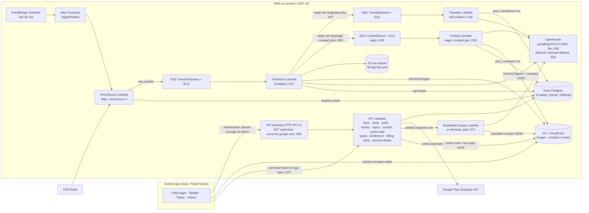

# TechTok — Design Document

TikTok-style reader for tech & science news: full-screen swipeable cards, each card an LLM-condensed story with image, headline, short summary, and a link to the source.

- **Status:** agreed 2026-07-18, after Q&A session (decisions logged in §2); localization + compact-reader + UX extension agreed 2026-07-22 (D20–D25, phases 7–10); UI library, eager translation, image quality, digest retirement, and visual identity agreed 2026-07-24 (D26–D30, phases 11–12); LLM provider swap to OpenRouter agreed 2026-07-24, code complete (D32, phase 13); CI/CD hardening — parallel jobs, API/mobile compatibility guardrail, mobile semver automation — agreed and implemented 2026-07-24 (D33–D35, phase 14); eager compact-article generation for all 4 languages agreed and implemented 2026-07-24 (D36, phase 15); visual identity redesign ("Orbit") + native-asset sync fix agreed 2026-07-24 (D37, phase 16); public project site on GitHub Pages agreed and implemented 2026-07-25 (D39, phase 17); mobile version automation retired for good after a real push race (D41, 2026-07-25), then reinstated as two race-safe pieces: post-merge tag-only (D42) and PR-branch auto-bump (D43), both 2026-07-26; auto-bump moved back to a post-merge push on `main` once the ruleset's `pull_request` requirement was lifted (D44, 2026-07-26); daily-use polish, smarter ranking and new-capability decisions agreed and implemented as independent PRs 2026-07-26 (D45–D49, phases beyond 17 — muting a source as a hard feed exclude being the latest, D49); listen mode (text-to-speech) for cards and the reader agreed and implemented via expo-speech (D54, 2026-07-26); offline saved-article prefetch (wifi-gated, on bookmark) agreed and implemented 2026-07-26 (D55); LoadingScreen made theme-aware with a "TechTok" title, amending D25/D30/D37 agreed and implemented 2026-07-27 (D56); mobile release tags/GitHub Releases now carry a feat/fix changelog, amending D42, agreed and implemented 2026-07-28 (D58); a release history feed on the public site, reusing that changelog, agreed 2026-08-03 (D60, phase 18); feed read-ahead content prefetch, extending D55 from explicit bookmarks to scroll position, agreed and implemented 2026-08-03 (D61); visual identity redesign — mascot-in-hexagon logo, replacing D37's Orbit mark — agreed and implemented 2026-08-10 (D66); D66's hexagon mark corrected for Android adaptive-icon safe-zone clipping, reported from an on-device screenshot, amended and implemented 2026-08-11; **going public and paid** — Google Play listing, Google Sign-In replacing anonymous device identity, a free-tier daily cap, a Play Billing subscription, and a paid extended-compact reader — agreed 2026-08-10 (D67–D74, phases 19–22); article-content prefetch removed from the app, retiring D55/D61 and reversing D81's decision to keep it, agreed and implemented 2026-08-21 (D82)
- **Scale target:** was "you + friends (tens of users), hobby budget ~$10/mo" through D66. As of D67 this is a **public Play Store app with a paid tier** — audience unbounded, cost governed by per-subscriber unit economics rather than a flat ceiling (D74), with the AWS Budget alarm retained at $25/mo as an infrastructure-drift signal only
- **Companion doc:** [IMPLEMENTATION_PLAN.md](IMPLEMENTATION_PLAN.md)

---

## 1. Product definition

**Core loop:** open app → full-screen card feed (newest unread stories in your topics) → swipe up for next → tap through to source when hooked. Read state and topic preferences follow you server-side.

**A card is:** article image (full-bleed background with scrim; deterministic gradient + topic-glyph stub when the article truly has none, D24) + hook title + 2–3 sentence summary + "why it matters" line + source attribution + topic chip + published time. Tap → compact in-app reader (D23) ending in a prominent "Read original" link-out; posts with no compact version fall back to the direct in-app browser tab.

**Non-goals (v1):** video/audio content, comments/social features, user-generated content, iOS release (kept buildable, not tested), personalized ML ranking. (Multi-language *sources* remain a non-goal — ingest is English-only; *serving* is localized per D20.) *Play Store publication was a non-goal through D66 and is now the explicit target — see D67.* Anonymous use is **also** now a non-goal: sign-in gates the feed (D68).

### Topics (fixed taxonomy v1)

`ai` · `dev` · `gadgets` · `startups` · `security` · `science` · `space` · `bio`

Defined once in `packages/shared`. The LLM classifier picks a `primaryTopic` from this list (source default as fallback). Empty user selection = all topics.

### Languages (v2, D20–D22)

`en` (source language) · `ru` · `uk` · `pl` — fixed set, defined in `packages/shared`. Each user has one `language` (device-locale default, changeable in settings/onboarding). Content is translated **on demand** (feed-triggered for cards, tap-triggered for compact articles) and stored per-post; English is always the fallback and never blocks — an untranslated card simply serves the English copy and upgrades on a later fetch. Topic labels and the app's own UI chrome are localized into the same four languages (static string tables, no LLM).

### Plans & entitlements (v3, D67–D74)

Every user signs in with Google (D68) and sits on one of two plans:

| | **Free** | **Plus** — €2.99/mo or €24.99/yr (D73) |
|---|---|---|
| Card reads / day | 50 | unlimited |
| Reader opens / day | 10 | unlimited |
| Compact article (~400–600 words, 4 languages, eager) | ✅ | ✅ |
| **Extended compact (~1,500 words, on demand)** | ❌ | ✅ (fair use: 100/mo) |
| Topics, language, history, bookmarks, search, listen mode, offline, stats | ✅ | ✅ |

A "card read" is the existing §1 settle event (1.5 s active page), *not* a feed item served — prefetch and offscreen renders never burn quota. Both counters reset at **local** midnight from an IANA timezone captured at sign-in (UTC fallback). Enforcement is server-side; the client renders remaining counts and the paywall. Entitlement is a first-class concept independent of the payment provider (D70), so it can be granted manually for testing and comped accounts.

Paid does **not** buy access to more of a publisher's text — it buys a longer version of *our own* condensation, on demand, plus the removal of our own limits (D72). That distinction is the whole rights posture of the paid tier.

### Seed sources (all editable — live in a Postgres `sources` table + seed file)

| Preset | Sources (verify exact feed URLs at implementation) | Default topic |
|---|---|---|
| Tech | Hacker News front page (hnrss, points≥100), The Verge, Ars Technica, TechCrunch | dev / gadgets / startups |
| Science | ScienceDaily, Phys.org, Quanta Magazine, Nature News | science / bio |
| AI & dev | arXiv cs.AI, GitHub Blog, Hugging Face blog | ai / dev |

### "Read" semantics

A post is **read** when its card has been the active (settled) page for ≥ 1.5 s, or the user opens the source link. The app queues read events locally and flushes in batches (every ~5 s and on app-background). Marking is idempotent.

---

## 2. Decision log

Decisions from the kickoff Q&A. Any of these can be revisited — the "revisit when" column says what would trigger it.

| # | Decision | Choice | Why | Revisit when |
|---|---|---|---|---|
| D1 | Audience | Me + friends, multi-user from day one | No store/compliance work, but real per-user state | It becomes a public product |
| D2 | Post format | Full-screen text+image cards (no video) | TikTok mechanics without the media pipeline | Never for v1; media array on schema keeps door open |
| D3 | Card text | LLM summaries are the target format | Best UX; excerpt cards are the interim + fallback | LLM cost/quality disappoints |
| D4 | Identity | Anonymous device ID, server-side user state | Zero friction, satisfies "server keeps prefs/read status" | Multi-device sync wanted → link Cognito accounts |
| D5 | Mobile toolchain | Expo + expo-dev-client + EAS | Fastest iteration, easy APK distribution to friends | A native need Expo can't plugin-ize |
| D6 | LLM provider | AWS Bedrock, Claude Haiku 4.5 | IAM auth (no keys), one bill, EU inference profiles | Model gaps in EU region |
| D7 | Lint/format | **Biome 2 everywhere** (no ESLint/Prettier) | One fast tool, simple config | RN-specific bugs slip that eslint-config-expo would catch |
| D8 | Package manager | pnpm workspaces | Fast, strict; Expo/Metro/SST all fine with it | Metro symlink pain → `node-linker=hoisted` escape hatch |
| D9 | Sources | All three presets (~11 feeds) | Broad tech+science coverage from day one | Feed quality review after phase 3 |
| D10 | Region | `eu-central-1` | User in EU; Claude via `eu.` cross-region inference profile | Model unavailable in EU profile |
| D11 | Budget | ~$10/mo, AWS Budget alarm; see §10. *(LLM caps were the enforcement mechanism through D27 — D31 removes them, leaving the alarm as a monitoring-only signal, not an enforced ceiling.)* | Hobby economics; see §10 | Friends actually use it heavily |
| D12 | iOS | Keep code cross-platform, test Android only | Near-free with Expo | Someone with an iPhone asks nicely |
| D13 | Backend stack | **SST v4** (Ion architecture), Node 22, TypeScript strict | User choice; at Phase 0 implementation time, v3 had already been superseded by v4 on the same CDK-free Ion architecture — same APIs, next major | SST ships a v5 with breaking API changes |
| D14 | Pipeline | Step Functions + SQS, **introduced in phase 2** (walking skeleton uses one cron Lambda) | SFN/SQS earn their keep at fan-out + LLM rate control, not at 3 feeds | — |
| D15 | Phase 0 toolchain pins | `sst.aws.CronV2` (not the deprecated `Cron`); TypeScript **5.9.3** (not the 7.0 native-compiler major); Jest **29.7.0** in `apps/mobile` (not 30.x) | CronV2 uses EventBridge Scheduler + retries/DLQ, the modern component; TS 7 is a from-scratch rewrite with unverified third-party tooling compat this early; `jest-expo@57.0.2` pins `@jest/globals`/`jest-environment-jsdom`/etc. to `^29.2.1` — installing jest 30 at the root split the jest-internals version graph and crashed (`clearMocksOnScope is not a function`) | jest-expo ships a 30.x-compatible release; revisit TS 7 once the ecosystem (Expo/Metro/SST tooling) has caught up |
| D16 | Transform Lambda reserved concurrency | Deferred — not set for now, on both `andrey` and `production` stages | This AWS account's Lambda "Concurrent executions" quota is stuck at 10 (confirmed via `aws lambda get-account-settings` / `aws service-quotas get-service-quota --service-code lambda --quota-code L-B99A9384`), below AWS's normal default of 1000. AWS requires ≥10 unreserved concurrent executions to always remain in the account, so *any* positive reserved-concurrency value on *any* function fails deployment (`InvalidParameterValueException: ... decreases account's UnreservedConcurrentExecution below its minimum value of [10]`). A self-service Service Quotas increase request was rejected (`You must provide a quota value greater than the default quota value of 1000.0`) — this is a suppressed/restricted quota needing an AWS Support case, not a normal increase flow. The transform stage still works correctly without the reservation; it just temporarily loses the intended cost/rate throttle (DESIGN §7.2) | The account's Lambda concurrent-execution quota is raised above ~12 (10 minimum unreserved + at least 2 reserved) — re-add `concurrency: { reserved: 2 }` to the Transform function in `infra/pipeline.ts` at that point |
| D17 | Stage naming & billing grouping | Personal dev stage renamed from the OS-username-derived default (`andrey`) to an explicit `dev` (`pnpm dev` now runs `sst dev --stage dev`; `deploy:dev` now `sst deploy --stage dev`; briefly named `stage` mid-rename, then unified to `dev` so the stage name and the `techtok-dev` app/tag/group value use one consistent word). All resources get default provider tags `app: techtok-dev\|techtok-production` + `stage: <stage name>` (`sst.config.ts`), plus one `aws.resourcegroups.Group` per stack (`infra/monitoring.ts`) named `techtok-dev`/`techtok-production` querying `AWS::AllSupported` resources by the `app` tag, for a single console view and Cost Explorer tag-based grouping | Wanted to group AWS resources per environment for billing/cost tracking. Considered AWS Service Catalog AppRegistry/myApplications, but AWS is closing AppRegistry to new customers on 2026-07-30 and this account (confirmed via `aws servicecatalog-appregistry list-applications`) has zero prior usage, so it would count as new and be a bad long-term bet; it also requires either per-resource `ResourceAssociation` wiring or an undocumented tag-scanner, not just default tags. Plain AWS Resource Groups (`aws.resourcegroups.Group`, the ARG service — confirmed distinct from and unaffected by the AppRegistry sunset) is a pure tag-query view: no per-resource wiring, no lifecycle coupling, free, and pairs with the same default tags used for Cost Explorer | AWS reopens AppRegistry to new customers, or the project wants the myApplications console/health-dashboard view badly enough to justify the extra per-resource wiring |
| D18 | Android build & distribution | Adopt a committed bare `android/` project (`expo prebuild`) so the app builds & publishes to Google Play with the standard Android/Gradle toolchain — no EAS. Release signing reads a gitignored `apps/mobile/android/keystore.properties` (upload key kept outside the repo; falls back to the debug key when absent). `apps/mobile` gains `prebuild:android`/`build:android`/`build:android:apk` scripts; the prebuild→gradlew→Play flow is documented in `docs/DISTRIBUTION.md`. EAS internal distribution (`eas.json`) is kept as a fallback | Wanted a Play Store release pipeline owned entirely on the maintainer's machine, without Expo's paid cloud build. Keeping the Expo SDK (prebuild/CNG → committed native project) rather than ejecting to bare React Native preserves every `expo-*` module already in use; only EAS Build is dropped. Bare (committed `android/`) was chosen over managed CNG so the release `signingConfig` lives durably in `build.gradle` instead of needing a config plugin re-applied on every prebuild. Caveats (OTA updates via EAS Update no longer fetch; push needs direct FCM off EAS) are documented in `docs/DISTRIBUTION.md` | The maintainer wants Expo's managed build/submit convenience back, or wants to remove the Expo SDK entirely (would require replacing `expo-router`/`expo-image`/`expo-notifications`/etc.) |
| D19 | Mobile CI builds | Build the Android APK in CI (`.github/workflows/mobile-build.yml`) with `eas build --local` on push to `main` + manual dispatch, publishing the APK to a GitHub Release for friends to sideload. `--local` runs on the GitHub runner, so it doesn't consume EAS free-tier cloud-build credits (15 Android/mo); signing uses EAS-managed *remote* credentials via an `EXPO_TOKEN` secret (no keystore in GitHub). Reuses the existing `eas.json` `preview` profile (APK, internal) | Wanted mobile builds automated in CI and to exceed the free tier's 15 cloud builds/month without paying. `eas build --local` is unmetered (compiles on the runner) yet stays in the Expo ecosystem (`eas.json` profiles, EAS Update channels, EAS-managed signing) that the maintainer wants to keep. GitHub Releases replaces EAS-hosted internal-distribution links, which are a cloud-build-only feature. Chosen over plain `./gradlew` in CI (D18) because it preserves EAS credential management (no keystore in GitHub secrets) and profile/env parity with any occasional cloud build | The maintainer wants EAS-hosted install pages or EAS Update baked into CI (would spend cloud-build credits), moves to the Play Store internal-testing track (D18), or needs iOS builds (requires a macOS runner + Apple signing) |
| D20 | Localization scope & preference model | Four languages: `en` (source) + `ru`/`uk`/`pl`, fixed list in `packages/shared`. One `Users.language` per user (single choice, not multi): default = device locale when it's one of the four, else `en`; set via an onboarding step and a settings row. Localized: LLM card copy **and** excerpt/skipped cards (verbatim excerpts translated — accepted rights trade-off at friends scale), topic labels (static per-language strings in `shared`), and the app's own UI chrome (`expo-localization` + typed string tables). Ingest stays English-only | The intended audience includes non-English-reading friends; a fixed 4-language set keeps cost and QA bounded. Excerpt translation included because a mixed EN/translated feed for excerpt-heavy days felt worse than the marginal rights exposure of machine-translating short verbatim excerpts privately | Language list grows (each language multiplies on-demand LLM spend); a source complains about translated excerpts (drop excerpts from eligibility, LLM cards only); multi-device users want per-device languages |
| D21 | Translation storage & serving | Translations live in an `i18n` map **on the same `Posts` item** (`i18n.ru = { cardTitle, summary, whyItMatters, translatedAt }`), never as separate post items. The server picks the served variant per request from `Users.language`; Card DTO gains `servedLang` + `isTranslated`; a "show original" toggle exists in the compact reader only (cards stay clean). English fallback is always served when a translation is missing | `postId` keys every identity-bearing feature — read markers, bookmarks, dedup, history snapshots, feed GSIs. Separate per-language items would fracture all of them (reading the RU variant wouldn't mark the EN one read). Server-side selection keeps the feed a single request and the client dumb | Translated posts ever need independent ranking/visibility (fan-out read model); payload size becomes a concern (move variants out of the hot item) |
| D22 | On-demand LLM economics under an unchanged $10 budget | Budget alarm stays at $10/mo (D11 reaffirmed). **All new LLM work is on-demand**: compact articles generate on demand at first tap (D23, endpoint redesigned to a job-polling API by D27). *(Card translations were on-demand from the feed read path under this decision; D27 moved them to eager pre-translation at transform time — see D27 for the current model and its cost impact.)* Guards were per-kind daily counters in `Counters` plus a per-source daily transform quota — **removed entirely by D31**; the LLM call always proceeds now, with no cap-based skip/degrade branch. Try switching Hugging Face to an official-posts-only feed URL (its community feed is 52% of the table). Haiku 4.5 for every step (D6 escalation path unchanged). Translation quality via **self-critique in-call** (translate → critique → corrected output in one response, ~30–50% more output tokens, no second pass). No backfill of translations | Eager fan-out of *everything* (all posts × all languages + eager compacts) ≈ $70–100/mo vs. the $10 ceiling — still true, which is why compact articles stay on-demand and eager translation (D27) is scoped to card translations only, not compacts. The cap-based worst-case/typical framing this row originally reasoned in no longer applies post-D31: spend now tracks real volume directly, with the $10 alarm as the only remaining signal | Real usage data after phase 12 rollout; bad-translation reports accumulate (add the deferred separate verify pass); D31's uncapped spend regularly busts the $10 alarm (see D31's own revisit trigger) |
| D23 | Compact in-app reader | Re-resolves challenged assumption #4 **at friends scale**: the app shows an LLM-compressed compact version of the article (structured zod-validated blocks — `paragraph \| heading \| image \| list \| quote` — ~400–600 words) with the article's own in-body figures extracted and mirrored (≤5, minimum dimensions, degrade to text-only). Generated **on demand** in a single pass straight to the requested language, sourced from the already-archived raw HTML in S3 (one live fetch attempt if no archive); stored as `content/<postId>/<lang>.json` on S3 behind the existing CloudFront router; cached reads bypass Lambda entirely (`compactLangs` on the DTO tells the app which variants exist on the CDN). *(Original shape was one synchronous `GET /v1/posts/:id/content?lang=` call, 30 s ceiling, spinner UX; D27 redesigns this into a job-based polling API — `POST` starts generation, `GET .../content/status?jobId=` polls staged progress — so the reader can show real progress instead of a spinner. Same generation logic, different transport.)* Card tap → reader (when available/generatable) → prominent "Read original" in-app browser link; direct link-out is the fallback; share always shares the original URL. Guardrails: per-source `compactEnabled` kill switch, prominent attribution, remove-on-request, explicit revisit before any public release. *(On-demand generation and its job-polling transport are both superseded by D36 — compacts become eager, generated inside the ingest pipeline for all 4 languages, and the reader API simplifies back to a plain cache read.)* | Reading without a site-hop is the product's next step, and the raw-HTML archive makes generation nearly free of network work. Sync-call generation was chosen over async-and-poll for simplicity at first (phase 9); D27 revisits that once a real progress bar is wanted, since ~11s typical generation is long enough that staged progress beats a spinner. Per-language single-pass generation avoids a translate-the-compact second call. The rights posture change is deliberate and logged, not incidental | Any public/store release (rights posture must be re-reviewed); a source objects (flip `compactEnabled`, remove content); figure extraction quality disappoints (text-only default) |
| D24 | Image fallback chain fix + backfill + stub | Implement the full designed chain: RSS `enclosure` → `media:content`/`media:thumbnail` (rss-parser `customFields`) → first `` in `content:encoded`/`content`/`summary` → **og:image from the already-fetched article page at transform time** (the `@extractus` result's `image` field, currently discarded) → mirror to CDN. *(D28 extends the og:image trigger to also fire when an ingest-time image exists but fails a minimum-dimension quality check, not only when it's entirely absent.)* One-shot backfill Lambda extracts og:image from the raw-HTML S3 archives for existing imageless posts (no LLM, no refetch). Genuinely imageless posts render a **client-side deterministic stub**: gradient seeded by `postId` + topic glyph (zero assets, zero backend, works offline). arXiv's generic og:image logo is treated as imageless (small known-generic denylist in `core`) | Production audit 2026-07-22: 28 of 1,610 posts (1%) had images — only The Verge, the one source whose feed embeds `` in plain `content`. The implemented chain was a subset of the §11-designed one: `media:content` unparsed, `content:encoded` undeclared, og:image never wired despite the transform already downloading every page | A source's og:image turns out consistently generic (extend the denylist); stub aesthetics after the design-token evolution; hotlink-vs-mirror balance changes |
| D25 | Feed UI restructure: bottom action bar + loading states | Replace the scattered overlay circle buttons with a **solid, layout-reserving bottom action bar** (~56 px + safe-area inset; the card pager shrinks accordingly — a deliberate amendment of D2's full-bleed aesthetic): per-card actions (bookmark, share) + global nav (saved, history, settings) in one bar; card tap remains the reader entry (D23). Add a **branded splash** (`expo-splash-screen`; requires prebuild re-run for the committed bare `android/`, D18) and a **dedicated in-app loading screen** (logo + spinner) between splash and the first rendered feed page, ahead of the existing skeleton states. *(The actual mark/color was left generic here — the Expo default template icon was still in place; D30 designs the concrete visual identity.)* | Five floating circles don't scale as actions grow, and the maintainer prefers a conventional persistent bar over an overlay (explicit choice against the overlay recommendation). Cold start currently drops straight into skeletons with no branded moment | Bar exceeds ~6 actions (introduce an overflow menu); full-bleed cards get missed enough to revisit the overlay variant; splash/loading feels slow rather than polished |
| D26 | Mobile UI component library | Adopt **React Native Paper** (Material Design 3) as the shared component library across the app — a full component sweep (buttons, cards, inputs, badges, chips, modals) replacing the custom UI. Implemented 2026-07-24: `PaperProvider` wraps the root (`app/_layout.tsx`) alongside expo-router's own `ThemeProvider`; every ad hoc `Pressable`+`Text` in `apps/mobile/src` was replaced (`Button`, `IconButton`, `Chip`, `List.Item`, `TouchableRipple`); no modal/dialog UI existed anywhere in the app to migrate. One peer-dep gap this decision didn't anticipate: `@expo/vector-icons` wasn't in the repo at all, so Paper's icon rendering would have silently rendered nothing — added it (`^15.1.1`, matches this repo's Expo SDK 57 exactly per `expo install --check`, pure JS backed by the already-present `expo-font`, Expo-Go-safe). Lint/typecheck/287 vitest + 37 mobile-jest tests green, `expo export` bundled cleanly for both `android`/`ios`; the physical-device Expo Go visual pass is still the maintainer's own step (no Android SDK/Xcode in this environment). **Amendment, 2026-07-24:** the original choice of full stock `MD3LightTheme`/`MD3DarkTheme` (not a custom-seeded theme) is reversed — the theme is now seeded from the app icon's brand palette (D37 "Orbit": navy `#111A33`, amber `#FF9F1C`), per the exact trigger this row's own "revisit when" column had flagged. `apps/mobile/src/constants/materialTheme.ts` uses a new `@material/material-color-utilities` dependency (Google's own HCT/tonal-palette algorithm; pure JS/TS, no native code, Expo-Go-safe) to seed the neutral/secondary/tertiary/error palettes from the navy brand color via `themeFromSourceColor`, then swaps in a separately-computed amber `TonalPalette` (matched hue/chroma from `#FF9F1C`) as the `primary` role, reproducing Paper's own stock tone-role mapping and elevation-overlay/disabled-opacity formulas by hand (read directly from Paper's MD3LightTheme/DarkTheme source). `apps/mobile/src/constants/paperTheme.ts` builds full `MD3Theme` light/dark objects from this plus matching expo-router navigation themes (primary/background/card/text/border/notification), both wired into `_layout.tsx` in place of the stock themes. `theme.ts`'s `Colors.light`/`Colors.dark` (background/backgroundElement/backgroundSelected/text/textSecondary — the tokens most screens actually render with, since most screens hardcode `Colors.dark.*` directly rather than switching via `ThemedView`/`ThemedText`) now derive from the same seeded roles instead of flat black/white/gray literals; `Colors.overlay.accent` (previously `#C9A8FF`, a stale leftover from the D30 violet/magenta identity never updated when D37 replaced it) is now the seeded dark-theme amber primary tone. A real cross-tool gotcha surfaced and was fixed: `@material/material-color-utilities` ships ESM-only, and jest-expo's default Jest `transformIgnorePatterns` only allow-lists `.pnpm` for the *outer* segment of pnpm's nested virtual-store path (`node_modules/.pnpm/<pkg>/node_modules/<pkg>/...`) — the inner `node_modules/@material` segment still fell through to "ignored", so Jest never transformed the package's `export` syntax; fixed in `apps/mobile/jest.config.js` by mirroring jest-expo's actual default pattern with `@material` added to the allow-list (a naive full replacement using the leaner upstream `@react-native/jest-preset` pattern was tried first and broke unrelated suites by dropping jest-expo's own `.pnpm`/`expo`/`@expo`/etc. allowances — caught immediately by the full test run, corrected before proceeding). 331 vitest + 37 mobile-jest tests green (up from 329+37); lint/typecheck clean; `expo export --platform android` bundled cleanly (1668 modules, up from 1625) as a Metro-side proxy, since Metro (unlike Jest) resolves ESM natively. Not verified live: the on-device Expo Go visual pass, same constraint as the original decision | Pure JS, no native linking — the only realistic fit under the plain-Expo-Go testing constraint (`expo-go-native-module-constraint` memory): Tamagui needs a babel/metro plugin, gluestack-ui/UI Kitten add more moving parts for less benefit at this app's size. Consolidates buttons and other primitives that had drifted into ad hoc custom components across phases 0–10. Amendment's why: the user asked to expand the icon's color scheme across the whole app, and stock MD3's default purple-leaning palette no longer matched the app's actual brand identity established by D37 | The Expo Go testing constraint lifts (a custom dev client becomes acceptable) and a more customizable/headless library earns its setup cost. (The seeded-theme trigger that used to live here has fired and is resolved — see the amendment.) If the brand identity changes again (past D37), the seed colors in `materialTheme.ts` need updating to match |
| D27 | Eager feed-card translation + job-polling compact API | Amends D22's on-demand model, feed-card scope only. `transformArticle` now eagerly enqueues a `TranslateQueue` job for each of the 3 non-English languages (ru/uk/pl) for every post, right after summarization — every post gets all 4 language variants (`i18n` map) saved before it ever reaches a feed response. This retires the feed-path lazy enqueue / `i18nPending` / `isTranslated`-pop-in mechanism entirely: a feed card always renders already-translated, never pops in. New posts only — no backfill of the historical backlog. The compact-reader detail view (D23) stays on-demand (translated only when a user opens it for a specific language), but its content endpoint is redesigned from one synchronous call into a job-based polling API (`POST` starts a job and returns a `jobId`; `GET .../content/status?jobId=` polls real stage: fetching/extracting/translating/done) so the reader can show a real staged progress bar instead of a single spinner. *(Originally required raising the `translations#<date>` daily cap and rechecking the budget ceiling — moot as of D31, which removes the cap entirely instead of raising it. Both the on-demand model and this job-polling transport are superseded by D36: compacts become eager for all 4 languages, and the transport simplifies back to a plain cache read.)* | Eager pre-translation gives every feed card a consistent, pop-in-free experience in any of the 4 languages, trading away D22's on-demand cost-shaping for card translations specifically (compacts stay on-demand — see D22). Real backend-driven progress reporting was chosen over a client-side simulated progress bar because it reflects what the content endpoint is actually doing stage-by-stage | Real cost data after phase 12 rollout shows uncapped translation spend (D31) is untenable (reintroduce some form of cap, redesigned); job-based polling proves more complexity than value for the ~11s typical generation window |
| D28 | Image quality gate (minimum dimensions) | Amends D24. At transform-time mirroring — the same point D24's `mirrorImage` step already fetches image bytes — check the candidate's real pixel dimensions via a lightweight header-only library (`image-size`, no native decode) and reject anything below **600px** in width or height as too low-quality for a full-bleed card. Cascade on rejection: ingest-time image fails the bar → try the transform-time og:image next (extends D24's og:image trigger from "no `imageUrl` at all" to also cover "has one, but it fails the quality check") → still fails/absent/denylisted → fall through to the existing `ImageStub` gradient placeholder. New posts only — no backfill of already-mirrored low-quality images. Implemented 2026-07-24: `mirrorImage`'s contract changed from `string \| undefined` to a three-way `{status: 'ok'\|'rejected'\|'failed'}` outcome so a quality rejection can be distinguished from an infra failure (which still degrades to the raw hotlink, unchanged); `transformArticle` cascades ingest→og on `'rejected'`; `PostsRepo.updateTransform` gained a `clearImageUrl` flag that issues a real DynamoDB `REMOVE` (a `SET` omission alone leaves the old value in place) for the both-rejected case. `image-size@2.0.2` (pure ESM+CJS dual package, Node ≥16, no native code) needed no bundling workarounds under SST's esbuild — confirmed live. 294 vitest + 37 mobile-jest tests green. Live-verified end-to-end on `dev` by direct Lambda invocation against two synthetic posts: a small (300×200) ingest image correctly cascaded to a real 1920×1080 og:image, which mirrored successfully to CloudFront; a small ingest image with no available og:image (`example.com`) correctly removed `imageUrl` from the DynamoDB row entirely (confirmed via `get-item` — the attribute was absent, not just falsy), leaving the mobile `ImageStub` as the only possible render path | Production feedback: some card images are blurry/pixelated because their source is a small RSS thumbnail (~150–300px) stretched to fill a full-screen card. 600px comfortably clears typical thumbnail sizes without rejecting normal editorial images (usually 800px+) | 600px proves too strict or too loose against real feedback; a source's thumbnails are borderline and worth a per-source override; backfilling existing low-quality images becomes worth the one-time cost |
| D29 | Retire daily digest push notifications | Reverses the Phase 5 "chosen-in" item (daily top-N-unread digest push via `expo-notifications` + Expo push API) and its Phase 8/10 follow-on wiring (digest localization). Removed end-to-end: `infra/digest.ts` (`DigestCron` + inline Lambda), `packages/functions/src/pipeline/digest.ts`, `core/digest/buildDigest.ts`, `core/notifications/expoPush.ts`, `PUT /v1/me/push-token` + its handler, `Users.pushToken` (field + repo methods), `pushTokenRequestSchema`, the mobile settings toggle + `state/pushNotifications.ts`, and the `expo-notifications` dependency/plugin entirely. Implemented and verified (lint/typecheck/287 vitest + 37 mobile-jest tests green) 2026-07-24. The related standalone "Send feedback" Settings row was removed in the same pass, but the long-press bad-translation-report feature (Card/reader) is unrelated and stays intact | User's explicit choice to remove the feature from Settings; rather than leave dead backend infra (Cron, Lambda, table field) running unreachable, chose full retirement for a clean codebase with nothing orphaned | Daily digest is wanted again as a feature — would need to be re-designed and rebuilt from scratch (not restored), since D27's eager-translation economics have changed materially since Phase 5/8 built the original version |
| D30 | Concrete visual identity (icon/splash) | Amends D25. Replaced the default Expo boilerplate icon/splash assets (confirmed: the pre-existing files were literally the default Expo template `grid.png`, only the `#208AEF` background had been customized) with a custom **duotone "T" lettermark** — deep violet background (`#2A1B5C`) with a magenta mark (`#FF3D8A`), flat rendering (no gradients) for crisp rendering at small Android adaptive-icon sizes. Applied to `app.json`'s icon/adaptiveIcon/splash-screen config, all Android adaptive-icon layers (foreground/background/monochrome), the favicon, and `LoadingScreen`'s background color (mirrors the native splash per D25's "reads as a continuation" requirement; its snapshot test was regenerated). Generated via an SVG source rasterized locally with `sharp` — no design-tool dependency. Implemented and verified (lint/typecheck/287 vitest + 37 mobile-jest tests green) 2026-07-24. **Correction, 2026-07-24, same day:** "implemented" here only ever meant `app.json`, `apps/mobile/assets/images/*`, and the JS-side `LoadingScreen` — all confirmed correct. The committed bare `android/` project (D18) was never regenerated via `expo prebuild` to match, so every real APK build since has kept baking in the original default Expo template icon/splash (`mipmap-*/ic_launcher*.webp`, `drawable-*/splashscreen_logo.png`, `values/colors.xml`'s `splashscreen_background` still `#208AEF`) — confirmed by decoding those files directly. No prior phase caught this because none of them included an actual on-device APK check (all deferred to "the maintainer's own step"); this is that check, finally run, finding a real gap. Fully superseded by D37, which replaces this identity outright rather than just re-syncing it | User explicitly asked for a real designed icon/splash rather than the Expo default. Lettermark chosen over an abstract swipe-motif or tech/science symbol for simplicity and clean scaling to tiny icon sizes; violet/magenta chosen over evolving the existing blue or a charcoal/lime direction for a distinctive, modern-product feel that stands out from typical blue tech-app icons | The brand direction changes again; D26's MD3 theme (phase 11, not yet built) is applied and this identity needs to seed a custom MD3 theme instead of using Paper's stock Material colors (resolved 2026-07-24 — see D26's amendment, which seeds from D37's Orbit identity instead of D30's) |
| D31 | Remove all daily LLM caps | Amends D11, D22, D23, D27. Delete cap-checking entirely: the global transform cap (`transforms#<date>`, 120/day), the per-source transform quota (`transforms#<sourceId>#<date>`, 30/day, plus `Sources.dailyQuota`), the translation cap (`translations#<date>`, 100/day, incl. D27's planned raise — now moot), and the compact-article cap (`compacts#<date>`, 20/day) all go away. `transformArticle`/`translateArticle`/`contentArticle` stop calling `CountersRepo.incrementIfUnderCap` and never take a cap-based skip/degrade branch — the LLM call always proceeds (non-cap degrade paths like source-fetch failure or LLM refusal are untouched). The `Counters` DynamoDB table is deleted (nothing else reads it). The $10/mo AWS Budget alarm (D11) stays but changes role: monitoring-only (fires an email at $10/mo spend), not a backstop on an enforced ceiling — no pipeline mechanism stops spend at a threshold anymore | User's explicit choice to simplify the pipeline: four separate counters, per-source overrides, env-tunable defaults, and cap-testing acceptance criteria across phases 3/8/9 had grown complex; user wants that complexity gone and accepts uncapped Bedrock spend as the tradeoff | Real spend without caps blows past the $10 alarm regularly enough that monitoring-only isn't sufficient and some form of throttle is wanted back — would need to be redesigned, not restored, since the `Counters` table is deleted |
| D32 | LLM provider: OpenRouter replaces Bedrock as active provider | Amends D6. All three LLM pipeline paths (card transform, translation, compact-article) switch from AWS Bedrock to OpenRouter (openrouter.ai), calling the **same model as today** — `anthropic/claude-haiku-4.5` via OpenRouter's catalog — so this is a pure transport swap with no prompt/model-behavior change. Bedrock is **kept in the codebase as a dormant fallback**, not deleted: `bedrockClient.ts`, the `bedrock:InvokeModel` IAM grants, and the `@aws-sdk/client-bedrock-runtime` dependency all stay, selectable via an `LLM_PROVIDER` env var (default `openrouter`, settable to `bedrock` per stage). Calls use Node 22's built-in `fetch` against OpenRouter's OpenAI-compatible chat-completions endpoint — no new HTTP/SDK dependency. The OpenRouter API key is stored as an `sst.Secret` (`OpenRouterApiKey`), set per-stage by the maintainer directly (`npx sst secret set OpenRouterApiKey <value> --stage <dev\|production>`) — this is the project's first real secret (§9 previously said "none needed v1"). No change to cost monitoring: the $10/mo AWS Budget alarm (D11) won't see OpenRouter spend (a separate bill) and that's accepted as-is, matching D31's direction of not adding new cap/alarm machinery. Implemented 2026-07-24 (IMPLEMENTATION_PLAN.md phase 13): `packages/core/src/llm/openRouterClient.ts` (`createOpenRouterProvider`, plain `fetch` against the chat-completions endpoint) + `packages/core/src/llm/providerFactory.ts` (`createConfiguredLlmProvider(env)`, the single call site all three handlers now use instead of constructing a Bedrock provider directly); `infra/pipeline.ts` gained the `OpenRouterApiKey` secret plus `LLM_PROVIDER`/`OPENROUTER_MODEL_ID` env vars on the transform/translate/content-job functions, with the existing `bedrock:InvokeModel` IAM grants and `BEDROCK_MODEL_ID` wiring left untouched. The secret's value is wired through as a plain `OPENROUTER_API_KEY` environment variable (Pulumi resolves `openRouterApiKey.value` at deploy time) rather than via SST's `Resource.OpenRouterApiKey.value` runtime-linking API — the latter needs a generated `sst-env.d.ts` that only exists after a live `sst dev`/`deploy` with the secret already set, which hadn't happened yet at implementation time; revisit once a first live deploy exists, since linking avoids the key ever appearing as a plaintext Lambda environment variable. 304 vitest + 37 mobile-jest tests green. Deploy-and-verify (task 7: a live OpenRouter call on `dev`, then the `LLM_PROVIDER=bedrock` fallback path, both via real logs) is blocked on the maintainer setting `OpenRouterApiKey` via `sst secret set` — not yet done in this environment | User already holds an OpenRouter account/API key; consolidating all three paths onto one model via one provider keeps prompt/golden-fixture behavior identical, only the transport changes. Keeping Bedrock as a selectable fallback (rather than deleting it) costs nothing but an unused code path and hedges against an OpenRouter outage or key-rotation pressure | OpenRouter has a sustained outage or its reliability/pricing proves worse than Bedrock in practice (flip `LLM_PROVIDER` back, or reconsider the fallback-vs-primary posture entirely); the account's Bedrock reserved-concurrency quota (D16) is ever fixed — that fix is unaffected by this decision either way, since D16's throttle was Lambda-side, not Bedrock-side |
| D33 | CI job parallelization | The single `quality` job in `.github/workflows/ci.yml` (`biome ci .` → typecheck → vitest → mobile jest, run sequentially in one job) splits into a `setup` job (installs deps once, uploads `node_modules` as a build artifact) plus three parallel jobs — `lint`, `typecheck`, `test` — each depending only on `setup` and downloading that artifact. The `deploy` job's `needs:` gains all three in place of the old single `quality` job. Implemented 2026-07-24: every workspace's `node_modules` (root + each package/app) is tar'd in `setup` and restored via `actions/upload-artifact`/`download-artifact` in each downstream job (pnpm's relative symlinks inside each package's `node_modules` stay valid once re-extracted at the same repo path); a fourth parallel job, `schema-check` (D34), was added alongside `lint`/`typecheck`/`test` off the same `setup` artifact | Lint/typecheck/test are independent checks with no data dependency between them — running them sequentially in one job wastes wall-clock time waiting on each other for no reason. Splitting them shortens CI feedback time, which matters more as the codebase (now 14 phases in) keeps growing | A job's own overhead (setup/restore) starts costing more than the parallelism saves (small repo, fast checks) — collapse back to one job; or GitHub Actions minutes/concurrency limits make 3x job count a real constraint |
| D34 | API/mobile compatibility guardrail | Two complementary layers: **(1) Schema snapshot diff, blocking, per-PR** — a committed snapshot (`packages/shared/schema-snapshot.json`) of `packages/shared`'s zod request/response contracts; a CI job (`schema-check`) regenerates the snapshot from the PR branch and fails if, relative to the committed one, a field was removed, a field's type/optionality narrowed, or an enum value was removed — additive changes (new optional field, new enum value) pass silently. **(2) E2E test suite against the real `dev` stage, post-deploy/scheduled (not per-PR)** — `.github/workflows/e2e.yml` (`workflow_dispatch` + a daily schedule, never triggered by a push/PR, since it needs real AWS credentials and this repo's standing rule is "CI must run with no AWS credentials" for the PR path) exercising: backend pipelines end-to-end (a real `IngestPipeline` execution, `TransformQueue`/`TranslateQueue`/`ContentJobQueue` draining, verifying real DynamoDB/S3 state transitions) and the API contract from the mobile client's perspective (real HTTP calls against the deployed `dev` API, parsed through the same shared zod schemas the mobile app itself uses). Mobile UI Maestro flows stay a separate, still-deferred phase 6 item — not folded into this E2E effort. Implemented 2026-07-24: (1) `packages/shared/scripts/schemaSnapshot.ts` uses zod 4's own `z.toJSONSchema()` (no hand-rolled introspection) plus a recursive structural diff (properties/items/oneOf-anyOf branch-matched-by-discriminator/enum) that walks only the *committed* snapshot's schemas against the freshly-generated one — a schema newly added on a branch is never flagged, and regenerating+committing the snapshot file *is* the explicit "acknowledged override" the design called for, visible to reviewers as a plain JSON diff; (2) a new `@techtok/e2e` workspace package (`packages/e2e`) discovers the dev stage's real resource identifiers (state machine ARN, queue URLs, table names, API id) via `ResourceGroupsTaggingAPI` tag search on the existing `app: techtok-dev` tag (D17) rather than guessing at SST/Pulumi-generated physical names, then runs the two suites against them; a new narrowly-scoped `techtok-gha-e2e` IAM role (OIDC trust policy mirroring the existing deploy role's, but an inline policy granting only `tag:GetResources`, `states:StartExecution`/`DescribeExecution` and `sqs:GetQueueAttributes`/`dynamodb:Scan`/`Query`/`GetItem`/`apigateway:GET` scoped to `techtok-dev-*` ARNs — no write/deploy permissions at all) replaces the idea of reusing the admin-privileged deploy role. Both suites were run live against the real `dev` stage during implementation (not yet via the Actions runner itself, which needs the `AWS_E2E_ROLE_ARN` secret added): the backend-pipeline suite started a real `IngestPipeline` execution, confirmed all 11 enabled `Sources` rows picked up a fresh `lastFetchAt`, and confirmed `TransformQueue`/`TranslateQueue` drained to zero; the API-contract suite hit `/v1/topics`, `/v1/me`, `/v1/feed`, `/v1/history`, `/v1/bookmarks` as a fresh device and parsed every response through the real `packages/shared` schemas with zero parse errors. A real CJS/ESM interop bug surfaced along the way: `he@1.2.0`'s `module.exports = he` (a variable, not a static object literal) can't be statically analyzed by Node's `cjs-module-lexer`, so `import { decode } from 'he'` — which bundlers silently paper over — throws under a real Node ESM loader (tsx); fixed in `core/ingest/htmlText.ts` with a default-import workaround (`import he from 'he'; const { decode } = he;`), harmless under every existing bundled runtime | Mobile APKs were sideloaded with no auto-update (D18 dropped EAS Update OTA; D65 later restored it for JS/asset-only changes via CI-automated EAS Update publishing, though native-affecting changes still need a reinstall), so an already-installed client can still run for a long time against whatever API is currently in production — a breaking API change can silently break users who haven't (and may never) reinstall. The static schema-diff catches breaking *shape* changes cheaply and immediately; it can't catch real runtime/integration failures (a Lambda IAM permission gap, a queue misconfiguration, a real DynamoDB key-schema mismatch), which is what the E2E layer is for. Keeping E2E off the per-PR path preserves the existing no-AWS-credentials-in-CI guarantee for every PR; only this dedicated workflow gets AWS credentials, scoped to `dev`-stage read/invoke only | The schema-diff mechanism proves too strict/noisy in practice (false positives on intentional additive changes); E2E flakiness against real infra makes the scheduled run unreliable enough to need retries/quarantine; a real breaking change ships anyway and slips through both layers (add a third layer or revisit the mobile app's own update story instead) |
| D35 | Mobile semver automation | The mobile app's version — previously inconsistent across three files (`apps/mobile/app.json` at `0.0.1`, `apps/mobile/package.json` at `0.0.0`, `apps/mobile/android/app/build.gradle` at `versionName "0.0.1"`/`versionCode 1`) — gets one canonical source, **`apps/mobile/app.json`'s `version` field**, with `package.json` and `build.gradle`'s `versionName` synced from it automatically by a script (`scripts/bumpMobileVersion.ts`); `versionCode` auto-increments by 1 on every bump regardless of semver bump size (Android requires it to strictly increase). The bump itself is **conventional-commit-driven**: the script parses commit messages since the last `mobile-v*` tag and computes the next version (`feat:`/`feat!:` → minor unless a `BREAKING CHANGE:`/`!` marker is present → major, `fix:` → patch, anything else → no bump), running in CI on merge to `main` when mobile-relevant paths change (same path filter `mobile-build.yml` already uses: `apps/mobile/**`, `packages/shared/**`). Implemented 2026-07-24: a new `.github/workflows/mobile-version.yml` runs the script then commits+tags+pushes only if the three files actually changed (`git diff --quiet` guard), so no-op runs (no feat/fix commits since the last tag) never produce an empty commit; on the very first run (no `mobile-v*` tag exists yet), the script treats `app.json`'s current version as the already-canonical baseline instead of computing a bump across the entire pre-automation commit history, and just reconciles the other two files to it plus bumps `versionCode` once — run for real as part of landing this decision, reconciling the pre-existing drift to `0.0.1`/`0.0.1`/`versionCode 2` and tagging `mobile-v0.0.1` at that commit so future runs correctly diff from a real baseline instead of re-triggering bootstrap mode indefinitely | User wants the mobile app's version to reflect what actually changed, tied to the conventional-commit discipline already in place, rather than a manually-remembered bump (which is how the three files drifted out of sync in the first place). `app.json` chosen as canonical because it's Expo's own config and the natural single source for an Expo app; `package.json`/`build.gradle` are generated artifacts by comparison | The auto-bump misclassifies real-world commit patterns often enough to need manual override; the maintainer wants changesets-style explicit per-PR bump declarations instead for more control; multiple mobile-relevant PRs merge close together and the bump-per-merge granularity feels too noisy (batch instead) |
| D36 | Eager compact-article generation (all 4 languages), replacing on-demand | Amends D23/D27, reached alongside the D32 OpenRouter swap. Compact-article generation stops being tap-triggered: `transformArticle` eagerly enqueues one compact-generation job per language (en/ru/uk/pl) for **every** post, right after the raw HTML archive step — independent of the card-generation LLM outcome (excerpt-fallback posts get compacts too, since generation reads the archived article directly) and independent of `TranslateQueue` (compact translation is still single-pass compress+translate per D23, not a second pass off the translated card). **Figure extraction + mirroring moves out of the per-language job and happens once per post** (figures are language-independent — the previous on-demand design redundantly re-extracted/re-mirrored per language, which only mattered when at most one language was ever generated per post; eager generation for all 4 makes that 4x redundant, so this decision fixes it as part of the same change). The on-demand job-polling transport D27 built (`POST` → `jobId`, `GET .../content/status?jobId=` staged progress) is retired — it existed specifically because generation was synchronous-and-slow at request time; once generation always happens ahead of the request, `GET /v1/posts/:id/content?lang=` simplifies back to a **plain cache read**: returns the cached blocks when present, or a typed "not ready yet" response for the rare case a just-ingested post is opened before its eager job completes (no jobId, no staged progress). The ephemeral `ContentJobs` DynamoDB table (job-polling state) is deleted; `ContentJobQueue` is renamed `ContentQueue` (the "job" it was named for no longer exists). `Sources.compactEnabled` (the rights kill switch, D23) is checked before the eager enqueue, same guardrail, new checkpoint. New posts only — no backfill of the historical backlog, matching this project's established precedent (D24/D27/D28). Not yet implemented (IMPLEMENTATION_PLAN.md phase 15) | User wants compacts and translations built inside the ingest pipeline itself, not on demand, for consistency with how card translation already works (D27) — and now that OpenRouter (D32) decouples this spend from the AWS Budget alarm and D31 already removed all caps, the cost objection that originally kept compacts on-demand (D22: eager fan-out ≈ $70–100/mo vs. the old $10 ceiling) no longer applies as a hard constraint, only as an accepted tradeoff. The per-post figure-mirroring dedup is a clear efficiency win with no behavior change, folded in because eager 4-language generation is what exposes the previous design's redundancy | Real OpenRouter spend from eager compacts proves uncomfortable even without an AWS-side cap (reintroduce some form of throttle, redesigned); a source's rights concern makes eager generation-before-any-tap feel worse than generation-on-first-tap (revert to on-demand for that source only, or overall); the "not ready yet" miss case turns out to happen often enough in practice to need the staged-progress UX back |
| D37 | Visual identity redesign: "Orbit" (amber ring-and-dot on navy), replacing D30, plus the native-asset sync fix | D30's violet/magenta "T" lettermark is replaced entirely with a new concept: deep navy background (`#111A33`) with an amber (`#FF9F1C`) minimal ring-and-dot mark (an orbit), leaning into the "science & space" half of the product's tech+science identity, flat rendering (no gradients), same treatment scope as D30 (`app.json`, all Android adaptive-icon layers, favicon, `LoadingScreen`). Chosen from four rendered concepts — Pulse (cyan signal waveform), Orbit, Stack (coral offset swipe-cards), Spark (lime lightning bolt) — the user picked Orbit directly. Implementation must not repeat D30's actual failure mode: after regenerating source assets and `app.json`, the committed bare `android/` project (D18) must be verifiably regenerated to match — via a surgical resource sync (copy the icon/splash-specific generated files from a scratch `expo prebuild` output into the existing committed `android/` tree) rather than a blind `expo prebuild --clean`, which would wipe D18's hand-edited `build.gradle` release-`signingConfig` block. This time, verification includes decoding the actual compiled `mipmap-*/ic_launcher*.webp` / `drawable-*/splashscreen_logo.png` files and building a real APK to confirm on-device, not just checking `app.json`/source-asset content (D30's verification gap). Implemented 2026-07-24: mark geometry is a stroke-only ring (radius 216, stroke 52 on a 1024 canvas) plus a detached filled dot (radius 50, 34px clear gap from the ring's outer edge, at -40°) — generated via an SVG source rasterized locally with `sharp` (ephemeral devDependency in a scratchpad install, not committed, matching D30's own "no design-tool dependency" precedent) into the same 6-file set D30 touched. The `android/` sync used a temporary `git worktree` (not a plain directory copy) checked out from a `git stash create` commit so the workspace's pnpm-linked `node_modules` resolved correctly for `expo prebuild --platform android`; a full `diff -rq` against the committed `android/` tree confirmed the prebuild's default `build.gradle` lacked D18's `keystoreProperties`-conditional release `signingConfig` entirely (proving why a blind `--clean` would have destroyed it) and surfaced three more pre-existing sync gaps unrelated to this decision — `AndroidManifest.xml` (missing an `expo-localization`-added `configChanges` token), `values/strings.xml` (`expo_runtime_version` stuck at `0.0.1`), and `gradle.properties` (missing phase-14-era CI build-perf tuning) — all left untouched as out of this decision's scope. Only `mipmap-*/ic_launcher*.webp` (all 5 densities), `drawable-*/splashscreen_logo.png` (all 5 densities), and `values/colors.xml`'s two color values were copied over; `build.gradle` confirmed byte-identical (`sha256sum`) before and after. Verified by decoding the copied `.webp`/`.png` files directly (not by re-reading `app.json`) — `ic_launcher.webp`, `ic_launcher_foreground.webp`, and `splashscreen_logo.png` all show the Orbit mark on navy, and `colors.xml`'s `splashscreen_background` reads `#111A33`. Real APK build and on-device install could **not** be completed — this environment has no Android SDK, no `adb`/`gradle`, and no Java runtime at all (confirmed: `ANDROID_HOME`/`ANDROID_SDK_ROOT` unset, no SDK at the default macOS path, `java -version` fails to locate a runtime) — so that acceptance criterion stays explicitly open for the maintainer, same constraint every prior phase (7, 10, 11, 12) hit | User reported still seeing the default Expo icon/splash on an actual installed APK, which led to discovering D30 never reached a real build (source/config/JS were right, the compiled native resources weren't). Taking the opportunity to also redesign from scratch per the user's explicit choice for "a completely new concept" rather than just re-syncing the existing lettermark | The brand direction changes again; D26's MD3 theme (phase 11) wants to seed from this identity's palette instead of Paper's stock Material colors (the same open question D30 already flagged, still unresolved); the maintainer wants in-app theming to tie into this palette too; the three newly-discovered unrelated `android/` sync gaps (manifest `configChanges`, `expo_runtime_version`, CI `gradle.properties` tuning) are worth a dedicated follow-up so this class of bug doesn't keep recurring silently |
| D38 | LLM model: swap OpenRouter default from Claude Haiku 4.5 to Gemini 3.1 Flash Lite | Amends D32. `OPENROUTER_MODEL_ID`'s default in `infra/pipeline.ts` changes from `anthropic/claude-haiku-4.5` to `google/gemini-3.1-flash-lite` for all three LLM pipeline paths (card transform, translation, compact-article) — a pure model swap, no prompt/behavior/code-path change. Bedrock stays a dormant fallback per D32, untouched | A pricing comparison against OpenRouter's live model catalog (`GET /api/v1/models`) showed `google/gemini-3.1-flash-lite` at $0.25/M input / $1.50/M output vs Haiku 4.5's $1.00/M / $5.00/M on OpenRouter — ~75%/70% cheaper — same current-gen "fast/small" tier, 1M context window (vs Haiku's 200K), and Google's models are generally regarded as strongest on multilingual translation quality, which matters directly for this pipeline's ru/uk/pl translation targets | Real generated output (compact articles, translations) shows a quality regression vs Haiku 4.5 that golden-fixture/manual review can't tolerate — revert `OPENROUTER_MODEL_ID`'s default (a single string, no other code change) |
| D39 | Public project site on GitHub Pages | New `apps/site` workspace package (Astro, static output) — a public landing page for the mobile app: hero, a pure-CSS/SVG phone mockup of a sample feed card, a features list, all 8 topics (from `packages/shared`'s `TOPIC_LABELS`) and all 11 seed sources (from `packages/core`'s `FULL_SOURCE_PRESETS`, exposed via a new `./ingest/sourcePresets` subpath export since the package's default barrel pulls in AWS SDK clients at module scope), and a download section with an inline SVG QR code + button pointing at the permanent `github.com/tormozz48/techtok/releases/latest/download/techtok.apk` URL, plus the current version read at build time from `apps/mobile/app.json` (D35's canonical source). Localized to all 4 app languages (en/ru/uk/pl) via two Astro route files (unprefixed `/` for the default locale, a `[lang]` dynamic route for the other three) sharing one layout, with a hand-written `SITE_COPY: Record<Language, SiteStrings>` module mirroring `apps/mobile/src/i18n/strings.ts`'s one-file-all-languages discipline (D20). Deployed as a final-stage job of `ci.yml`'s D38 release pipeline, in a new `deploy-site.yml` reusable workflow (`actions/configure-pages` → `astro build` → `actions/upload-pages-artifact` → `actions/deploy-pages`, `GITHUB_TOKEN` only, no AWS) gated on `mobile-build` completing — running in parallel with the unrelated `release-cleanup` job a separate, concurrently-merged PR added at the same point in the pipeline (reconciled as a merge conflict, not a design choice: the two jobs are independent, neither depends on the other, so both simply run off `needs: mobile-build`). Requires flipping `mobile-build.yml`'s GitHub Release from `prerelease: true` to `prerelease: false`, since GitHub's `releases/latest` alias (what the download button and QR both point at) only ever resolves to the newest non-prerelease release — so the QR code, once printed or bookmarked, never goes stale. Since D37's Orbit mark was never committed as a source file (only described in prose and baked into raster app assets), it's redrawn here as inline SVG from that description (ring radius 216/stroke 52, dot radius 50 at −40° with a 34px gap, navy `#111A33`/amber `#FF9F1C`) for both the page header/favicon and reused inside a hand-written CSS phone mockup that stands in for real device screenshots (no Android tooling in this environment, matching every prior phase's constraint). Implemented 2026-07-25: 3 new vitest files (copy-completeness across all 4 locales, the base-path-joining helper, the download-URL constants + QR SVG shape) — 336 vitest + 37 mobile-jest tests green; `pnpm lint`/`typecheck`/`test` all exit 0; `astro build` produces all 4 locale pages; the QR SVG extracted from the real build output was rasterized and decoded (ephemeral scratchpad `sharp`+`jsqr` install, matching D30/D37's own precedent) and confirmed to encode the exact stable URL byte-for-byte; all 4 locales browser-checked at desktop and mobile (360–390px) viewport widths. Two real (not cosmetic) bugs surfaced and were fixed during this verification, both worth recording since they'll bite again if more locales/pages are added later: (1) Astro's `getStaticPaths()` runs in an isolated per-file scope that can see imports but not a sibling top-level `const` in the same frontmatter — the dynamic `[lang]` route has to compute its locale list from an imported binding (`@techtok/shared`'s `LANGUAGES`, filtered inline) rather than a local constant, or the build throws a `ReferenceError` at generate time, not at typecheck time; (2) Astro's `import.meta.env.BASE_URL` does **not** carry a trailing slash (`/techtok`, not `/techtok/`), so every `${base}${path}` concatenation across the language switcher, canonical/hreflang links, and favicon/OG-image links silently dropped the separating slash — fixed with a single `withBase()` helper in `src/lib/locale.ts` that normalizes this once. Not verified here (no Pages access, no phone): the real live deploy (Pages isn't yet enabled on the repo — `actions/configure-pages`'s `enablement: true` may turn it on automatically on first run, otherwise it's a one-time Settings → Pages → Source: "GitHub Actions" step) and an actual phone-camera scan of the deployed QR | Public visibility for the friends-rollout (phase 5) and general project presentation was requested directly; reusing existing code-as-content (topics/sources/version) instead of hand-copying it means the site can never drift out of sync with what's actually shipped; a stable `releases/latest`-based QR means it never needs reprinting; GitHub Pages is free, so D11's $10/mo ceiling is unaffected | The site outgrows a single landing page (blog, changelog) and wants a heavier framework/CMS; distribution moves off sideloaded APKs entirely (Play Store) and the download section needs to point somewhere else; the Orbit mark ever gets a real committed SVG source (D37's own gap) — this page's inline copy should switch to importing that instead of keeping its own redrawn copy |
| D40 | Reinstate mobile version automation, into `mobile-build.yml` (amends D35, D38) | D35 built `scripts/bumpMobileVersion.ts` plus a push-triggered `.github/workflows/mobile-version.yml` that auto-bumped `app.json`/`package.json`/`build.gradle` from conventional commits and tagged `mobile-v*`. D38's linear pipeline restructure deleted that workflow because a separate push-triggered job raced `mobile-build.yml` with no clean insertion point, leaving version bumps manual since (`chore(mobile): bump version to 0.4.0` was the last one, for phase 16) — and the `mobile-v*` tag was never updated to match (`mobile-v0.0.1` stayed put while `app.json` drifted to `0.4.0`). This decision adds the bump back as a step inside `mobile-build.yml`'s `android` job, right after `pnpm install` and before the Gradle cache/APK build steps: this **is** the clean insertion point D38 said didn't exist, because `mobile-build` now always runs as the guaranteed final pre-APK-build checkpoint of every main-branch pipeline run, and `deploy-site` (D39) runs after it in its own fresh checkout, so a commit pushed here is picked up by the site's version badge too. The checkout step gains `fetch-depth: 0` (needed for `git describe`/`git log <tag>..HEAD`); after the bump script runs, a step diffs the three version files and, if changed, commits `chore(mobile): bump version to $VERSION` under a `github-actions[bot]` identity, tags `mobile-v$VERSION`, and pushes both to `main` with `--follow-tags` — the exact commit/tag/push shell logic D35 originally used, recovered from the deleted workflow's git history and relocated rather than rewritten. Also fixed a real bug this reinstatement would otherwise have hit immediately: `bumpMobileVersion.ts`'s `main()` only had a bootstrap path for "no `mobile-v*` tag exists yet" — nothing for "a tag exists but no longer matches `app.json`'s version," exactly the drift state above. Left as-is, the first automated run would have found the stale `mobile-v0.0.1` tag, scanned every commit since it (dozens of merges spanning phases 8–17), and computed a bump on top of the already-current `0.4.0` — double-counting work the manual bumps had already accounted for — instead of just the two commits (one `feat`, one `fix`) that actually landed since the last manual bump. Fixed by widening the bootstrap condition to also fire whenever the tag's version doesn't match `app.json`'s current version: reconcile to `app.json` (`versionCode` still +1, no semver bump, tag rewritten) instead of computing a bump across history that predates a baseline the tag no longer reflects — making the script self-healing against this same class of drift in the future too, with no out-of-band tag surgery needed to fix the current one | User asked to reinstate the automation (not just a one-off manual bump) after noticing the site's version badge was stuck at `0.4.0`; D38's own pipeline restructure — `deploy-production` → `mobile-build` → `deploy-site`, each its own job/checkout — turned out to already contain the insertion point D38's retirement rationale said was missing, so reinstating here is a straightforward follow-through rather than a re-litigation of D38 | The auto-bump misclassifies real commit patterns often enough to need manual override (the same open concern D35 already flagged); a future `mobile-build` run's push-to-`main` races a concurrent push and fails (accepted risk, same as D35's original design); the maintainer wants the version-drift self-heal to warn/fail loudly instead of silently reconciling; a mobile-relevant-paths filter turns out to be wanted again now that `mobile-build` runs on every merge regardless of what changed |
| D41 | Retire mobile version automation entirely (amends D35, D40) | D40's predicted race happened for real: run `30194608567`'s `mobile-build` job bumped the version correctly but then `git push origin HEAD:main --follow-tags` was rejected as non-fast-forward — an unrelated PR merged to `main` while the job was still running — which failed the whole job and skipped the Gradle/APK-build/release-publish steps for that pipeline run. Rather than harden the race further (a rebase-and-retry loop was drafted and verified as a working fix), the automation is removed outright: the "Bump mobile version" and "Commit and tag if the version changed" steps are deleted from `.github/workflows/mobile-build.yml`, along with the `fetch-depth: 0` full-history checkout that only existed to support the bump script's `git describe`/`git log <tag>..HEAD`. `scripts/bumpMobileVersion.ts` and its test are deleted, and the `mobile:bump-version` package.json script is removed. `apps/mobile/app.json`'s `version` field (and the `package.json`/`build.gradle` copies D35 kept synced) go back to being hand-edited in a normal commit before merging — no CI push, so no race is possible | Keeping three files in sync via a CI job that pushes back to `main`, gated behind a race that had already bitten once and was flagged as an accepted risk in both D35's and D40's own decision text, is more machinery than the benefit justifies for a version nobody consumes programmatically yet (no Play Store, no auto-update channel — this is a manually-installed APK, D5). Manual bumps are simple, can't race with a concurrent merge, and match how `versionCode`/`versionName` were already being reasoned about before D35 existed | The app gains a distribution channel that needs a strictly-increasing `versionCode` on every merge without a human in the loop (e.g. a Play Store internal-testing track with auto-upload); or manual bumps get forgotten on mobile-relevant PRs often enough that re-automating (with the rebase-retry fix this time) starts looking cheaper than the discipline it requires. **Narrowly amended by D42** (2026-07-26): CI regained a tag-only step (no commit, no branch push), leaving this decision's manual-bump policy otherwise intact |
| D42 | Reinstate mobile release git-tagging, tag-only (amends D41) | Version bumping stays manual exactly as D41 left it — `apps/mobile/app.json`/`package.json`/`android/app/build.gradle` are hand-edited before merge (confirmed already in sync at semver `0.4.0`, no drift). `mobile-build.yml`'s `android` job gains one new step, after the APK build and GitHub Release publish both succeed: read `expo.version` from `apps/mobile/app.json`, and if a `mobile-v$VERSION` tag doesn't already exist on `origin` (checked via `git ls-remote --tags origin`, no `fetch-depth: 0` full-history checkout needed since there's no commit range to walk), create a lightweight git tag and push only that tag ref — no commit, no branch push to `main`. If the tag already exists (a merge that didn't bump the version), the step skips silently rather than failing the build. `apps/site`'s version display (D39) needs no change: it already reads `expo.version` from `app.json` at `deploy-site`'s own build time, in a fresh checkout that runs after `mobile-build` and therefore already contains whatever manual bump landed in the merged PR | D41's actual failure was `git push origin HEAD:main` rejected as non-fast-forward because an unrelated PR merged to `main` mid-pipeline — a branch push racing the moving `main` ref. A tag push never touches the `main` ref and carries no fast-forward requirement; it can only fail if the exact tag already exists remotely, which the pre-check handles as a no-op rather than an error. This gives every release a stable, greppable `mobile-v*` git marker without reintroducing the one mechanism that actually broke (a CI-authored commit pushed back to `main`) | A distribution channel needs the tag to carry more than a marker (e.g. a Play Store release track keyed off it) and this step needs to grow richer; manual bumps get forgotten often enough (D41's own flagged open concern) that conventional-commit-driven auto-bump becomes worth reconsidering — the same tag-only-push principle should carry over if so |
| D43 | Reinstate conventional-commit-driven mobile version auto-bumping, targeting the PR's own branch (amends D41, D42) | The actual `app.json`/`package.json`/`build.gradle` version bump — left manual by D41 — becomes automated again, but the write target changes: instead of a post-merge commit to `main` (D40's mechanism, and the thing that raced), a new `pull_request`-triggered workflow (`opened`/`synchronize`, paths `apps/mobile/**`/`packages/shared/**`, mirroring `mobile-build.yml`'s existing filter) computes the bump and commits it onto the **PR's own head branch**. It checks out the PR head with `fetch-depth: 0` (so `origin/<base>` is available locally), then: (1) no-ops entirely if the PR is from a fork (`head.repo.full_name != github.repository`) — fork PRs get a read-only `GITHUB_TOKEN` regardless of the workflow's `permissions:` block, so a push attempt there would just fail; (2) reads `app.json`'s version at the PR's merge-base with its base branch as the pre-PR baseline via `git show origin/<base>:apps/mobile/app.json`, and compares it to the version currently on the PR head — if they already differ, the developer already bumped by hand in this PR, so automation skips entirely (manual always wins); (3) otherwise computes the bump from conventional commits in `origin/<base>..HEAD` (identical classification rules to the D41-deleted `scripts/bumpMobileVersion.ts`: `feat:`/`feat!:` → minor unless a `BREAKING CHANGE:`/`!` marker → major, `fix:` → patch, else none), applies it to the three files, bumping `versionCode` by 1 relative to the base branch's `build.gradle`; (4) if that differs from what's already on the PR head, the actual commit+push is delegated to `stefanzweifel/git-auto-commit-action` (a well-tested, widely-used action for exactly this "commit generated changes back onto the current branch" pattern) rather than hand-rolled git shell — it already handles a clean no-op when there's nothing to commit and correct committer identity, so this reinstatement doesn't re-risk reproducing D40's mechanism bug-for-bug in a new script. `mobile-build.yml`/D42's tagging and the rest of the release pipeline are untouched — this workflow never runs on `main` and never touches it | The user wants the manual-bump discipline D41 left automated again, but pointed out the real constraint directly: branch protection blocks direct pushes to `main` outright now, so any reinstated automation has to target something else. A PR's own head branch is exactly that: pushing there only risks racing a concurrent push to that *same* branch (in practice, just the PR author pushing again while the job runs) — far narrower than D41's race against every merge to `main` — and it's self-healing, since a rejected push here means the very push that caused the rejection retriggers `synchronize` and a fresh, correct run, unlike D41 where `mobile-build` only ran once per merge with no automatic retry. Delegating the git write itself to a proven action (rather than reusing/rewriting shell commands, which is how D40 ended up with the specific bug that broke it) reduces the chance of quietly reintroducing a similar mistake | Branch protection rules ever get extended to block direct pushes to arbitrary feature branches too (not just `main`), which would break this mechanism the same way D41 broke; the auto-bump misclassifies commits often enough in practice to need frequent manual override (the same open concern D35/D40 already flagged); `git-auto-commit-action`'s own retry/edge-case handling proves insufficient for a real observed race, at which point hardening it further (vs. giving up on PR-branch auto-bump entirely) needs a decision |
| D44 | Move mobile version auto-bump back to a post-merge push on `main` (amends D41, D42, D43) | The `ProtectMainBrach` ruleset on `main` no longer includes a `pull_request` rule (the maintainer removed it directly in GitHub, confirmed via `gh api repos/tormozz48/techtok/rulesets/19722909` — remaining rules are just `deletion`, `non_fast_forward`, `required_status_checks`, no bypass actors), so D43's stated reason for targeting the PR's own branch (`main` categorically refusing direct pushes) no longer holds. D43's `pull_request`-triggered `.github/workflows/mobile-version-bump.yml` is deleted outright. The bump moves back into `mobile-build.yml`'s `android` job, as a step right after `pnpm install` and before the Gradle/APK-build steps (the same insertion point D40 used) — this is D40's original mechanism, reinstated with two fixes for the specific ways it and its retirement (D41) went wrong: (1) **self-trigger avoidance** — the commit message carries a trailing `[skip ci]`, a native GitHub Actions marker that suppresses the push from re-triggering `ci.yml` at all; without it, the bump-commit push would start a fresh `ci.yml` run that shares `ci.yml`'s `ci-${{ github.workflow }}-${{ github.ref }}` concurrency group with `cancel-in-progress: true`, canceling the very run that's still mid-pipeline (deploying/building/publishing) for the original merge — a self-inflicted failure on every single mobile-relevant merge, worse than D41's race, and never actually hit in D40/D41 because neither of those included this analysis; (2) **rebase-and-retry** — D41's own decision text noted "a rebase-and-retry loop was drafted and verified as a working fix" but wasn't shipped; this time a bounded loop (5 attempts) does `git push origin HEAD:main`, and on non-fast-forward rejection, discards the local bump commit, re-fetches/hard-resets to `origin/main`, and recomputes the bump from scratch (rather than rebasing the stale diff) before retrying — a genuine concurrent direct push to `main` is now something to retry through instead of fail on outright. `scripts/bumpMobilePrVersion.ts` is renamed to `scripts/bumpMobileVersion.ts` and its `main()` rebaselines against the latest `mobile-v*` tag (D42 guarantees one exists and is accurate after every run) instead of a PR's base ref — same manual-bump-wins guard, same conventional-commit classification, same pure/testable helpers, just a different baseline ref. D42's post-build tagging step is unchanged, now simply reading whatever version the bump step already committed | The user asked to move the bump off the PR branch and onto `main` again. Before implementing, the ruleset was re-checked live via `gh api` and initially confirmed D43's blocker was still real (`pull_request` rule present, no bypass actors) — surfaced to the user as a hard blocker with three options (bot-PR-with-auto-merge, add a bypass actor, or stay on D43); the user then removed the `pull_request` rule from the ruleset directly and asked for the check to be repeated, at which point it was confirmed gone, unblocking a direct push | The `pull_request` rule (or an equivalent direct-push block) is reinstated on `main`, which would immediately break this mechanism the same way D43 was originally motivated; the rebase-and-retry loop still fails often enough in practice (concurrent direct pushes to `main` turn out to be common) that it needs a longer backoff or a fundamentally different approach; `[skip ci]` proves to have an unwanted side effect (e.g. a required check silently never runs against the bump commit, tripping `required_status_checks` on a later push) |
| D45 | Serve only `ready` posts in the feed, closing a documented-intent gap | The candidate filter in `buildFeed.ts` (already excluding `duplicateOf` posts) gains `post.status === 'ready'`, applied before pagination cursor derivation — so a `discovered` (pre-LLM) or `failed` post is never returned, and a stuck `discovered` post inside a page window is transparently skipped, with `nextBefore` derived from the oldest surviving *ready* candidate rather than the excluded one. A live status-distribution preflight (a no-scan `byTime` GSI query, not a table scan) confirmed both `dev` (1513/1514 ready) and `production` (1617/1617 ready) were safe to ship this against before merging | §5.2 always said the feed queries "newest 25 ready posts," but no code path ever enforced status — a documented-intent gap, not a new decision, closed to match what was already specified | A source's transform failure rate rises enough that permanently-invisible `discovered`/`failed` posts (previously shown as excerpt-fallback cards) becomes a real content-availability regression worth surfacing differently (e.g. a dedicated retry path) rather than silent exclusion |
| D46 | Backfill the missing decision-log row for the linear release-pipeline restructure that D39–D44's text calls "D38" | D38's live row in this table (LLM model swap to Gemini 3.1 Flash Lite) and the separate "linear release pipeline" decision D39/D40/D42/D43/D44 all reference by the same number are two different decisions that collided: both were logged concurrently on independent branches, each computing "next free = D38" from a base that couldn't see the other's addition, and the merge that reconciled them kept only the Gemini-swap row — the pipeline-restructure row was silently dropped even though its actual code (the `deploy-dev` → `e2e` → `deploy-production` → `mobile-build` reusable-workflow chain in `ci.yml`) merged and shipped intact (confirmed via `git show <its original commit> -- docs/DESIGN.md`, which shows it as originally authored). This row backfills it, using the original commit's own description: `.github/workflows/ci.yml` becomes one straight-line pipeline for every push to `main` — the existing `lint`/`typecheck`/`test`/`schema-check` quality jobs gate `deploy-dev`, which gates `e2e`, which gates `deploy-production`, which gates `mobile-build`; each stage is its own reusable workflow file pulled in via `uses: ./.github/workflows/<file>.yml` + `secrets: inherit`, each keeping its own `workflow_dispatch` trigger. `deploy-dev` authenticates via a new least-privilege `AWS_DEV_DEPLOY_ROLE_ARN` role (`techtok-gha-dev-deploy`, scoped to `techtok-dev-*` resources with an explicit deny on anything tagged `production`), replacing a prior reuse of the admin-privileged production deploy role. `mobile-build` receives the real production API URL as a `workflow_call` input from `deploy-production`'s own output, so `apps/mobile/eas.json` no longer needs a hardcoded placeholder. D35's push-triggered version-bump workflow was retired in the same change since it no longer had a clean insertion point in the new linear shape (subsequently revisited by D40–D44). The Gemini-swap D38 row is left untouched — it is a valid, independently-correct decision that simply reused a number that was already spoken for; renumbering it now would break every later row's own internal "amends D38"/"D38's own..." references, which all mean the pipeline restructure, not the model swap | CLAUDE.md flagged this exact double-booking as a known pre-existing doc gap needing a resolution, discovered while auditing the decision log for stale ranges; reconstructing from the original commit (rather than writing a fresh summary) keeps the backfilled text an accurate historical record instead of a guess | Any future decision's text needs to reference "the pipeline restructure" — cite D46, not D38, to avoid perpetuating the same ambiguity |
| D47 | Coverage badge ("Covered by N sources"); fixes a real duplicate-chain bug found while building it; no backfill | `findDuplicateOf` now returns `post.duplicateOf ?? post.postId` instead of `post.postId` unconditionally — previously a post C could be marked as a duplicate of B where B was itself already a duplicate of A, leaving a broken two-hop chain instead of every duplicate pointing at the true root. `Posts.dupCount` increments atomically on the root post (`PostsRepo.incrementDupCount`, a top-level `ADD`) via a new `recordDuplicate` ingest dependency, called only when the incoming post was newly inserted and is a duplicate — wrapped in try/catch into `errors[]` so a failure here degrades (content-level) rather than blocking ingest (infra-level). The card DTO exposes `sourceCount: dupCount + 1` only when `dupCount` is present; the mobile card shows a small localized chip only then. No backfill of `dupCount` for existing posts, matching this project's established precedent for additive fields | Multiple sources covering the same story is a real, visible signal of a story's importance that the feed already computes internally (via dedup) but never surfaced; fixing the chain bug first was necessary because the badge would otherwise undercount for any post more than one hop deep in a duplicate chain | Same-source republishes are found to inflate N in practice often enough to matter (the accepted trade-off at the time this was written): a String Set of contributing source IDs (dedup-by-source, not just by-count) would fix it at the cost of an unbounded per-item collection |
| D48 | Affinity write path: per-user topic-read counters on `Users`, not feed-time aggregation | `Users.topicReads: Partial<Record<Topic, number>>` incremented via `UsersRepo.addTopicReads`, two sequential `UpdateCommand`s (DynamoDB `ADD` can't target nested map paths) — SET-if-not-exists on the map itself, then a per-topic SET-if-not-exists-then-add on each key. `UserActivityRepo.markRead` gains `ReturnValues: 'ALL_OLD'` to derive `wasNew`, so only genuinely-first reads increment (retries/re-reads never double-count). No stored decay — read-time share normalization (consumed by the later scoring blend) bounds drift instead; lazy halving remains the documented escalation path, not built. Read/bookmark snapshots also gain an optional `primaryTopic` field (from the post already in hand via the existing BatchGet), unlocking a client-side reading-stats screen without a schema change of its own | The feed handler's existing `touch(deviceId)` call already returns the full Users item via `ReturnValues: 'ALL_NEW'`, so reading counters back on the hot feed path costs zero extra DynamoDB reads — the cheapest place to land signal that only starts accruing from ship date, motivating landing this ahead of the scoring change that consumes it | The per-topic counters grow large enough that read amplification on the Users item becomes noticeable (unlikely — around 8 topics, small integers); a per-topic decay is wanted to stop very old reads from permanently dominating a user's affinity (implement the documented lazy-halving escalation then, not before) |
| D49 | Muting a source is a hard exclude, not a per-user downweight | Users.mutedSources: string[] (a List, not a DynamoDB String Set, since Sets can't be empty and a full-replace API matches the existing topics[] preference precedent). PUT /v1/me/muted-sources replaces the list wholesale; a new public GET /v1/sources catalog endpoint (mirroring GET /v1/topics) lists enabled sources for the settings UI. buildFeed.ts's existing candidate filter gains !mutedSourceIds?.has(post.sourceId) alongside its status/duplicate checks. | The feed's per-source weighting lives in a single process-wide sourceWeightsCache, not per-user — there's no existing mechanism to downweight a source for one user without affecting everyone else's feed, so a hard mute (skip entirely for that user) is the only option that doesn't require redesigning source weighting into a per-user structure for a first version of this feature. | Users ask for "show less of X" rather than "never show X" (would need per-user weight overrides, a bigger change); a muted source's posts turn out to matter for dedup/coverage-badge counts in a way that's confusing when hidden. |
| D50 | Search over history & bookmarks: a query param on the existing endpoints, not a new route; bounded to the most recent ~500 rows | GET /v1/history / GET /v1/bookmarks gain an optional q (trimmed, 1-100 chars); when present, cursor is ignored and nextCursor is always null — a search is a bounded one-shot scan, not a paginated relationship. A new deps-injected searchActivity() in packages/core loops 100-row pages from the same single-partition UserActivity query every list view already uses, matching case-insensitively against snapshot cardTitle/sourceName, stopping at limit matches or 500 rows scanned (maxScanned), whichever comes first — still a single-partition query per page, never a table scan. | Reusing the existing endpoints/auth/transformers avoids a parallel API surface for what's fundamentally the same data; the 500-row bound is an honest, documented contract ("searches your most recent ~500 reads/saves") rather than open-ended cursor bookkeeping for a feature that's a convenience search, not a full-text index. | Users regularly want to search further back than ~500 rows (would need either a real search index or raising the scan bound at a real cost); the known limitation that snapshots store English titles (so non-English users search English text) generates confusion or complaints worth fixing with a stored per-language snapshot title. |
| D51 | Retire the shared-install `setup` job; each CI check job installs for itself (amends D33) | `ci.yml`'s `setup` job — which ran `pnpm install` once, `tar`'d every workspace's `node_modules` into one artifact, uploaded it, and had `lint`/`typecheck`/`test`/`schema-check` each download+extract it — is deleted outright. All four check jobs go back to running `pnpm install --frozen-lockfile` themselves, off the pnpm store cache `actions/setup-node@v4` (`cache: pnpm`) already restores in each of them. No other job changes: `deploy-dev` still needs all four green | Measured on real runs (30218005407 and two neighbours), the shared install was a net loss. `pnpm install --frozen-lockfile` against the warm pnpm store takes ~10s; the artifact path it replaced costs ~12s (4s `download-artifact` + 8s `tar -xzf`) — so each check job got *slower*, and on top of that the `setup` job itself sat on the critical path for ~70s (10s install, 31s `tar -czf`, 10s upload, ~20s runner/checkout/node setup) before any check could start. Deleting it removes ~70s from every single run, PRs included, and makes the four check jobs the first thing that runs. D33 chose the shared install to avoid "each job re-running `pnpm install`" without measuring what a warm-cache install actually costs in this repo | The pnpm store cache stops being reliably warm (e.g. cache eviction from a much larger repo, or a lockfile that churns every run), making a from-cold `pnpm install` per job expensive enough that centralizing it wins again — re-measure before reinstating rather than assuming
| D52 | Deploy `dev` in parallel with the quality jobs; move the quality gate onto `production` (amends D46) | In `ci.yml`, the `deploy-dev` caller job drops its `needs: [lint, typecheck, test, schema-check]` and gains no replacement — with no `needs` at all it starts at the same instant the four check jobs do, and `e2e` (which still needs `deploy-dev`) follows straight off it. The gate isn't removed, it moves one stage later: `deploy-production` changes from `needs: e2e` to `needs: [e2e, lint, typecheck, test, schema-check]`, so a commit that fails any check can never reach `production` even though it already reached `dev`. `deploy-dev.yml` itself is untouched — it already does its own checkout and `pnpm install`, so it never depended on the check jobs for anything but ordering | The check fan-out and the dev deploy are entirely independent work that was being run in series for no technical reason: `deploy-dev` waited ~50s for four jobs whose output it doesn't consume, and `e2e` inherited that wait on top. Overlapping them takes ~50s off the critical path of every merge to `main`. The thing actually being traded away is dev-stage hygiene — `dev` can now briefly hold a commit that fails lint or a unit test — which is acceptable precisely because `dev` is the throwaway stage this project already redeploys on every merge and points no users at; `production`'s guarantee is strictly unchanged | `dev` stops being throwaway (friends or an external integration start pointing at it), making "briefly broken `dev`" a real cost; or `e2e` starts failing often enough against a not-yet-lint-clean `dev` deploy that the noise outweighs the ~50s — in which case restore `needs` on `deploy-dev` rather than half-gating it |
| D53 | Skip the Android APK build when nothing mobile-relevant changed since the last release (amends D46) | A new `mobile-changes` job in `ci.yml` (no `needs`, so it costs nothing on the critical path) checks out with `fetch-depth: 0`, takes the newest `mobile-v*` tag as its baseline — the same `--sort=-v:refname` ordering `scripts/bumpMobileVersion.ts` already uses — and diffs `<tag>..HEAD` over `apps/mobile`, `packages/shared`, `pnpm-lock.yaml` and `.github/workflows/mobile-build.yml`. Empty diff ⇒ `should_build=false` and the `mobile-build` caller job's `if` skips it; no `mobile-v*` tag at all ⇒ fail open and build. Two downstream conditions follow from a *skipped* (not failed) dependency: `deploy-site` moves to `needs: [deploy-production, mobile-build]` with an explicit `!cancelled() && needs.deploy-production.result == 'success' && (needs.mobile-build.result == 'success' \|\| needs.mobile-build.result == 'skipped')`, because GitHub skips a dependent job when any `needs` entry is skipped unless a status-check function overrides it; `release-cleanup` deliberately keeps its plain `needs: mobile-build` so it cascades the skip, since with no new release there's nothing to prune. `mobile-build.yml` itself is untouched and its `workflow_dispatch` trigger still forces an unconditional build | The APK build is 8–9 minutes of a ~14.5-minute pipeline (~60%), and most merges to `main` are backend- or site-only, so the common case was rebuilding a byte-for-similar APK for no reason — backend-only merges drop to ~6 minutes. Baselining on the release tag rather than the push's own commit range (`github.event.before`) is the deliberate choice: the tag asks "what has landed since the APK `releases/latest` actually serves", so changes accumulate across skipped runs and a mobile change can never be stranded without a build, whereas a per-push range would permanently strand a mobile change whose build failed. Old clients keep working against the newly-deployed API because D34's schema-snapshot gate already blocks breaking contract changes — that guardrail is what makes skipping safe | A mobile-relevant change lands as a commit type that produces no version bump (`chore(mobile):`, `test(mobile):`), leaving the baseline tag stationary so every later merge re-triggers a build — a fail-safe degradation to exactly today's behaviour, but if it becomes common, marking the built commit directly (rather than inferring it from the version tag) is the fix; or an `infra/` change alters the production API URL, where the skipped build leaves the shipped APK pointing at a dead URL and the existing `workflow_dispatch` rebuild has to be run by hand |
| D54 | Listen mode (text-to-speech) | Adopted expo-speech (confirmed Expo-Go-bundled for SDK 57 before adding it, no custom dev client) for an optional "listen" control: a speaker icon in the feed's action bar speaks the active card's title+summary, and the compact-article reader speaks all blocks sequentially (list items as individual utterances, images skipped unless captioned). Voice language follows the card/article's served language; a per-session device-voice-availability check hides the control for a language with no confirmed voice (optimistic default: shown until proven unavailable). Toggling original/translated text in the reader stops any in-flight speech | This narrates *existing* text content aloud as a consumption/accessibility aid — it doesn't reopen D2's "no video/audio content" non-goal, which is about content *format*, not narration of text already on the card. The schema's `media[]` array was already left open for this (see "Challenged assumptions" below, resolution 1: "Post schema includes an optional `media[]` array from day one so TTS/video can be added without migration") | Device voice coverage for ru/uk/pl proves poor enough in practice that the optimistic-show default becomes more annoying (silent failures) than helpful; a future need for recorded/produced audio (not on-device TTS) would be a distinct, larger decision |
| D55 | Offline saved articles (promotes §12's deferred compact-article offline prefetch) — **retired by D82, 2026-08-21** | The `PersistQueryClientProvider`'s dehydration allowlist in `_layout.tsx` (previously `feed`-only) grows to include the `bookmarks` and `content` query-key namespaces, so both persist to `AsyncStorage` and survive app restarts, same as the feed already did. A new `prefetchPostContent(queryClient, postId, language)` helper (`apps/mobile/src/api/prefetchContent.ts`) calls `queryClient.prefetchQuery` against the exact `['content', postId, language]` key the reader (`post/[id].tsx`) already queries by, so a successful prefetch is a guaranteed cache hit there, not a parallel cache. It's called from two sites, both gated on the existing `getIsWifi()` check (no new network-state plumbing): `BookmarkButton.tsx` fires it once, fire-and-forget, right after a bookmark is created; `saved.tsx` runs it in a `useEffect` over every bookmark currently loaded on the Saved screen (initial page and any further pages loaded by scrolling), keyed on `[data, queryClient]` rather than the derived `items` array so the effect doesn't re-fire every render on a fresh-but-equivalent array reference. Only the current UI language is prefetched (matching what the reader would actually request first); `expo-image`'s own disk cache already covers in-body figures with no new code. `prefetchQuery` swallows its own `queryFn` rejections internally, so a failed prefetch (e.g. wifi flips to cellular mid-request) never surfaces as an error toward the bookmark action or the Saved list | Saving an article is an explicit "read this later" signal, and later often means offline (commute, flight) — fetching reader content live from S3/CloudFront at that moment defeats the point of having saved it. Gating on wifi keeps this from silently spending cellular data or racing the ingest pipeline's own request volume; reusing the feed's existing persist mechanism and the reader's existing query key means no new cache layer or invalidation logic was needed | Usage data shows saved articles are almost always read before connectivity drops (the wifi-gate + prefetch adds cost with no real benefit — drop it); the persisted cache grows large enough to matter (many bookmarks × content blocks + figures) — cap prefetch count or add eviction; a user wants other languages' content prefetched too, not just the current UI language |
| D56 | LoadingScreen theming (amends D25/D30/D37's "matches native splash exactly" intent) | `LoadingScreen.tsx` no longer hardcodes the navy `#111A33` splash background — it now calls `useThemeColors()` like every other screen, so its background/text/spinner follow the user's selected theme (Settings' light/dark/system choice, same resolution `_layout.tsx` and every other screen use), not just system dark. It also now renders a "TechTok" title (`Typography.xl`, `colors.text`) below the logo, matching the brand-name treatment already used in `apps/site`'s Header/Hero. The logo's `<Image>` box switched from `width` + a computed `aspectRatio` (redundant — the source PNG is a fixed 228×228 square) to explicit `width`/`height`, a harder guarantee against any layout-time sizing quirk; `contentFit="contain"` (unchanged) already guarantees the source is never cropped, letterboxed instead | Maintainer reported the logo still reading as trimmed on the loading screen and wanted a title plus theme parity with the rest of the app; no reproducible crop was found in `contentFit="contain"`'s math or in the generated asset pixels (checked via `sharp` — the source PNG carries ~20–25% transparent padding on every edge), so the explicit-size change is a defensive hardening rather than a confirmed root-cause fix | The native splash-to-loading-screen jump reads as jarring in light mode (screen flashes from the always-navy native splash to a light background) and the maintainer wants the JS screen to fake-match the native splash for the first frame instead |
| D57 | Prune stale `mobile-v*` git tags, same retention as `android-build-*` releases (amends D42) | `mobile-v*` tags are plain git tags with no attached GitHub release (D42), so D46's `release-cleanup.yml` — which already prunes `android-build-*` releases down to the 3 most recent — never touched them and they accumulated forever. A second step, "Delete stale mobile-v tags", was added to the same `cleanup` job: lists all tags via `gh api repos/$GH_REPO/tags --paginate`, filters to `mobile-v*`, sorts descending by version (`sort -rV`, safe since every entry shares the same prefix), keeps the newest 3 (same `KEEP=3` as the release step), and deletes the rest via `gh api -X DELETE repos/$GH_REPO/git/refs/tags/$tag` — the Git refs API, since `gh release delete --cleanup-tag` only works for a tag with an attached release. Same `dry_run`/`workflow_dispatch` support as the existing step, sharing one workflow file and concurrency group | `ci.yml`'s `mobile-changes` job (D53) only ever diffs against the single newest `mobile-v*` tag as its baseline, so pruning older ones is safe regardless of how far back they go — the same shape of safety argument D46's release cleanup already relies on for `android-build-*` | A future need arises to look further back than the newest `mobile-v*` tag (e.g. a bisect across releases), which pruning would foreclose — if so, raise `KEEP` rather than removing the cleanup |
| D58 | Mobile release tags/GitHub Releases carry a feat/fix changelog (amends D42's "tag-only, no richer content") | `mobile-build.yml` gains a "Generate release notes" step, right after the version-bump step and before the Gradle/build steps: it walks `git log <last mobile-v* tag>..HEAD --format=%s`, classifies each subject with the same `feat(...)/fix(...)` conventional-commit pattern `bumpMobileVersion.ts` uses for the semver bump, and buckets matches into a "### Features" / "### Fixes" markdown changelog (`changelog.md`). That changelog is prepended to the existing static boilerplate (commit SHA, install steps, always-current link) to form `release-body.md`, which the "Publish APK to GitHub Release" step now passes via `body_path` instead of an inline `body:` block. The "Tag release version" step switches from a lightweight `git tag` to an annotated `git tag -a -F changelog.md`, so the changelog also lives on the tag object itself, not just the GitHub Release; the step gains the same `github-actions[bot]` `GIT_AUTHOR_*`/`GIT_COMMITTER_*` env vars the bump step uses, since an annotated tag (unlike a lightweight one) needs a tagger identity. If no commit since the last tag matches `feat:`/`fix:` (e.g. a `chore:`-only or docs-only release), the changelog falls back to a one-line "no user-facing changes" note rather than an empty section. **Bug found and fixed 2026-08-10:** the original `git tag -a -F changelog.md` invocation shipped without `--cleanup=verbatim`, so git's default tag-message "strip" cleanup treated any line starting with `#` — including changelog.md's own "## What's changed"/"### Features"/"### Fixes" Markdown headers — as a comment and silently dropped it (also collapsing the surrounding blank lines), while the identical file's bytes reached the GitHub Release untouched (`body_path` posts `release-body.md` verbatim via the API, never passing through git's message-cleanup path). Confirmed by diffing a live release body against its sibling tag message for the same commit range (`android-build-268` vs. `mobile-v0.13.3`): the release showed the full "## What's changed" / "### Fixes" structure, the tag showed only the bare bullets — and every real tag through the then-latest `mobile-v0.15.1` carried the same flat, headerless shape, so this had silently affected every release to date. Discovered while building D60's site feature (which reads that tag message directly). Fixed by adding `--cleanup=verbatim` to the `git tag -a` call so the message is stored byte-for-byte, matching the release body. Pre-fix tags are immutable and were deliberately left as-is rather than force-retagged — D60's `apps/site` parser already tolerates the unsectioned shape as a fallback (`other` bucket) and keeps doing so indefinitely for those older tags | The maintainer asked for release/tag descriptions to say what shipped instead of the prior generic "Automated internal APK" text, so both the GitHub Releases page and `git tag -n99`/`git show <tag>` are self-describing without cross-referencing commit history by hand | The conventional-commit classification needs to diverge from `bumpMobileVersion.ts`'s (e.g. surfacing `perf:`/`refactor:` too) — the two should probably share one source of truth at that point instead of duplicating the regex; or the changelog needs to span more than one release (e.g. a cumulative "since version X" view); or the maintainer decides the pre-fix tags (`mobile-v0.12.0`–`mobile-v0.15.1`) are worth retroactively rewriting with a correctly-sectioned message (force tag + force push) rather than leaving them permanently flat |
| D59 | CI gate against stale Android launcher icon/splash assets (a repeat of the D30/phase-16 sync bug); amended same day after its first design failed in real CI | A new always-run `mobile-icon-check` job in `ci.yml` checks out with `fetch-depth: 0` and, for both the launcher icon (`assets/images/android-icon-*.png` → `android/app/src/main/res/mipmap-*/ic_launcher*.webp` + `mipmap-anydpi-v26/*.xml`) and the splash image (`assets/images/splash-icon.png` → `drawable-*/splashscreen_logo.png`), fails if the source's last-touching commit is more recent than the generated output's — pure `git log -1 --format=%ct` metadata, no prebuild run, no pixel comparison. `strings.xml`'s `app_name` is checked separately, by value (`jq` against `app.json`'s `expo.name`) rather than commit recency, since `app.json` changes far more often than the name itself (e.g. every mobile release's automated version bump) and a recency check there would be permanently, falsely stale | The first design (run `expo prebuild --clean`, diff only the asset-derived output files against `HEAD`) shipped, then failed in real CI on `apps/mobile/android`'s launcher-icon/splash-check job — but not for the reason anticipated. It correctly avoided the hand-edit false positives it was designed against, but `drawable-*/splashscreen_logo.png` still failed: libvips resizes that PNG with an architecture-specific SIMD kernel, so a splash image regenerated on GitHub's x86_64 runners is never byte-identical to the arm64-generated committed one even with zero actual drift. A tolerant pixel-diff-threshold approach was prototyped next (calibrated against real arch noise vs. a genuinely different logo), but this asset's actual content — a small centered mark on an otherwise blank canvas — dilutes real content changes down to roughly the same aggregate magnitude as the noise itself, so no threshold reliably told them apart; verified directly by swapping in the pre-Orbit logo and confirming the tolerant check still reported "in sync". Switching to commit-recency metadata sidesteps the whole problem: it can't be fooled by any toolchain- or architecture-dependent regeneration noise, since it never regenerates or compares pixels at all. Investigating the false failure also surfaced a real, already-shipped instance of the exact bug being guarded against: commit `20aa98b` ("regenerate splash-icon.png with correct padding") fixed the source image, but `android/`'s committed splash drawables were never regenerated to match, so the built APK was still shipping the clipped pre-fix splash logo — fixed in the same change as this amendment | Another prebuild-derived file starts drifting too (e.g. `AndroidManifest.xml` permissions) and needs the same guard — extend via another source→output commit-recency pair, same pattern as the two already in place; or the commit-recency heuristic itself proves too coarse (e.g. someone touches the output path without a genuine regeneration, making it look current when it isn't) — in which case revisit content verification, but any future attempt must budget for cross-architecture non-determinism in whatever image library generates the asset |
| D60 | Release history feed on the public site | New "Releases" section on `apps/site`'s existing single-page layout (composed alongside Hero/Features/Topics/Sources/Download in `Landing.astro`), showing the 3 most recent mobile app releases — version, release date, and a Features/Fixes changelog. Scoped to mobile app releases specifically: this project's only versioned, changelogged release artifact today (D42/D58) — a backend- or site-only merge that never bumps the mobile version (D53 can skip `mobile-build` entirely) produces no entry here. Sourced from the existing `mobile-v*` annotated git tags at Astro build time via a local git read (`execFileSync`, mirroring `scripts/bumpMobileVersion.ts`'s existing tag/log-reading pattern) rather than a GitHub Releases API call — zero new network dependency, and the tag's own annotated message is already D58's clean Features/Fixes changelog text with no boilerplate to strip. Requires `deploy-site.yml`'s checkout step to gain `fetch-depth: 0` (mirrors `mobile-build.yml`'s existing full-history checkout) so tags are actually present in the build. The "3" matches `release-cleanup.yml`'s existing `KEEP="3"` retention (D46/D57) for both `android-build-*` releases and `mobile-v*` tags — not a new number, just read consistently; the two aren't wired to one shared constant (a GitHub Actions env var and an Astro build-time literal have no clean shared source), so they're two independent literals that happen to agree, called out here so a future retention change doesn't silently desync them. Changelog text renders in English regardless of site locale — only the section's chrome (title/subtitle/labels) is localized via `SITE_COPY` — since translating it would need a fourth ad hoc LLM call path outside the three the Hard Rules define, for a page that's the only reader of it. Not yet implemented (IMPLEMENTATION_PLAN.md phase 18) | The maintainer wants the public site to show what's actually shipping, not just the current version badge — visible release history is a natural extension of a site whose entire purpose is APK distribution. Reusing the existing `mobile-v*`/D58 changelog infra outright, rather than inventing a project-wide changelog, was the deliberate scope choice: zero new backend work, and "what changed in the version I'm about to install" is exactly what a visitor at the download section already cares about. Local git tags over the GitHub Releases API matches `scripts/bumpMobileVersion.ts`'s own established `execFileSync('git', ...)` pattern and keeps the site's build at zero external network calls, consistent with every other build-time data source it already has (`version.ts`, `sourcePresets`). A new section rather than a dedicated `/releases` route was chosen because the list is deliberately bounded to 3 items, not a growing archive — D39's own revisit trigger ("the site outgrows a single page — blog, changelog") is a real concern this decision explicitly weighed and concluded doesn't yet apply | The site ever wants release/change visibility beyond the mobile app (backend-only or site-only merges) — would need a genuinely new changelog mechanism, since D58's generator only runs inside `mobile-build.yml`; `release-cleanup.yml`'s `KEEP` retention is ever raised or lowered — the site's own "3" is a separate literal that needs updating in step; or the section wants to grow into a real paginated/full history — at that point D39's single-page-to-CMS trigger actually fires and a dedicated route (or heavier tooling) is worth reconsidering |
| D61 | Feed read-ahead content prefetch, extending D55 from explicit bookmarks to scroll position — **retired by D82, 2026-08-21** (the image half of the same read-ahead stays) | Implemented 2026-08-03. `FeedPager.tsx`'s existing wifi-gated, position-driven image read-ahead (`onPageSelected`: `if (getIsWifi()) { for (const url of selectImagesToPrefetch(cards, position)) Image.prefetch(url) }`, next 3 cards) grows a parallel content step over the same window and the same gate: a new `selectContentToPrefetch(cards, position, count)` alongside `selectImagesToPrefetch` in `prefetch.ts` returns the next 3 cards' `postId`s, and `FeedPager` (newly holding a `useQueryClient()`) calls the existing `prefetchPostContent(queryClient, postId, language)` (D55) for each — the same helper the bookmark trigger already uses, so this is an additional call site, not a new cache or mechanism. `prefetchPostContent` itself gains a fix that benefits both call sites: after `prefetchQuery` resolves, it reads the freshly-cached value back (`queryClient.getQueryData(['content', postId, language])`) and calls `Image.prefetch()` on every `figures[].url` it finds — closing a real D55 gap where only the compact-article JSON was ever prefetched, never its in-body figures, so an article prefetched-but-never-opened before going offline would show broken images in the body despite having its text. Non-bookmarked prefetched `content` entries are capped at the 50 most recently touched, oldest evicted first via `queryClient.removeQueries()`, tracked by a new `state/prefetchLedger.ts` module (`recordPrefetch`/`forgetPrefetch`) deliberately decoupled from `QueryClient` — it returns evicted entries for the caller (`FeedPager`) to remove from the query cache itself, rather than owning that removal. Bookmarking a card (`BookmarkButton.tsx`) calls `forgetPrefetch(postId)` right after `createBookmark` succeeds, dropping any ledger entry for that postId in any language so it's never evicted — an explicit save always outranks scroll-driven prefetch. Scroll-triggered only — no OS-level background fetch and no batch prefetch on app open, both considered and rejected (see Why). No new settings toggle, matching D55's own precedent. Verified via `pnpm lint`/`typecheck`/`test` (all exit 0; mobile jest grew from 83 to 93 tests across `prefetch.test.ts`, the new `prefetchLedger.test.ts`, and `prefetchContent.test.ts`) and a Metro `expo export --platform android` bundle (1,796 modules, no errors) — the same proxy every mobile phase without device access in this environment uses; no real on-device or Expo Go pass was possible here | D55 already built everything this needs — the wifi gate, a prefetch helper guaranteed to land in the exact cache key the reader reads from, and AsyncStorage persistence across restarts — so widening its trigger from "explicit bookmark" to "scroll position" is a small, low-risk extension of an existing mechanism, not a new one, and it finally closes the general "explicit prefetch of next N cards + images on wifi" item the original Phase 4 backlog listed (IMPLEMENTATION_PLAN.md phase 4 menu) — D55 only ever covered the bookmarks half of it. True OS-level background fetch (`expo-background-fetch`/`task-manager`) was considered and rejected: it needs new native APIs requiring an Expo-Go-compatibility check (the same diligence D54 did for TTS), fights Android's Doze/App Standby battery restrictions that no app-level code controls (timing isn't guaranteed — can run 15+ minutes late or be skipped under battery saver), and can't be verified at all in this development environment, which already lacks Android tooling for every other on-device check (D30/D37/D39) — a Metro-bundle-check proxy proves nothing about real background-wake behavior. A bounded cap was added instead of deferring again (D55's original choice) because scroll-driven prefetch touches every card scrolled past, not just deliberate saves — a qualitatively faster growth rate against the same AsyncStorage blob `createAsyncStoragePersister` (`_layout.tsx`) serializes and deserializes whole on every write and every app launch, so unbounded growth here is a hydration-time cost, not just a disk-space one | N=3 (shared with the existing image read-ahead) feels wrong once used daily — tune independently if the two windows need to diverge; the 50-entry cap evicts content the user actually wanted before they got a chance to go offline, or proves too lax to keep hydration time flat — retune the number or move to a byte-size bound; fast/flicky scrolling fires far more prefetch calls than intended, worth debouncing beyond simple per-page-settle triggering; a settings toggle to disable read-ahead is requested (currently deliberately omitted) |
| D62 | Reading stats screen (C2): client-computed entirely from existing history pages, no new backend endpoint | `computeReadingStats` (`apps/mobile/src/utils/readingStats.ts`) takes the `HistoryItem[]` the app already fetches and derives `readsThisWeek`/`readsThisMonth` (trailing 7/30-day windows off `readAt`), `streakDays`, and top-3 `topTopics`/`topSources` — no dedicated backend endpoint or schema. The streak is the longest run of consecutive UTC read-days (keyed by `readAt.slice(0, 10)`), anchored to the most recent active day rather than literally "today", so a user who read every day through yesterday still sees their full streak instead of it reading 0 until their next read; same-day reads collapse into one day before the run is computed, so multiple reads in a day never inflate it. Rows with no `primaryTopic` (read before B1/D48 added that field to `HistoryItem`) simply don't contribute to `topTopics` — degrades gracefully, no special-casing. Top-N ranking is a stable sort of each tally `Map`'s entries by count descending, sliced to 3, so ties keep first-encountered order. `stats.tsx` fetches up to 500 history items (100 per page) via a plain cursor loop, not infinite-scroll pagination — the same bound and "based on your recent history" contract as C1/D50's search — then renders 3 stat tiles (This Week/This Month/Streak) plus two ranked sections (topics localized via `getTopicLabel`; sources shown as the raw `sourceName`) that are omitted entirely rather than shown empty, alongside explicit loading/error/empty states. Linked from a new row in Settings and registered in the root `Stack` (`_layout.tsx`) with its own localized header title. Branched directly off B1 for its `primaryTopic` field rather than duplicating it, so the PR's diff carried B1's commits until B1 merged first. (Backfilled from the original commit, `046884a` "feat: reading stats screen", PR #59 — which shipped without a decision-log row of its own) | History pages are already fetched in full elsewhere (C1/D50's search, the History/Saved screens), so stats are a free client-side derivation over data already in hand rather than a new aggregation endpoint and schema; anchoring the streak to the last active day avoids it visibly dropping to 0 every morning before that day's first read; reusing C1's 500-row bound keeps one honest "recent history, not full archive" contract instead of two different pagination philosophies across the app | Fetching 500 history rows on every screen-open becomes slow enough to need caching or a lighter aggregate, or 500 rows proves too small a window for `topTopics`/`topSources` to stay meaningful for very active readers; or `topTopics`/`topSources` should reflect the decay-weighted affinity D48 already defers rather than a flat count over the fetched window |
| D63 | Manual theme switch (System/Light/Dark) in Settings, plus a stats-screen dark-mode-only bug fix (amends D26); backfilled from commit `aa136da` (PR #65), which shipped with no decision-log row | A new persisted `apps/mobile/src/state/themeStore.ts` (zustand, mirroring `topicsStore`/`languageStore`'s shape but with no server sync — a purely local device preference, per its own doc comment) exposes `mode: 'system' \| 'light' \| 'dark'`, cached at module load from the same in-memory-cached `AsyncStorage` wrapper (`state/storage.ts`) those stores already use, with a synchronous `load()` that re-reads it once `state/storage.ts`'s `ready()` resolves (called from `_layout.tsx` alongside the existing `topicsStore`/`languageStore` loads) and a `setMode()` that updates state and writes through immediately. `useThemeColors()` (the per-screen `Colors.light`/`Colors.dark` hook from the app's earlier light-mode work) and `_layout.tsx`'s `PaperProvider`/navigation-`ThemeProvider` resolution changed identically: both now read `useThemeStore((state) => state.mode)` and only fall through to `useColorScheme()` when `mode === 'system'`, so a `light`/`dark` choice overrides the device setting everywhere at once — chrome screens and Paper components never disagree, preserving the invariant `useThemeColors()`'s own doc comment already called out. Settings gained a new `Appearance` section above the existing `Language` section, built from the same `SelectableList` component already used for the topic picker, with new localized `themeSectionTitle`/`themeSystem`/`themeLight`/`themeDark` strings added to all four `STRINGS` locales (en/ru/uk/pl). Separately, `stats.tsx` — which hardcoded `Colors.dark.*` in every style plus a hardcoded white `ActivityIndicator` and had never picked up the app's light-mode work — was rewritten to call `useThemeColors()` and build its `StyleSheet` from the resolved palette via the same `createStyles(colors)` pattern every other chrome screen uses | Every chrome screen already resolved its palette by following the OS color scheme, and `_layout.tsx` did the same for the Paper/navigation theme (D26) — but nothing let a user pin the app to one mode regardless of the device setting, and `stats.tsx` had silently never been migrated to that pattern at all, so it stayed dark unconditionally even after the rest of the app already had a working light mode. Layering the override inside `themeStore` rather than replacing the OS-scheme fallback keeps `system` behavior unchanged by default for anyone who never opens the new setting | A new screen ships without going through `useThemeColors()` — the same class of gap `stats.tsx` had, which nothing but manual review currently catches (the Storybook-sync hook flags a missing story, not a hardcoded-color screen); or the app wants theme overrides scoped narrower than one global mode (e.g. per-screen), which `themeStore`'s single `mode` value doesn't support |
| D64 | CI gate against `apps/mobile` `runtimeVersion` drift between `app.json` and the committed native project, extending D59's `mobile-icon-check` job (fulfills a follow-up D37 flagged) | A third by-value check added to `mobile-icon-check`'s existing single step in `ci.yml`, right after D59's `app_name` check and following the exact same shape: `jq -r '.expo.runtimeVersion' apps/mobile/app.json` compared against `strings.xml`'s `expo_runtime_version` (extracted the same `grep`/`sed` way `app_name` already is), failing with the same error/remediation format ("Run `pnpm --filter mobile prebuild:android -- --clean` and commit the change") if they differ — no new job or step, since `app_name` had already established that this one step covers more than literal icon/splash assets. The real drift this was written to catch already existed on `main` going into this change (`app.json`'s `runtimeVersion` at `"1.0.0"`, `strings.xml`'s `expo_runtime_version` still `"0.0.1"`) and was fixed in the same change, so the new gate ships green instead of immediately red — mirroring D59's own precedent of fixing the real instance it found rather than just adding the check around it | D37's own "Revisit when" column named this exact gap (`expo_runtime_version` stuck at `0.0.1`, "worth a dedicated follow-up so this class of bug doesn't keep recurring silently") but left it unaddressed at the time as out of its own scope; this is that follow-up. Value comparison, not D59's commit-recency approach for the icon/splash pair, for the same reason `app_name` already uses it: `app.json` changes on every mobile release (the automated version bump touches it), but `runtimeVersion` itself is a manually-bumped literal that only changes for native-incompatible changes, so a recency check would read as permanently, falsely stale — these are two plain strings that must be byte-identical, with none of the cross-architecture image-regeneration nondeterminism that pushed D59 off a prebuild-and-diff approach in the first place. A silent mismatch here matters beyond generic drift-hygiene: it's the specific failure mode that would make a runtime-version-gated update mechanism (D65 wires exactly this into `mobile-build.yml`, merged concurrently) tag a published update with a runtime version no installed client is actually listening on — shipped but invisible. It's the same "sideloaded APKs have no reliable update path" risk class D34 already names for the manual-reinstall path; this closes the equivalent gap for D65's OTA-style path too |  Another prebuild-derived native-project field starts drifting the same way and needs the same by-value or by-commit-recency guard, per D59's own already-established revisit trigger; or `runtimeVersion`'s source of truth stops being a manually-edited literal (e.g. moves to a computed Expo fingerprint/policy), at which point this by-value check stops making sense and needs to change shape entirely |
| D65 | Automate EAS Update OTA publishing in CI (amends D18/D19; narrows D34's rationale; its `runtimeVersion`-drift risk is guarded by D64) | `mobile-build.yml` gains a "Publish OTA update" step right after "Build Android APK" (gated on that build succeeding) and before the GitHub Release step: `eas update --channel preview --platform android --non-interactive --message "v$VERSION"`, publishing the exact JS/asset bundle just compiled to the `preview` EAS Update channel — the same channel the `preview`-profile APK (D19) already embeds and polls on every launch (`EXPO_UPDATES_CHECK_ON_LAUNCH=ALWAYS`). JS/asset-only changes now reach already-installed friends automatically, no reinstall; anything native-affecting (new native dependency, `app.json` plugin/permission/icon change, Expo SDK bump) still needs a fresh APK exactly as before. Fixed a latent drift bug found while implementing this: `app.json`'s `runtimeVersion` (`"1.0.0"`) and the committed native project's `strings.xml` `expo_runtime_version` (`"0.0.1"`) had gone out of sync — no live impact yet (Phase 5 has never had a real install), but it would have made the very first OTA publish invisible to any real install; D64, merged concurrently, fixes the same instance and adds a standing CI gate against it recurring. Deliberately kept `runtimeVersion` a hand-maintained plain string rather than switching to Expo's `{"policy": "fingerprint"}` auto-detecting mechanism: `android/app/build.gradle` has no `expo-updates`/`create-manifest-android` Gradle integration, and `mobile-build.yml` never runs `expo prebuild` before building (D18 deliberately committed a static, pre-generated `android/` to avoid prebuild-induced nondeterminism/signing-config churn, the same reasoning behind D59's commit-recency icon/splash check) — so nothing in this pipeline would ever recompute a fingerprint, and the policy would silently never take effect | Every mobile change, even a one-line JS fix, required a full native rebuild plus a manual reinstall by every friend (`docs/DISTRIBUTION.md` said so outright), despite `expo-updates`/EAS Update already being installed and configured end-to-end (`updates.url`, per-profile channels, manifest meta-data) and simply never fed | This mechanism has no independent drift guard of its own — it relies entirely on D64's by-value CI check to keep `runtimeVersion` and `strings.xml` in sync. If D64 is ever removed or weakened, or a native-affecting change ships through some other path D64 doesn't cover, the next OTA publish would silently be unreachable by already-installed apps rather than crash them, but it would still take a human noticing and reinstalling. **Amendment, 2026-08-15 (phase 23 track C):** this row's claim that the `preview`-profile APK "already embeds and polls" a channel conflated two separate things — `EXPO_UPDATES_CHECK_ON_LAUNCH=ALWAYS` (real, present, "poll on every launch") with an actual channel binding (absent). Tracing `expo-updates`' Android source (`UpdatesConfiguration.kt`, corroborated against the iOS and controller source) shows a channel travels as an `expo-channel-name` request header sourced from a manifest meta-data key, and `git log --all` on `AndroidManifest.xml` confirms that key has never existed in the committed native project, for any profile, since D18. So `eas.json`'s `channel` fields have been inert for Android all along — this row's own OTA-publish mechanism is unaffected (it publishes correctly to the `preview` channel server-side), but no installed build has ever had a channel to receive it against. No live impact per this row's own note that phase 5 has never had a real install. Fix is `npx eas-cli update:configure --platform android`, run once per channel that needs binding; phase 23/D75 scopes this to the `production` channel only (see `IMPLEMENTATION_PLAN.md` phase 23 track C, task 15) and leaves `preview` exactly as unbound as it already was, since fixing phase 5's dormant friends-distribution channel isn't a Play-launch blocker |
| D66 | Visual identity redesign: mascot-in-hexagon logo, replacing D37's Orbit ring-and-dot mark | Same navy (`#111A33`) / amber (`#FF9F1C`) brand palette as D37 — only the mark geometry changed, not the brand colors, so D26's MD3 theme seed and every other palette-consuming surface needed no changes. New mark: an amber hexagon outline containing the existing "Buddy" mascot (`apps/mobile/src/components/TopicMascot.tsx`) reduced to a flat single-color silhouette (head, antennae, cone body) with a layered white/navy/black eye plus a small highlight glint, centered inside the hexagon with margin on every side. Reached after several rounds of iteration with the user in a visualize-widget mockup: started from a hand-drawn sketch of a circuit-node "T" letter inside a hexagon, tried a two-T "TT" monogram (rejected on sight for looking inadvertently phallic), then settled on reusing the existing mascot recolored into the hexagon instead of any lettermark. Implemented 2026-08-10: `apps/mobile/assets/images/{icon,android-icon-foreground,android-icon-background,android-icon-monochrome,splash-icon,favicon}.png` regenerated via an ephemeral scratchpad `sharp` install (not committed, matching D30/D37's own precedent) from four derived SVG variants (full, foreground-only, background-only, single-color monochrome) sharing one coordinate system; `apps/site/public/favicon.{svg,png}` updated to the same mark — `favicon.svg` remains the repo's one committed vector source, closing D39's own noted gap that the previous mark was never committed as source; `apps/site/src/components/OrbitMark.astro`'s inline-redrawn geometry updated to match. `app.json` and `LoadingScreen.tsx` needed no changes — colors, file paths, and dimensions are all unchanged, only the pixel content of the PNGs and the SVG geometry moved. Did not touch the committed `android/` native project (D37's prebuild-worktree resource sync) or produce a real APK/on-device check — same "no Android SDK/Java/adb in this environment" constraint every prior visual-identity phase (D30, D37) hit; left as the maintainer's own follow-up, unchanged from before. Verified: `pnpm lint`/`typecheck`/`test` all exit 0 (406 vitest + 131 mobile-jest, all green; `LoadingScreen`'s snapshot needed no update since it only asserts the asset's file path, not pixel content), `expo export --platform android` bundled cleanly, `astro build` built all 4 locale pages cleanly, and the site's header mark was checked at small size in the browser | The user asked to replace the app's icon/favicon/loading-screen imagery outright with a new design, after an extended interactive design pass; keeping the existing navy/amber palette rather than inventing new brand colors avoids cascading this into `apps/mobile/src/constants/materialTheme.ts`'s MD3 theme seed (D26/D37) and every screen that derives its palette from it — a much larger, unrequested change; reusing the existing mascot (already illustrated per-topic in `TopicMascot.tsx`) rather than a lettermark keeps one consistent character as the face of the brand across app icon, splash, and in-feed topic art, instead of introducing an unrelated second visual motif | The brand direction changes again — D26's MD3 theme seed and every screen deriving from it would need updating too, same open trigger D30/D37 already carried forward; ~~the maintainer completes the real APK build/on-device check and finds the mascot doesn't read cleanly at actual launcher-icon size, at which point the silhouette/eye layering may need simplifying further~~ (fired and resolved, see amendment below); or the mascot's own per-topic illustrations (`TopicMascot.tsx`) are redesigned, at which point this app-icon mark (a simplified derivative of it) should be revisited to stay recognizably the same character. **Amendment, 2026-08-11:** the mascot-in-hexagon mark's geometry is corrected — the hexagon's vertices reached ~427/512 of the icon canvas's half-width, well outside Android's adaptive-icon "safe zone" (the guaranteed-visible inner 66dp circle of the 108dp foreground/background canvas, ≈156px radius on the 512px layer), so real launcher masks clipped/flattened the hexagon's corners on-device — reported by the user from an actual home-screen screenshot, resolving this row's own open trigger. Fix: the hexagon+mascot mark was uniformly scaled by 0.65 about its center (new hexagon vertices ≈144px max, comfortably inside the safe radius) in `apps/mobile/assets/images/android-icon-background.png` and `android-icon-foreground.png` (regenerated via an ephemeral scratchpad `sharp` install from hand-derived SVGs, same precedent as D30/D37/this decision), then the committed `android/` native project's `mipmap-*/ic_launcher_{background,foreground}.webp` (all 5 densities) were synced via the same surgical git-worktree `expo prebuild` + selective-copy technique D37 established — `build.gradle`/`AndroidManifest.xml`/`gradle.properties`/`.gitignore` confirmed byte-identical before and after, so none of D37's already-known unrelated sync gaps (manifest `configChanges`, `expo_runtime_version`, CI `gradle.properties` tuning) were touched. `ic_launcher.webp`/`ic_launcher_round.webp` (the legacy pre-adaptive fallback, generated from the flat `icon.png` rather than the background/foreground layers) and `android-icon-monochrome.png` (mascot-only content, no hexagon, already inside the safe zone) needed no changes; `icon.png`, `splash-icon.png`, `favicon.png`/`favicon.svg`, and `apps/site/src/components/OrbitMark.astro` were deliberately left untouched since none of them are subject to the adaptive-icon safe-zone mask. Verified: `pnpm lint`/`typecheck`/`test` all exit 0 (423 vitest + 142 mobile-jest, all green), `expo export --platform android` bundled cleanly, and the corrected composite (hexagon + centered mascot, same relative alignment, now with margin) was confirmed by decoding both the regenerated source PNGs and the copied compiled `.webp` files directly. Real on-device confirmation still needs the maintainer — no Android SDK/build tooling in this environment, the same constraint every prior visual-identity phase (D30, D37, this decision) hit |
| D67 | Distribution & monetization posture: public Google Play listing, Play Billing mandatory | The stage's four requirements (Google auth, paid full-length reading, payments, a free-tier cap) only make sense against a real audience, so D1's "me + friends" and §1's "Play Store publication" non-goal are both retired: TechTok becomes a **publicly listed Play app with a paid subscription**. That choice picks the payment rail by policy, not preference — **Google Play's Payments policy requires Play Billing for digital subscriptions consumed in-app, so Stripe (the stage's originally-requested provider) is not permissible** and is rejected. Two consequences worth stating positively: Google is merchant of record, so EU B2C digital-services VAT/OSS registration — the single heaviest compliance item on the Stripe path — disappears entirely; and Play's 15% rate (first $1M/yr) is competitive with Stripe's 2.9% + €0.30 once VAT handling is priced in. Consequences worth stating negatively: Play Billing is a native module, so the Expo Go test loop ends for this feature set (D18's committed bare `android/` makes this workable); IAP can only be exercised from a build distributed through a real Play track; a new *personal* Play developer account must run a closed test with **≥12 testers opted in continuously for 14 days** before it can apply for production access (organization accounts and pre-Nov-2023 accounts are exempt); and the "mandatory rights re-review before any public release" condition standing in challenged assumption #4, D23 and §11 is now **due**, not deferred | Play's policy changes materially (the EEA/DMA "external offers" and alternative-billing routes already exist but carry a Google fee anyway and far more compliance, so they're not worth it at this scale); or the public listing is abandoned and the app returns to sideloaded GitHub-Release distribution, at which point Stripe becomes permissible again and this row should be re-opened |
| D68 | Identity: Google Sign-In required at launch; anonymous device identity retired and existing user data wiped | Replaces D4 outright rather than layering on it — D4's own "revisit when" (multi-device sync → link accounts) is superseded by a stronger trigger: at public scale `X-Device-Id` stops being an acceptable risk (§5 accepted guessable UUIDs explicitly *at friends-scale*; publicly, anyone can send any UUID and read someone else's history), and a per-device free quota is farmable by reinstalling. So: sign-in gates the feed, `userId` becomes the Google `sub` (stored prefixed, `g:<sub>`), and the `X-Device-Id` header is removed from the API entirely. **No migration** — existing `dev` and `production` `Users`/`UserActivity` rows are wiped on cutover (the maintainer's explicit choice over linking; current users are the maintainer plus a handful of friends, so the cost is a lost read history, not a lost audience). Client: `@react-native-google-signin/google-signin` on Android **Credential Manager** (the classic Google Sign-In SDK is deprecated). Server: API Gateway HTTP API's **built-in JWT authorizer** pointed at issuer `https://accounts.google.com` with the OAuth client ID as audience — zero verification code, zero new AWS services, **no Cognito**. Known caveats, both designed around rather than discovered later: Google ID tokens expire in 1 hour, so the client silently re-signs-in and refreshes the `Authorization` header; and **Play App Signing rewrites the signing certificate**, so the Android OAuth client must register the *Play-managed* SHA-1, not the local upload key — this is the single most common cause of "sign-in works in debug, fails in release" | Multi-provider sign-in is wanted (Apple, email) — that's the point to introduce Cognito with Google as a federated IdP and migrate `userId` once; or ID-token refresh proves unreliable in practice (same answer: Cognito, for its long-lived refresh tokens) |
| D69 | Free tier: 50 card-reads/day + 10 reader-opens/day, server-enforced, local-midnight reset | The stage's original ask was "limit available daily posts to 20", but "post" resolves three different ways in this codebase and 20 swipes is roughly two minutes of a TikTok-style loop — enough to make the free tier feel broken rather than limited. Resolved as two separate counters against the two things that actually differ in value and cost: **50 card-reads/day** (a "read" is the existing §1 settle event — the 1.5 s active-page rule already flushed via `POST /v1/reads`, *not* feed-items-served, so D61's read-ahead prefetch and the pager's offscreen renders never burn quota) and **10 reader-opens/day** (a compact-article open). Paid removes both. Enforcement is server-side (the client is untrusted; it renders remaining counts and the paywall). Counters live as an attribute on the existing `Users` item with an atomic `ADD` — **the deleted `Counters` table is deliberately not resurrected** (D31), since these counters are per-user and per-day, not global, so they belong on the user's own partition. Reset is at **local** midnight, from an IANA timezone captured at sign-in, falling back to UTC — a UTC-only reset means a 2 a.m. reset for most of Europe. Known and accepted hole: the persisted TanStack cache lets a determined user swipe already-downloaded cards offline past the limit; closing it would mean crippling offline reading for everyone, which is a worse trade. **Narrowed again by D82**, which removed the content prefetch that used to widen it — the persisted `content` cache now only holds articles the user actually opened. **Narrowed by D81** to the offline case only — online, the client blocks on its live entitlement counters rather than on a feed page's `quotaExhausted` flag | Real conversion data says the limits are too tight (they're two plain numbers, trivially raised) or too loose; or offline-cache evasion turns out to be common rather than theoretical |
| D70 | Entitlement layer is separate from the payment provider | `Entitlement` (does this user have `plus` right now, and until when) is modelled as its own concept on the `Users` item, consulted by the feed/content/quota handlers, and written by *adapters*. Play Billing is the first and currently only adapter; a manual-grant path exists for the maintainer's own testing and for comped accounts. This is deliberately one indirection more than the feature strictly needs, for two reasons: it lets the entire paywall — quota enforcement, paywall screen, gated extended compact — ship and be demoed on a phone with manually-granted entitlements **before any payment code exists** (phase 20 before 21), which takes the riskiest integration off the critical path of proving the product; and it keeps the rail swappable if D67 is ever re-opened, since a Stripe adapter would then be a new writer into an unchanged read path | Never expected to change; if a second adapter never materializes and the indirection reads as dead weight in a year, collapse it into the Play-specific code |
| D71 | Purchase sync: verify on app open, no RTDN / GCP Pub/Sub | The app calls Play Billing's `queryPurchases()` on launch and POSTs the purchase token; a Lambda verifies it against the Play Developer API (`purchases.subscriptionsv2.get`) and writes entitlement + expiry to the `Users` row. Google's *recommended* path is Real-time Developer Notifications over GCP Pub/Sub, and it is explicitly declined here: it would introduce a **GCP project alongside AWS — a cross-cloud dependency this repo has never had** — plus a second authenticated inbound webhook surface, to solve a staleness problem that barely exists, because entitlement is only ever consulted while serving a request and every request follows an app open. Accepted gap, stated rather than discovered: a refund or revocation isn't learned until the next app open, so a refunded user keeps access until their period would have expired — bounded in blast radius by D73's fair-use cap. Needs one new secret: a Google Cloud service-account key with Play Developer API access (`sst.Secret`, per stage, the second after `OpenRouterApiKey`) | Refund abuse shows up in the numbers, or subscription-state bugs prove hard to debug without an event log — then add RTDN as a *second writer* into D70's entitlement layer (the read path doesn't change), or the cheaper middle step first: a nightly reconcile cron re-checking active subscriptions |
| D72 | Paid artifact: extended compact (~1,500 words), on demand — a **fourth** LLM path | The stage asked for "read full translated version on demand". Taken literally that means republishing a full third-party article, translated — a derivative work sold for money in a public app, with no EU fair-use safety net — which is the highest-risk thing this project could ship and was rejected on that basis. Resolved instead as an **extended compact**: the same kind of artifact D23/D36 already produce (our own condensation, prominent attribution, "Read original" link-out, per-source `compactEnabled` kill switch), at ~1,500 words instead of ~400–600, generated **on demand** in the user's language and gated on entitlement. The rights *lane* is therefore unchanged from D23 — only the length and the price are new. This adds a **fourth** LLM path, so the standing "LLM calls go only through the three defined paths" rule in CLAUDE.md, §7.4 and the plan's sequencing notes are all amended to four. On-demand (not eager, unlike D36) is deliberate and is the mechanism that makes the economics work: cost tracks paid usage instead of RSS volume. D36's eager 4-language ~400–600-word compact stays exactly as it is, free, for everyone | The rights re-review D67 makes due concludes that even a 1,500-word condensation is too close to substitution for the original at a paid tier (shorten it, or make the paid tier about *our* features — unlimited reading, offline, listen mode, stats — rather than more of someone else's text); or on-demand latency (~15–25 s for 1,500 words) proves unacceptable in the reader and it needs an eager-for-subscribers variant |
| D73 | Pricing: €2.99/mo + €24.99/yr, no intro trial in v1, with a per-subscriber fair-use cap | Two base plans under one Play subscription product — monthly for low commitment, annual (~30% off) for cash flow and churn. **No free trial in v1**, deliberately: a trial is the one configuration where someone can burn extended-compact LLM spend with zero possibility of revenue, and this project has no cost ceiling left to absorb that (D31/D32/D36). It's a Play Console offer, addable in minutes once real per-subscriber cost data exists. **Fair-use cap: 100 extended compacts/subscriber/month**, soft — the reader explains and falls back to the free compact rather than erroring. This is not a revenue play at this scale (tens of users × ~€2.54 net ≈ pocket change); it's the mechanism that keeps a paid feature from costing more than it earns, since an extended compact runs roughly €0.01–0.02 and the LLM base it sits on is uncapped and invisible to AWS Budget | Real usage shows the cap is never approached (raise or drop it) or is routinely hit by normal users (it's mispriced, not misused); or conversion is bad enough that a trial's cost risk is worth taking |
| D74 | The $10/mo AWS Budget ceiling is no longer the governing cost number (amends D11) | D11's $10/mo hobby ceiling assumed no revenue, no subscribers, and — before D31/D32 — an enforced cap. All three assumptions are gone: D32 moved LLM spend to OpenRouter's bill where AWS Budget cannot see it, D31 removed the enforcement, D36 multiplied the volume, and D67 introduces revenue. The governing number becomes **per-subscriber unit economics** — net revenue (€2.54/mo after Play's 15%) minus that subscriber's marginal LLM cost (bounded by D73's fair-use cap at roughly €1–2/mo worst case) — with the AWS Budget alarm retained purely as an infrastructure-drift signal, raised to **$25/mo** to reflect a public app's real API/CloudFront/DynamoDB floor. The un-priced risk this makes explicit rather than hides: free users still cost money (eager transform + 3 translations + 4 eager compacts per post, per D31/D36) and generate none, so the *free* tier's cost scales with RSS volume and user count while revenue scales only with conversion | Free-tier cost per active user is measured (first real read after phase 22 ships) and turns out to dominate — the levers are D36's eager compacts (the most expensive row and the easiest to make demand-targeted), the ingestion cadence, and reintroducing some form of cap |
| D75 | Play launch is **free-first**: publish phases 19–20 publicly, monetize afterwards (re-sequences D67; defers D69's enforcement date) | The first public Play release is the **free** app — Google sign-in (D68) plus the entitlement/quota machinery (D69/D70) deployed but not biting — and Play Billing (D71/phase 21) and the extended compact (D72/phase 22) ship as later store updates. Four sub-decisions, taken together because each only makes sense given the others: **(a) Publication before billing.** D70's provider-agnostic entitlement layer exists precisely so the paywall could be demoed before payment code; this extends the same reasoning to the store itself — the listing, Data Safety form, legal surface, upload-signing chain, and the Play-managed SHA-1 (D68's named failure mode, and the one that can only be discovered against a real Play-signed build) all get proven while the only thing at risk is a free app. **(b) `applicationId` stays `com.tormozz48dev.techtok`**, `.dev` suffix and all, and becomes permanent at first upload. Renaming to `io.github.tormozz48.techtok` (reverse-DNS of the site's actual domain, D39) was considered and rejected: the string is visible only in the Play URL and Android's app-info screen, never in the listing, and a rename costs an `expo prebuild` regeneration of the committed `android/` project (D18) plus re-derived namespace and Java package directories, for cosmetic gain. `docs/DISTRIBUTION.md`'s standing "the `.dev` suffix is dev-only; decide before publishing" note is hereby resolved rather than left open. **(c) Personal developer account**, so Play's ≥12-testers-for-14-continuous-days gate applies in full and is the critical path — but it now starts against code that already exists, rather than behind unwritten billing code. **(d) D69's limits are not enforced at launch:** `FREE_CARD_READS_PER_DAY`/`FREE_READER_OPENS_PER_DAY` (`packages/core/src/entitlement/entitlement.types.ts`) are raised out of reach until phase 21 makes a purchase possible. This corrects an assumption left implicit in D69 and D74 — the expensive per-post LLM work (transform + 3 translations + 4 eager compacts) is fixed per *ingested post*, not per user, so a free user's true marginal cost is API/DynamoDB/CloudFront only. The quota is a conversion lever, not a cost control, and a conversion lever with no purchase button is friction with no upside — worst of all during the exact 14 days testers are judging the app | Phases 19 and 20 are code-complete with **zero** verified acceptance criteria between them — nothing deployed, no live user wipe, no on-device pass — while 21 and 22 are unwritten. Serializing the first public release behind all of that puts the longest-lead item (the 14-day tester clock) dead last, immediately after the riskiest and least testable integration (Play Billing, exercisable only from a real track build). Free-first inverts the order: the clock starts on code that already exists, and Play Billing is later developed against a live Play app with an already-proven signing chain, instead of standing up both at once | Conversion pressure or real cost data argues for enforcing D69 before billing exists (the limits are two constants — trivially flipped); or the free launch surfaces a Play policy problem that makes the paid tier unviable, reopening D67's monetization posture; or 12 testers cannot actually be fielded, at which point an organization account's exemption becomes worth its legal-entity and D-U-N-S overhead after all |
| D76 | Mobile client observability: logs + product analytics ingestion (resolves §12's "Product analytics" deferred default) | A single `POST /v1/events` Lambda route — same per-route-Lambda + zod pattern as every other endpoint (§5), no new AWS service — ingests a client-batched array of records validated against a `packages/shared` discriminated union on `kind: "log" \| "event"` (non-crash client errors/warnings and product-usage events like screen views, swipe/read events, feature usage share one schema and one Lambda). The handler uses the same Lambda Powertools logger already wired into `summarize`/`transform` to emit structured JSON per record to CloudWatch Logs, plus EMF custom metrics (e.g. `EventCount` by `kind`/`name`) for durable aggregate trends that outlive log retention. The client batches and flushes periodically (not one call per swipe) to bound Lambda invocation volume. Log retention matches the existing per-stage `sst.config.ts` config (14d prod / 3d dev) — no new retention tier. Crash reporting (Sentry, phase 6) is unaffected and stays deferred; this covers non-crash logs and product analytics only | Reuses infrastructure and patterns that already exist (Powertools, per-route Lambda + zod, the CloudWatch dashboard/alarms in `infra/monitoring.ts`) instead of adding a new billed/managed service — CloudWatch RUM's per-session pricing, Pinpoint's maintenance-mode posture, or a Firehose→S3→Athena pipeline — that this project's scale (tens–low hundreds of users) doesn't yet justify, consistent with D74's cost-consciousness and the project's AWS-native bias (no third-party SaaS like Amplitude/PostHog/Firebase Analytics). One endpoint/schema instead of two avoids duplicating auth/batching/schema plumbing for what is, at this scale, the same pipe | Event volume or query needs outgrow CloudWatch Logs Insights (real per-user funnels/cohorts, not just aggregate counts) → revisit Firehose/S3/Athena; or session-level detail (network waterfalls, device/OS breakdowns) becomes valuable enough to justify CloudWatch RUM; or raw event volume drives the CloudWatch Logs bill past the $25/mo infra-drift alarm (D74) meaningfully |
| D77 | Feed ranking gets a per-source interleave, on top of the existing per-topic one, to fix source-imbalanced feeds | Reported bug: most feed posts came from 1–2 sources while others were starved, even though `scorePost` (`packages/core/src/feed/scoring.ts`) already multiplies in a per-source weight — that weight shapes *score*, not *slot order*, and `rankCandidates` only ever guarded against a single **topic** dominating consecutive slots (`interleaveByTopic`), never a single **source**. Fix: the shared round-robin algorithm was pulled out into a generic `interleaveByKey` helper, and a new `interleaveBySource` (round-robin by `sourceId`, same "preserve internal order, drop nothing" semantics as the topic version) was added. `rankCandidates` now runs `interleaveBySource(interleaveByTopic(scored))` — topic interleaving still sets the primary ordering, then the source pass prevents a run of same-source posts within that ordering. No schema change, no new config/weights, no change to `scorePost` itself — purely a reordering pass over already-fetched/scored candidates in `buildFeed`. Tests added in `scoring.test.ts` mirroring the existing `interleaveByTopic` cases | Minimal, symmetric fix consistent with the existing structural-guard pattern the code already used for topics (per scoring.ts's own comment that interleaving is "the structural guard" against one dimension crowding out the rest) — closes the same gap for sources instead of introducing a new mechanism (e.g. a hard per-source cap or an explicit diversity score term) | If topic and source interleaving start fighting each other in practice (e.g. one source publishes almost exclusively in one topic, so the two passes cancel out and clumping returns) — revisit with a combined `(topic, source)` interleave key instead of two sequential passes |
| D78 | `buildFeed`'s ready-only filter (D45) is extended to also require the requested language's compact article to exist, closing D36's own documented revisit trigger | Reported bug: the first feed card consistently opened the external browser instead of the compact reader, needing a swipe to the next post before reading worked — confirmed on-device (user saw Chrome open) and root-caused via an adversarial multi-agent investigation. `transformArticle` flips a post to `status: 'ready'` *before* enqueueing its per-language compact-generation jobs (D36), and the newest/highest-ranked post is structurally the one most likely to still be missing a compact article for a given language, so it disproportionately hit `GET /v1/posts/:id/content`'s `available:false` path — which the reader turns into an immediate link-out. A live preflight against `dev`'s `Posts` table (`byTime` GSI, no scan — same method as D45's own preflight) found this is not just a short transient race: of the 300 most-recent `ready` posts, 6 (2%) are *permanently* stuck at `compactLangs: []` well past normal generation latency (the 5 absolute-newest posts already had all 4 languages), while the wider ~16%-of-all-time gap is overwhelmingly the pre-D36 historical backlog D36 explicitly chose not to backfill — posts old enough that D45's own recency-decay ranking (6-hour half-life) already keeps them out of any real feed position. Fix: `buildFeed.ts`'s candidate filter gains `(!params.lang || (post.compactLangs ?? []).includes(params.lang))`, with `lang` threaded from `feed.ts` (the same value already used for card-copy selection); `params.lang` is optional, same precedent as `mutedSourceIds`, so existing callers/tests default to no filtering | A client-side retry/backoff in the reader before falling back to the browser was considered and rejected: the live data shows the affected posts are permanently stuck, not transiently generating, so a bounded retry would only have delayed the same failure by a few seconds, not fixed it | If the ~2%-of-recent stuck-post rate grows, the compact-generation pipeline (`content.ts`'s SQS consumer) likely has a real, silent failure mode worth investigating directly (dead-lettered messages, a per-language error being swallowed) rather than just filtering the symptom out of the feed |
| D79 | The feed response reports the account language it actually rendered with, and the client adopts it — closing a live production bug where chrome/reader silently drifted from the server's `Users.language` (D21) | Reported bug, confirmed live: settings showed English while feed cards rendered in Russian (the account's real, server-held language) — production `Users` row had `language: "ru"`, but the client's own mirror never learned it. `languageStore` (a zustand store hydrated from AsyncStorage) reconciles only via a dedicated `GET /v1/me` fired inside `_layout.tsx`'s mount effect — CloudWatch access logs for the affected session show zero `GET /v1/me` calls, proving the reconciler never ran (a warm app resume, not a fresh mount, doesn't re-run it; nothing in the app forces an immediate reload after an EAS OTA update either, so a fix shipped this way can go unobserved for a full extra relaunch). Fix: `feedResponseSchema` gains an optional `language` field, echoed from `feed.ts`'s existing `lang` (the same value already used for card-copy selection, D21) in both response bodies (the ordinary page and the D69 quota-exhausted one). The client adopts it via a new `languageStore.adoptServerLanguage` action, called from an effect in `index.tsx` keyed off the latest feed page — the feed request fires on every launch, making it the one reconciliation channel that can't be skipped. `adoptServerLanguage` no-ops while a local `setLanguage` write is in flight, so it can never revert a change the user just made in Settings. Landed alongside: hardened `setLanguage`'s rollback semantics (roll back on an `ApiError`/network failure since the write never landed; do *not* roll back on a response-parse failure since the server already committed the write by then) and added error logging to the previously-silent reconcile-failure path | Reusing `Card.servedLang` was considered and rejected — it's a per-post fallback-resolution outcome (`selectCardVariant` returns `'en'` whenever a translation is missing), not the account preference, and it doesn't cover History/Saved's reader entry points, which carry no language field at all. Blocking the first feed render on `GET /v1/me` was also rejected — it conflicts with the persisted-feed/offline-saved-articles design (D55/D61) by adding a blocking network gate to every cold start. Sending `?lang=` on `GET /v1/feed` was rejected outright — it would invert D21's server-owned-language design | The adoption effect's one-time query-key churn (a single extra `GET /v1/feed` on the launch where client and server actually disagree) becomes a UX complaint worth avoiding; or EAS OTA/`sst deploy` ordering ever needs this field to be non-optional (unlikely — additive fields are the established schema-change precedent, D34) |
| D80 | The feed's card set is settled once before first paint, instead of being replaced ~1.6s after it — closing the third and final report of "the first posts aren't clickable until you swipe a few times" | Reported bug, third occurrence after D78 and D79 each fixed a different contributing cause. Production API access logs show **four `GET /v1/feed` calls inside 1.55s of every launch, and D61's read-ahead prefetch firing twice with completely different post ids** (07:27:05.837 → `5139cb…/086b99…/bdb698…`, 07:27:07.483 → `a9e7d8…/5d8446…/cc6262…`), proving the card array under the mounted `PagerView` is fully replaced a second and a half after the user first sees it. Every `Card` is keyed by `card.id`, so a wholesale replacement unmounts the touchable the user is mid-press on, and RN's Pressability cancels a press whose target unmounts — the tap is silently swallowed, which reads exactly as "the card is not clickable". Swiping lands the user on cards from the settled array, hence "it works after several swipes". `available:false` (D78's cause) was ruled out for this occurrence: every post the client requested in the affected sessions has all four languages in `compactLangs`. Two independent causes, both fixed: (1) **`languageStore`'s pre-hydration default.** Its initial value is computed at module-import time, when `state/storage.ts`'s sync cache is still empty, so it is *always* the `'en'` fallback; D79 moved the storage re-read out of `_layout.tsx`'s `ready()` gate and into an auth-gated effect along with the network reconcile, so the feed — whose query key is `['feed', language]` — mounted under `'en'` and switched to the real language once `load()` ran. A new storage-only, network-free `languageStore.hydrate()` now runs inside the `ready()` gate next to `topicsStore`/`themeStore`, so the first render already holds the persisted language; `load()` calls it too, for the later re-sign-in path. This accounts for the two *concurrent* feed calls. (2) **The stale-restore mount refetch.** `_layout.tsx` dehydrates `['feed']` for offline use, so a cold start paints the persisted cards instantly, and — being older than `FEED_STALE_TIME_MS` — they are replaced by a mount refetch one round-trip later. `index.tsx` now holds its existing `LoadingScreen` while `dataUpdatedAt < mountedAt && isFetching` — i.e. while the cards it would paint predate this mount and a fetch is in flight — so a cold start paints exactly one card set. `dataUpdatedAt` rather than a settled-once flag because the flag races the persister: during restoration `isFetching` is `false`, so a flag-based gate arms itself before the mount refetch has even started, and defeats itself. Later fetches never blank the feed (once a fetch from this mount lands, `dataUpdatedAt` stays ahead of `mountedAt`, so `fetchNextPage` and A1's focus refetch are unaffected), and a *failed* refetch clears `isFetching` without advancing `dataUpdatedAt`, so an offline cold start falls through to the restored cards rather than hanging on the spinner | Fixes the trigger rather than the symptom. The considered alternative — keying `Card` by index so the touchable survives a swap — was rejected outright: the press would then complete against whichever post replaced the one the user actually tapped, turning a lost tap into the wrong article. Remounting the pager via a changing `key` was also rejected: it resets scroll position to the top, which would yank a user back to card 0 whenever a background refetch brought in a newer post. Removing `'feed'` from `shouldDehydrateQuery` would have eliminated cause (2) in one line but gives up the instant, offline-capable cold start D55/D61 built for | Cause (2)'s gate makes a stale cold start wait a feed round-trip (~0.2-1.3s observed) on the LoadingScreen instead of showing day-old cards immediately — if that read as a startup regression, the alternative is to paint the restored cards and suppress the swap instead (apply fresh pages only on an explicit refresh). Also, if the persister ever resumes queries a render *before* the refetch flips `isFetching`, a frame or two of pre-mount cards can still paint — the gate then re-engages for the rest of the round-trip, so the exposure is a frame rather than the ~1.4s window measured here; a transition-tracking ref would close it entirely at the cost of a hang risk if a fetch never starts |
| D81 | The feed's client-side quota block reads the **live entitlement counters**, and blocks **in place** instead of routing to `/paywall` — closing a reported bug where the limit did not stop swiping at all | Reported bug: after hitting the daily card-reads limit the feed kept swiping normally, and the block only appeared via a different path (opening the reader, or returning to a feed left stale past its 5-minute `staleTime`). Three compounding causes, all client-side — D69's server enforcement was correct throughout. **(a) The gate read a lagging signal.** `index.tsx` derived exhaustion from `data.pages.at(-1).quotaExhausted`, a flag that can only appear on a page fetched *after* the limit was hit; pages are only fetched from `onNearEnd` (within `NEAR_END_THRESHOLD` = 5 of the buffer's end), so a user who spent their last card mid-buffer had no check at all for the rest of the page. The authoritative counters were already in the app — `['entitlement']` is invalidated on every `POST /v1/reads` flush (`api/client.ts`) and rendered in the `QuotaBadge` directly over the feed — and nothing gated on them. Fixed: the gate is now `entitlement.plan === 'free' && quota.cardReads >= quota.cardReadsLimit`, with the page flag kept only as a cold-start fallback for the window before `['entitlement']` resolves. **(b) The block was a one-shot.** A `hasPromptedPaywall` ref guarded `router.push('/paywall')` and was never re-armed, so backing out of the paywall once left the feed swipeable for the rest of the session — and, because `['feed']` is persisted to AsyncStorage for a day (`_layout.tsx`), across restarts too. **(c) `push`, not a block.** A pushed route leaves the feed mounted underneath, one back press away. Fixed by rendering the exhausted state *as* the feed (a `ScreenState` with the reset time and an upgrade link, keeping the action bar so saved/history/settings stay reachable) — there is nothing to dismiss, and it re-derives from the same gate after any remount. Removing D55/D61's prefetch was considered first, as the suspected cause, and rejected on the evidence: content prefetch calls `?intent=prefetch`, which `content.ts` exempts from both the reader-opens gate and its increment, and it never touches `cardReads` (only `POST /v1/reads` does, driven by the pager's 1.5 s settle timer) — so removing it would have cost offline reading and changed the swipe block by nothing. **Reversed by D82 (2026-08-21)**: prefetch was removed anyway, not as a fix for this bug but because it made both counters hard to reason about — see that row | D69's accepted offline hole is deliberately left open: with no network neither query can refresh, so already-downloaded cards stay swipeable, which is still the better trade. If online evasion via a very large persisted buffer ever matters, the next step is a client-side counter, not more server plumbing |
| D82 | Article-content prefetch is removed from the app — D55's bookmark trigger, D61's scroll read-ahead, and the Saved-screen sweep all go; image read-ahead stays | Maintainer's call, 2026-08-21, after D81's own investigation left prefetch in place. Deleted: `api/prefetchContent.ts`, `state/prefetchLedger.ts` (the 50-entry cap D61 added), `selectContentToPrefetch` in `components/prefetch.ts`, and the three call sites (`FeedPager.tsx`'s `onPageSelected`, `BookmarkButton.tsx`'s post-create hook, `saved.tsx`'s `useEffect` over loaded bookmarks). `fetchPostContent` loses its `intent` parameter and now always invalidates `['entitlement']`, since every call it makes is a genuine reader open. Kept deliberately: `selectImagesToPrefetch` + the `getIsWifi()` gate (`state/network.ts`) in `FeedPager`, which never touch the API or either counter; and the `content` key in `_layout.tsx`'s dehydration allowlist, which now persists articles the user actually opened rather than speculative ones, so offline re-reading survives. **Server-side `?intent=prefetch` is deliberately untouched** — `content.ts` still exempts it from the reader-opens gate and increment, so an already-installed build that still prefetches doesn't burn three reader-opens per swipe; no client sends it any more | Prefetch never incremented `cardReads` or `readerOpens` (D81 verified that and rejected removal on it), but it *did* make both counters hard to reason about, which is the actual complaint. It wrote into `['content', postId, language]` — the reader's own query key, with no `staleTime` — so an opened article painted from a cache entry no counter had seen, with the gated `intent=read` request still in flight behind it: a quota-exhausted free user reads the body first and lands on the paywall a round-trip later, and offline that request never fires at all (D69's accepted hole, reached by scrolling rather than by saving). It also made the request stream unreadable: `staleTime: 0` means `prefetchQuery` refetches every time, so three content GETs fired per swipe against the same window, re-requesting the same posts as it slid — noise that D80 had to reason around in production access logs, and that inflates any per-post metric derived from content reads. What it bought was narrow: articles the user never asked for, warmed only on wifi, capped at 50, on a pre-launch app with no reported offline complaints | Real users report the reader feeling slow to open, or offline saved-article reading turning out to matter after launch — the helper was 32 lines and the wifi gate is still here, so the bookmark-only half (D55, without D61's scroll trigger) is a small revert. If it comes back, give the reader query a `staleTime` so a prefetched article is a real cache hit rather than a flash of uncounted content, and decide explicitly whether that hit should still count as a reader open |
| D83 | Comments in code | **Banned outright** in `.ts`/`.tsx`/`.js`/`.jsx`/`.mjs`/`.cjs`/`.astro`. The only survivors are comments a tool actually reads, where deleting the text changes build/lint/test behaviour: `biome-ignore`, `/// <reference … />`, `@ts-expect-error`/`@ts-ignore`/`@ts-nocheck`/`@ts-check`, `eslint-disable*`, `@jest-environment`/`@vitest-environment`, coverage pragmas, `prettier-ignore`, `@type`/`@typedef` casts in `.js`, `sourceMappingURL`, `webpackIgnore`, `/* @__PURE__ */`. The existing **1,215 comments across 197 files** were removed in one sweep — 1,185 in 192 TS/JS files plus 30 lines in 5 `.astro` files. Enforcement is mechanical: `scripts/checkNoComments.ts` runs as part of `pnpm lint` (so it gates CI's `lint` job) and a fourth PostToolUse hook, `.claude/hooks/no-comments-check.sh`, **blocks** an edit that introduces one — unlike the repo's three pre-existing hooks, which are informational | Maintainer preference, stated directly. It also removes a standing duplication hazard: this repo already mandates that the *why* lives in this decision log and operational facts in `README.md`, so inline rationale was a second copy with no mechanism keeping it honest — and the stalest copy is the one sitting next to the code, where it reads as authoritative. The checker walks comments with the **TypeScript scanner** rather than regex, so `//` inside a string, template literal or regex literal is not a false positive (proven by unit tests in `scripts/lib/comments.test.ts`); `.astro` gets a line-based pass because Biome cannot parse it. A `biome.json` rule was the first choice and is not available: Biome ships no no-comments rule, and its GritQL plugins cannot match comments at all — comments are CST trivia, not nodes, so `comment()`/`line_comment()` patterns fail to compile. Verified against the full gate set: lint, typecheck, 52 vitest files and 33 jest suites (185 tests) all green, identical to the pre-sweep baseline | A comment turns out to be genuinely load-bearing outside the allowlist (add the pragma to `ALLOWED_DIRECTIVES` in `scripts/lib/comments.ts`, don't grant a blanket exception); or the ban needs to extend to the currently unpoliced surfaces — `.github/workflows/*.yml`, Maestro `.yaml` flows, `.sh` scripts (the hooks themselves included), `android/` native sources, Markdown |
| D84 | An OTA update is applied on the next long-absence foreground, and the publish baseline is what actually reached the channel — not a single push window | Reported bug, 2026-08-21: settings changes shipped over the air were not visible after relaunching the app. **The publish side was verified healthy end to end and was never the fault** — CI run 32531191563's `mobile-ota-update` job published update `01a0265d` (branch `preview`, runtime `1.0.0`, commit 3590489), the shipped `techtok.apk`'s decoded binary manifest carries `UPDATES_CONFIGURATION_REQUEST_HEADERS_KEY = {"expo-channel-name":"preview"}` (so `eas build --local` *does* inject the channel into D18's committed `android/` project, contradicting the standing note that the raw-Gradle path ships no channel binding), and a hand-built request to `u.expo.dev` carrying exactly the device's headers plus the APK's embedded update id returned `200` with `expo-update-id: 01a0265d` and `expo-manifest-filters: branchname="preview"`. The defect was client-side apply timing, exactly as D79's rationale had already noted in passing: `EXPO_UPDATES_CHECK_ON_LAUNCH=ALWAYS` with `EXPO_UPDATES_LAUNCH_WAIT_MS=0` launches from the cached bundle and downloads in the background, so the new bundle only runs on the *following* cold start — and nothing in `apps/mobile/src` called `checkForUpdateAsync`/`fetchUpdateAsync`/`reloadAsync` (the sole `expo-updates` import was `BuildInfo.tsx`, read-only). Resuming from the recents list isn't a cold start at all, so a user who never force-stops the app never even triggers the check. Two fixes: (1) **`state/updates.ts`** — started from `_layout.tsx`'s `ready()` gate alongside the other queue/monitor services, it fetches on launch and, on a foreground transition, applies the pending bundle with `Updates.reloadAsync()`. The decision is a pure function, `utils/otaUpdate.ts`'s `decideOnForeground`, gated on the app having been backgrounded for ≥ 5 minutes **and** the session being signed in — the excursion guard is what keeps a reload out of the middle of a Google sign-in hand-off, an `expo-web-browser` article read, or a permission dialog, all of which background the app for seconds. (2) **`ci.yml`'s `should_ota`** — rebaselined from `github.event.before..HEAD` onto the newer of the `mobile-v*` tag and a new moving `mobile-ota-latest` tag that `mobile-ota-update` force-pushes only after a successful publish | A latent hole found while tracing the first: because `ci.yml` sets `cancel-in-progress`, a mobile-JS push whose run is cancelled by a following backend-only push published nothing, and the next run's single-push window no longer contained the change — it sat unpublished until some later push happened to touch `apps/mobile/src` again. This already fired on PR #162 (run 32528630305, cancelled at 3m47s), and was masked only because #163 also touched mobile source. Content was never lost, since `eas update` always exports the working tree at HEAD; the exposure is an unbounded delay, which for the one commit that adds the on-device OTA marker is precisely the worst case. Raising `updates.fallbackToCacheTimeout` so the launch itself waits was rejected: it puts a network round-trip in front of every cold start, against a startup path D80 had just finished tightening, and it needs a native rebuild to take effect at all. A manual "check for updates" button in Settings → Build was rejected as the *only* mechanism — nobody finds it — though it remains a cheap addition on top | The 5-minute threshold reads as too slow to be useful (lower it, or add the Settings button as a second, explicit path); a reload lands somewhere genuinely destructive, in which case the guard needs real per-screen state rather than a duration heuristic; or `runtimeVersion` stops being hand-maintained (D60) — a fingerprint policy would make the native-vs-OTA classification exact and retire the path heuristic `should_build`/`should_ota` rest on |
| D85 | The ingest watermark skips only items **strictly older** than it, and the per-fetch cap bounds **candidates** (items surviving the watermark), not raw feed entries | The 2026-08-26 WCU fix (`newestSeenPublishedAt` + `MAX_ITEMS_PER_FETCH = 100`) cut billed DynamoDB writes 87,924 → 31,332/day, but silently stopped ingesting content. Two defects, both confirmed against `production`: (1) the skip was `publishedAt <= watermark`, which is wrong for **date-granularity feeds** — `arxiv-ai` stamps every item in a burst `T04:00:00.000Z` (3,993 posts across 12 distinct timestamps, 707 sharing one) and `nature` uses `T00:00:00.000Z` (42 sharing one), so once the first item of a batch advanced the watermark, every sibling was skipped **forever**; `nature` fell from ~18 posts/day to exactly 1/day. (2) the 100-item cap sliced the **raw feed**, so a 585-item `arxiv-ai` burst was truncated to its first 100 and the remainder was never examined — `FetchSourceFunction` logs show `seen=585 created=522` on 2026-08-25 becoming `seen=100 created=100` on 08-26 and `seen=100 created=0` on 08-27, and the Posts table holds exactly 100 arxiv rows for 08-26 vs 522 for 08-25. Total posts created fell 776 → 331/day between two comparable burst days. Fix: compare with `<`, iterate the whole feed, and charge the cap (now `MAX_CANDIDATES_PER_FETCH = 1000`) only against items that pass the watermark | The cost win is preserved because it never depended on either defect: already-seen items are still skipped without a write, and `huggingface-blog` — the source the original fix targeted, 19,608 conditional writes/day for 4 new posts — stays at ~0 writes, since its items are strictly older than its watermark. `<` re-attempts only items sharing the newest timestamp, which costs one conditional write each **per poll that returns a body**; `arxiv-ai` returns 304 on all but ~2 polls/day, so the worst case is ~1.4k writes/day against ~22k of eliminated waste. The cap moved to 1000 to clear the largest real feeds (`huggingface-blog` 850, `arxiv-ai` 707 per burst) while still bounding a runaway feed; charging it against candidates means an all-already-seen feed consumes none of the budget. Regression-tested by reverting each defect in turn and confirming the new tests fail | A feed appears whose bursts exceed 1000 items (raise the cap, or page the fetch); or equal-timestamp re-attempts become material on a source that returns a body every poll, which would call for a per-source seen-id set rather than a single scalar watermark |
| D86 | `ContentStore.getContent` distinguishes a missing S3 object from any other read failure, instead of collapsing both into "not ready yet" | Reported bug: a specific feed card ("Тайны Меркурия…", `postId ff6390f4…c4aa`) failed to open on the first tap. Its compact article had been fully generated and cached in S3 two days earlier (all 4 languages already in `compactLangs`), ruling out D78's stuck-generation cause. Production API access logs show exactly two `GET /v1/posts/{id}/content` requests for this post, ever — 49 seconds apart, same device, both HTTP 200 — the shape of a failed first attempt followed by a successful manual retry. Root cause: `ContentStore.getContent` (`packages/core/src/repos/contentStore.ts`) wrapped its S3 `GetObjectCommand` call in a bare `catch { return undefined }`, so *any* read failure — a transient S3 blip, throttling, a parse error — was reported identically to "the content genuinely doesn't exist yet," which `content.ts`'s handler turns into `available:false` (still HTTP 200), and the reader (`post/[id].tsx`) treats as terminal: it opens the external browser and navigates back immediately, with no retry, and nothing was ever logged. Fix: `getContent` now catches only `NoSuchKey` (the SDK's own exception class for a missing object) as "not ready," and rethrows everything else; the handler has no surrounding try/catch, so a rethrown error propagates through `withAuth`'s existing `runWithLogging` (which logs it — closing the previously silent failure mode) into an unhandled Lambda error, which API Gateway reports as HTTP 5xx | No mobile-app change was needed: `apiFetch` already throws `ApiError` on a non-2xx response, and the reader's `useQuery` already retries up to 3 times with react-query's default backoff on any thrown error except a 402 (`post/[id].tsx`'s existing `retry` callback) — a path that never engaged for this failure mode because a swallowed error never threw anything to retry. Reusing it is more minimal than bespoke client-side retry logic, and it doesn't reopen D78's rejected proposal: D78 rejected retrying because *those* posts were permanently stuck (a retry would only delay the same failure), whereas this is a transient read failure, which is exactly what a retry resolves — as the live incident's own 49-second manual retry demonstrated. Genuinely-not-ready content (D78's remaining footnote: a non-feed entry point opened before its compact article exists) is unchanged — `NoSuchKey` still maps straight to `available:false` and the immediate browser fallback. Followed the sibling `rawArticleStore.getRaw` convention of not swallowing unrecognized errors rather than inventing a new one | These 5xx responses show up often enough (via the CloudWatch logging this fix adds) to suggest a systemic S3/content-store issue rather than a one-off blip, which would need investigating the content-generation pipeline itself, not just the read path's error handling; or Sentry gets connected and a captured client-side trace confirms or contradicts this root cause more directly than the circumstantial access-log evidence this decision relied on |
| D87 | `scripts/bumpMobileVersion.ts` auto-bumps `expo.runtimeVersion`, instead of leaving it hand-maintained (amends D60, closes D84's revisit trigger on the same point) | Reported crash via Sentry (`tormozz48.sentry.io`, project `react-native-g`): `Error: Cannot find native module 'ExpoClipboard'`, unhandled, thrown from `requireNativeModule` at import time of `apps/mobile/src/app/post/[id].tsx`. Root cause: commit `15a1eff7` added `expo-clipboard` as a new native dependency (the copy-article-text button) and correctly triggered a native rebuild (`ci.yml`'s `should_build`, since it touched `apps/mobile/package.json`/`pnpm-lock.yaml`) — but `app.json`'s `runtimeVersion` stayed `"1.0.0"`, exactly the manual step `mobile-build.yml`'s own comment next to the `eas update` step already warned could be skipped. Because `eas update` publishes to the "preview" channel keyed only by `runtimeVersion`, any older already-installed APK built before `expo-clipboard` was linked — but still carrying the same unchanged `runtimeVersion` — went on receiving every subsequent OTA JS bundle, including this one, and crashed on launch of the post reader. Fix: `bumpMobileVersion.ts` now also patch-bumps `expo.runtimeVersion` in `app.json` and the generated `apps/mobile/android/app/src/main/res/values/strings.xml`'s `expo_runtime_version` string, unconditionally, every time it runs — mirroring the existing app-version bump rather than adding new machinery. `mobile-build.yml`'s version-bump step now also stages `strings.xml` | This script only ever runs from `mobile-build.yml` (`.github/workflows/mobile-build.yml`'s "Compute and push mobile version bump" step), which itself only runs when `ci.yml`'s `mobile-changes` job sets `should_build=true` — a native-affecting change, by construction (D53). So "this script ran" and "a native rebuild is happening" are the same fact, and it's safe to bump `runtimeVersion` on every invocation without a separate signal: any already-installed APK, built at the prior `runtimeVersion`, simply stops matching the new OTA channel value and stops receiving updates until its own next native rebuild — never crashes on an incompatible bundle again. A full fingerprint policy (D60's rejected alternative, recomputing `runtimeVersion` from an actual hash of native inputs) remains rejected for the reason D60 gave: D18's committed `android/` project has no per-build `expo prebuild` step, so a fingerprint would never actually be recomputed by this pipeline | A false-positive `should_build` (e.g. a pure-JS `pnpm-lock.yaml` bump misclassified as native-relevant, already called out in `ci.yml`'s own comment) now also costs an unnecessary `runtimeVersion` bump — freezing OTA for already-installed apps until the next native build for no real compatibility reason. If that starts happening often enough to matter, `should_build`'s path heuristic needs to get more precise before this fix's blast radius does; or the app moves to a real fingerprint policy once D18's committed `android/` project gains a per-build prebuild step |
| D88 | Both `Posts` GSIs drop `ProjectionType: ALL`: `byTopic` becomes `INCLUDE` of the five fields the feed filter and the dedup scan actually read, `byTime` becomes `KEYS_ONLY`. `buildFeed` ranks projected candidates and hydrates only the page it returns, via a `BatchGet` on the base table | Cost Explorer, August 2026: DynamoDB was **$2.75/mo** across `dev` + `production` — the second-largest AWS line after CloudWatch, on a $11.08 total — and **$2.65 of it was writes** (3.48M write units) against $0.08 for all reads and $0 storage. §10's `<$1` estimate had been stale for months. Root cause is write amplification, not volume: a sampled `production` post is 7,513 bytes of which **`i18n` alone is 4,918 (65%)**, and with `ALL` on both GSIs every update replicates the whole item three times. The average item is 3.46 KB (54.8 MB / 15,818 items), so one update costs 4 WRU x 3 copies = 12 WRU — and the pipeline updates each post ~10 times (`putIfNew`, `updateTransform`, `updateMirroredImage`, `setMirroredFigures`, 3x `writeTranslation`, 4x `appendCompactLang`). DynamoDB charges an `UpdateItem` on the full post-update item size, not the delta, so appending a 2-character language code to `compactLangs` on a 7.5 KB item billed 24 WRU. The three-language translation blob was being copied into a time-ordered index whose only job is `publishedAt` ordering | Projections were chosen from the actual readers, not from the record type. `byTopic` has two consumers: `buildFeed`'s candidate filter (`sourceId`, `status`, `duplicateOf`, `compactLangs`) and `findDuplicateOf`'s 48-hour scan (`origTitle`), so it projects exactly those five. `byTime` has only the two `ops/backfill*` batch jobs, which need full records anyway and now hydrate explicitly — so it keeps nothing. New `PostCandidate`/`PostKey` types make the projected shape a compile-time fact rather than a `PostRecord` cast that would lie about which fields are present; `rankCandidates` and its interleave helpers became generic over the ranking fields. Hydration re-sorts the `BatchGet` result into rank order and drops ids that no longer resolve (a post can TTL out between the index query and the fetch), and is skipped entirely when nothing survives ranking. Reads get cheaper too: the feed previously pulled up to 8 x 25 fat items to return 20. Modelled effect ~267 -> ~109 WRU per post (**~59%**, roughly $2.65 -> $1.15). The remaining half is the base-table item itself; relocating `i18n` off the item — a separate `PostTranslations` table, not S3, to keep hydration a `BatchGet` rather than 20 S3 GETs — would take it to ~$0.40 but needs a backfill of 15,818 `production` + 10,560 `dev` rows, so it is deliberately left as a follow-up rather than bundled here | Changing a GSI projection **replaces** the index: DynamoDB rejects more than one index create/delete per `UpdateTable`, so the two must land in separate deploys, and each rebuild backfills before it serves — the feed degrades until `byTopic` finishes (~16k items). If that backfill window is unacceptable on `production`, the alternative is adding new indexes alongside, cutting over, then dropping the old ones. Revisit if DynamoDB write cost climbs back above ~$2/mo (the `i18n` relocation is the next lever), or if a future feed filter needs a field the narrowed `byTopic` no longer carries — each such field is a permanent addition to every post's write cost, so it should be weighed, not reflexively added |
| D89 | The ops dashboard and the three `*QueueBacklogAlarm`s are deleted from `infra/monitoring.ts` — CloudWatch spend is a **per-resource free-tier** problem here, not a log-volume one (amends D74, supersedes the dashboard half of D76; same 2026-08-31 Cost Explorer read as D88, different service) | Removed: the `aws.cloudwatch.Dashboard('OpsDashboard')` resource together with the whole `dashboardBody` builder that fed it (14 widgets, 45 metrics, ~250 lines, plus the `alarmArns` list and the `postsTable`/`sourcesTable`/`usersTable`/`userActivityTable`/live-queue imports that existed only for it), and `queueBacklogAlarms` — the three `ApproximateAgeOfOldestMessage > 60 min` alarms on `TransformQueue`/`TranslateQueue`/`ContentQueue`. Seven alarms remain (3 DLQ-depth, Step Functions failed, API 5xx, ingest stalled, Lambda throttled), still production-only, still on the one email-subscribed SNS topic; `alertTopic`, the resource group and the $25 budget are untouched. Measured against the real bill via Cost Explorer on 2026-08-31: CloudWatch was **$4.10 of an $11.08 August bill** — the single largest line item, ahead of DynamoDB — split `DashboardsUsageHour-Basic` $2.58 and `CW:AlarmMonitorUsage` $1.52 (both regions), with **$0.00** for log ingestion, log storage, Logs Insights queries and EMF custom metrics combined. Expected saving ≈ **$3.30/mo**: $3.00 for the dashboard, $0.30 for the three alarms | CloudWatch cost $0.20/mo in June and $4.10 in August; this monitoring stack deployed 2026-07-28, so it is essentially the entire delta. Neither charge responds to traffic. **Dashboards bill per dashboard, not per metric** — the usage type is `DashboardsUsageHour-Basic`, which AWS's own cost-optimization guide defines as "dashboard with 50 or fewer metrics", and the free tier is 3 dashboards per account. The account already held 3 chargeable units before this one (`uweather-dev` and `uweather-prod`, from a second project sharing the account, plus one more), so `techtok-production` was the unit over the line at a flat $3.00/mo. Trimming the dashboard was tried first on paper and rejected: at 45 metrics it is already inside the cheap Basic bucket, so cutting the two DynamoDB widgets (16 metrics that read near-zero on this workload) would have saved exactly $0. It is delete-or-keep, nothing in between. **Alarms are $0.10 per alarm-metric per month with the first 10 free per account** — confirmed exactly by June's line item: 12 alarms, 2 chargeable, $0.2000. The account now runs 22 (7 here plus 12 `uweather` alarms across three stages), so every alarm here is billable at the margin. The backlog alarms were the cheapest to give up: a consumer wedged long enough for a message to age past 60 minutes also fails that message 3 times and lands it in the DLQ, which the DLQ-depth alarms already page on at `threshold: 0` — the backlog alarm mostly buys a slightly earlier page for a failure the DLQ alarm catches anyway. Folding alarms together with metric math was considered and rejected: CloudWatch bills a math alarm per referenced alarm-metric, so one expression over three DLQs costs the same three dimes as three alarms. **Logs were deliberately left alone.** The whole eu-central-1 log estate is ~16 MB, August ingested 0.078 GB and scanned 0.02 GB, all inside free tier — so retention tuning, log sampling, Powertools log levels and the Infrequent Access log class are each worth $0 here, and D76's per-record client-event logging needs no revision. Deleting from code rather than from the console is what actually stops the charge: `sst.config.ts` sets `removal: 'retain'`, which retains only S3 buckets and DynamoDB tables, and `protect: true`, which gates only `sst remove` — so the dashboard is genuinely destroyed by the next `production` deploy rather than orphaned into a silent $3/mo. The dashboard body stays recoverable from git history | A second operator, or a real incident, makes an at-a-glance view worth $3/mo — in which case delete the two `uweather-*` dashboards first, since the allowance is per-account and a dormant project's dev-stage dashboard is the weaker claim on it. A queue wedges in a way the DLQ alarms genuinely miss — a consumer that neither succeeds nor fails, e.g. one timing out into a visibility-timeout loop — which is the one failure mode the backlog alarms covered alone. Or the account's alarm count drops back under 10, at which point re-adding them is free |
| D90 | The primary datastore moves from DynamoDB to **Neon Postgres** via **Drizzle ORM**, on a **normalized (3NF) schema** — supersedes §6's four-table design | Four DynamoDB tables become fifteen Postgres tables on Neon (`aws-eu-central-1`, **one free-plan project per stage** — the 0.5 GB/100 CU-hour quotas are per *project*, so two projects beat two branches of one). Every blob and array attribute normalizes out: `Posts.i18n` **and** the base `cardTitle`/`summary`/`whyItMatters` columns unify into `post_translations(post_id, lang, …)`, where English is a row like any other; `topics[]` → `post_topics`; `compactLangs[]` → `post_compacts`; `mirroredFigures[]` → `post_figures(post_id, position, …)` — `position` is load-bearing, since `compactBlockSchema`'s image blocks address figures by `figureIndex`; `Users.topics[]`/`mutedSources[]`/`topicReads{}`/`quota{}`/`entitlement{}` → five child tables; `UserActivity`'s `read#`/`bm#` sort-key prefixes split into `user_reads`/`user_bookmarks`, with the `snapshot` blob they both duplicate extracted into a shared `post_snapshots` table that deliberately carries **no FK to `posts`** (posts expire at 90 days; history must outlive them). `dupCount` becomes a derived `count(*)`. Access is `drizzle-orm/neon-http` (stateless, one HTTP round trip per query), **not** a pooled TCP driver: a warm Lambda holding a connection defeats Neon's 5-minute autosuspend and burns the 100 CU-hour budget doing nothing. The price is non-interactive transactions only, so multi-table writes are expressed as single data-modifying CTEs. Tests run the identical schema on PGlite (`drizzle-orm/pglite`), replacing `aws-sdk-client-mock` and keeping every PR-triggered job credential-free (D34). Repo class names and method signatures are unchanged, so `buildFeed`, `findDuplicateOf`, every handler and all of `packages/shared` compile untouched and the schema snapshot does not move | Three reasons, in order. **(1) The blobs were never one attribute.** `posts.cardTitle` and `posts.i18n.ru.cardTitle` are the same attribute stored two different ways — which is exactly why translation writes need a nested-map `UpdateExpression` while transform writes are plain columns. **(2) Normalization deletes documented workarounds instead of adding abstraction:** D48's two-sequential-`UpdateCommand` hack ("DynamoDB `ADD` can't target nested map paths") becomes one upsert; `incrementQuota`'s ~45-line `ConditionalCheckFailedException` rollover dance becomes one statement once quota is keyed `(user_id, day)`, because a new day is simply a new row; C1's search stops being `searchActivity.ts`'s 500-row client-side scan loop that always returns `nextCursor: null` and becomes an indexed `ilike` with real pagination; `getReadSet`'s 100-key `BatchGet` chunking collapses to `post_id = any($1)`. **(3) Cost is not the motive and must not be claimed as one** — measured 2026-08-31, production is ~56 MB across all four tables (Posts 15,818 rows / 54.8 MB); storage bills $0 and reads $0.08/mo. DynamoDB *did* cost $2.75/mo, but that was write amplification, and **D88 has already harvested that win without leaving DynamoDB** — which strengthens rather than weakens this point: there is no cost argument left for the move. The motive is queryability, a schema that enforces its own invariants, and running the real database in tests without AWS. The binding *new* constraint is **egress**, not storage: Neon's free plan allows 5 GB/month, and unlike DynamoDB's in-region reads every row crosses the internet. **D88 already did most of this work** — `queryByTopic` returns a narrow `PostCandidate` and only the returned page is hydrated, so a feed request moves roughly 130 KB (up to 300 candidates at ~200 B, plus ~20 full records at 3.46 KB) rather than the ~700 KB it moved before. That is ~38k requests/month against the allowance. The port must **preserve D88's candidate/hydrate split rather than collapse it back into one query** — it maps onto SQL as a narrow candidate select plus a hydrate select — and normalization then improves on it, since joining a single language cuts the hydrate half to ~48 KB/request, about 110k requests/month | Storage approaches the 0.5 GB/project ceiling (projected 80–240 MB at 90-day steady state, so roughly 2× headroom) or CU-hours/egress do — note that hitting **any** free limit suspends compute until the next billing cycle, a hard outage rather than a degrade, so the escape hatch is Neon's paid Launch plan, not a re-migration; or the CTE ergonomics under `neon-http` prove bad enough that interactive transactions are needed, at which point the WebSocket driver replaces the HTTP one and the compute-budget maths is redone; or fifteen tables plus the hydration layer that rebuilds `PostRecord` from them prove to cost more in ceremony than the blobs ever cost in correctness |
| D91 | `ci.yml`'s workflow-level `cancel-in-progress` becomes conditional — `true` for `pull_request`, `false` for a push to `main`, so a merge never cancels a release pipeline already in flight | The 2026-08-31 `production` outage. D88's GSI projection change merged as PR #190; its main-branch run deployed `dev` cleanly (delete `byTime`, delete `byTopic`, create `byTime`, create `byTopic`, 21:59–22:09 CEST) and then began `production`: delete `byTime` 22:21:40, delete `byTopic` 22:21:48, create `byTime` 22:21:55. Two further merges to `main` (#192, #193) landed 60 seconds apart at 22:24 and 22:25; the first cancelled that run at 26m31s — after `byTime` was recreated and before `byTopic` was — and the second diffed against the interrupted state, deleted the fresh `byTime` at 22:29:18 and died at 22:29:26 on `ResourceNotFoundException: Requested resource not found: Index byTopic`. `techtok-production-PostsTable` was left with **zero GSIs**, so every `GET /v1/feed` returned 500 (`ValidationException: The table does not have the specified index: byTopic`) for the next ~8 hours and `findDuplicateOf` degraded on every hourly ingest. `Api5xxAlarm` did fire; the SNS subscription is what nobody saw | A **caller** run's cancellation propagates into every reusable workflow it calls, so `deploy-production.yml`'s own `concurrency: {group: deploy-production, cancel-in-progress: false}` was never able to protect this — it guards against a second *deploy-production* starting, not against `ci.yml` killing the one that is running. The three-line fix keeps cancellation exactly where it is cheap and correct (a superseded PR head has nothing deployed) and removes it where the job holds a half-applied `UpdateTable` sequence. Main-branch runs now **queue** rather than cancel: GitHub keeps at most one pending run per group and cancels older *pending* ones, so rapid merges still collapse into fewer runs — they just never interrupt a live deploy. That queued-run cancellation is why D84's `mobile-ota-latest` baseline is still load-bearing and was left in place. Splitting the checks into their own cancellable workflow was considered and rejected as premature: it doubles the workflow count and duplicates the `if: github.ref == 'refs/heads/main'` gating to save a few minutes on a repo where merges to `main` are not usually 60 seconds apart. Separately, D88's own deploy note — one index create/delete per `UpdateTable`, so a projection change must land one index per deploy — was correct and was not the thing that broke; Pulumi serializes those operations correctly when left alone | Merge frequency on `main` makes a serialized ~30-minute pipeline the bottleneck, at which point split `ci.yml` into a cancellable checks workflow and a non-cancellable deploy workflow. Or GitHub changes reusable-workflow cancellation so a called workflow's `cancel-in-progress: false` genuinely holds, which would make this redundant |
| D92 | `drizzle-kit migrate` runs as a step in `deploy-dev.yml`/`deploy-production.yml`, immediately before `sst deploy`, instead of the maintainer running `pnpm db:migrate` by hand — supersedes phase 24 stage 8's assumption of a manual per-cutover migration | Real incident during phase 24: the `user_muted_sources` FK fix (D49's unvalidated-muting contract, violated by a stray FK the Postgres port added) landed on `main` and merged, but nothing re-ran `pnpm db:migrate` against `dev`'s already-deployed database — the old constraint stayed live and kept failing the exact E2E case (`PUT /v1/me/muted-sources` with an arbitrary `sourceId`) the fix was supposed to resolve, until the next migration happened to be run by hand. A step a human has to remember, with no CI signal when it's skipped, doesn't scale past the initial cutover — every `schema.ts` change after that needs the same manual step, forever, with silent staleness as the failure mode | Each deploy workflow's job sets `DATABASE_URL` to a **direct** (non-pooled) Neon connection string, held in new per-stage GitHub secrets `NEON_DATABASE_URL_DEV_DIRECT`/`NEON_DATABASE_URL_PRODUCTION_DIRECT` — distinct from the pooled `NeonDatabaseUrl` `sst.Secret` the Lambdas link at runtime (D90), because `drizzle-kit migrate` issues a session's worth of DDL that PgBouncer's transaction-pooling mode can't guarantee, and because GitHub Actions has no way to read an `sst.Secret`'s value directly anyway. `pnpm db:migrate` is idempotent (drizzle-kit tracks applied migrations in its own table), so running it on every deploy — even when there's nothing pending — is a no-op, not a risk. Migrating before `sst deploy` rather than after matches this repo's actual pattern so far: every schema change has shipped alongside repo code written to assume it already applied | A migration is ever deliberately destructive enough to need a manual gate (e.g. one that can't run safely against in-flight traffic) — at that point add a `workflow_dispatch` approval step or a maintainer-run escape hatch for that one migration, rather than removing the automation for all of them |
| D93 | Drizzle stays — the ORM behind `packages/core`'s repos is **not** replaced. Row-to-domain mapping moves out of `packages/core/src/repos/` into internal model classes in `packages/core/src/models/` (`Post`, `User`, `Source`, `Activity`), each owning its table aggregate's `toRecord()`/`toRow()` serialization; opaque-cursor pagination, the `postId` tie-break and `ilike` search move to `db/cursor.ts`. The four repos keep their D90 class names and method signatures and still return the same plain records, so models never cross the package boundary and `packages/shared`, every handler, `buildFeed` and the mobile app stay untouched | Asked to swap Drizzle for an ORM with entity classes carrying their own logic/validation/serialization. The entity-class half was adopted; the swap was rejected on driver cost, not preference. Every candidate with real entity classes — MikroORM 7, TypeORM 1.x, Objection/Knex — is `pg`-over-TCP only (TypeORM 1.1.1's peer deps list `pg`/`pg-native`, no HTTP option), so it would drop `drizzle-orm/neon-http`'s fetch driver and make every Lambda cold start pay a TCP+TLS handshake through Neon's pooler, push PGlite unit tests through a wire-protocol shim (`@electric-sql/pglite-socket`), and rewrite the drizzle-kit migration path D92 had just automated in CI. MikroORM would additionally import identity-map/Unit-of-Work semantics that need per-invocation `RequestContext` in Lambda or entities leak across warm invocations. Meanwhile the repos' bulk was never ORM-shaped: ~170 of 870 lines were normalized-row to denormalized-`PostRecord`/`UserRecord` mapping that exists **only** because D90 froze the DynamoDB-era domain shapes — no ORM deletes that, and relocating it onto models does, under any query layer | Repos went 870 to 603 lines against 303 lines of new single-purpose files, so total lines are roughly flat; the win is that mapping, pagination and query-building are three separately named things instead of one interleaved blob. `toPostRecord`'s 35-line hand-written structural type became an 8-line `$inferSelect`-derived type that cannot drift from `schema.ts`. `userActivityRepo`'s three near-duplicate read/bookmark pairs collapsed into shared `selectPostIds`/`queryActivity` helpers by aliasing `readAt`/`bookmarkedAt` to a common `ts` column — verified type-real, not `any`, by probing with a deliberately wrong column and confirming the compiler reports a genuine union of both tables' row shapes. Two traps were closed on the way: `sourcesRepo.putIfNew` does **not** pass a `SourceRecord` straight to `.values()`, because Drizzle iterates the caller's keys rather than the table's columns (a future record-only field would become a runtime SQL error in ingest), so it goes through the explicit `Source.toRow()`; and `FetchOutcome` became a discriminated union whose `error` case cannot carry `etag`/`lastModified`, which is what makes collapsing `recordFetchResult`'s two branches into one update equivalent by construction rather than by luck. The whole change is proved by the repo tests being **unmodified** — 498 vitest + 208 jest green | The repos need cross-table transactional writes a single data-modifying CTE cannot express (neon-http has no interactive transactions, only `batch()`), or Drizzle's relational query builder stops covering the aggregate loads — at which point the HTTP-vs-TCP driver tradeoff gets re-priced against `pg` plus Neon's pooler, and MikroORM becomes the candidate to beat |
| D94 | Every table gets an `integer generated always as identity` **surrogate primary key named `id`**, every FK is `<singular>_id`, indexed and given an explicit referential action, `topics` becomes a table that the `topic` enum is replaced by, and `Sources` splits into stable `sources` + volatile `source_states` — amends D90's 15-table schema to 16 tables | The sha-256 `posts.post_id` is gone: dedup is now `unique(canonical_url)` and the id the API returns for a post is `posts.id`, serialized as a decimal string so `packages/shared`'s `z.string()` contracts, the committed schema snapshot and the mobile app are all untouched. `sources.source_id` becomes `sources.slug` and `users.user_id` becomes `users.external_id` — both keep their `not null unique` text columns because neither value is derivable: the source slug is what `sourcePresets`, `GET /v1/sources` and `mutedSources` speak, and `users.external_id` is the JWT subject (`"g:" + <Google sub>`), the only handle the authorizer can look a user up by. The eight `TOPICS` values are seeded as `topics` rows by the migration; `posts.primary_topic_id`, `sources.default_topic_id`, `post_topics.topic_id`, `user_topics.topic_id`, `user_topic_reads.topic_id` and the two activity snapshots' `primary_topic_id` all reference them. Referential actions are three-valued by role: `cascade` for owned children, `restrict` for the two not-null topic references (reference data must not silently take posts with it), `set null` for nullable references — including `posts.duplicate_of_post_id`, which previously had **no** `onDelete` at all and would have made `deleteExpired` throw once an original outlived by a later-ingested duplicate came up for expiry. The `sources`/`source_states` split follows write frequency: `recordFetchResult` fires once per source per ingest run and touches only `etag`/`last_modified`/`last_fetch_at`/`last_status`/`newest_seen_published_at`/`fail_count`, while `name`/`rss_url`/`site_url`/`default_topic_id`/`weight`/`enabled`/`compact_enabled` are written once at seed time and never updated (`weight` was checked: it is set to 1 by `sourcePresets` and only ever read, by `sourceWeightsCache`). Migration `0003_integer_keys.sql` drops every table and enum and recreates them, seeding `topics` — sanctioned because the maintainer authorised dropping all existing data rather than migrating it, and it runs itself on both stages via D92's automatic `drizzle-kit migrate` step | Three things the change had to preserve, and did. **(1) The unauthenticated CDN's opacity.** §11 accepts guessable CloudFront URLs *only* because postIds were sha-256 hashes, and D72's paid extended compacts will sit on the same router — sequential integers would have made `content/1/en.json` enumerable. S3 and CDN object keys therefore switched from the post id to `contentKey(canonicalUrl)`, the same sha-256 the old `post_id` held, now computed from a column instead of stored; `raw/`, `images/` and `content/` keys keep their exact previous shape. **(2) History outliving posts.** `user_reads.post_id`/`user_bookmarks.post_id` stay plain integers with **no** FK — posts expire at 90 days and the snapshot columns exist so history still renders — and `user_muted_sources.source_slug` stays unvalidated text per D49, the constraint a stray FK already broke once (D92). Identity sequences never reuse a value, so a stale history row can no longer collide with a new post any more than a hash could. **(3) The domain layer.** `SourceRecord.sourceId`, `UserRecord.userId` and `PostRecord.postId` are still the same strings they were, so `buildFeed`, `findDuplicateOf`, every handler and all of `packages/shared` compile untouched; the integer/slug translation lives entirely at the repo boundary, with `decodeId` rejecting non-numeric ids so a stale client id yields a 404 rather than a 500. The one flow that genuinely changed shape is ingest: `posts.id` does not exist until after the insert, so `PostsRepo.putIfNew` returns the new id instead of a boolean, `NewPost` no longer carries a `postId`, and `ingestSource` builds its dedup candidate and its `TransformQueue` payload from the returned id | The `topics` lookup joins start showing up in query plans — every read now joins `topics` for the slug and every write resolves one via a subquery, which is free at eight rows and would not be at eight thousand; or the `id`-plus-natural-key pairing on `sources`/`users` proves redundant enough that one of them should collapse back to a single key; or `post_id` on the activity tables needs real referential integrity, which would mean giving history its own copy of the post rather than a snapshot |
| D95 | `deploy-dev.yml`/`deploy-production.yml` invoke the `SeedSources` Lambda as a step immediately **after** `sst deploy`, the mirror of D92's pre-deploy `db:migrate` | The stage's `SeedSources` function ARN is published as a new `seedSources` stage output in `sst.config.ts` (`arn`, not `name` — `--function-name` accepts either and `arn` is the accessor this config already relies on for `ingestPipeline`), read back out of `.sst/outputs.json` the same way `Deploy production` already reads `api`, and invoked with `aws lambda invoke`; the step fails the deploy when the response carries a `FunctionError`. `SeedSources` is idempotent — `putIfNew` over `sourcePresetsForStage(stage)` — so on an already-seeded stage it is a no-op, exactly the argument D92 makes for running migrations unconditionally. **Requires `lambda:InvokeFunction` on the stage's own `SeedSources` function for both deploying principals** (`AWS_DEV_DEPLOY_ROLE_ARN`, `AWS_DEPLOY_ROLE_ARN`); Claude cannot edit IAM, so this is a maintainer step | Found the hard way by D94's own release. Migration `0003` dropped every table including `sources`, and **nothing re-seeds them**: `LoadSources` only calls `listEnabled()`, and `seedSourcesFn` was declared in `infra/pipeline.ts` but wired to no schedule, no deploy hook and no pipeline step — it had only ever been invoked by hand at bootstrap. So the main-branch run left `dev` with `GET /v1/sources` returning `{"sources":[]}` permanently: the 6-hourly ingest would map over an empty set forever, the feed would never refill, and `api-contract`'s five feed-dependent E2E tests would fail on every subsequent run, which in turn blocks `deploy-production` because E2E gates it. Left unfixed, `production` would have taken the identical wipe on its next deploy — with real users on it. Seeding from the deploy rather than from the migration keeps `sourcePresets.ts` the single source of truth (the presets are stage-dependent — `NON_PRODUCTION_SOURCE_IDS` trims `dev` to two feeds — and encoding that in SQL would fork it) | Sources stop being preset-derived and become genuinely user-curated data, at which point re-running the seed on every deploy could resurrect a source someone deliberately deleted (`putIfNew` already declines to revive a *disabled* one, so only hard deletes are exposed) — the fix then is to gate the step on the table being empty rather than to run it unconditionally |
| D96 | `PostsRepo.setMirroredFigures` upserts on `(post_id, position)` (`on conflict do update set url = excluded.url, caption = excluded.caption`) instead of relying on SQS retry to resolve the collision | The delete-then-insert pair is not atomic and is not the only writer: D36 fans out one `ContentQueue` message per language per post, so all four content Lambdas for one post run concurrently, each reads an empty `post.mirroredFigures`, each mirrors the same figures and each calls `setMirroredFigures`. Interleaved as delete/delete/insert/insert, the second insert hits `post_figures_post_position_key` with `23505`. The `excluded.*` form is required because this insert is multi-row — unlike `writeTranslation`, whose single-row `set: row` can reuse its literal values | Observed live on `dev` 2026-09-02: one failure in 60 content jobs, logged as `content job failed for message` with `Failed query: insert into "post_figures" ...`. It was benign — SQS retried and the job succeeded, no DLQ entry — but the retry re-runs a full LLM compact generation, so the cost of the collision is real OpenRouter spend, not a lost post. Pre-existing rather than a D94 regression: the old schema enforced the same uniqueness as a composite primary key on `(post_id, position)`. The `delete` stays, since it is what trims figures when a re-run produces a shorter list; the upsert only removes the crash when two writers overlap | Figure extraction moves off the per-language fan-out to a single once-per-post step, which would remove the concurrent writers entirely and make both the `delete` and the `on conflict` clause dead weight |
| D97 | The E2E `backend-pipeline` job gets `DATABASE_URL` from the existing `NEON_DATABASE_URL_DEV_DIRECT` secret, and fails loudly when it is unset instead of skipping — narrowing, but not abandoning, D34's read/invoke-only E2E credential scope | `backendPipeline.test.ts` guards itself with `describe.skipIf(!databaseUrl)`, which is right for a laptop run but made the CI job a **silent no-op**: `e2e.yml` never set `DATABASE_URL`, so from the phase 24 Postgres port until now the job reported green having executed nothing. The step now sets the secret and, like D92's migration step, exits 1 with a `::error::` when it is empty, so the suite can never quietly vanish again. The same test also had a vacuous assertion — `staleSources` filters `afterSources`, so an **empty** source list yields an empty stale list and passes — which is precisely the state D94's wipe left `dev` in; it now asserts `afterSources.length > 0` first | Three alternatives were weighed. A dedicated read-only Neon role is better-scoped and remains the right long-term answer, but it needs a role created and a secret added before anything runs, so it would have left the suite skipping for exactly as long as it already had. Dropping the DB dependency entirely and asserting through CloudWatch/EMF instead would preserve the credential scope perfectly but replaces a direct read of the thing under test (`recordFetchResult` wrote `last_fetch_at` through) with a proxy, and depends on log-read permissions the E2E role may not hold. Reusing the dev secret was chosen because the blast radius is genuinely small: it is the **dev** stage, which the README already calls throwaway; this workflow already mutates dev by design (it starts real ingest executions); it is never triggered by a pull request (D34/D38); and production's connection string stays exclusive to `deploy-production.yml`. What D34 actually protects is the **AWS** role, and that is untouched | A read-only Neon role exists (then point this secret at it and the tradeoff disappears), or the E2E workflow ever becomes PR-triggerable — at which point a write-capable dev credential in a fork-reachable job is no longer acceptable and this must move to the read-only role first |
| D98 | `mobile-release.yml` (the Play Store AAB build) moves from `workflow_dispatch`-only to a step in `ci.yml`'s automatic main-branch pipeline, and gains a Play Developer API submit step | A new `mobile-play-release` job runs after `mobile-build`, gated on the same `mobile-changes.should_build` signal (D53) so it only fires when a merge actually needed a native rebuild. It `needs: mobile-build` and checks out `ref: main` (not `github.sha`) because it must embed the versionCode `mobile-build`'s bump step already pushed to main — building from the triggering SHA would ship a stale versionCode. `mobile-release.yml` gained a `workflow_call` trigger alongside its existing `workflow_dispatch` (kept for an ad hoc rebuild against a one-off API URL) and a "Publish to Google Play (internal track)" step using `r0adkll/upload-google-play` against the `PlayServiceAccountKey` secret (D71), submitting to the `internal` track. The step is gated on that secret existing and cleanly skips when it doesn't — the same convention already used for `SENTRY_AUTH_TOKEN` and the E2E Google test credentials — so the AAB always still lands as a downloadable Actions artifact either way | Maintainer wants Play publishing to be part of regular CI/CD rather than a deliberate manual click. `internal` was chosen over a higher track as the safest fully-automated default, and because phase 23's Track D still needs the *first* Play-managed-signing upload to land on `internal` before Play mints the real SHA-1 (D68's ordering trap) — this pipeline is what will produce that upload once the two prerequisites below exist | This does not close phase 21: `PlayServiceAccountKey` (a Google Cloud service account with Play Developer API access) still has to be provisioned by the maintainer, and the app has to already exist in Play Console with Play App Signing enabled (phase 23 Track D task 20) before the submit step can do anything but skip. Revisit if a higher automated track (closed/production) is ever wanted, or if a bad automatic build ever reaches even the internal track's testers unreviewed and a manual gate turns out to be needed after all |
| D99 | Amends D98: extracts the version bump into its own `mobile-version-bump` job in `ci.yml`, so `mobile-build` (APK) and `mobile-play-release` (AAB) run **in parallel** instead of the latter needing the former | D98 originally had `mobile-play-release` depend on `mobile-build` purely to see the versionCode/versionName that `mobile-build.yml`'s own bump step pushed to `main` mid-run — the AAB and APK never actually needed each other, that was an artifact of where the bump code happened to live. `mobile-version-bump` runs `bumpMobileVersion.ts` and pushes the commit exactly as before, but as a small Node-only job (no Android SDK/JDK/EAS setup) that both build jobs now `needs:` directly. `mobile-build.yml` gained a `skip_version_bump` `workflow_call` input (default `false`, so its own `workflow_dispatch` is unaffected and still bumps itself) that `ci.yml` sets `true`, and its checkout moved from the default `github.sha` to an explicit `ref: main` — same reasoning as `mobile-release.yml`'s existing checkout, now stated in both places. `mobile-play-release`'s gate simplified to the same `should_build` check `mobile-build` uses, dropping the `needs.mobile-build.result == 'success'` clause it no longer needs | Maintainer asked for the two native builds to run in parallel rather than sequentially, to cut the pipeline's critical path — two ~10 min `eas build --local` runs back to back was the single largest piece of main-branch pipeline latency after e2e | If a future job needs to know both builds' *outcomes* (not just the bumped version) before proceeding — e.g. a promotion step that only tags "released" once both the APK and the AAB are confirmed live — it would need its own `needs: [mobile-build, mobile-play-release]` job, since neither now waits on the other |
| D100 | The `dev` stage leaves CI entirely: one deploy (`Deploy to AWS`, `production`), gated on the six quality checks; E2E runs **after** it, against production; and the whole mobile chain runs in parallel with both, reading the API URL from a `PRODUCTION_API_URL` repository variable instead of the deploy's output — retires D46's `deploy-dev → e2e → deploy-production` chain, D52's parallel dev deploy, and the D97 narrowing that kept production's connection string away from E2E | `.github/workflows/deploy-dev.yml` is deleted and `deploy-production.yml` becomes `deploy.yml` (`name: Deploy to AWS`); `ci.yml`'s `deploy` job needs the six checks, `e2e` needs `deploy`. `e2e.yml` retargets to production: `NEON_DATABASE_URL_PRODUCTION_DIRECT` instead of `NEON_DATABASE_URL_DEV_DIRECT`, concurrency group `e2e-production`, and `packages/e2e/src/awsDiscovery.ts`'s `discoverDevResources(stage = 'dev')` becomes `discoverStageResources(stage = process.env.E2E_STAGE ?? 'production')` so the resource-tag discovery follows. `mobile-changes` picks up `needs: [<the six checks>]` — the gate it used to inherit transitively through `mobile-build`'s `needs: deploy-production` — plus a step that fails the mobile chain when `PRODUCTION_API_URL` is unset, since an empty `EXPO_PUBLIC_API_URL` builds and ships silently. `mobile-build`/`mobile-play-release`/`mobile-ota-update` drop `deploy-production` from `needs` and read `vars.PRODUCTION_API_URL`; `deploy.yml` keeps its `api_url` output and gains a post-deploy `::warning::` when the variable doesn't match what was actually deployed, which is the only remaining signal that the hand-maintained variable has gone stale. `mobile-emulator-e2e.yml` discovers production's endpoint rather than `dev`'s | The `dev` stage was costing real money and real pipeline latency to answer a question production could answer itself: it existed to be deployed-then-E2E'd as a proxy for production, so every merge paid for two full `sst deploy` runs and put the E2E suite on the critical path *before* the deploy anyone cares about. Testing the artifact that was actually shipped is also a stronger signal than testing a same-commit deploy of a differently-configured stage. The mobile chain's dependency on the deploy was never about ordering — it only ever needed a string — so a repository variable buys back the entire deploy+E2E span for every APK/AAB build. Maintainer's call, with the trade named explicitly below | The tradeoff is real and one-directional: E2E can no longer **block** a bad deploy, only report on one that already happened, so the six checks are now the entire gate between `main` and production users. Revisit — by reintroducing a pre-production stage, or by adding a manual approval environment on the `deploy` job — if a regression that E2E would have caught reaches users, or once the Play launch (phase 23) puts enough real users on production that `backendPipeline.test.ts` starting a real ingest execution (LLM spend, real rows) and `apiContract.test.ts` mutating a real account on every merge stop being acceptable. Also revisit `PRODUCTION_API_URL` if the API Gateway URL ever starts changing for reasons other than a stack recreate — the drift warning is a warning, not a gate |

### Challenged assumptions → resolutions

1. **"Reels" ≠ video.** Resolved: cards with TikTok swipe mechanics (D2). Post schema includes an optional `media[]` array from day one so TTS/video can be added without migration.
2. **Step Functions on day one vs. "prototype ASAP".** Resolved: phase 0 ships a single scheduled Lambda; SFN+SQS arrive in phase 2 where per-source isolation, retries, and rate control actually matter (D14).
3. **LLM is the only real cost.** Resolved: budget guardrails were first-class design (§7.4, §10): daily transform cap, input truncation, reserved concurrency, excerpt fallback. **Re-resolved 2026-07-24 (D31):** the daily cap guardrail was deliberately removed for simplicity; input truncation and excerpt fallback remain, reserved concurrency stays deferred (D16), and the $10/mo Budget alarm (D11) is now a monitoring-only signal instead of a backstop on an enforced ceiling.
4. **Content rights.** Resolved lane: ingest RSS (built for syndication), display *our own* summaries + excerpt + prominent attribution and link-out. Full text fetched only as processing input, stored privately in S3, never displayed. Respect robots.txt on page fetches; identify as `TechTokBot`. Per-source allowlist; remove any source on request. **Re-resolved 2026-07-22 (D23):** the compact in-app reader deliberately widens this lane at friends scale — an LLM-compressed rewrite with the article's mirrored figures is displayed in-app, with prominent attribution + "Read original", a per-source `compactEnabled` kill switch, remove-on-request, and a mandatory rights re-review before any public release. **Re-resolved 2026-08-10 (D67/D72):** that re-review is no longer deferrable — the app is going to a public Play listing *with a paid tier*, which is the exact condition every prior revision of this row postponed to. Two deliberate boundaries hold the lane: (a) the paid artifact is an **extended condensation of our own writing** (~1,500 words), not a translation or reproduction of the publisher's article — "full translated version", as originally requested, was rejected specifically because a derivative work republished for money has no EU fair-use defence; (b) nothing about attribution, "Read original", `compactEnabled`, robots.txt, or remove-on-request weakens at the paid tier — those guardrails get *more* load-bearing, not less. The open item this row can no longer defer is a real rights review by the maintainer before the Play listing goes live (release gate, IMPLEMENTATION_PLAN.md phases 19–22), including a decision on whether any source should be excluded from extended compacts entirely.
5. **DynamoDB feed query is the hard part.** Resolved with explicit key design (§6) — topic+time GSI, server-side merge, read-set exclusion — accepted imprecision documented (§5.2).

---

## 3. System architecture



**Data flow:** the scheduler kicks a Step Function that fans out over enabled sources; each fetch does a conditional GET on the RSS feed, deduplicates entries by canonical-URL hash (`unique(canonical_url)` on `posts`), and enqueues only *new* posts to SQS. The transform consumer fetches the article page, extracts text + og:image, archives raw HTML to S3, mirrors the image, calls the configured LLM provider (OpenRouter by default, Bedrock as a dormant fallback — D32) for the card copy + topic classification (no cap, D31), enqueues eager `TranslateQueue` jobs for the 3 non-English languages (D27), enqueues eager `ContentQueue` compact-generation jobs for all 4 languages (D36), and updates the post to `ready`. The content consumer extracts + mirrors the post's figures once (language-independent), then generates and caches compact-article JSON for each language on the CDN — eager, not tap-triggered (D36); the API's own content route is now a plain cache read, returning cached blocks or a typed "not ready yet" for the rare miss. The API side is otherwise plain request/response Lambdas over Neon Postgres (Drizzle, `neon-http`, D90/D94 — see §6).

---

## 4. Repository layout

pnpm workspace monorepo; SST config at the root.

```
techtok/
├── sst.config.ts            # stages, imports infra/
├── infra/                   # SST components: api.ts, storage.ts, pipeline.ts
├── biome.json               # lint + format, whole repo
├── tsconfig.base.json       # strict, shared options
├── pnpm-workspace.yaml
├── packages/
│   ├── shared/              # zod contracts, topic taxonomy, API types (server+app)
│   ├── core/                # domain logic: rss mapping, url canonicalization,
│   │                        #   repos (Postgres/Drizzle), feed merge, llm client, extractors
│   └── functions/           # thin Lambda handlers: api/*, ingest/*, transform/*
├── apps/
│   ├── mobile/              # Expo app (expo-router)
│   └── site/                # public project site (Astro), deployed to GitHub Pages
└── docs/
```

Rules: `functions` handlers stay thin (parse → call `core` → serialize); all business logic lives in `core` where it's unit-testable without AWS. `shared` has zero runtime deps besides zod and is imported by both server and app.

---

## 5. API design

- **Base:** API Gateway HTTP API, path-versioned `/v1`, one Lambda per route (SST `ApiGatewayV2.route()` — idiomatic, per-route IAM). Revisit to a single Hono Lambda only if route count or cold starts become annoying.
- **Auth (v1, retired):** ~~`X-Device-Id: <uuid>` header, `userId = deviceId`, guessable-ID risk accepted at friends-scale.~~ **Superseded by D68** — the header is removed from the API entirely, and its guessable-ID acceptance was explicitly scoped to friends-scale, which no longer holds.
- **Auth (v3, D68):** `Authorization: Bearer <Google ID token>`, verified by **API Gateway HTTP API's built-in JWT authorizer** (issuer `https://accounts.google.com`, audience = the OAuth client ID) — no verification code in any handler, no Cognito. `userId = "g:" + <sub>` is read from the authorizer's validated claims (`event.requestContext.authorizer.jwt.claims.sub`), never from a client-supplied header. The user row is upserted on first sight. Tokens live 1 hour; the client silently re-signs-in and retries once on 401. **All `/v1` routes require auth except `GET /v1/topics` and `GET /v1/sources`** (static catalogs, already public).
- **Breaking change (D68):** dropping `X-Device-Id` is not backward compatible, and D34's schema-snapshot guardrail will correctly fail CI on it — that failure is the point, and the snapshot is regenerated deliberately as part of phase 19. Every APK already in the wild 401s after cutover; acceptable because the live user data is being wiped in the same phase and the app is not yet publicly listed.
- **Validation:** every request/response shape is a zod schema in `packages/shared`; server parses inputs (400 on failure), app parses responses.
- **Errors:** `{ "error": { "code": "string", "message": "string" } }` with proper status codes.

| Method & path | Purpose | Notes |
|---|---|---|
| `GET /v1/feed?limit=20&before=<iso>` | Next cards for this user | Unread, topic-filtered, newest-first; served in `Users.language` with EN fallback (translations enqueued eagerly at transform time, D27 — this path no longer enqueues on read); returns `{ items, nextBefore }` |
| `POST /v1/reads` | Mark posts read | Body `{ postIds: string[] }`, idempotent, 204 |
| `GET /v1/history?limit=50&cursor=` | Reading history | Newest-read-first, snapshot-based (survives post TTL) |
| `GET /v1/me` | User profile | `{ userId, topics, language, createdAt }` |
| `PUT /v1/me/topics` | Set topic prefs | `{ topics: string[] }`; empty = all topics |
| `PUT /v1/me/language` | Set content/UI language | `{ language: "en"\|"ru"\|"uk"\|"pl" }` (D20) |
| `GET /v1/topics` | Topic taxonomy | Static list with per-language labels (D20); lets app render without hardcoding |
| `GET /v1/posts/:id/content?lang=` | Read a (now eagerly-generated, D36) compact article | Returns `{ available: true, blocks, figures }` on a cache hit (the common case — generation already happened during ingest), or `{ available: false, reason: "not ready yet" \| "compactEnabled is false" \| ... }` for the rare miss. No `jobId`, no polling — plain cache read. **Counts against the free tier's 10 reader-opens/day (D69)**; 402 when exhausted |
| `POST /v1/posts/:id/extended` | Generate/read the paid extended compact (D72) | Body `{ lang }`. **Entitlement-gated (402 `plus_required`)** and fair-use-capped (429 `fair_use_exceeded`, D73). CDN cache hit → returns immediately; miss → synchronous on-demand generation (~15–25 s, Lambda timeout 60 s), then cached at `content/<postId>/<lang>.extended.json`. Failure degrades to the free compact, never an error page |
| `GET /v1/me/entitlement` | Current plan + quota state | `{ plan: "free"\|"plus", expiresAt?, quota: { cardReads, cardReadsLimit, readerOpens, readerOpensLimit, resetsAt }, fairUse?: { used, limit } }` — one call drives the whole paywall UI |
| `POST /v1/billing/play/verify` | Verify a Play purchase (D71) | Body `{ purchaseToken, productId }`. Server calls the Play Developer API, writes entitlement + expiry, returns the same shape as `GET /v1/me/entitlement`. Idempotent; called on every app open |
| `DELETE /v1/me` | Delete account and all data | **Required by Play policy** for any app with accounts. Deletes the `Users` row and every `UserActivity` row for the user; 204. Paired with a public web deletion URL on the project site (D39) |

**Card DTO:** `{ id, title, summary, whyItMatters?, imageUrl?, sourceName, url, primaryTopic, topics[], publishedAt, servedLang, isTranslated, compactLangs[], media?[] }` — `title`/`summary`/`whyItMatters` carry the `servedLang` variant (D21).

### 5.2 Feed algorithm (v1)

1. Load user's topics (empty → all 8) and `language`.
2. For each selected topic, query `Posts.byTopic` GSI: newest 25 `ready` posts `< before` watermark.
3. Merge by `publishedAt` desc, dedup by id.
4. `BatchGet` the user's read-markers for the top ~60 candidates; drop read ones.
5. Return first `limit` + `nextBefore` = `publishedAt` of the last returned item.
6. **Variant selection (D21):** for each returned card, serve `i18n[language]` when present, else the English fields (`servedLang`/`isTranslated` reflect which happened — post-D27, `isTranslated` should essentially always be true for non-EN users since translation now happens eagerly at transform time, not on this read path).
7. ~~**On-demand translate enqueue (D22):** for returned posts missing `i18n[language]` (non-EN users only), conditionally stamp `i18nPending[language]` on the post (skip if a fresh pending marker exists) and `SendMessageBatch` `{ postId, lang }` to `TranslateQueue`. The current response still ships English; the translation appears on a later fetch.~~ **Superseded by D27:** this feed-read-triggered enqueue is removed entirely — translation is enqueued eagerly at transform time instead (§7.5). This step no longer exists in the feed handler.

8. **Quota gate (D69, free plan only):** before step 2, read the user's `quota` attribute; if `cardReads` for the current local day is already ≥ 50, return `{ items: [], quotaExhausted: true, resetsAt }` instead of a page — the client renders the paywall rather than an empty feed. Plus users skip this branch entirely. The counter itself is incremented on the **read** path (`POST /v1/reads`), not here, so serving a page never consumes quota; the feed only *checks*. A partial page is never truncated mid-flight — the cap is enforced at page granularity, so *server-side* a user can overshoot by at most one page, which is deliberate: a hard mid-page cut would strand cards the client has already buffered. **The client no longer rides that overshoot (D81):** it blocks on its own live `GET /v1/me/entitlement` counters as soon as they hit the limit, so the extra page is fetched but not swipeable while online.

Known imprecision: a timestamp-watermark cursor can duplicate or skip items at equal timestamps under concurrent ingestion. Accepted at this scale; the app dedups by id. The clean fix (fan-out per-topic feed table as a read model) is noted for phase 4+ if ever needed.

**Ordering v1 is newest-first.** A lightweight score (recency decay + source weight + topic diversity) is a phase 4 experiment — deliberately not in the MVP.

---

## 6. Data model (Neon Postgres, normalized)

Sixteen tables (D90 replaced the four DynamoDB tables; D94 added `topics`/`source_states` and the surrogate keys). Conventions, all D94: every table's primary key is `id integer generated always as identity`; every foreign key is named `<singular referenced table>_id`, is indexed (directly, or as the leading column of a unique constraint), and carries an explicit `on delete`/`on update` action. Business keys that outside systems speak survive as `not null unique` text columns — they are no longer keys.

### Reference data

| Table | Columns | Notes |
|---|---|---|
| `topics` | `id`, `slug` (unique) | The eight `TOPICS` values from `packages/shared`, seeded by migration `0003`. Replaces the old `topic` pg enum; everything that used to store a topic string now holds a `topic_id` |

### Sources

| Table | Columns | Notes |
|---|---|---|
| `sources` | `id`, `slug` (unique — `hn`, `verge`), `name`, `rss_url`, `site_url`, `default_topic_id` → `topics` (restrict), `weight`, `enabled`, `compact_enabled` (compact-reader kill switch, D23) | Written once at seed time and effectively never updated. `slug` is what `sourcePresets`, `GET /v1/sources` and `mutedSources` speak |
| `source_states` | `id`, `source_id` → `sources` (cascade, unique), `etag`, `last_modified`, `last_fetch_at`, `last_status`, `newest_seen_published_at`, `fail_count` | The volatile half: rewritten by `recordFetchResult` once per source per ingest run |

### Posts

| Table | Columns | Notes |
|---|---|---|
| `posts` | `id`, `url`, `canonical_url` (unique), `source_id` → `sources` (cascade), `orig_title`, `excerpt`, `image_url`, `mirrored_image_url`, `primary_topic_id` → `topics` (restrict), `status: discovered\|ready\|failed`, `transform: llm\|excerpt`, `lang`, `s3_raw_key`, `duplicate_of_post_id` → `posts` (set null), `published_at`, `ingested_at`, `expires_at` | **Dedup is `unique(canonical_url)`** (utm/tracking params stripped) — the sha-256 `postId` it replaced is now computed on demand as `contentKey(canonicalUrl)` for S3/CDN object keys only. `expires_at` is 90 days; `deleteExpired` runs in the ingest sweep. `duplicate_of_post_id`'s `set null` is what lets an original expire while a later-ingested duplicate still points at it |
| `post_translations` | `id`, `post_id` → `posts` (cascade), `lang`, `card_title`, `summary`, `why_it_matters`, `translated_at`, unique `(post_id, lang)` | English is a row like any other (D90); D21's `i18n` blob is rebuilt from these rows by the `Post` model |
| `post_topics` | `id`, `post_id` → `posts` (cascade), `topic_id` → `topics` (cascade), unique `(post_id, topic_id)` | Secondary topics; the feed indexes `posts.primary_topic_id` only |
| `post_compacts` | `id`, `post_id` → `posts` (cascade), `lang`, unique `(post_id, lang)` | Which compact-article variants exist on the CDN (D36) |
| `post_figures` | `id`, `post_id` → `posts` (cascade), `position`, `url`, `caption`, unique `(post_id, position)` | `position` is load-bearing: `compactBlockSchema`'s image blocks address figures by `figureIndex` |

`posts_feed_idx` is the feed query: `(primary_topic_id, published_at desc, id desc)` partial on `status = 'ready' and duplicate_of_post_id is null`. `dupCount` is a derived `count(*)` over `duplicate_of_post_id`, not a stored counter.

### Users

| Table | Columns | Notes |
|---|---|---|
| `users` | `id`, `external_id` (unique), `created_at`, `last_seen_at`, `language`, `timezone`, `email`, `name` | `external_id` is `"g:" + <Google sub>` from the JWT authorizer's validated claims (D68) — the only handle a request carries, so it cannot be dropped. `email`/`name` are the first personal data this app stores |
| `user_topics` | `id`, `user_id` → `users` (cascade), `topic_id` → `topics` (cascade), unique `(user_id, topic_id)` | Topic preferences |
| `user_muted_sources` | `id`, `user_id` → `users` (cascade), `source_slug`, unique `(user_id, source_slug)` | **Deliberately no FK to `sources`** — D49 specifies muting as unvalidated, and a stray FK here broke `PUT /v1/me/muted-sources` once already (D92) |
| `user_topic_reads` | `id`, `user_id` → `users` (cascade), `topic_id` → `topics` (cascade), `read_count`, unique `(user_id, topic_id)` | Affinity counters (D48/B1) |
| `user_quotas` | `id`, `user_id` → `users` (cascade), `day` (local `YYYY-MM-DD`), `card_reads`, `reader_opens`, unique `(user_id, day)` | A new day is a new row, which is what deleted D69's conditional-rollover dance |
| `user_entitlements` | `id`, `user_id` → `users` (cascade, unique), `plan`, `source`, `expires_at`, `product_id`, `purchase_token`, `verified_at` | D70 |
| `user_reads` | `id`, `user_id` → `users` (cascade), `post_id` (**no FK**), `read_at`, `card_title`, `source_name`, `url`, `primary_topic_id` → `topics` (set null), unique `(user_id, post_id)` | The snapshot columns are why there is no FK: posts expire at 90 days and history has to outlive them. Identity sequences never reuse a value, so a stale `post_id` cannot collide with a new post |
| `user_bookmarks` | same shape, `bookmarked_at` instead of `read_at` | Paged by `(user_id, <ts> desc, post_id desc)` with an opaque cursor; C1's search is an indexed `ilike` over `card_title`/`source_name` |

**S3 content layout** (keys are `contentKey(canonicalUrl)` = sha-256 of the canonical URL, **not** `posts.id` — §11's guessable-CDN-URL acceptance depends on the key being unguessable, and D72's paid extended compacts land on the same unauthenticated router): `raw/<contentKey>.html` (private article archive, 90-day lifecycle) · `images/<contentKey>[-figN].<ext>` mirrored images behind the CloudFront router · `content/<contentKey>/<lang>.json` compact-article blocks (D23) · `content/<contentKey>/<lang>.extended.json` paid extended compacts (D72).

**Client:** `drizzle-orm/neon-http` (stateless, one HTTP round trip per query) behind the four repo classes in `core`, which map rows to the unchanged `PostRecord`/`UserRecord`/`SourceRecord`/`ActivityRecord` shapes via `core/src/models/`. No interactive transactions, so multi-table writes are single data-modifying CTEs. Tests run the identical migrations on PGlite.

---


## 7. Ingestion & transform pipeline

### 7.1 Phase 0 shape (walking skeleton)

`Cron(rate 1 hour)` → one `ingest` Lambda: fetch 3 hardcoded feeds → `rss-parser` → canonicalize URL → conditional put excerpt-cards (`status=ready`, `transform=excerpt`). No SFN/SQS/S3 yet. This alone makes the app real.

### 7.2 Target shape (phase 2+)

**EventBridge** `rate(60 minutes)` → **Step Function `IngestPipeline`** (SST `StepFunctions` component; drop to raw provider resources if the component lacks a feature):

1. **LoadSources** — Lambda: scan enabled sources.
2. **Map over sources** (`maxConcurrency: 4`, per-item Catch so one bad feed never kills the run → increments `failCount`, records `lastStatus`):
   **FetchSource** — conditional GET (`If-None-Match`/`If-Modified-Since` from stored `etag`/`lastModified`); parse; per entry: canonical URL → `postId` → conditional put skeleton post (`status=discovered`, excerpt fields, `ttl`); only *newly created* posts → `SendMessageBatch` to SQS. Returns `{ sourceId, seen, new }`.
3. **Summarize** — aggregate counts → CloudWatch metrics (EMF) + structured log line.

**SQS `TransformQueue`** (visibility 90 s, redrive to DLQ after 3 receives) → **Transform Lambda** (batch ≤ 5, **reserved concurrency 2** — the LLM rate/cost valve; currently unset pending an AWS account quota fix, see D16):

1. Fetch article page — 10 s timeout, 2 MB cap, UA `TechTokBot/1.0 (+repo URL)`, robots.txt honored (`robots-parser`, per-host cache).
2. Extract main text (`@extractus/article-extractor`; fallback = RSS description).
3. Archive raw HTML → S3 `raw/<postId>.html` (lifecycle: delete at 90 days).
4. **LLM call** (OpenRouter primary, Bedrock dormant fallback — D32) → card copy (§7.4). *(No daily cap check before this call — removed by D31; the LLM call always proceeds. `transform=skipped` no longer exists as a cap-driven outcome — `transform` is now just `llm` or `excerpt`.)*
5. Enqueue eager `TranslateQueue` jobs (3 non-English languages, D27) and eager `ContentQueue` compact-generation jobs (all 4 languages, D36) — both fire regardless of whether step 4 degraded to excerpt, since neither depends on the card LLM call succeeding.
6. Update post → `status=ready`, `transform=llm` (or `excerpt` on degrade).

**Failure semantics:** content-level failures (unparseable page, LLM refusal) degrade to excerpt cards — the feed never starves. Infra-level failures throw → SQS retry ×3 → DLQ → CloudWatch alarm. Everything is idempotent: re-transforming overwrites the same fields.

### 7.3 Why SFN + SQS at all (and why not in phase 0)

Step Functions buys per-source retry/isolation, visible execution history, and Map-state fan-out; SQS decouples discovery rate from the deliberately-throttled LLM stage and gives DLQ semantics. None of that pays off at 3 hardcoded feeds — hence phase-gated (D14).

### 7.4 LLM contracts

All **four** contracts (three through D36; the fourth added by D72) share the same machinery: prompt in the repo (`packages/core/src/llm/prompts/`), zod-validated JSON output, one repair-retry, golden-fixture tests (recorded outputs, no live LLM calls in CI), `google/gemini-3.1-flash-lite` via OpenRouter (D32 provider, D38 model) with Bedrock's EU Claude Haiku 4.5 inference profile kept as a dormant, env-switchable fallback (D6/D22).

- **Card generation** (transform stage) — **Input:** extracted article text truncated to ~4,000 chars + title + source. **Output:** `{ cardTitle ≤ 80, summary 2–3 sentences ≤ 320, whyItMatters ≤ 160, primaryTopic: enum, topics: enum[], lang }`. Failure → excerpt fallback.
- **Card translation** (translate stage, D22) — **Input:** the English card fields (or excerpt for `transform=excerpt` posts) + target language. **Self-critique in-call:** the prompt instructs translate → critique the draft → emit only the corrected final JSON (same field shape as the card copy). Failure → post simply stays English (no degrade state needed — EN fallback *is* the resting state).
- **Compact article** (content stage, D23; eager for all 4 languages as of D36) — **Input:** archived article text (~8,000 chars) + title + source + the extracted figure list (urls + captions, extracted/mirrored once per post and shared across all 4 language calls, D36) + target language. Single pass straight to the requested language (compress + translate in one call, with the same self-critique instruction for non-EN). **Output:** zod-validated block list `{ blocks: ({type:"paragraph"|"heading"|"list"|"quote", text|items} | {type:"image", figureIndex, caption?})[], ~400–600 words }` — image blocks reference the *provided* figure list by index (the LLM never invents URLs). Failure → no compact stored for that language; reader degrades to the direct link-out for that language only (other languages generate independently).
- **Extended compact** (paid, on demand, D72) — **Input:** the same archived article text as the compact call but truncated to ~16,000 chars instead of ~8,000 + title + source + the already-mirrored figure list + target language. Same single-pass compress-and-translate shape and the same self-critique instruction for non-EN. **Output:** the *same* zod block-list schema as the compact article (so the reader renders both with one component, and a failed extended call degrades to the free compact with zero UI branching), targeting ~1,500 words with a `variant: "extended"` marker. **This is the only LLM path in the system that is request-triggered rather than pipeline-triggered**, so it is also the only one whose latency a user waits on (~15–25 s) and the only one whose cost is bounded by an explicit per-user cap (D73) rather than by RSS volume. Failure → the free compact, plus the fair-use counter is *not* incremented.
- **Cost knobs:** input truncation, on-demand triggers for compacts, Bedrock batch inference (−50%, only applies if `LLM_PROVIDER=bedrock`, D32) as a later optimization. **Daily caps/per-source quotas were the primary cost knob through D27 — removed entirely by D31**; the $10/mo AWS Budget alarm (D11) is now the only remaining cost signal, monitoring-only, and it doesn't see OpenRouter spend at all (D32 — separate bill, no AWS-side visibility). (Reserved concurrency 2 remains deferred per D16, and is Bedrock-fallback-only regardless.)

### 7.5 Extension pipeline stages (phases 7–9, made fully eager by D27/D36)

**Image chain fix (D24), inside existing stages:** FetchSource's mapper implements the full fallback chain (`enclosure` → `media:content`/`media:thumbnail` → `` in `content:encoded`/`content`/`summary`); the transform stage adds the final rung — when the post has no `imageUrl`, take og:image from the `@extractus` result (already in hand) before the mirror step, with a small denylist for known-generic images (arXiv logo). **Quality gate (D28):** before mirroring any candidate, check its real pixel dimensions (`image-size`, header-only) and reject below 600px in either dimension; a rejected ingest-time image now also triggers the og:image rung (not only a fully-missing one), and a rejected/absent/denylisted og:image falls through to the stub. `mirrorImage` reports a three-way `'ok' | 'rejected' | 'failed'` outcome rather than a plain `string | undefined` so the cascade only advances on a genuine quality rejection, never on an infra failure (which still degrades to the raw hotlink); when both candidates end up rejected, `PostsRepo.updateTransform`'s `clearImageUrl` flag issues an explicit `image_url = null` update so the stale ingest-time image URL can never be served raw.

**Translate stage (D22, eager as of D27):** `TranslateQueue` (SQS + DLQ, same redrive semantics as transform) consumed by a translate Lambda (ESM `maxConcurrency: 2` — respects the D16 account ceiling). Messages `{ postId, lang }` are enqueued eagerly at transform time, one per non-English language, for every post (D27 — supersedes the original feed-read-triggered enqueue). Consumer: LLM translation → write `i18n[lang]` (no daily cap check — removed by D31). Content-level failures (LLM refusal/invalid output) leave the post on English fallback, so nothing degrades. Infra failures throw → SQS retry → DLQ → existing alarm.

**Content stage (D23; eager for all 4 languages as of D36):** `transformArticle` enqueues one `ContentQueue` message per language (en/ru/uk/pl), for every post, right after archiving raw HTML — independent of the card-generation LLM outcome and of `TranslateQueue`. The content consumer, on its **first** message for a given post, extracts + mirrors that post's in-body figures once (≤5, min dimensions, existing `ImageStore`) and writes them to `post_figures`; every subsequent per-language message for that post reuses the stored figure list instead of re-extracting/re-mirroring. Per language: check `sources.compact_enabled` (kill switch stays — rights guardrail, D23, unrelated to cost) → compact-article LLM call → write `content/<contentKey>/<lang>.json` to S3, insert the `post_compacts` row for that `(post_id, lang)`. Content-level failures (LLM refusal, disallowed by robots.txt, archive+live-fetch both unavailable) mean that language's compact simply never gets cached — no alarm, no retry; the reader degrades to the direct link-out for that language only. Infra failures throw → SQS retry → DLQ → alarm, same split as every other stage. The API's `GET /v1/posts/:id/content?lang=` is now a **plain cache read** (S3 cache hit → return blocks; miss → typed "not ready yet", since eager generation should already be in flight) — no job IDs, no polling, no synchronous LLM call on the request path at all.

### 7.6 Extended-compact stage (phase 22, D72)

The one deliberately-not-a-pipeline-stage LLM path. `POST /v1/posts/:id/extended` runs in its own Lambda (60 s timeout, separate from the thin cache-read content route so a slow generation can never affect the free reader's latency profile) and does, in order: check entitlement (402 `plus_required`) → check the monthly fair-use counter (429 `fair_use_exceeded`) → check the CDN for `content/<contentKey>/<lang>.extended.json` (hit → return, and **do not** increment fair use, so re-reading something you already generated is free) → check `sources.compact_enabled` (the D23 rights kill switch applies unchanged to the paid artifact) → read the archived raw HTML from S3 → one LLM call → validate → write to the CDN, upsert the extended-variant `post_compacts` row, increment fair use.

It follows the standing failure split, with the degrade target being the *free* compact rather than the link-out: an LLM refusal, invalid output, or a missing archive all mean the reader shows the ~400–600-word compact it would have shown anyway, with a one-line note — a paid user is never left with an error screen, and never has a fair-use unit deducted for a generation that failed. Infra failures (S3/Postgres unavailable) still throw. Because generation is synchronous and user-visible, this is also the only path where the D16 concurrency ceiling could bite in a user-facing way; at the expected subscriber count it is far from binding, and the mitigation if it ever is, is to move generation behind a queue and poll — the design D27 already built and D36 retired, recoverable from git history.

---

## 8. Mobile app (Expo)

- **Stack:** Expo SDK (latest at implementation, ~54), TypeScript strict, `expo-router`, New Architecture defaults.
- **Native modules & the Expo Go loop (D67/D68):** this stage adds the app's first two Expo-Go-incompatible dependencies — `@react-native-google-signin/google-signin` (Android Credential Manager) and a Play Billing client (`expo-iap`/`react-native-iap`). **The Expo Go test loop ends here** for auth, billing and anything behind them; D18's committed bare `android/` project is what makes that survivable, and a `prebuild` + Gradle debug build becomes the standard dev loop. In-app purchases additionally cannot be tested at all from a local build — they require a build distributed through a real Play track with license testers configured.
- **Screens (added this stage):** `/auth` sign-in gate (Google button, shown before the feed for signed-out users, D68) · `/paywall` plan comparison + Play Billing purchase flow, reachable from an exhausted quota, the extended-compact CTA, and settings (D73) · `/account` email, plan, manage-subscription deep link to Play, and **delete account** (a Play requirement, D68). Settings gains a plan row with remaining daily quota.
- **Screens:** `/` feed (vertical pager above the bottom action bar) · `/post/[id]` compact reader (D23: block renderer, translated ⇄ original toggle, "Read original" link-out) · `/settings` modal (topic multi-select, language, about) · `/history` list · `/saved` bookmarks · `/onboarding` (topics + language). **Bottom action bar (D25):** solid, layout-reserving (~56 px + safe-area) — bookmark, share, saved, history, settings; replaces the overlay circle buttons; card tap opens the reader.
- **Feed mechanics:** `react-native-pager-view` (vertical, `offscreenPageLimit=1`) over `useInfiniteQuery` pages of 20; request next page when ~5 cards from the end. `expo-image` for cached images, gradient scrim for text legibility, `expo-web-browser` for source link-out, native share sheet (original URL). Imageless cards render the deterministic gradient + topic-glyph stub (D24, pure client code).
- **Launch sequence (D25):** branded `expo-splash-screen` → in-app loading screen (logo + spinner while the first feed page is in flight) → feed (skeletons remain for subsequent loads). The concrete visual identity — violet `#2A1B5C` background, magenta `#FF3D8A` duotone "T" lettermark — is D30. Splash changes require an `expo prebuild` re-run for the committed bare `android/` (D18).
- **Localization (D20):** `Users.language` mirrored in the zustand store drives *both* served content and UI chrome; chrome strings via `expo-localization` (Expo-Go-bundled) + typed per-language string tables in the app (no i18n framework dep); topic labels come localized from `packages/shared`.
- **State:** TanStack Query v5 (server state, AsyncStorage-persisted cache → last feed readable offline) + Zustand v5 (device ID, topic cache, pending read-queue) persisted via the same AsyncStorage-backed `state/storage.ts` module (`react-native-mmkv` is not an actual dependency — this note was aspirational and never matched what shipped).
- **Read queue:** page-settle timer (1.5 s) → enqueue → flush every 5 s + on AppState background; survives restarts via MMKV.
- **Styling:** `StyleSheet` + a small design-tokens module, dark-first with system-theme support, through phase 10. Phase 11 (D26) replaces the custom component set with **React Native Paper** (MD3) for buttons/cards/inputs/badges/chips/modals; MD3 theme seeded from the app icon's brand palette (D26 amendment, D37) rather than Paper's stock theme. NativeWind remains a deliberate non-adoption (Biome has `useSortedClasses` for it if it's ever picked up).
- **Config:** API base URL per build profile via `app.config.ts` (`dev` → your personal SST stage, `preview` → production stage).
- **Distribution to friends:** EAS internal distribution (installable APK link). Play Store internal track only if this outgrows friends (D1).

---

## 9. Tooling, quality, operations

- **TypeScript:** strict everywhere, `tsconfig.base.json` + per-package extends; `tsc --noEmit` as the typecheck gate.
- **Biome 2:** single root `biome.json` (lint + format, organize imports); per-directory overrides where mobile needs different rules. Known trade-off (D7): fewer RN-specific rules than eslint-config-expo — revisit if real bugs slip through.
- **Testing:** Vitest for `shared`/`core`/`functions` (URL canonicalization, RSS mapping, feed merge, cursor logic, zod contracts, repos via `aws-sdk-client-mock`, LLM golden fixtures). `jest-expo` + React Native Testing Library for mobile components and the read-queue. Maestro E2E is optional phase 6 (mobile UI flows only). No live-AWS calls in the PR-triggered CI path. *(D34, phase 14: a separate scheduled/manual-dispatch E2E workflow, `.github/workflows/e2e.yml`, authenticates via AWS OIDC and exercises the real backend pipelines + the API contract from the mobile client's perspective against the `dev` stage — this is the one place live AWS calls are intentional.)*
- **CI (GitHub Actions):** on PR + main — `lint`/`typecheck`/`test`/`schema-check` run as parallel jobs, each doing its own `pnpm install --frozen-lockfile` off the pnpm store cache (D33, phase 14; the shared-install `setup` job D33 introduced was measured as a net loss and retired in D51); `deploy` needs all of them green. On main (from phase 2): `sst deploy --stage production` via AWS OIDC role (no long-lived keys). EAS builds via manual dispatch.
- **API/mobile compatibility:** *(D34, phase 14)* a committed snapshot of `packages/shared`'s zod contracts (`packages/shared/schema-snapshot.json`) is diffed on every PR; a removed field, narrowed/changed type, or removed enum value fails CI — this exists because sideloaded mobile APKs have no auto-update (D18) and can run for a long time against whatever API is currently live.
- **Mobile versioning:** *(D35, retired D41, tag-only reinstated D42, bump automation reinstated D43 then moved back to `main` by D44, phase 14)* `apps/mobile/app.json`'s `version` is the canonical source. `mobile-build.yml`'s `android` job (post-merge to `main` only) does both remaining steps itself: (1) D44's bump step computes a conventional-commit-driven bump (baselined against the latest `mobile-v*` tag) and, if the three files changed, commits and pushes directly to `main` — with a `[skip ci]` marker so the push doesn't retrigger `ci.yml`, and a bounded rebase-and-retry loop against a concurrent push — skipping entirely if a manual bump already landed since that tag; (2) D42's tag step pushes a `mobile-v$VERSION` git tag once the build/release succeed, if that tag doesn't already exist. `package.json` and `android/app/build.gradle`'s `versionName`/`versionCode` stay in sync with `app.json` via the bump step. D40's original design (bump-commit-tag-push landing directly on `main` post-merge) was tried and retired in D41 after a real push race broke a `mobile-build` run, then D43 moved the bump to a PR's own branch specifically because `main`'s ruleset blocked direct pushes outright at the time — D44 moves it back now that the ruleset's `pull_request` requirement has been removed, adding the `[skip ci]` guard and rebase-retry loop D40/D41 lacked.
- **Conventions:** conventional commits; solo work goes to `main` behind green CI, branches for risky work. **Definition of done:** Biome + typecheck + tests green, deployed to dev stage, feature exercised on a device/emulator.
- **Stages:** personal dev stage (`sst dev` live development) + `production`. Same AWS account is fine at this scale — SST already namespaces every resource's physical name by `<app>-<stage>` (confirmed 2026-07-24: every `sst.aws.*` component in `infra/` uses SST's logical name, none set an explicit shared physical name), so dev and production get fully separate Neon Postgres databases (a per-stage `NeonDatabaseUrl` secret, same pattern as `OpenRouterApiKey`), Lambdas, SQS queues, S3 buckets, Step Functions, and API Gateway/CloudFront — zero resource sharing across stages today. The Bedrock model/inference profile ID and the OpenRouter model slug (D32) are both stage-agnostic plain strings, not SST-owned resources; the OpenRouter API key itself *is* stage-scoped (an `sst.Secret` set independently per stage, even though the value happens to be the same).
- **Observability:** Lambda Powertools (TypeScript) structured logs + EMF metrics from phase 0 (`IngestedCount`, `TransformFail`, `LLMDailyCount`); 14-day log retention. Alarms: DLQ depth > 0, SFN execution failed, API 5xx spike, AWS Budget at $25 (D74, infrastructure-drift signal only). Extended to mobile client observability by D76: a `POST /v1/events` route ingests batched client logs + product-analytics events into the same Powertools/CloudWatch pipeline.
- **Secrets:** none needed v1 (Bedrock is IAM). First real secret as of D32 (phase 13, code complete): `OpenRouterApiKey` via `sst secret set --stage <stage>` — not yet set on either stage, so a live deploy is still pending. Second as of D71 (phase 21): `PlayServiceAccountKey`, a Google Cloud service-account JSON with Play Developer API access, same per-stage `sst secret set` mechanism. The Google OAuth **client ID** is not a secret (it's public by design) and lives in config, not `sst.Secret`. Phase 19 implementation surfaced one more, GitHub-side (not `sst.Secret` — the E2E workflow's own credential, not an app runtime one): `GOOGLE_TEST_REFRESH_TOKEN` + `GOOGLE_OAUTH_WEB_CLIENT_SECRET`, for `packages/e2e`'s dedicated test Google account (`.github/workflows/e2e.yml`, `packages/e2e/src/googleTestAuth.ts`) — the authenticated API-contract E2E suites `describe.skipIf` cleanly until these are set, rather than failing.

---

## 10. Cost model (monthly, friends-scale)

| Item | Assumption | Est. |
|---|---|---|
| API GW + Lambda + SQS + EventBridge | well inside free tiers | ~$0 |
| ~~DynamoDB on-demand~~ (superseded by D90) | Historical, pre-migration measurement (Cost Explorer, Aug 2026, `dev` + `production`): 3.48M write units = $2.65, 514k read units = $0.08, storage $0 (0.18 GB, free tier) — essentially all write amplification from ~10 pipeline updates per post against a 3.46 KB average item. **D90 removed this line from the AWS bill entirely**, replacing it with Neon Postgres (measured 2026-08-31: `production` ~56 MB total). D90 is not a cost migration (this DynamoDB cost was already near-zero after D88) — Neon's own free-tier limits (storage, compute, and the binding new constraint, 5 GB/month egress) are the cost signal now, tracked on Neon's dashboard rather than AWS Cost Explorer, the same way OpenRouter spend already sits outside this table | **$2.75/mo historical (DynamoDB)** → Neon, currently within free tier |
| Step Functions (standard) | 48 runs/day × ~15 transitions | ~$0.50 |
| S3 + lifecycle | <2 GB rolling (raw HTML + compact JSON) | ~$0.05 |
| CloudFront + mirrored images/figures + compact content | low request volume, <2 GB rolling, 90-day lifecycle | ~$1 |
| CloudWatch logs/metrics/alarms | 14-day retention | ~$1–2 |
| **LLM: card generation** (as of D38, OpenRouter's `google/gemini-3.1-flash-lite` — confirmed $0.25/M in, $1.50/M out via OpenRouter's model catalog, replacing the prior `anthropic/claude-haiku-4.5` default's $1/M in, $5/M out) | **Uncapped (D31)** — every newly-discovered post gets an LLM card; no daily ceiling, no per-source quota. ~1.4k in + 250 out each. Real volume = actual RSS ingestion rate, previously suppressed to 120/day by the cap plus a per-source quota that was specifically throttling a Hugging Face community-feed flood (D22) — that flood is no longer throttled either | **No longer computable without real data.** Was ~$9–10/mo at the old 120/day ceiling on Bedrock; real cost now scales directly with whatever RSS actually delivers, including the previously-quota'd HF volume — and as of D32 lands on the OpenRouter bill, not AWS's (D38's model swap lowers the per-token rate further, ~75%/70% on in/out vs the prior OpenRouter default) |
| **LLM: card translations** (D27, uncapped by D31) | **Eager** — 3 languages × every LLM-carded post, ~0.5k in + 0.4k out each (self-critique). No daily ceiling; volume is exactly 3× the (also uncapped) row above | **No longer computable without real data** — scales directly with uncapped transform volume, with no ceiling of its own on top |
| **LLM: compact articles** (D23, eager for all 4 languages as of D36) | **Eager** — 4 languages × every post, no longer bounded by taps at all. ~3.5k in + ~1k out each. Real volume = actual RSS ingestion rate × 4, same uncapped-by-RSS-volume shape as the card-generation row above | **No longer computable without real data.** Was ~$5/mo at the old 20/day on-demand cap on Bedrock; eager generation for all 4 languages removes the tap-gating that bounded this entirely — expect an order-of-magnitude jump proportional to real RSS volume, landing on the OpenRouter bill (D32) |
| **LLM: extended compacts** (D72, paid, on demand) | **The only demand-bounded LLM row in the table.** ~16k in + ~2k out per generation ≈ €0.01–0.02 at D38's `google/gemini-3.1-flash-lite` rates. Capped at 100/subscriber/month (D73), so worst case is ~€1–2 per subscriber per month; realistically far less, since cache hits are free and most subscribers won't approach the cap | **≤ €2 × subscribers**, and it is the one LLM cost in this project with a hard ceiling |
| **Revenue** (D67/D73) | €2.99/mo or €24.99/yr, less Google's 15% (first $1M/yr) → **~€2.54/mo net** per monthly subscriber. Google is merchant of record, so EU VAT is handled and doesn't come out of this | **+€2.54 × subscribers** |
| **Total** | | **No longer a computable ceiling.** D31 deliberately removed the mechanism that made a "theoretical maximum" a meaningful number — real monthly spend is now `(actual RSS ingestion volume) × (1 card + 3 translations)` plus `(actual reader taps) × (1 compact generation)`, with nothing in the pipeline bounding either factor. As of D32 this spend moves to OpenRouter's bill (Bedrock is a dormant fallback only) — the $10/mo AWS Budget alarm (D11) no longer sees it at all; OpenRouter's own dashboard is now the only spend-visibility tool for the LLM rows in this table |

**Unit economics (D74) replace the flat ceiling.** The number that governs is per-subscriber: **+€2.54 net revenue − ≤€2 worst-case extended-compact cost = €0.54–2.50/subscriber/month**, thin but never negative, because D73's cap is what makes the downside bounded. The number that is *not* governed, and is now the real cost story: **free users generate no revenue and still cost money** — every ingested post pays for 1 card + 3 translations + 4 eager compacts (D31/D36) regardless of whether anyone reads it. That cost scales with RSS volume, not with users, so it behaves as a fixed monthly floor that conversion has to clear. Measuring it is the first post-phase-22 task, and the levers, in order of size, are: D36's eager 4-language compacts (make demand-targeted), ingestion cadence, D27's eager 3-language translations (restrict to languages with active users), and reintroducing some form of cap.

The AWS Budget alarm is raised from $10 to **$25** (D74, amending D11) and narrowed to an *infrastructure-drift* signal — it never saw LLM spend after D32 anyway. Its original role, described below, is retained verbatim for context:

The AWS Budget alarm stays at **$10** (D11) but its role changed with D31: it's a **monitoring-only signal**, not a backstop on an enforced ceiling — nothing in the pipeline stops spend at any threshold anymore. As of D32, it also only covers AWS-side costs (S3, CloudFront, etc. — DynamoDB was the other line here until D90 moved storage to Neon, off the AWS bill) — LLM spend on OpenRouter and database spend on Neon are both invisible to it entirely; the maintainer checks each provider's own dashboard for that. Firing is expected to happen for the AWS-side rows and is not itself an incident; it's the trigger to go read Cost Explorer and decide whether some form of throttle needs to come back (D31's own revisit condition).
Levers if real spend proves untenable: reintroduce some form of cap (redesigned, since the `Counters` table is deleted), shrink truncation, 60-min cadence, Bedrock batch API (−50%, Bedrock-fallback-only, D32), or fall back to D27's documented demand-targeted alternative for translation (only languages with ≥1 active user).
Cost Explorer check one week after phases 8 and 9 ship is mandatory (see IMPLEMENTATION_PLAN.md phase 10); a check immediately after phase 12 (D27 + D31) ships was meant to be the load-bearing one for uncapped Bedrock spend — D32 (phase 13, code complete, not yet deployed) moves that spend off AWS Budget entirely, so the equivalent check post-phase-13 is against OpenRouter's own dashboard, not Cost Explorer.

---

## 11. Risks

| Risk | Mitigation |
|---|---|
| RSS feed quirks (missing images, bad dates, encodings) | Per-source parser fixtures; fallback field chain (enclosure → media:content → og:image → none); tolerate imageless cards |
| Hotlinked images break or block | Accepted v1; phase 4 mirrors images to S3 + CloudFront (~$1/mo) |
| LLM JSON drift / refusals | zod validation + one repair retry + excerpt fallback; golden tests pin the prompt |
| Cost overrun | Input truncation + Budget alarm (monitoring-only as of D31 — daily caps were removed for simplicity, see the uncapped-spend risk row below) |
| Feed cursor imprecision | Client id-dedup; fan-out read model documented as the upgrade |
| Biome misses RN-specific footguns | Watch for hook-deps/list-key bugs; ESLint remains a one-day swap |
| pnpm × Metro edge cases | Expo supports pnpm monorepos; `node-linker=hoisted` is the escape hatch |
| Source objects to summarization | Attribution + link-out + robots.txt respect; per-source kill switch (`enabled=false`); remove on request |
| Source objects to compact rewrites / mirrored figures (D23) | Friends-scale + private; prominent attribution + "Read original"; per-source `compactEnabled` kill switch; remove on request; mandatory rights re-review before any public release |
| Bedrock model/profile availability in EU | Verify at implementation; fallbacks: eu Sonnet profile or us profile. Bedrock is now itself the fallback provider (D32) — this risk only bites if `LLM_PROVIDER=bedrock` is ever actually in use |
| OpenRouter outage or API key compromise (D32) | Outage: flip `LLM_PROVIDER=bedrock` and redeploy (fallback kept live for exactly this). Key compromise: rotate via `sst secret set` per stage; the key is never stored in code or logs, only as an `sst.Secret` |
| Uncapped LLM spend invisible to AWS Budget (D32) | As of D32, LLM spend lands on OpenRouter's bill, which the existing $10/mo AWS Budget alarm (D11) cannot see at all — accepted as-is per the user's explicit choice; OpenRouter's own dashboard is the only spend signal for this cost going forward |
| Translation pop-in confuses users (EN card silently becomes RU on refetch, D22) | Resolved by D27 (phase 12): feed cards are pre-translated eagerly at transform time, so pop-in no longer occurs; `isTranslated` badge is kept for the compact reader's own on-demand translation surface |
| Eager pre-translation cost overrun (D27) | All 3 non-English languages generated for every post regardless of demand, with no cap of its own (D31); fallback is demand-targeted eager translation (active languages only) or reintroducing some form of cap if real cost data proves untenable |
| Eager compact-generation cost overrun (D36) | All 4 languages × every post, regardless of taps, with no cap of its own — same shape as the translation row above, applied to the more expensive (~3.5k in + ~1k out) compact call. Fallback is reverting to on-demand generation (D23's original model) or reintroducing some form of cap |
| Uncapped LLM spend generally (D31, extended by D36) | No pipeline mechanism bounds transform/translation/compact volume anymore — spend tracks real RSS ingestion volume alone now (D36 removes the last usage-gated LLM path; compacts no longer track reader taps either). The $10/mo Budget alarm (D11) is the only remaining AWS-side signal and it doesn't see any of this spend post-D32 — OpenRouter's own dashboard is the only real visibility |
| Sync compact generation misses the 30 s ceiling (slow source page or LLM) | **Moot as of D36** — generation is no longer synchronous or request-triggered at all; it happens eagerly during ingest, well ahead of any reader tap |
| A just-ingested post is opened before its eager compact job finishes (D36) | **Revised by D78, and see D80/D81** — this was expected to be rare and self-resolving; a live preflight instead found 2% of recent posts permanently stuck with no compact article, disproportionately at the feed's highest-ranked (newest) slot. `buildFeed` now excludes any post missing the requested language's compact article from the feed entirely (D78), so this row's original fallback — the reader degrading to the in-app browser — is now a rarer last resort (content still mid-generation in the first few seconds, or a non-feed entry point like a bookmarked post from History/Saved) rather than the primary mitigation |
| Compact/figure content on guessable CDN URLs | Same acceptance as mirrored images (unauthenticated CDN, random postId hashes); revisit with any public release |
| Lambda concurrency quota stuck at 10 (D16) vs. more consumers | Translate ESM capped at `maxConcurrency: 2`; content Lambda is API-invoked and rare; no fan-out-heavy additions until the quota case is resolved |
| Machine-translated verbatim excerpts (D20) | Accepted at friends scale; drop excerpt posts from translation eligibility on any complaint (one-line change). **Note this acceptance was explicitly friends-scale and D67 ends that** — re-decide as part of the pre-listing rights review; the safe default is to exclude `transform=excerpt` posts from translation once public |
| **Selling condensations of third-party articles publicly (D67/D72)** | The single highest-consequence risk of this stage. Guardrails, unchanged but now load-bearing: our own writing only (never a translation or reproduction of the publisher's text — the reason "full translated version" was rejected), prominent attribution, "Read original", per-source `compactEnabled`, robots.txt, remove-on-request. **Hard release gate:** a real rights review before the Play listing goes live, including whether specific sources should be excluded from extended compacts. Escape hatch if it goes wrong: the paid tier can be redefined to sell only *our own* features (unlimited reading, offline, listen mode, stats) with no length-gated content at all — a pricing-page and entitlement-check change, not an architecture change |
| **Play policy rejection or takedown (D67)** | Play Billing is used for the subscription (Stripe would itself be a violation); mandatory in-app + web account deletion; Data Safety form declared honestly for the email/name now stored (D68); no News category declaration (it carries extra publisher-transparency requirements this app can't satisfy). Residual risk is a reviewer taking a different view of the aggregation model than the rights review did |
| **Play's 12-testers-for-14-days gate blocks launch (D67)** | New personal Play developer accounts cannot reach production without a continuous 14-day closed test with ≥12 opted-in testers. This is a *scheduling* risk, not a technical one, and it is the longest-lead item in the whole stage — it should start the day phase 21 produces an installable track build. Exempt if the developer account is an organization account or predates Nov 2023 |
| **Google Sign-In works in debug, fails in release (D68)** | Play App Signing rewrites the signing certificate, so the Android OAuth client must register the *Play-managed* SHA-1, not the local upload key. Called out here because it is the most common Google-auth failure mode and it surfaces only in a real track build — i.e. after the Expo Go loop has already ended |
| **Personal data, GDPR, and account deletion (D68)** | The app stores email + name for the first time. Required before listing: a public privacy policy (hosted on the D39 project site), a Data Safety declaration matching it, in-app deletion (`DELETE /v1/me`) plus a public web deletion URL, and a lawful basis for processing. Deletion must remove `Users` **and** every `UserActivity` row, not just the profile |
| **Refunded users keep access until period end (D71)** | Accepted consequence of verify-on-app-open with no RTDN. Blast radius is bounded by D73's fair-use cap. Upgrade path is a nightly reconcile cron, then RTDN, both as additional writers into D70's entitlement layer |
| **Free-tier quota evaded via the offline cache (D69)** | Accepted **while offline**: the persisted TanStack cache lets a user swipe already-downloaded cards past the daily limit, and closing that would mean crippling offline reading for paying and non-paying users alike. Online, D81 closed it — the feed blocks on live entitlement counters, not on a fetched page's flag |
| **The free tier costs money and earns none (D74)** | Eager transform + 3 translations + 4 compacts run for every ingested post regardless of readership, so free-tier cost tracks RSS volume, not conversion. Measured first, then addressed by making D36's eager compacts demand-targeted — deliberately *not* pre-optimized, because the measurement doesn't exist yet |

---

## 12. Deferred decisions (defaults chosen — flip anytime)

Everything else I would otherwise have asked, with the default the plan assumes:

| Question | Default (v1) |
|---|---|
| Ingestion cadence | 60 min (30 min through phase 17) |
| Post retention | 90-day `expires_at` + scheduled expiry sweep (replaces DynamoDB TTL, D90) + S3 lifecycle; history snapshots keep forever |
| Feed with no topic prefs | All topics |
| Language | English-only **ingest**; serving localized to en/ru/uk/pl on demand (D20–D22, supersedes the original English-only default) |
| Separate translation verify pass | Self-critique in-call now (D22); a standalone verify stage only if bad-translation reports demand it |
| Compact-article offline prefetch | **Resolved by D55**, then **removed by D82** — no article content is prefetched; the persisted `content` cache covers re-reading what was already opened |
| API framework | None — per-route Lambdas + zod (Hono single-Lambda is the fallback if routes proliferate) |
| ~~DDB modeling~~ | Moot — superseded by D90/D94's normalized Postgres schema (§6) |
| Validation library | zod v4 (shared contracts package) |
| HTTP client (server) | Node 22 built-in fetch/undici |
| RSS parsing | `rss-parser`; extraction `@extractus/article-extractor` |
| Mobile styling | React Native Paper (MD3) component library (D26, phase 11), theme seeded from the app icon's brand palette (D26 amendment, D37); NativeWind still not adopted |
| Offline | Article content: no prefetch at all (D82) — the persisted `content` cache holds what the reader actually opened. Feed images: wifi-gated read-ahead, next 3 cards. No OS-level background fetch |
| Push notifications | Implemented phase 5, retired 2026-07-24 (D29) — no push notification feature exists |
| Crash reporting | Sentry (free tier) in phase 6 |
| Product analytics | **Resolved by D76** — CloudWatch-native events endpoint (structured logs + EMF metrics), no third-party SaaS |
| Cross-source duplicate stories (same story, two outlets) | Accepted v1; canonical-URL + title-similarity dedup is a phase 4+ experiment |
| Dark mode | Dark-first + system theme from day one |
| Bookmarks | Phase 4 (`bm#` sort-key space reserved) |
| Auth upgrade | ~~Cognito + device-linking, only when multi-device sync is wanted~~ **Resolved by D68** — Google Sign-In required at launch, JWT authorizer, no Cognito; Cognito returns only if a second sign-in provider is wanted |
| Free trial on the subscription | **None in v1** (D73) — a Play Console offer, addable in minutes once per-subscriber cost data exists |
| Extended-compact fair-use cap | **100/subscriber/month**, soft (degrades to the free compact, D73) |
| Quota day boundary | User's **local** midnight, from an IANA timezone captured at sign-in; UTC fallback (D69) |
| Subscription upgrade/downgrade/proration | Handled entirely by Play; the server only reads the resulting entitlement state (D71) |
| Web purchase flow / Stripe | Not built. Prohibited by Play policy for in-app digital goods while D67 stands (§2 D67) |
| iOS + App Store | Still a non-goal (D12). Note StoreKit would be a second billing adapter behind D70's entitlement layer, not a rewrite |
| Renovate/dependabot | Add in phase 6 |
| Node / TS versions | Node 22 LTS, TS 5.8+, pinned via `engines` + `.nvmrc` |
